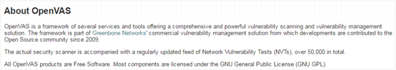
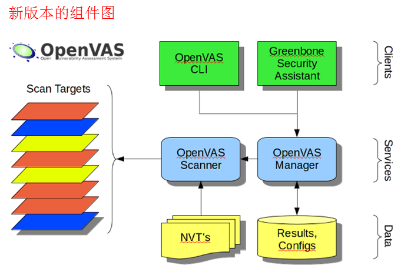
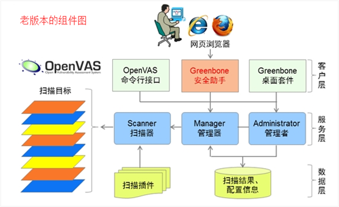
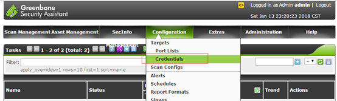
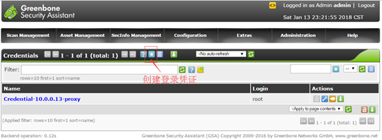
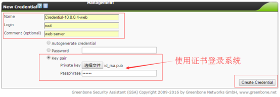

# OpenVAS开放式脆弱性评估系统介绍

1. # OpenVAS简介 

在IT项目中，系统上线时需要做运行环境的漏洞评估，找出漏洞后修复漏洞，只有运行环境满足安全规范要求时才允许系统上线；在系统运维过程中，需要定期对系统进行基线测试，发现漏洞要及时整改，直至安全隐患消除，确保运行环境安全可靠。由此可见，发现漏洞、修复漏洞成为了IT项目生命周期中不可缺少的一项重要工作。如何才能及时有效的发现漏洞呢？这就需要用到漏洞评估工具了，今天我们就来介绍一款业内十分著名系统，它就是OpenVAS！

OpenVAS的全称是Open Vulnerability Assessment System，译成中文是开放式漏洞评估系统，官方(http://www.openvas.org)的介绍是这样的：

OpenVAS是一个包含了多个服务及工具的框架，提供了一个全面而强大的脆弱性扫描及脆弱性管理解决方案。这个框架原来是绿骨网络公司商业化脆弱性管理解决方案的一部分，自2009起，该框架就交给开源社区维护。

现在的安全扫描器集成了定期更新好的漏洞测试库，漏洞测试库总数超过了5万条。

所有的OpenVAS产品都是免费软件，大多数组件是基于GNU GPL许可。

最新版本的OpenVAS系统组件如下图所示：

现在网上看到最多的是老版本的组件图：

新版本和旧版本对比可以发现，新的版本在客户层集约了Greenbone桌面套件，在服务层集约了Administrator管理者组件，在数据层Scanner扫描器强调的是漏洞测试数据，淡化扫描插件。

OpenVAS是专业扫描操作系统漏洞的利器，如果被扫描的操作系统安装了WEB服务，OpenVAS也会顺带扫描WEB漏洞。

1. # 安装OpenVAS 

   1. ## 利用Atomicorp仓库安装OpenVAS8 

\1. 配置yum Atomicorp仓库：

wget -q -O – http://www.atomicorp.com/installers/atomic |sh

\2. 安装openvas：

yum install openvas

3、配置openvas

openvas-setup (Update NVT’s and SCAP data, Configure GSAD)

4、检查配置是否正确

openvas-check-setup，可以查到提示找不到redis-server: ERROR: No redis-server installation found

1. ## 修复redis-server错误； 

需要手动编译安装redis-server

1、下载，解压，编译:

wget http://download.redis.io/releases/redis-3.2.9.tar.gz

tar xzf redis-3.2.9.tar.gz

cd redis-3.2.9

make

2、安装

cd src

mkdir /usr/local/redis-3.2.9

cp redis-server /usr/local/redis-3.2.9/

cp redis-cli /usr/local/redis-3.2.9/

cp redis-benchmark /usr/local/redis-3.2.9/

cp ../redis.conf /usr/local/redis-3.2.9/

3、修改配置文件

vi /usr/local/redis-3.2.9/redis.conf

注释第84行的port 6379，下一行添加：

port 0

去掉第102及103行的注释，如下：

unixsocket /tmp/redis.sock

unixsocketperm 700

timeout 0

启动redis-server：

/usr/local/redis-3.2.9/redis-server /usr/local/redis-3.2.9/redis.conf

4、将/usr/local/redis-3.2.9将到环境变量中

vi /etc/profile

在最底部添加：

export PATH=”$PATH:/usr/local/redis-3.2.9″

环境变量生效：

source /etc/profile

5、配置自启动

vi /etc/rc.d/rc.local

在最底部加一句：

/usr/local/redis-3.2.9/redis-server /usr/local/redis-3.2.9/redis.conf

下次开机时就会自动启动redis-server

1. ## 修复sqlite3_errstr错误 

/etc/init.d/openvas-manager start，发现openvas-manager启动时候出现如下错误：

/usr/sbin/openvasmd: symbol lookup error: /usr/sbin/openvasmd: undefined symbol: sqlite3_errstr

解决办法：

1、安装 atomic-sqlite-sqlite-devel.x86_64

yum install atomic-sqlite-sqlite-devel.x86_64

2、更新安装包

yum downgrade openvas-manager-6.0.8-35.el6.art

3、然后执行openvas-check-setup

按照提示操作即可。

1. ## openvas-nvt-sync下载漏洞库 

openvas-nvt-sync下载漏洞库是一个漫长的过程，需要耐心等待。

1. ## 修复启动脚本 

通过netstat -tunap，会发现openvasmd侦听了:::9390端口，openvassd侦听了0.0.0.0:9391端口，gsad侦听了0.0.0.0:9392及0.0.0.0:80端口，需要修复配置文件及启动脚本。

配置文件位于/etc/sysconfig/目录下

有三个配置文件：openvas-manager、openvas-scanner及gsad

vi /etc/sysconfig/openvas-manager

改为：

OPTIONS=””

MANAGER_ADDRESS=0.0.0.0

MANAGER_PORT=9390

vi /etc/sysconfig/openvas-scanner

改为：

\# Options to pass to the openvassd daemon

OPTIONS=””

\# Set to yes if plugins should be automatically updated via a cron job

auto_plugin_update=yes

\# Notify OpenVAS scanner after update by seding it SIGHUP?

notify_openvas_scanner=yes

\# Method to use to get updates. The default is via rsync

\# Note that only wget and curl support retrieval via proxy

\# update_method=rsync|wget|curl

\# Additionaly, you can specify the following variables

\#NVT_DIR where to extract plugins (absolute path)

\#OV_RSYNC_FEED URL of rsync feed

\#OV_HTTP_FEED URL of http feed

\# First time install token

FIRSTBOOT=no

SCANNER_ADDRESS=0.0.0.0

SCANNER_PORT=9391

vi /etc/sysconfig/gsad

改为：

OPTIONS=””

\#

\# The address the Greenbone Security Assistant will listen on.

\#

GSA_ADDRESS=0.0.0.0

\#

\# The port the Greenbone Security Assistant will listen on.

\#

GSA_PORT=9392

GSA_REDIRECT=1

GSA_REDIRECT_PORT=8092

\#

\# The address the OpenVAS Manager is listening on.

\#

MANAGER_ADDRESS=0.0.0.0

\#

\# The port the OpenVAS Manager is listening on.

\#

MANAGER_PORT=9390

启动文件位于/etc/init.d/目录下

有三个启动文件：openvas-manager、openvas-scanner及gsad

其中openvas-manager需要修复，修改为如下：

\#!/bin/bash

\# This is an implementation of a start-script for OpenVAS Manager

\# chkconfig: – 92 10

\# Description: OpenVAS Manager is a vulnerability Scanner management daemon

\#

\### BEGIN INIT INFO

\# Provides: openvas-manager

\# Required-Start: $local_fs $network $syslog

\# Required-Stop: $local_fs $network $syslog

\# Default-Start:

\# Default-Stop: 0 1 2 3 4 5 6

\# Short-Description: start|stop|status|restart|condrestart OpenVAS Manager

\# Description: control OpenVAS Manager

\### END INIT INFO

\# Source function library.

. /etc/rc.d/init.d/functions

exec=”/usr/sbin/openvasmd”

prog=”openvasmd”

progname=”openvas-manager”

lockfile=/var/lock/subsys/openvasmd

[ -e /etc/sysconfig/$progname ] && . /etc/sysconfig/$progname

\# Build parameters

[ “$MANAGER_ADDRESS” ] && PARAMS=”$PARAMS –listen=$MANAGER_ADDRESS”

[ “$MANAGER_PORT” ] && PARAMS=”$PARAMS –port=$MANAGER_PORT”

rh_status() {

\# run checks to determine if the service is running or use generic status

status -p /var/run/$prog.pid -l $lockfile $progname

}

rh_status_q() {

rh_status >/dev/null 2>&1

}

start() {

echo “Starting $progname:”

\#daemon –pidfile=/var/run/$prog.pid $prog $OPTIONS

daemon –pidfile=/var/run/$prog.pid $exec $PARAMS

\#$prog

RETVAL=$?

echo

[ $RETVAL -eq 0 ] && touch $lockfile

return $RETVAL

}

stop() {

echo -n “Stopping $progname: ”

killproc $prog

RETVAL=$?

echo

[ $RETVAL -eq 0 ] && rm -f $lockfile

return $RETVAL

}

restart() {

stop

start

}

case “$1” in

start)

rh_status_q && exit 0

$1

;;

stop)

rh_status_q || exit 0

$1

;;

restart)

$1

;;

condrestart|try-restart)

rh_status_q || exit 0

$1

;;

status)

status -p /var/run/$prog.pid -l $lockfile $progname

;;

*)

echo “Usage: $0 {start|stop|status|restart|condrestart}”

exit 1

esac

exit 0

1. # 使用OpenVAS 

安装好OpenVAS后，我们来看下openvas三个组成部分：

1. OpenVAS Manager的进程名称为openvasmd，侦听9390端口，启动方式为/etc/init.d/openvas-manager start

2. OpenVAS Scanner的进程名称为openvassd，侦听9391端口，启动方式为/etc/init.d/openvas-scanner start

3. Greenbone Security Assistant的进程名称为gsad，侦听9391端口，启动方式为/etc/init.d/gsad start

   1. ## 扫描Linux系统 

**1、登录系统
**

首先在浏览器中打开[https://192.168.1.31:9392](https://192.168.1.31:9392/)，进入登录页面，如下图所示：

登录后的主界面如下：

**2、创建登录凭证
**

点击菜单Configuration->Credentials，如下所示：

进入凭证列表后，点击”创建”菜单创建一个登录凭证，如下：

请参与下面参数创建一个Credential，如下：

创建成功后如下图所示：

**3、创建扫描目标
**

点击菜单Configuration->Targets，如下所示：

进入扫描目标列表后，点击”创建”菜单创建一个扫描目标，如下：

请参与下面参数创建一个Target，如下：

创建成功后如下图所示：

**4、创建扫描任务
**

点击菜单Scan Management->Tasks，如下所示：

进入扫描任务列表后，点击”创建”菜单创建一个扫描任务，如下：

请参与下面参数创建一个Target，如下：

创建成功后如下图所示：

至止所有创建工作已经完成，如下开展正式扫描工作，如下：

点击菜单Scan Management->Tasks，如下所示：

点击启动按钮，如下：

启动扫描后，可以刷新页面查看扫描扫描进度，如下：

扫描完成后，可以查看报表，如下：

以上报表可以看出，被扫描的系统很多高危漏洞，需要逐个修复。

1. ## 扫描Windows系统 

**1、登录系统
**

首先在浏览器中打开[https://192.168.1.31:9392](https://192.168.1.31:9392/)，进入登录页面，如下图所示：

登录后的主界面如下：

**2、创建登录凭证
**

点击菜单Configuration->Credentials，如下所示：

进入凭证列表后，点击”创建”菜单创建一个登录凭证，如下：

请参与下面参数创建一个Credential，如下：

创建成功后如下图所示：

**3、创建扫描目标
**

点击菜单Configuration->Targets，如下所示：

进入扫描目标列表后，点击”创建”菜单创建一个扫描目标，如下：

请参与下面参数创建一个Target，如下：

创建成功后如下图所示：

**4、创建扫描任务
**

点击菜单Scan Management->Tasks，如下所示：

进入扫描任务列表后，点击”创建”菜单创建一个扫描任务，如下：

请参与下面参数创建一个Target，如下：

创建成功后如下图所示：

至止所有创建工作已经完成，如下开展正式扫描工作，如下：

点击菜单Scan Management->Tasks，如下所示：

点击启动按钮，如下：

启动扫描后，可以刷新页面查看扫描扫描进度，如下：

扫描完成后，可以查看报表，如下：

以上报表可以看出，因为没有给windows 2003打补丁，被扫描的系统很多高危漏洞，需要给系统打补丁来修复漏洞。