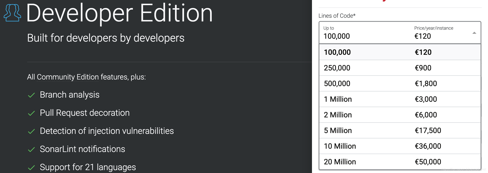
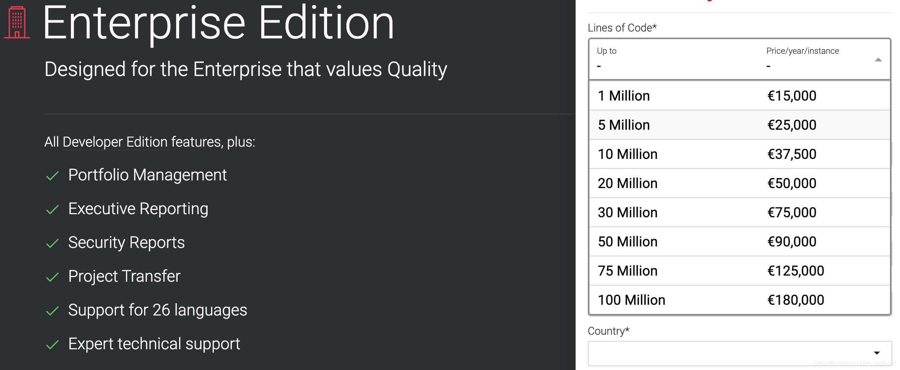
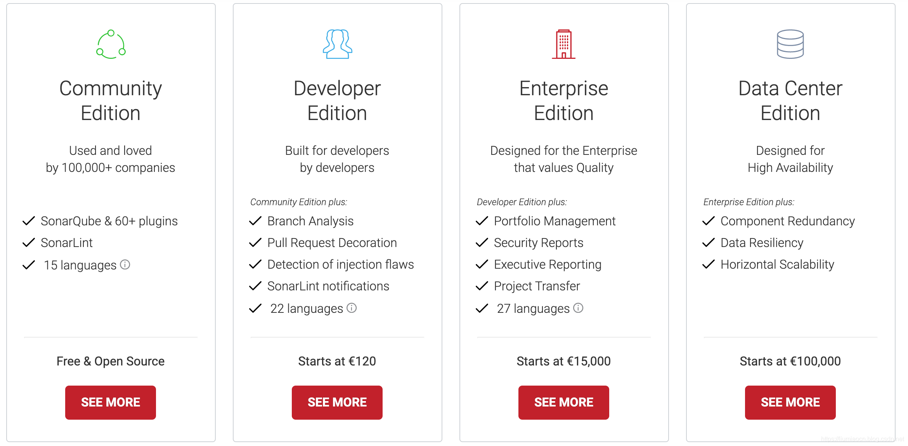
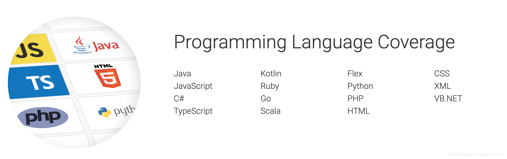
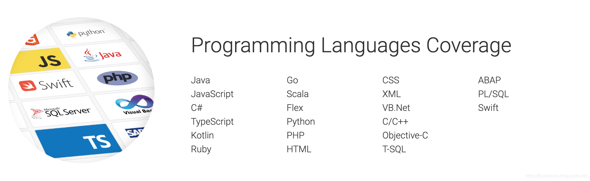
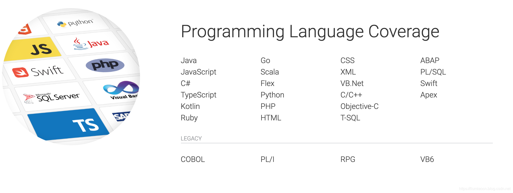

相较于一般的开源工具，比如Docker/Gitlab等，套路都是CE版和EE版。而在代码质量扫描工具的SonarQube这里，显得就更加精细化了一些，SonarQube分为了CE、DE、EE和DCE版本，版本众多，眼花缭乱，如何进行选择，这篇文章搜集和整理了一些基本的信息。

# 类型

SonarQube目前分四种类型的版本，简单说明如下

| 类型 | 全称                | 说明                           |
| ---- | ------------------- | ------------------------------ |
| CE   | Community Edition   | 社区版                         |
| DE   | Developer Edition   | 开发版（具有CE版所有特性）     |
| EE   | Enterprise Edition  | 企业版（具有DE版所有特性）     |
| DCE  | Data Center Edition | 数据中心版（具有EE版所有特性） |

# 成本

应该选择那种，虽然很难下决心，但是看一下目前的收费模型，就会快速帮助用户做好自身定位了，注意价格均为每年单个实例的价格。

| 类型 | 价格               | LOC                  |
| ---- | ------------------ | -------------------- |
| CE   | 免费               | -                    |
| DE   | 120欧元-5万欧元    | 10万行代码-20M行代码 |
| EE   | 1.5万欧元-18万欧元 | 1M行代码-100M行代码  |
| DCE  | 10万欧元-上不封顶  | 20M代码-             |

## DE

## EE

## DCE

# 概要信息

各个版本的概要信息如下所示

# 扫描语言支持

## CE支持15种

详细信息如下所示：

## DE支持22种

相较于CE版，增加了C/C++、Objective-C、T-SQL、ABAP、PL/SQL和Swift等，详细信息如下所示：

## EE与DCE支持27种

相较于DE版，增加了Apex、COBOL、PL/1、RPG和VB6等五种，详细信息如下所示：

# CE版主要特性

除了支持15种编程语言，CE版还就有如下特性

- 支持5种IDE
- 支持60+的插件
- 支持SonarLint
- 支持Quality Gate
- 快速确认近期修改代码的问题

# DE版增强特性

DE版具有CE版所有特性，在此基础之上，该版本还有如下特性增强：

- 支持22种编程语言
- 支持Pull Request的分支代码分析
- 安全性的增强：Security Hotspots & Security Vulnerabilities的全面支持
- 支持SonarLint的智能提示，更好地与IDE进行集成

# EE版增强特性

EE版具有DE版所有特性，在此基础之上，该版本还有如下特性增强：

- 支持27种编程语言
- 支持对于Portfolio的管理
- 提供OWASP / SANS的安全报告
- 提供可配置的SAST 分析引擎

# EE版增强特性

EE版具有EE版所有特性，此版本主要对于高可用性和横向扩展性有更好的支持。

# 参考内容

https://www.sonarsource.com/plans-and-pricing/
https://www.sonarsource.com/plans-and-pricing/community/
https://www.sonarsource.com/plans-and-pricing/developer/
https://www.sonarsource.com/plans-and-pricing/enterprise/
https://www.sonarsource.com/plans-and-pricing/data-center/