在2019年SonarQube发布了LTS 7.9版，相较于上一个主要的LTS 6.7版，增加不少不错的特性。

# 新增加了6种语言的支持

新增了对于go、ruby、Kotlin、Scala等6种流行语言的支持，共计支持语言数量达到27种，与Fortify基本持平。
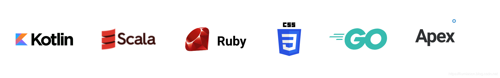

# 代码安全特性

## Hotspots

与6.7相比可以看到在首页除了传统的Bugs、Vulnerabilities、Code smells三种，新增了Security Hotspots这种类型。

这种问题的出现说明代码种存在安全相关的隐患，需要进行人工的review以确认是否是存在安全上的问题。这项特性目前支持如下6种语言
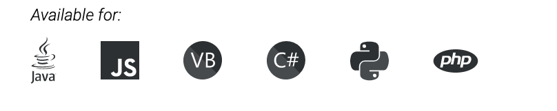

## Security Vulnerabilities

相较于Hotspots的不确定性，如果出现Security Vulnerabilities，则基本是需要代码的修正和对应以消除安全上的脆弱性。
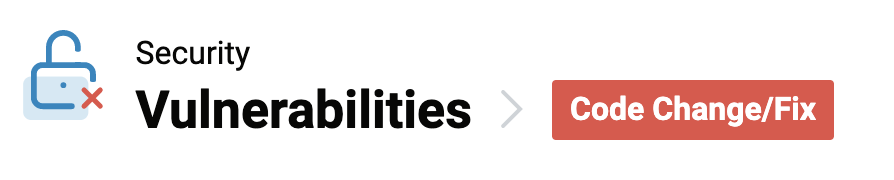
这项特性目前只在Java、PHP和C#中是支持的。
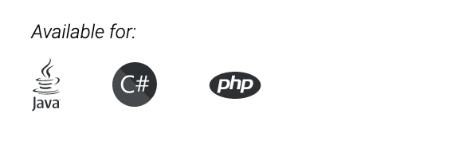

# 注入型缺陷的检测

对于SQL注入等安全性的类型隐患可以予以检出，但是请注意此为收费版DE、EE和DCE才有的功能特性。

## Java代码检出示例

- 运行态操作系统级命令注入的可能性风险
  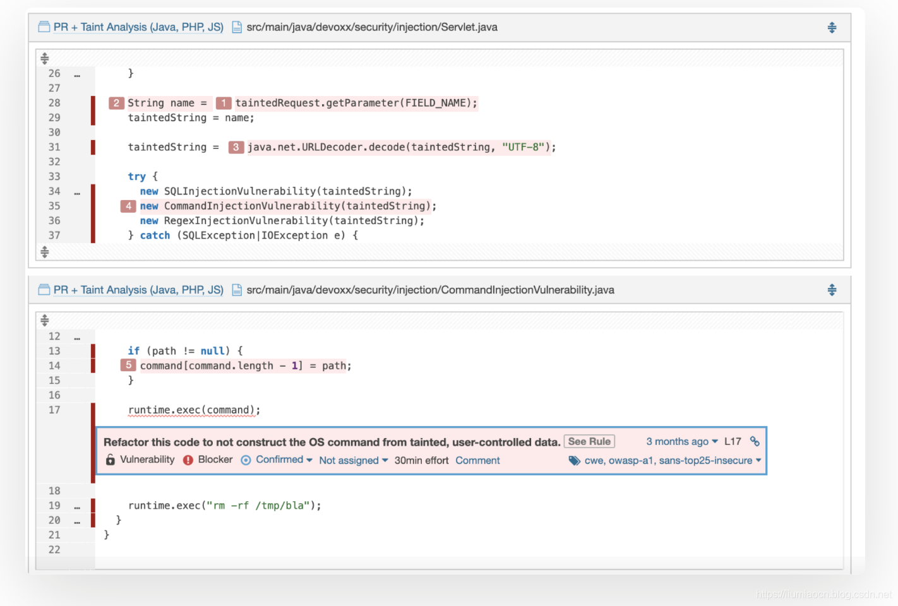

## PHP代码检出示例

- 运行态SQL注入的可能性风险
  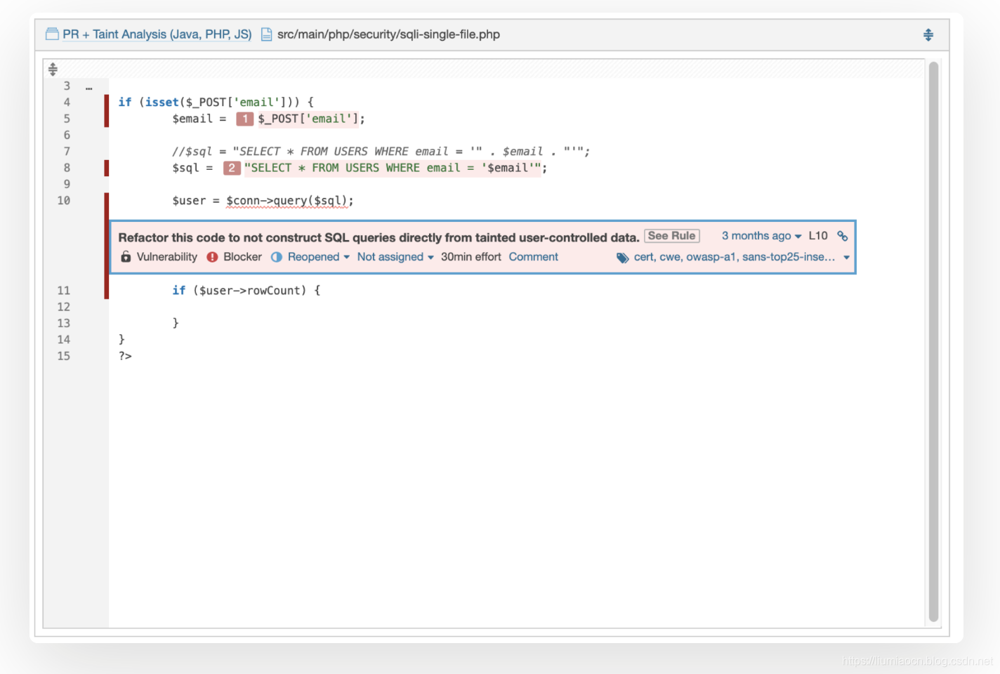

## C#代码检出示例

- 运行态SQL注入的可能性风险
  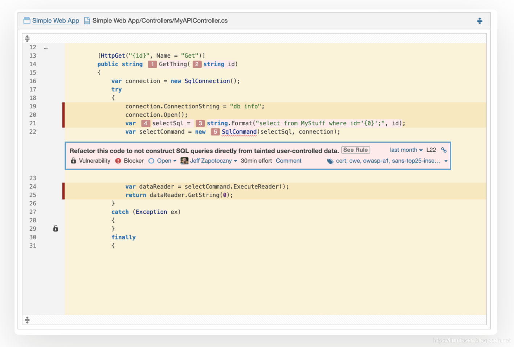

# OWASP / SANS 安全报告

可以针对OWASP / SANS 所标注的安全威胁进行重点分析并给出结论报告以及对应方法提示，这是一项非常不错的特性增强，但是只有在EE和DCE版本中才有此项特性。
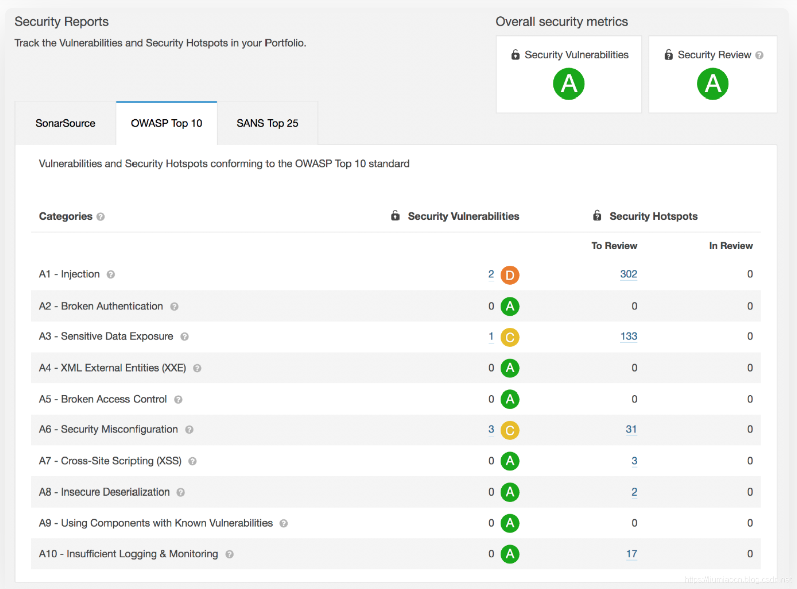

# 与分支操作的结合

- PR质量分析
  对于特定分支的Pull Requests进行代码质量分析，收否通过SonarQube的检测，可以清楚地确认结果。此项特性只在DE、EE和DCE版中提供。
- 分支质量监控
  选定分支之后，可以进行应用程序分支质量的监控，此项特性仅在EE和DCE版本中提供。
  

# 与其他工具的集成

与Bitbucket Server、Github Enterprise与Azure DevOps Server进行集成，更好的显示分支代码的质量状况。

## Bitbucket Server

## GitHub Enterprise

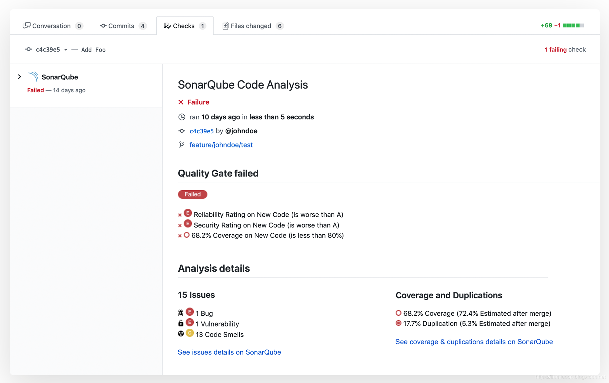

## Azure DevOps Server

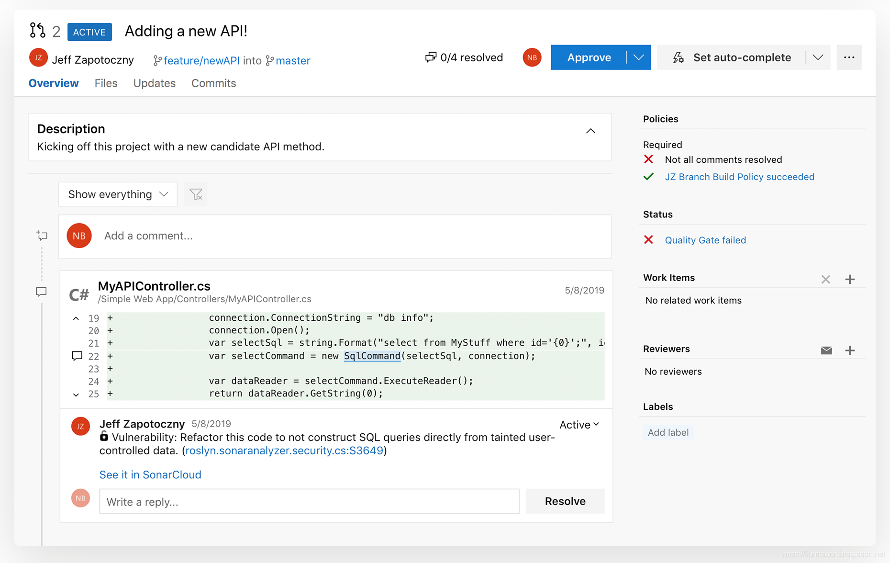

# 企业级管理工具

如下相关特性仅在EE和DCE版中提供。

## 实时 应用/Portfolio 监控

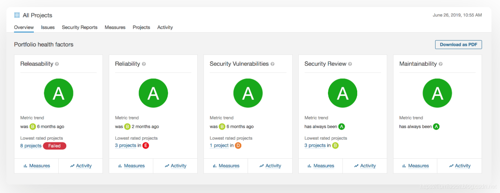

- 自定义的Portfolio
  可定义全局的Portfolio，从而可以更好地对主要监控的Portfolio确认实时的细节信息
- Portfolio的PDF生成
  可生成包含Portfolio的分析数据的PDF文件，可以非常方便地嵌入在分享内容之中。

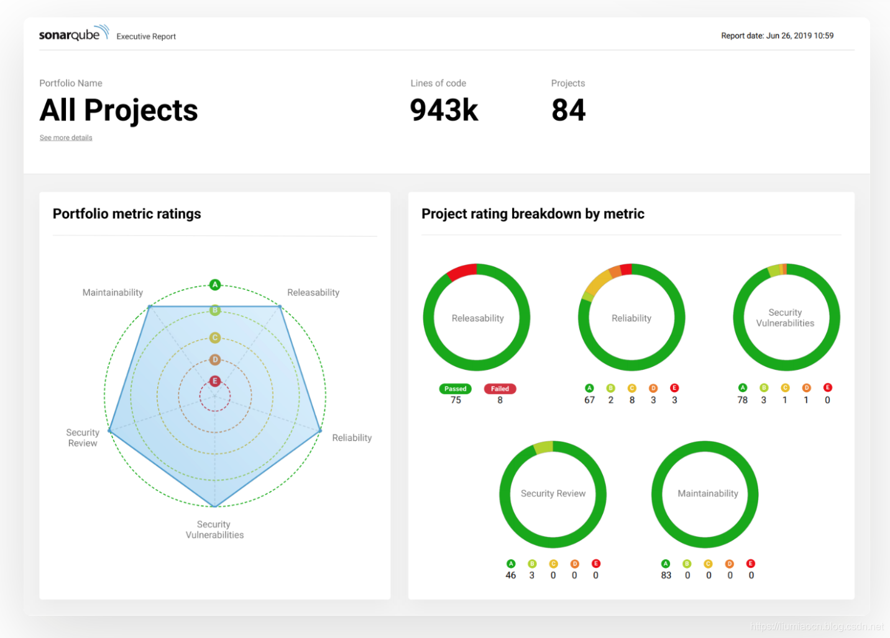

# 扫描规则的更新

从LTS 6.7版之后，不同语言都有了很多扫描规则的更新
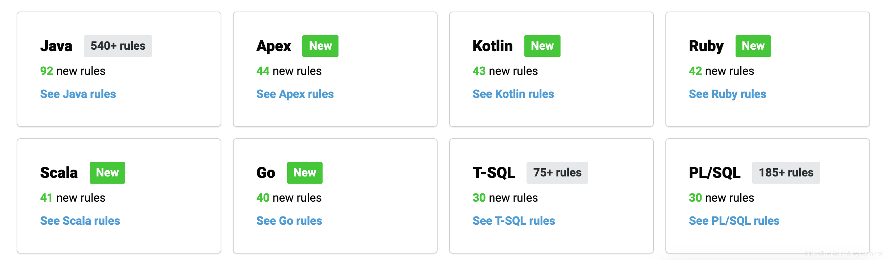
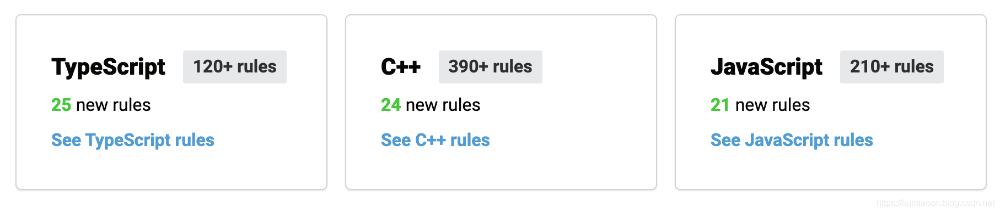

# 其他特性

- VB.NET的支持现在是免费和开源的
- 引入TSLint、ESlint、PMD、Checkstyle等三方工具的分析
- 支持SAML 2.0
- 提供内建的Project徽章
- 文档现在嵌入在产品之中
- 可使用project tags创建Portfolios
- …

# 升级与限制

LTS 7.9 对于使用者最为直接的影响有如下三条：

- 从7.9开始，不再提供MySQL的支持，使用MySQL存储数据将无法启动SonarQube服务，如果之前使用MySQL进行SonarQube的数据存储的用户，要么不升级，要么先将MySQL迁移至其他数据库（SonarQube推荐Postgresql），然后再进行升级（官方提供了相应的工具进行升级）。
- SonarQube使用Java 11，使用JDK 8也将无法启动SonarQube服务，升级时需要将JDK升至11.
- 本地Sonar-Scanner的Java版本暂可使用Java 8，但至SonarQube 8开始，Sonar-Scanner的JDK或者JRE的支持也需要Java 11或者以上版本。

# 参考内容

https://www.sonarqube.org/sonarqube-7-9-lts/
https://rules.sonarsource.com/