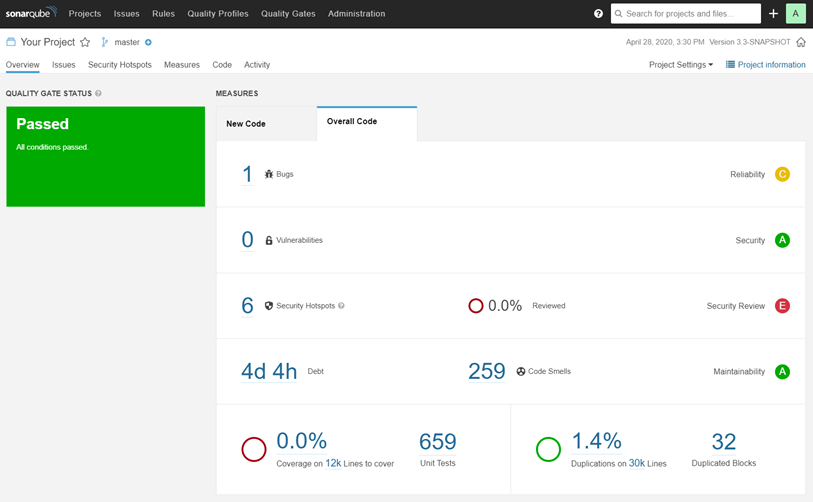

# Try Out SonarQube

You've heard about how [SonarQube](https://www.sonarqube.org/) can help you write cleaner and safer code, and now you're ready to try it out for yourself. This guide shows you how to install a local instance of SonarQube and analyze a project. Installing a local instance gets you up and running quickly, so you can experience SonarQube first hand.

Once you're ready to set up a production instance, take a look at the [Install SonarQube](https://docs.sonarqube.org/latest/setup/install-server/) documentation.

## Installing a local instance of SonarQube

You can evaluate SonarQube using a traditional installation with the [zip file](https://www.sonarqube.org/downloads/) or you can spin up a Docker container using one of our [Docker images](https://hub.docker.com/_/sonarqube/). Click the method you prefer below to expand the installation instructions:

[From the zip file](https://docs.sonarqube.org/latest/setup/get-started-2-minutes/#)

[From the Docker image](https://docs.sonarqube.org/latest/setup/get-started-2-minutes/#)

Find the Community Edition Docker image on [Docker Hub](https://hub.docker.com/_/sonarqube/).

1. Start the server by running:

```console
$ docker run -d --name sonarqube -e SONAR_ES_BOOTSTRAP_CHECKS_DISABLE=true -p 9000:9000 sonarqube:8.5-community
```

1. Log in to [http://localhost:9000](http://localhost:9000/) with System Administrator credentials (login=admin, password=admin).

## Analyzing a Project

Now that you're logged in to your local SonarQube instance, let's analyze a project:

1. Click the **Create new project** button.
2. When asked **How do you want to create your project**, select **Manually**.
3. Give your project a **Project key** and a **Display name** and click the **Set Up** button.
4. Under **Provide a token**, select **Generate a token**. Give your token a name, click the **Generate** button, and click **Continue**.
5. Select your project's main language under **Run analysis on your project**, and follow the instructions to analyze your project. Here you'll download and execute a Scanner on your code (if you're using Maven or Gradle, the Scanner is automatically downloaded).

After successfully analyzing your code, you'll see your first analysis on SonarQube:

