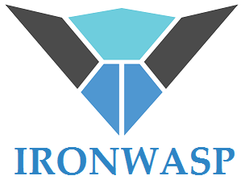
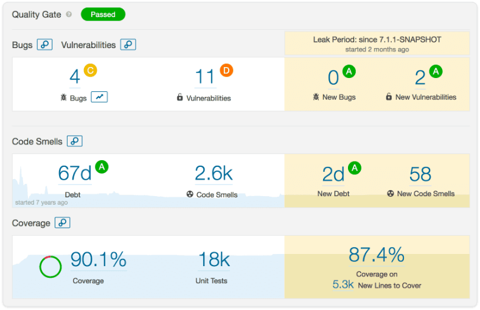
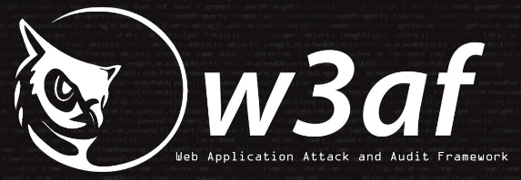
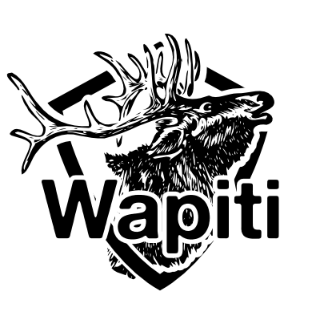

# 十大开源Web应用安全测试工具

[安全运营](https://www.secrss.com/articles?tag=安全运营) [安全牛](https://www.secrss.com/articles?author=安全牛) 2020-05-19

本文向我们推荐了十大开源安全测试工具。这些工具除了免费之外，最大的优点是可以自定义它们，以符合您的特定要求。

Web应用安全测试可对Web应用程序执行功能测试，找到尽可能多的安全问题，大大降低黑客入侵几率。

在研究并推荐一些最佳的开源Web应用安全测试工具之前，让我们首先了解一下安全测试的定义、功用和价值。

**安全测试的定义**

安全测试可以提高信息系统中的数据安全性，防止未经批准的用户访问。在Web应用安全范畴中，成功的安全测试可以保护Web应用程序免受严重的恶意软件和其他恶意威胁的侵害，这些恶意软件和恶意威胁可能导致Web应用程序崩溃或产生意外行为。

安全测试有助于在初始阶段解决Web应用程序的各种漏洞和缺陷。此外，它还有助于测试应用程序的代码安全性。Web安全测试涵盖的主要领域是：

·认证方式

·授权书

·可用性

·保密

·一致性

·不可否认

**安全测试的目的**

全球范围内的组织和专业人员都使用安全测试来确保其Web应用程序和信息系统的安全性。实施安全测试的主要目的是：

·帮助提高产品的安全性和保质期

·在开发初期识别并修复各种安全问题

·评估当前状态下的稳定性

**为什么我们需要重视Web安全测试**

·避免性能不一致

·避免失去客户信任

·避免以安全漏洞的形式丢失重要信息

·防止身份不明的用户盗窃信息

·从意外故障中恢复

·节省解决安全问题所需的额外费用

目前市场上有很多免费、付费和开源工具可用来检查Web应用程序中的漏洞和缺陷。关于开源工具，除了免费之外，最大的优点是可以自定义它们，以符合您的特定要求。

**以下，是我们推荐的十大开源安全测试列表：**

**Arachni**

Arachni面向渗透测试人员和管理员的旨在识别Web应用程序中的安全问题。该开源安全测试工具能够发现许多漏洞，包括：

·无效的重定向

·本地和远程文件包含

·SQL注入

·XSS注射

**主要亮点：**

·即时部署

·模块化，高性能Ruby框架

·多平台支持

**下载：**

https://github.com/Arachni/arachni

**劫掠者**

便携式Grabber旨在扫描小型Web应用程序，包括论坛和个人网站。轻量级的安全测试工具没有GUI界面，并且使用Python编写。Grabber发现的漏洞包括：

·备份文件验证

·跨站脚本

·文件包含

·简单的AJAX验证

·SQL注入

**主要亮点：**

·生成统计分析文件

·简单便携

·支持JS代码分析

**下载：**

https://github.com/amoldp/Grabber-Security-and-Vulnerability-Analysis-

**Iron Wasp**

Iron Wasp是一种开放源代码，功能强大的扫描工具，能够发现25种以上的Web应用程序漏洞。此外，它还可以检测误报和误报。Iron Wasp可帮助暴露各种漏洞，包括：

·身份验证失败

·跨站脚本

·CSRF

·隐藏参数

·特权提升

**主要亮点：**

·通过插件或模块可扩展地用C＃、Python、Ruby或VB.NET编写

·基于GUI

·以HTML和RTF格式生成报告

**下载：**

https://github.com/Lavakumar/IronWASP

**Nogotofail**

Nogotofail是Google开发的网络流量安全测试工具，一款轻量级的应用程序，能够检测TLS / SSL漏洞和配置错误。Nogotofail暴露的漏洞包括：

·MiTM攻击

·SSL证书验证问题

·SSL注入

·TLS注入

**主要亮点：**

·易于使用

·轻巧的

·易于部署

·支持设置为路由器、代理或VPN服务器

**下载：**

https://github.com/google/nogotofail

**SonarQube**

另一个值得推荐的开源安全测试工具是SonarQube。除了公开漏洞外，它还用于衡量Web应用程序的源代码质量。尽管使用Java编写，SonarQube仍能够分析20多种编程语言。此外，它可以通过持续集成工具轻松地集成到Jenkins之类的产品中。SonarQube发现的问题以绿色或红色突出显示。前者代表低风险的漏洞和问题，而后者则代表严重的漏洞和问题。对于高级用户，可以通过命令提示符进行访问。对于那些相对较新的测试人员，有一个交互式GUI。SonarQube暴露的一些漏洞包括：

·跨站脚本

·拒绝服务（DoS）攻击

·HTTP响应拆分

·内存损坏

·SQL注入

**主要亮点：**

·检测棘手的问题

·DevOps集成

·设置pull requests请求分析

·支持短期和长期代码分支的质量跟踪

·提供Quality Gate

·可视化项目历史

**下载：**

https://github.com/SonarSource/sonarqube

**SQLMap**

SQLMap完全免费，可以实现网站数据库中SQL注入漏洞检测和利用过程的自动化。该安全测试工具附带一个功能强大的测试引擎，能够支持6种类型的SQL注入技术：

·基于布尔的盲注

·基于错误

·带外

·堆叠查询

·基于时间的盲注

·UNION查询

**主要亮点：**

·自动化查找SQL注入漏洞的过程

·也可以用于网站的安全测试

·强大的检测引擎

·支持多种数据库，包括MySQL、Oracle和PostgreSQL

**下载：**

https://github.com/sqlmapproject/sqlmap

**W3af**

W3af是最受Python开发者喜欢的Web应用程序安全测试框架之一。该工具覆盖Web应用程序中超过200多种类型的安全问题，包括：

·SQL盲注

·缓冲区溢出

·跨站脚本

·CSRF

·不安全的DAV配置

**主要亮点：**

·认证支持

·易于上手

·提供直观的GUI界面

·输出可以记录到控制台，文件或电子邮件中

**下载：**

https://github.com/andresriancho/w3af

**Wapiti**

Wapiti是领先的Web应用程序安全测试工具之一，它是SourceForge和devloop提供的免费的开源项目。Wapiti可执行黑盒测试，检查Web应用程序是否存在安全漏洞。由于是命令行应用程序，因此了解Wapiti使用的各种命令非常重要。Wapiti对于经验丰富的人来说易于使用，但对于新手来说却是一个的考验。但请放心，您可以在官方文档中找到所有Wapiti说明。为了检查脚本是否易受攻击，Wapiti注入了有效负载。该开源安全测试工具同时支持GET和POSTHTTP攻击方法。Wapiti暴露的漏洞包括：

·命令执行检测

·CRLF注射

·数据库注入

·档案披露

·Shellshock或Bash错误

·SSRF（服务器端请求伪造）

·可以绕开的.htaccess弱配置

·XSS注入

·XXE注入

**主要亮点：**

·允许通过不同的方法进行身份验证，包括Kerberos和NTLM

·带有buster模块，可以暴力破解目标Web服务器上的目录和文件名

·操作类似fuzzer

·同时支持GET和POSTHTTP方法进行攻击

**下载**：

https://github.com/mbarbon/wapiti

**Wfuzz**

Wfuzz是用Python开发的，普遍用于暴力破解Web应用程序。该开源安全测试工具没有GUI界面，只能通过命令行使用。Wfuzz暴露的漏洞包括：

·LDAP注入

·SQL注入

·XSS注入

**主要亮点：**

·认证支持

·Cookies fuzzing

·多线程

·多注入点

·支持代理和SOCK

**下载：**

https://github.com/xmendez/wfuzz

**Zed攻击代理（ZAP）**

ZAP或Zed Attack Proxy由OWASP（开放Web应用程序安全项目）开发，是一种跨多平台，开放源代码Web应用程序安全测试工具。ZAP用于在开发和测试阶段查找Web应用程序中的许多安全漏洞。由于其直观的GUI，新手和专家都可以轻松使用Zed Attach Proxy。安全测试工具支持高级用户的命令行访问。 除了是最著名的OWASP 项目之一，ZAP还是当之无愧的Web安全测试旗舰产品。ZAP用Java编写。除了用作扫描程序外，ZAP还可以用来拦截代理以手动测试网页。ZAP暴露的漏洞包括：

·应用错误披露

·非HttpOnly Cookie标识

·缺少反CSRF令牌和安全标头

·私人IP披露

·URL重写中的会话ID

·SQL注入

·XSS注入

**主要亮点：**

·自动扫描

·易于使用

·多平台

·基于休息的API

·支持身份验证

·使用传统而强大的AJAX蜘蛛

**下载：**

https://github.com/zaproxy