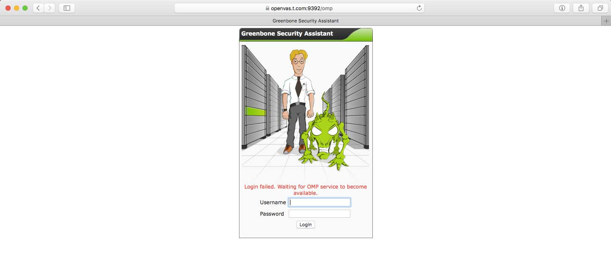
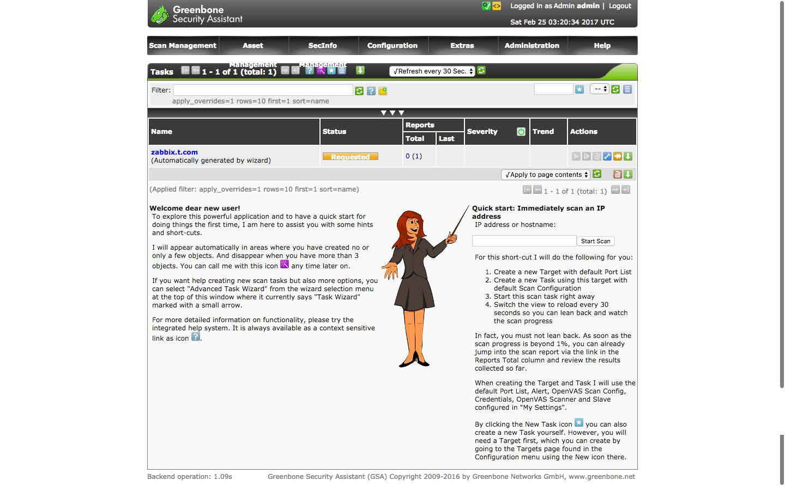
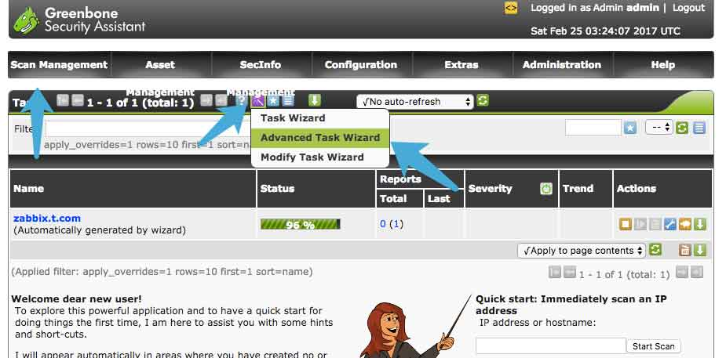
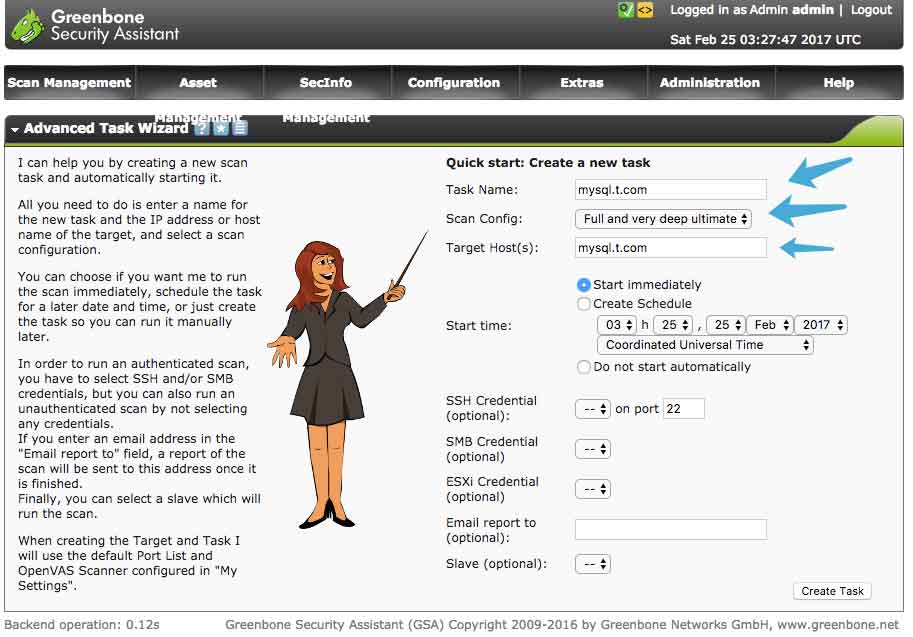
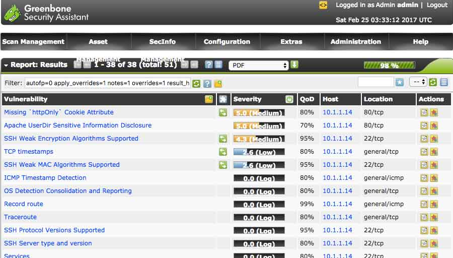

# 0x01 前言

在线的绝大部分漏洞扫描、评估系统都是收费的，我一直以来都使用一款名为OpenVAS的开源漏洞评估系统。它可以为我找出被我忽略的网站漏洞、系统漏洞等，然后根据它的报告进行修补。这能大大节省我们的费用支出，还能提早做好防御攻击的准备。

***注意！这款工具非常具有攻击性，请在合法合规的情况下使用。\***

# 0x02 准备

OpenVAS并不支持再windows系统中安装服务端，在这里我选用centos7作为承载系统。另外我们还需要网络下载特征库，最好能配置上代理。要不然你可能得花好几个小时获取最新的特征库，我就花了8个小时才配置好。

以下是官方网站：

- [http://www.openvas.org/](http://openvas.org/)

# 0x03 安装

下载安装源的安装脚本并运行：

```
BY OR PUBLISHED IN THIS REPOSITORY BE LIABLE FOR ANY DIRECT,
INDIRECT, INCIDENTAL, SPECIAL, EXEMPLARY, OR CONSEQUENTIAL DAMAGES
(INCLUDING, BUT NOT LIMITED TO, PROCUREMENT OF SUBSTITUTE GOODS
OR SERVICES; LOSS OF USE, DATA, OR PROFITS; OR BUSINESS INTERRUPTION)
HOWEVER CAUSED AND ON ANY THEORY OF LIABILITY, WHETHER IN CONTRACT,
STRICT LIABILITY, OR TORT (INCLUDING NEGLIGENCE OR OTHERWISE)
ARISING IN ANY WAY OUT OF THE USE OF THIS SOFTWARE, EVEN IF ADVISED
OF THE POSSIBILITY OF SUCH DAMAGE.
 
For supported software packages please contact us at: 
 
  sales@atomicorp.com
 
Do you agree to these terms? (yes/no) [Default: yes] 
 
Configuring the [atomic] repo archive for this system 
 
Installing the Atomic GPG keys: OK
 
Downloading atomic-release-1.0-21.el7.art.noarch.rpm: Preparing...                          ################################# [100%]
Updating / installing...
   1:atomic-release-1.0-21.el7.art    ################################# [100%]
OK
 
Enable repo by default? (yes/no) [Default: yes]: 
 
 
The Atomic repo has now been installed and configured for your system
The following channels are available:
  atomic          - [ACTIVATED] - contains the stable tree of ART packages
  atomic-testing  - [DISABLED]  - contains the testing tree of ART packages
  atomic-bleeding - [DISABLED]  - contains the development tree of ART packages
```

使用yum安装openvas：

```
yum install openvas
```


使用配置工具进行初始配置：

```
[root@centos-t1 ~]# openvas-setup
 
Openvas Setup, Version: 1.0
 
 
Step 1: Update NVT, CERT, and SCAP data
Please note this step could take some time.
Once completed, this will be updated automatically every 24 hours
 
Select download method
* wget (NVT download only) 
* curl (NVT download only) 
* rsync
 
  Note: If rsync requires a proxy, you should define that before this step.
Downloader [Default: rsync]
```

使用rsync同步的时候会非常缓慢，要耐心等待。openvas的rsync服务器在同一时间内只允许1个连接请求，如果你强制断开，可能需要等待几分钟才能重试。

分别需要同步CERT与SCAP的数据，这一过程根据网络环境的不同，可能需要5个小时或更久。数据同步并自动安装完成后，安装程序会询问是否允许任何IP访问：

```
Step 2: Configure GSAD
The Greenbone Security Assistant is a Web Based front end
for managing scans. By default it is configured to only allow
connections from localhost.
Allow connections from any IP? [Default: yes]
```

建议选用默认的yes，如果需要控制访问来源IP，则通过iptables或firewalld控制即可。最后配置用户名和密码：

```
Step 3: Choose the GSAD admin users password.
The admin user is used to configure accounts,
Update NVT's manually, and manage roles.
Enter administrator username [Default: admin] : admin
Enter Administrator Password:
Verify Administrator Password:
```

完成初始配置后即可通过https://ip:9392访问，不过应该是登入不了系统的：


[]()

# 0x04 debug

安装完成后可能会发现通过浏览器尝试登入控制页面时会提示错误：

```
Login failed. Waiting for OMP service to become available.
```

查看日志：

```
#打开日志
[root@openvas ~]# vim /var/log/openvas/openvasmd.log
 
#定位错误
Failed to create manager socket: Address family not supported by protocol
```


这错误是因为我的服务器禁用了ipv6所导致的，openvasmd监听不了ipv6协议的端口而启动失败。在这里我使用一个非常暴力的方法，先取消openvasmd的开机启动配置，然后手动指定坚挺IP并设置开机启动：

```
#禁用开机启动
[root@openvas ~]# systemctl disable openvas-manager.service
 
#手动指定监听IP
openvasmd --listen=127.0.0.1
 
#打开rc.local文件
[root@openvas ~]# vim /etc/rc.local
 
#填入到尾部并保存
openvasmd --listen=127.0.0.1
```


检查运行状况：

```
[root@openvas ~]# netstat -anp | grep openvasmd
tcp        0      0 127.0.0.1:9390          0.0.0.0:*               LISTEN      9942/openvasmd
```


# 0x05 扫描

一切就绪后再次通过https://ip:9392访问控制台：

[]()

点击Scan Management并通过高级配置新建任务：

[](https://ngx.hk/wp-content/uploads/2017/02/1487990453.jpg)

配置如下：

- Task Name：任务名称，可自定义
- Scan Config：扫描模式，请根据实际需要选择
- Target Host(s)：目标IP或域名
- Start time：任务开始时间

[]()

# 0x06 报告

通过点击Scan Management > Reports查看报告，即使是正在扫描中的任务也可以查看：

[]()

# 0x07 结语

通过这种方式安装的openvas，系统会每天同步一次特征库。openvas在扫描的时候会使用大量的CPU资源，而内存则使用率还可以接受，建议将openvas配置在虚拟机中，以便控制资源的使用。

最后再提醒一次，这软件极具攻击性，请谨慎使用。