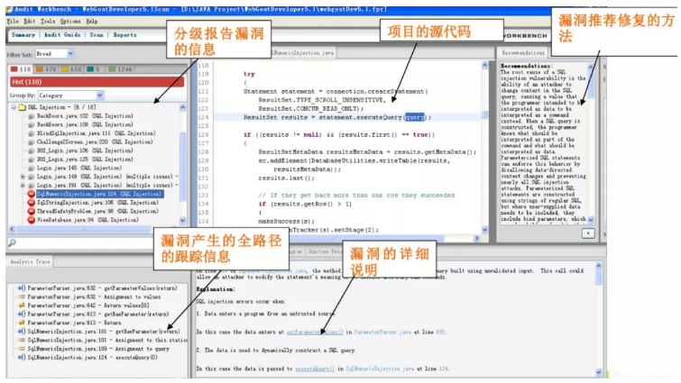
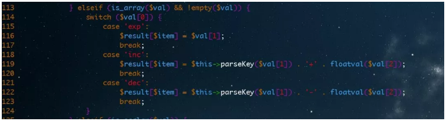

## 甲方代码审计之道与术

林伟壕 2019-10-19 10:05:00

**作者介绍**

**林伟壕，**腾讯高级工程师，专注于企业SDL、SecDevOps建设。目前从事安全风险评估与代码审计，曾在国内大型电信运营商与顶尖游戏公司从事运维、安全体系建设工作。

**注：**本文系作者原创投稿，未经dbaplus社群及作者允许，不得擅自转载。

 

**背景**

 

1、势在必行

 

 

 

漏洞攻防从来都是不对等的，这句话曾被用来形容防守方防守的是整个面，而攻击方只需要突破单个点即可侵入。但在漏洞攻防上，防守方也有攻击方无法具备的优势：他们拥有代码。

 

相比黑盒测试，代码审计有从代码实现逻辑的根源去挖掘漏洞的天然优势；相比教条式的修复指引，代码审计也可以从代码实现逻辑上为漏洞修复提出更有针对性、可行性的方案，甚至可以在此基础上演化出安全开发组件、框架。

 

在SDLC和DevSecOps大行其道的今天，代码审计已经成为甲方开展深度防御、安全融入业务的必经之路。在此大背景下，甲方推行代码审计势在必行。

 

另外，需要注意，本文所述代码审计，包括自动化代码漏洞扫描以及人工代码审计两部分。

 

2、与漏洞挖掘的区别

 

 

 

**1）对风险项的关注**

 

与漏洞挖掘不同，代码审计还会对无法构成漏洞的风险项进行跟踪，或要求或建议业务进行修复，特别是在强调纵深防御的企业安全建设思路之下，尤为注意。

 

**2）对软件供应链的关注**

 

代码审计还关注应用程序或者开发组件依赖安全性，比如npm包是否存在CVE漏洞、pip源是否安全。

 

3、甲方代码审计与白帽子代码审计的区别

 

 

 

**1）目标与初衷导致覆盖范围、使用方法不同**

 

覆盖面：不仅在于挖掘漏洞、也在于风险发现，不仅在于提供加固意见、更在于梳理研发体系为编码规范的制订与安全开发组件建设提供数据支持，不仅在于人工、更在于自动化体系建设，此外甲方代码审计强调完整覆盖面，而白帽子可能只是关注个别点，只要突破一个点即可入侵。

 

**2）审计的代码不同**

 

甲方通常审计的是自研代码，而白帽子通常审计的是开源代码，两者在业务逻辑复杂度、编码可读性区别较大。

 

**流程**

 

代码审计是SDLC、DevSecOps的编码实现阶段需要做的事，分别对应到SDLC中的Implement/Verification阶段和DevSecOps的Development/Build/Test阶段，其中自动化代码漏洞扫描可以在开发与编码构建阶段完成，人工代码审计可在业务测试阶段同步开展，前者作为所有业务上线前必经阶段，后者可先从新增业务、高危业务、重要业务入手逐步开展，毕竟对于甲方庞大的业务代码而言，人工审计所能覆盖的范围始终有限。

 

 

**方法论**

 

下文开始介绍甲方代码审计之“道”部分，所谓“道”，便是方法论，这一部分包括代码审计的痛点、解决痛点的整体思路以及一些审计技巧。

 

1、痛点

 

 

 

甲方，尤其是大型电信运营商、金融机构、互联网公司，其业务规模庞大，随之而来的是代码与业务架构高度复杂的问题，虽然市面上有不少SAST（Staic Application Security Tool，静态应用程序安全工具）可进行代码漏洞扫描，但其准确性、误报率难以满足期望，再加上人工审计执行人熟练程度的不同、判断标准的不同，也会引起落地上的一系列困难。

 

**1）代码与架构复杂**

 

- 几十万、几百万行代码、一个业务分几十个模块几十个代码仓库家常便饭；
- 开发语言多种多样，各种自研框架、流行框架应接不暇、架构还非常复杂。

 

以上两个问题对审计人员、SAST工具来说无疑都是很大的挑战。

 

 

**2）工具准召率**

 

- 正文文本框没有工具是所谓银弹，官方规则、插件准召率很低，需要根据开发语言、编码风格自定义；
- 工具对逻辑漏洞的无力，与业务逻辑漏洞大量曝光的漏洞态势之间的矛盾；
- 工具、系统的运营也需要专门人力投入，从而不断提高工具的准召率。

 

 

**3）心态**

 

- 审计新手统一会犯的一个错误就是会判断这段代码是否按照自己的思路去实现。但是却忘记了一道数学题可能有多个解法，特别是在没有统一的编码规范或者最佳实践被大家认可之前，若不遵守这个规则，审计起来会遇到很多麻烦；
- 审计人员出于KPI的考虑，想着既然花了很长时间做了代码审计，为了体现工作量就必须说点什么，如果系统本来没有问题却在那挑刺，开发者会更加不信任你；
- 对于甲方代码审计人员，审计任务多、代码庞大是常态，如果不考虑后果的只提高速度，这种方式会遗漏掉细节，导致不能全面的审查；
- 认为高级程序员编写的代码时没有什么问题的，但是马失前蹄尚且存在，更何况在巨大的开发压力下，如何能保证高级开发人员就不会犯一些安全编码的错误呢？或者不相信新手编写的的代码，其实只要新手有了对代码的安全意识和良好的编码习惯，也不一定写的代码就有很大的问题。总而言之，需要对开发者一视同仁。

 

 

2、整体思路

 

 

 

下文将从自动手动结合、黑白盒结合、正反向跟踪、动静结合、过往与当下结合、checklist与安全编码规范结合、通读与走读结合等7种方法入手，介绍如何更好开展代码审计。

 

**1）自动手动结合**

 

代码扫描工具->ast/正则表达式->复核

 

**ast**

 

词法分析->语法分析->（语义分析->中间代码）->AST

 

按照预定的规则合并成一个个的标识tokens。同时，它会移除空白符、注释等。最后，整个代码将被分割进一个tokens列表（或者说一维数组）。将词法分析出来的数组转化成树形的表达形式。同时，验证语法，语法如果有错的话，抛出语法错误。解析器会删除一些没必要的标识tokens（比如不完整的括号），因此AST不是100%与源码匹配的，解析器100%覆盖所有代码结构生成树叫做CST（具体语法树）。

 

以下介绍一些主流web开发语言的ast parser：

 

- 在线parser；
- php-parsesr；
- python-parser；
- go-parser；
- js-parser；
- java-parser。

 

结合开源、商业sast工具进行漏洞和风险扫描输出初步检测报告，然后人工复核准确性，不断优化sast扫描规则，同时提高漏洞挖掘速度。

 

**2）黑白盒结合**

 

黑盒求覆盖->白盒求重点

 

通过黑盒来全部覆盖所有业务cgi，同时通过白盒测试覆盖重要业务cgi，黑盒快速验证、白盒挖掘根因或者研究绕过策略，从而实现实现效率与重要性的平衡。另外，这里建议使用被动扫描器进行快速流量回放，实现流量采集与漏洞测试的同步执行，大大提高测试效率。同时也建议将cgi与功能整理出来，不然白盒审计在理解业务和代码逻辑上的成本会非常高。

 

**3）正反向跟踪**

 

①正向：变量->函数/敏感操作->输出

 

 

$_GET->$param->eval($param)->return $param

 

从参数接收入口开始跟踪数据流，是一种正向追踪的思路。优点是方便理解程序整体框架，相对容易定位逻辑漏洞。但是在代码量较大、代码结构化不强的情况下人工审计成本很高，ROI可能不明显，这种情况下结合SAST工具进行审计效果会更好。

 

②反向：函数/敏感操作回溯->输出

 

 

eval($param)->$param->$GET->return $param

 

根据敏感关键字来回溯传入的参数，是一种逆向追踪的思路。优点是仅需要搜索相应敏感关键字，就可以快速挖掘漏洞，可定向挖掘，高效，高质量，但也因为没有通读代码，对程序整体框架不熟悉，定位时会花费时间，逻辑漏洞挖掘较为困难。同理，这种情况下也需要结合SAST工具来做，因为SAST工具对敏感函数的控制流跟踪效果较好，方便人工后续回溯变量。

 

**4）动静结合**

 

①静态审计

 

通过静态分析源码，发现源码中的逻辑、数据处理、函数使用不当来确认源码中可能存在的漏洞。可以通过规则匹配和代码解析法开展，不过这块可以交给SAST工具去做。

 

- 规则匹配

 

通过编写正则表达式匹配开发语言或者开发框架的默认变量与高危函数进行匹配，比如php的默认变量$GET、$POST，高危函数eval()、exec()等。

 

- 代码解析法

 

通过解析代码的语法，分析出代码执行流程，这块如果采用自动化手段便属于前文所说AST，所以说不同思路之间也有相通之处。

 

②动态审计

 

通过运行需要审计的代码，结合使用断点调试的方法跟踪数据的流转来判断系统中是否存在漏洞。这块可以交给DAST或者IAST工具去做。注意一开始只需要关注我们关心的漏洞类型：高危文件、高危函数以及常规Web漏洞。

 

**5）过往与当下结合**

 

- 是否采用存在漏洞的框架版本；
- 是否出自同一个存在不良编码习惯或安全意识薄弱的开发者之手；
- 是否出现过漏洞，可能没彻底修复或者其他业务有类似的问题；
- 这个功能、模块、类、函数出现的漏洞是否可能出现在其他功能模块、类函数。

 

**6）checklist与安全编码规范结合**

 

梳理常见漏洞场景、常见漏洞类型、常见功能安全编码模板，对比实现方式，编码规范可以参考《OWASP安全编码规范》，相关checklist可以下一部分的内容。

 

**7）通读与走读结合**

 

类似英语阅读文章的阅读技巧，先粗略读一遍，再根据漏洞类型与业务场景跳着读。

 

- 首先要看程序的大体代码结构

 

如主目录有哪些文件，模块目录有哪些文件，插件目录有哪些文件，除了关注有哪些文件，还要注意文件的大小、创建时间。查看版本管理历史记录，大概了解整套代码更新迭代过程。

 

- 关注框架文件、核心功能

 

函数集文件（公共库类函数）、配置文件（看单引号、双引号，看全局配合或者路由）、安全过滤文件（防护代码）、index文件（入口文件），也看身份认证、权限控制、数据库操作、文件上传之类的核心功能实现逻辑。

 

3、覆盖

 

 

 

结合上面谈到的总体思路，下文将介绍在业务中具体落地代码审计的三大重要模块，业务基础信息、代码逻辑是基础，平台化手段是助推器，流程标准化是关键。

 

**1）依赖代码仓库和业务基础信息**

 

- 安全资产管理 进行代码审计前必须有完善的资产大盘，了解业务、责任人、组织架构的对应关系，这样才能在明确安全态势的基础上选择代码审计的对象、优先级、方法、手段；
- 代码获取 明确审计对象后，需要通过资产大盘找到开发团队，通过代码仓库的权限申请流程获取代码；
- 架构、cgi接口、业务逻辑 审计前需要了解业务架构来初步评估审计范围，了解cgi接口和业务逻辑可加快审计速度，快速定位漏洞和风险。

 

**2）平台化建设**

 

甲方业务的复杂性决定了代码审计必须走平台化建设道路，通过将SAST工具与CI系统打通，实现自动化漏洞扫描，在发现漏洞后可自动创建漏洞工单，并按照已有的审计流程进行复核以及开展人工审计。

 

- CI系统与SAST工具 例如sast工具sonarcube及其插件find securit bug与CI系统jenkins就是一套低成本的实现方案；
- 漏洞管理系统 进入到代码审计阶段的企业，通常已经有相对完善的漏洞管理系统和工单处理流程，可以将sast生成的报表解析、过滤后再推到漏洞管理系统；
- 审计流程管理 这块主要明确审计过程的任务跟踪、检查覆盖率、ROI评价。

 

**3）checklist**

 

这里的checklist其实是对审计流程的进一步细化，按场景和漏洞进行区分，做了哪些、发现什么问题，多少代码量，什么技术栈，花费了多少人天，考察周期内的准召率。

 

 

**4）覆盖业务范围**

 

- 高危业务：一个月内出现1次高危漏洞或者n次漏洞以上即可判定。
- 新业务：严格把关新业务上线的安全基线达标情况，要求走统一的自动化代码漏洞扫描与人工审计。
- 重要业务：筛选出重要业务的域名清单，统一拉取代码、cgi信息进行黑白盒审计。

 

4、Tips

 

 

 

紧接着整体思路，下文将介绍快速阅读代码、从业务思维去挖掘漏洞以及提高准召率的小技巧。

 

**1）如何快速看懂代码**

 

简单来说，便是关注开发模式、开发框架，读尽可能少的代码、从路由与cgi的映射关系入手，结合IDE去阅读代码。

 

- 用mvc或者mvvm架构思维去理解 大部分web系统都是按照model（数据库模型）-view（用户交互）-controller（后台业务逻辑）的架构去设计开发的，近年来越来越流行的mvmm（model-view-viewmodel）架构也是在此基础上演变而来，两种区别在于mvvm的viewcontrol抽离了mvc的controller中的业务逻辑，实现业务逻辑组件的复用。审计时可以直接去controller或者viewmodel中找相应的业务逻辑。
- 区分前后端代码 前后端分离也是近年来流行的开发模式，前端部分通常只会出现xss漏洞，通过区分前后端代码，可以避免在前端代码部分浪费时间去定位sql注入、越权漏洞之类的后端逻辑才会出现的漏洞。
- 先找路由与逻辑代码对应关系 路由通常出现在配置或者mvc架构的controller中，通过文件目录或者类函数的public属性来定位，或者在url路由表中直接定义。
- 论IDE的重要性 IDE通常会显示类或者函数的Definition和Reference，通过链接可以快速跟踪代码调用，也可以使用内嵌的搜索功能快速定位关键字，比起命令行下查找关键字方便很多。

 

**2）业务思维**

 

这里强调业务思维，是说越了解业务，越能从开发者和用户角度去思考设计和使用上可能存在的安全问题，对逻辑漏洞挖掘非常重要。

 

- 让业务提供应用程序的设计文档、架构文档，以便从功能上快速理解业务逻辑。
- 始终记住用户可以控制请求的每一个方面，他们可以按照任意顺序访问多阶段功能，可以提交畸形数据，可以忽略某些参数，可以伪造某些参数，可以修改某些参数。因此在设计的时候一定尽可能要面面俱到。
- 从各个角度考虑两个因素：应用程序如何处理用户的反常操作和输入的，不同代码组件与应用程序功能之间的相互依赖操作可能造成不利影响。
- 考虑设计过程中做的每一个假设，并想象假设被违背的每种情况，尤其注意用户可以完全控制的假设条件。

 

**3）如何提高准召率**

 

主要关于如何提高准确性和完整性的问题。

 

- 现代编程中关注代码调度、脚手架、统一框架、高度封装的问题：过滤和预编译等安全防护都在框架层或者公共class/function完成的可忽略。
- 传入危险函数的参数用户不可控的可忽略。
- 依赖组件扫描只是提供一种思路或者缩小审计范围，工具扫出后需要复核，如何存在问题的函数或者类业务并没有使用，不作为漏洞，只作风险提醒。
- 接入层已使用https的，不需要关注HSTS等安全header异常，但仍建议程序自行配置安全header，特别是secure/httponly/X-Content-Type-Options:nosniff等不适合在接入层统一配置的。
- 对于常见的应用场景，如文件操作、命令行操作、数据库操作、用户权限及认证等，我们需要了解框架的实现，给出相应的安全编码范例。框架文档中给出的例子并不一定就是最好的。安全侧必须对开发进行安全意识的培训，让他知道如何利用框架的API去安全的组合出常用功能。
- 对于应用漏洞挖掘，我们需要扩充字典。框架的封装，可能引入更多的危险API或危险特性。在代码审计的过程中，需要将这些内容加入到危险词字典中。

 

**利器**

 

上文大量介绍了代码审计的方法论，下文将重点介绍代码审计过程中使用的开源与商业sast工具。

 

1、开源工具评测

 

 

 

很少开源sast工具是同时支持好几种开发语言的，除了cobra系列工具。而单独针对个别语言的开源工具则非常多。

 

**1）cobra**

 

官方版本支持php/java ast，其他语言使用正则表达式、关键词匹配的方法，但用户可通过重写扫描引擎和自定义规则进行优化。建议可以关注基于cobra二次开发的cobra-w，该工具重写了ast解析，主攻准确性。

 

 

**2）bandit**

 

python代码审计工具，支持ast、支持丰富的漏洞类型和报告格式、可自定义插件和报告格式。

 

 

**3）nodejsscan**

 

nodejs代码审计工具，使用正则表达式匹配方式，基本覆盖了nodejs常见漏洞以及nodejs开发最佳实践。

 

 

gosec 使用ast parser，支持20+漏洞类型检测，是一款比较全面的golang代码审计工具。但实际测试效果不太理想，需要进一步troubleshooting。

 

**4）devskim/auditjs/dependence-check/clockwalk**

 

这几款工具主要用于pip包、npm包和jar包的cve漏洞检测，但误报挺高，因为代码中其实有不少组件引入后并没有使用，可作为风险项进行提醒。

 

 

2、商业工具评测

 

 

 

下表针对目前主楼的商业sast工具做了简单评测，企业在采购时可略做参考，因为sast工具在不同语言上的表现参差不齐，可能在企业环境实际测试会更好。

 

 

**1）CheckMarx**

 

以色列网络安全公司开发的CheckMarx CxSuite目前在业界广泛应用，下文将简单介绍其CxAudit工具。

 

**检测模型**

 

 

input->sanitize->output

 

- 静态元素表示保存在所谓的文档对象模型(DOM)中。
- 动态元素表示保存在所谓的数据流图(DFG)中。

 

DOM和DFG被保存在数据库中，可以使用CxSQL创建和查询数据库中的任何东西，包括搜索安全漏洞。

 

 

**2）Fortify**

 

HP旗下的Fortify SCA工具也是目前非常流行的sast工具，其检测模型简单介绍如下：

 

**检测模型**

 

①Translation-首先通过调用语言的编译器或者解释器把前端的语言代码（如JAVA，C/C++源代码）转换成一种中间媒体文件NST（Normal Syntax Tree）将其源代码之间的调用关系，执行环境，上下文等分析清楚。

 

②Analysis-通过8个分析不同类型问题的静态分析引擎分析这个NST，匹配所有规则库中的漏洞特征，一旦发现漏洞就抓取出来。最后形成包含详细漏洞信息的FPR结果文件，用AWB打开查看。

 

 

3、IDE

 

 

 

下文介绍几款IDE工具。

 

**1）sast软件的插件**

 

像CheckMarx/Fortify等SAST针对IntellijIDEA/VSCode等主流IDE都提供了插件，通过填写服务接口地址和账密信息即可实现主动触发扫描和IDE内报告阅读，对开发者非常友好，但实际落地中会遇到License限制的问题，导致很难人手一个账号，无法隔离权限，不太可能大规模推广。

 

**2）用户自行编写插件**

 

像sublime支持用户自行编写插件，即可针对代码审计的场景自行编写插件，这里推荐vulhint+kiwi+devskim，其中vulhint的配置如下，阅读代码时会高亮提示高危函数：

 

 

**cases**

 

下文将简单介绍如何对PHP、js、Python这三种主流开发语言进行代码审计，其中，PHP选择ThinkPHP框架、js选择NodeJS下的Express框架、Python选择Flask框架。

 

1、PHP代码审计

 

 

 

**ThinkPHP**

 

漏洞详情

 

版本：ThinkPHP 5.0.14

 

影响方法：insert、update

 

payload：

 

 

http://localhost/thinkphp/public/index.php/index/index/index?name[0]=inc&name[1]=updatexml(1,concat(0x7,user(),0x7e),1)&name[2]=1

 

审计流程：

 

1）下载安装ThinkPHP框架到Nginx/Apache之类的webserver，搭建好测试环境。

 

 

2）查看官方文档了解框架目录，确认业务逻辑编写路径在application下，开始编写自己的服务，这里定义Index.php如下图：

 

 

3）先输入payload快速验证一下，发现注入成功。

 

 

4）下面开始代码审计，定位漏洞代码，可以看到用户传入的参数是直接进入insert函数操作的，那么跟踪insert函数往下走，通过IDE提示知道insert是在thinkphp\library\think\db\Builder.php中定义，往下走发现有一个分析数据的函数parseData，跟踪进去：

 

 

5）发现parseData有个逻辑，一旦传入参数数组第一个元素是inc时会进入新的函数parseKey处理，再次跟踪进去。

 

 

6）发现parseKey没有做任何过滤，直接将执行结果返回给用户，由此输入updatexml或者extractvalue函数可造成sql执行出错，从而返回当前用户信息。

 

 

2、js代码审计

 

 

 

**Express**

 

漏洞详情

 

payload：

 

 

POST http://localhost:9090/ping/ HTTP/1.1

xxx

 

address=127.0.0.1;whoami

 

审计流程：

 

1）查看目录结构，很典型的MVC架构，可以猜测router放置路由信息，models放置数据模型，views放置html信息。

 

 

2）跟进router发现cgi与后台逻辑对应关系，main是主页面，app才是业务页面，可以看到/ping对应处理模块是appHandler，身份认证是authHandler，然后response返回给view的app/ping渲染。

 

 

 

3）跟进appHandler找到对应的处理逻辑，发现用户可控参数传到命令执行的函数中，而且没有任何过滤，从而构成任意命令执行漏洞。

 

 

3、Python代码审计

 

 

 

**Flask**

 

漏洞详情

 

payload：

 

 

http://localhost/xss/reflected/name=

 

审计流程：

 

1）查看代码路径，看到run.py，查看通过装饰器定义了url与后台逻辑的对应关系，可以直接查看后台逻辑。

 

 

2）发现用户传输的参数直接吐到html文件中，而html并未对数据进行转义，造成xss。

 

 

4、Golang代码审计

 

 

 

漏洞详情

 

payload：

 

 

POST http://localhost:8082/sqli HTTP/1.1 

xxx 

Uid=1' or 1=1--#返回所有数据

//or 

Uid=1' and 1=2--#返回空数据

 

审计流程：

 

1）查看代码目录发现，也是很典型的MVC架构，其中app.go是入口文件，util定义了model，templates定义了view，vulnerability定义了具体controller。

 

 

2）跟进app.go来看，在main函数初始化路由、注册应用路由。

 

 

3）我们先看sql注入的漏洞类型，根据import的模块可知业务逻辑可能在vulnerability/sqli中，找到vulnerability/functions.go找到具体定义如下：

 

 

 

4）那到底有没有sql注入就要看UnsafeQueryGetData函数怎么过滤或者是否做预编译了，跟进vulnerability/sqli/sqli.go里查看发现没有任何过滤，直接拼接sql语句，从而构成sql注入。

 

 

**>>>>**

 

**参考资料**

 

- 代码审计：审计思路之实例解说全文通读
- Java代码审计，高手就是这样“硬看”的
- 通读全文进行代码审计
- 通用代码审计思路
- AST抽象语法树介绍
- thinkphp insert/update sql注入