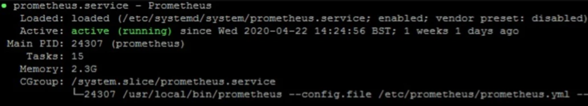

Prometheus® is an open source monitoring system developed by engineers at SoundCloud in 2012. In 2016, Prometheus was the second project accepted into the Cloud Native Computing Foundation after Kubernetes, and also to the second to graduate in 2018.
The Prometheus monitoring system includes a rich, multidimensional data model, a concise and powerful query language called PromQL, an efficient embedded time-series database, and over 150 integrations with third-party systems.


#### CONFIGURE PROMETHEUS ON CENTOS

#### PREREQUISITES:

1. Two 64-bit CentOS 7. One is Server1 and 2nd Server2 is for Node Exporter.
   **CPU** – 3.4 Ghz (2 cores)
   **Memory** – 2 GB
   **Storage** – 20 GB
   **Operating System** – CentOS 7

------

Login to Server1 Terminal as a Sudo/Non-Sudo user.

**Step 1 –** Update System

```
sudo yum update -y
```

**Step 2 –** Disable SELinux

```
sudo vim /etc/sysconfig/selinux
```

Change “SELINUX=enforcing” to “SELINUX=disabled”.
Change, save the file and then Reboot the System

```
sudo Reboot
```

**Step 3 –** Download Prometheus package
Go to official Prometheus [downloads page,](https://prometheus.io/download/) and copy the URL of the Linux “tar” file.

Run the following command to download the package. Paste the copied URL after wget in the below command:

```
wget https://github.com/prometheus/prometheus/releases/download/v2.17.2/prometheus-2.17.2.linux-amd64.tar.gz
```

**Step 4 –** Create a Prometheus user, required directories, and make Prometheus the user as the owner of those directories.

```
sudo useradd --no-create-home --shell /bin/false prometheus
sudo mkdir /etc/prometheus
sudo mkdir /var/lib/prometheus
sudo chown prometheus:prometheus /etc/prometheus
sudo chown prometheus:prometheus /var/lib/prometheus
```

**Step 5 –** Now go to Prometheus downloaded location and extract it.

```
sudo tar -xvzf prometheus-2.17.2.linux-amd64.tar.gz
```

**Step 6 –** Rename it as per your preference.

```
sudo mv prometheus-2.17.2.linux-amd64 prometheuspkg
```

**Step 7 –** Move the consoles and console_libraries directories from **prometheuspkg** to **/etc/prometheus** folder and change the ownership to **prometheus** user.

```
sudo cp -r prometheuspkg/consoles /etc/prometheus
sudo cp -r prometheuspkg/console_libraries /etc/prometheus
sudo chown -R prometheus:prometheus /etc/prometheus/consoles
sudo chown -R prometheus:prometheus /etc/prometheus/console_libraries
```

**Step 8 –** Copy **prometheus** and **promtool** binary from the **prometheuspkg** folder to **/usr/local/bin**

```
sudo cp prometheuspkg/prometheus /usr/local/bin/
sudo cp prometheuspkg/promtool /usr/local/bin/
```

**Step 9 –** Change the ownership to Prometheus user.

```
sudo chown prometheus:prometheus /usr/local/bin/prometheus
sudo chown prometheus:prometheus /usr/local/bin/promtool 
```

**Step 10 –** Add and modify the Prometheus Configuration file.

Now we will create the prometheus.yml file.

```
sudo vi /etc/prometheus/prometheus.yml
```

Add the following configuration to the file.

```
global:
  scrape_interval: 10s

scrape_configs:
  - job_name: 'prometheus'
    scrape_interval: 5s
    static_configs:
      - targets: ['localhost:9090']
```

Change the ownership of the file.

```
sudo chown prometheus:prometheus /etc/prometheus/prometheus.yml
```

**Step 11 –** Configure the Prometheus Service File.

```
sudo vi /etc/systemd/system/prometheus.service
```

Copy the following content to the file.

```
[Unit]
Description=Prometheus
Wants=network-online.target
After=network-online.target

[Service]
User=prometheus
Group=prometheus
Type=simple
ExecStart=/usr/local/bin/prometheus \
--config.file /etc/prometheus/prometheus.yml \
--storage.tsdb.path /var/lib/prometheus/ \
--web.console.templates=/etc/prometheus/consoles \
--web.console.libraries=/etc/prometheus/console_libraries

[Install]
WantedBy=multi-user.target
```

Save and the exit file

**Step 12-** Reload the systemd service to register the Prometheus service and start the Prometheus service and check the status

```
sudo systemctl daemon-reload
sudo systemctl start prometheus
sudo systemctl status prometheus
```



**Step 13 –** Access Prometheus Web UI

Now you will be able to access the Prometheus UI on 9090 port of the Prometheus server. Make sure that port 9090 is open for the web interface.

```
http://<prometheus-ip>:9090/graph
```


#### CONFIGURE NODE EXPORTER ON CENTOS

node_exporter is an exporter of machine metrics that can run on *Nix and Linux system.

In this tutorial, we will install the node_exporter on server2. We will monitor and get the metric of the server2.

**Step 1-** Go to the official [Prometheus downloads section](https://prometheus.io/download/) and download the latest.


```
wgethttps://github.com/prometheus/node_exporter/releases/download/v1.0.0-rc.0/node_exporter-1.0.0-rc.0.linux-amd64.tar.gz
```

**Step 2-** Extract the downloaded package.

```
sudo tar -xzf node_exporter-1.0.0-rc.0.linux-amd64.tar.gz
```

**Step 3-** create a user for node exporter and move binary to **/usr/local/bin**

```
sudo useradd -rs /bin/false nodeusr
sudo mv node_exporter-1.0.0-rc.0.linux-amd64/node_exporter /usr/local/bin/
```

**Step 4-** Create a node_exporter service file under systemd

```
sudo vi /etc/systemd/system/node_exporter.service
```

Add the following service file content :

```
[Unit]
Description=Node Exporter
After=network.target

[Service]
User=nodeusr
Group=nodeusr
Type=simple
ExecStart=/usr/local/bin/node_exporter

[Install]
WantedBy=multi-user.target
```

**Step 5-** Reload the system daemon and start the node exporter service and enable it on boot system

```
sudo systemctl daemon-reload
sudo systemctl start node_exporter
Sudo systemctl status node_exporter
sudo systemctl enable node_exporter
```


**Step 6 –** Access Node_Exporter Web UI

Now you will be able to access the Node_Exporter on 9100 port. Make sure that port 9100 is open for web interface.

```
http://IP-Address:9100/metrics
```


metrics look like this

**Step 7-** Now add Node_Exporter to the target Prometheus server
Login to the Prometheus server(server1) and open the prometheus.yml file.

```
sudo vi /etc/prometheus/prometheus.yml
```

**Step 8-** In the YML file add the node exporter target as shown below.

```
- job_name: 'node_exporter'
    scrape_interval: 5s
    static_configs:
      - targets: ['35.198.249.251:9100']
```

After adding the node exporter target in YML file it should look like this


**Step 9-** Restart the Prometheus services

```
sudo systemctl restart  prometheus
```

Now, if you check the target in prometheus web UI (http://<prometheus-IP>:9090/targets) , you will be able to see the status as shown below


you can use the Prometheus expression browser to query for node related metrics


**Congrats….** You have successfully installed and configure Prometheus and Node_Exporter to monitor matrix of your machine.