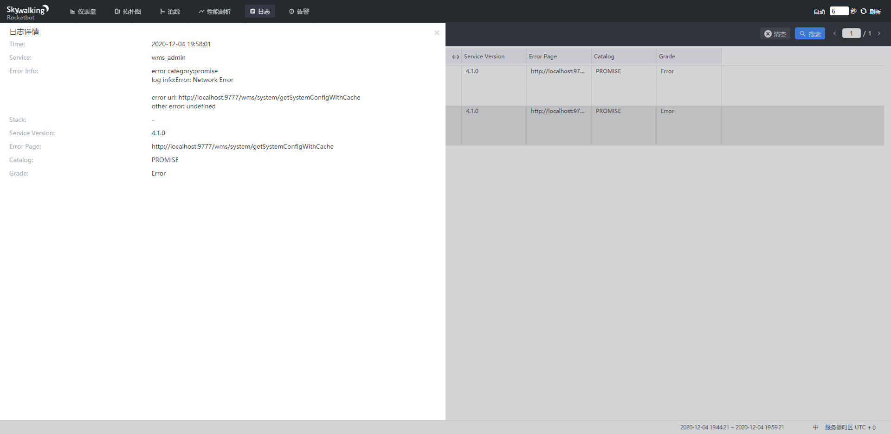
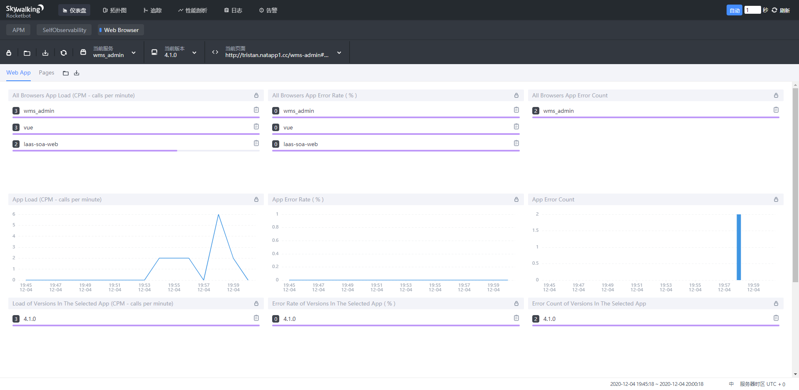
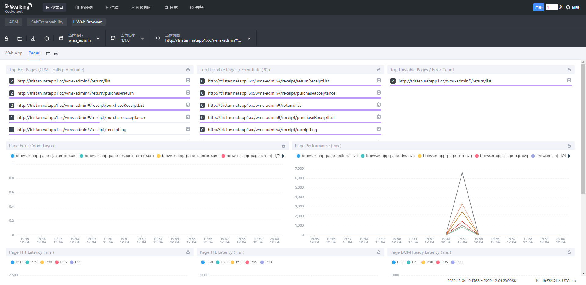

# 配置nginx代理oap

如果有多层nginx, 建议放到内层nginx中

```
		location /browser {
			proxy_pass http://192.168.2.35:12800;
			proxy_set_header Host      $host;
			proxy_set_header X-Real-IP $remote_addr;
		}
```

# 前端项目安装依赖

```
npm install skywalking-client-js --save
```

# 项目配置

每一个项目的package.json中的name都要用项目名称且不能与其他项目重复, version尽量保持有意义

# 配置在路由/公共js中

注意router.beforeEach在实际项目中最好只声明一次

```
import ClientMonitor from 'skywalking-client-js'

const router = createRouter() // 在router创建之后
const package_json = require('../../package.json')
const set_skywalking_monitor = async function(to, from, next) {
  const skywalking_config = {
    service: package_json.name,
    serviceVersion: package_json.version,
    pagePath: location.href.substring(0, location.href.indexOf('#') + 1) + to.path,
    jsErrors: true,
    apiErrors: true,
    resourceErrors: true,
    useFmp: true,
    enableSPA: true,
    autoTracePerf: true
  }
  try {
    ClientMonitor.register(skywalking_config)
    ClientMonitor.setPerformance(skywalking_config)
  } catch (e) {
    console.log(e)
  }
  next()
}
router.beforeEach(set_skywalking_monitor)
```

# 效果

目前能看到各个系统的前端页面访问记录的时间

控制台的打印日志







# 接下来

ajax 请求情况