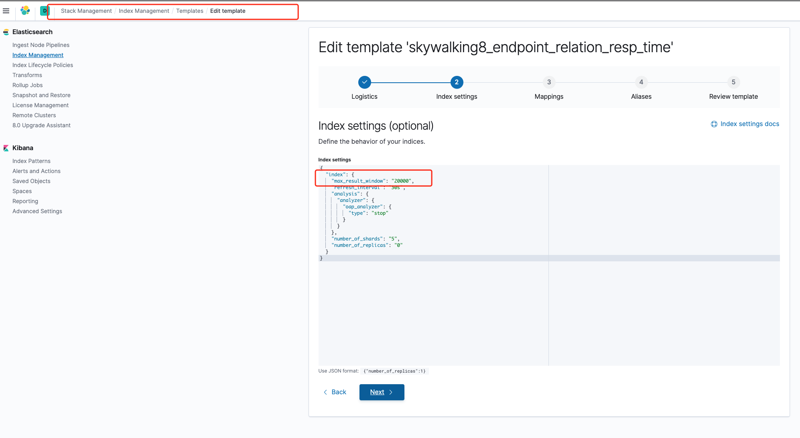
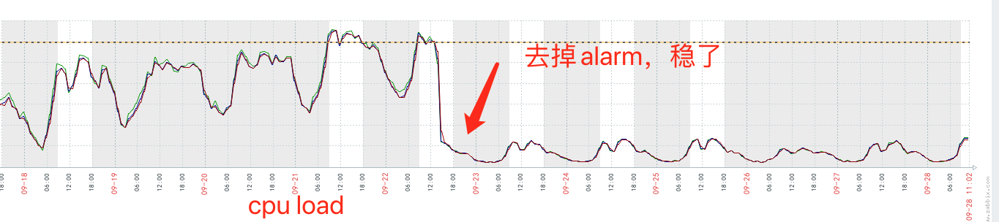

# [SkyWalking 8: 常见问题总结](https://my.oschina.net/osgit/blog/4558674)

原创

[刘少](https://my.oschina.net/osgit)

[Java](https://my.oschina.net/osgit?tab=newest&catalogId=493267)

09/11 16:25

阅读数 9.2K

[](https://www.oschina.net/group/architecture)

本文被收录于专区

[软件架构](https://www.oschina.net/group/architecture)

[进入专区参与更多专题讨论 ](https://www.oschina.net/group/architecture)

[干货限时下载丨想get最新最全的数据库知识？看这里就够了！>>>](https://e.cn.miaozhen.com/r/k=2210727&p=7jCTZ&dx=__IPDX__&rt=2&pro=s&ns=__IP__&ni=__IESID__&v=__LOC__&xa=__ADPLATFORM__&tr=__REQUESTID__&o=https://bbs.huaweicloud.com/blogs/221533?utm_source=oschina&utm_medium=banner&utm_campaign=Blog-pdev&utm_content=blog-details-text)


目前skywalking 8已经非常稳定，在线上很少遇到错误，个别错误也是配套系统引起，有些是配置参数问题。以下是我遇到的常见错误，可能还会增加：


## **Result window is too large, from + size must be less than or equal to: [10000] but was [10540].**

> Suppressed: org.elasticsearch.client.ResponseException: method [POST], host [http://10.0.20.30:9200], URI [/skywalking8_endpoint_relation_sla/_search?typed_keys=true&ignore_unavailable=false&expand_wildcards=open&allow_no_indices=true&search_type=query_then_fetch&batched_reduce_size=512&ccs_minimize_roundtrips=true], status line [HTTP/1.1 400 Bad Request] {"error":{"root_cause":[{"type":"illegal_argument_exception","reason":"Result window is too large, from + size must be less than or equal to: [10000] but was [10540]. See the scroll api for a more efficient way to request large data sets. This limit can be set by changing the [index.max_result_window] index level setting."}, {"type":"illegal_argument_exception","reason":"Result window is too large, from + size must be less than or equal to: [10000] but was [10540]. See the scroll api for a more efficient way to request large data sets. This limit can be set by changing the [index.max_result_window] index level setting."}, "reason":"Result window is too large, from + size must be less than or equal to: [10000] but was [10540]. See the scroll api for a more efficient way to request large data sets. This limit can be set by changing the [index.max_result_window] index level setting."}}], "caused_by":{"type":"illegal_argument_exception","reason":"Result window is too large, from + size must be less than or equal to: [10000] but was [10540]. See the scroll api for a more efficient way to request large data sets. This limit can be set by changing the [index.max_result_window] index level setting.", "caused_by":{"type":"illegal_argument_exception","reason":"Result window is too large, from + size must be less than or equal to: [10000] but was [10540]. See the scroll api for a more efficient way to request large data sets. This limit can be set by changing the [index.max_result_window] index level setting."}}},"status":400}

默认es搜索返回的结果最大数量是10000条，所以这里要进行调整。

 

调整分两步，第一步就是修改正在使用的索引，这里改为20000，

格式如下：

```
curl -H "content-type:application/json" -XPUT http://localhost:9200/indexName/_settings -d '{ "index" : { "max_result_window" : 20000}}'
```

实际执行：

```bash
curl -H "content-type:application/json" -XPUT http://10.0.20.30:9200/skywalking8_endpoint_relation_sla/_settings -d '{ "index" : { "max_result_window" : 20000}}'
```

另外还需要修改index template, 这也是skywalking方便的地方，每天都基于index template新建一个索引。

**访问kibana ： [Stack Management](http://kibana.eff.eqxiu.cc/app/kibana#/management) ->** **Index Management，** 

 



 


## **Grpc server thread pool is full, rejecting the task**

这个错误是因为你的oap服务的吞吐量太弱，太弱这里可以理解为：你的存储性能跟不上，或者你的oap server的配置太低都有可能， 但agent上报又快，最有效的方法是增加oap服务数量，提高底层存储配置。如果没有条件看下面：

默认grpc server的线程池大小是4*cpu数，排队队列长度是10000，可以调整这两个参数大小：定位到application.yml文件。在core的default下增加

gRPCThreadPoolSize: 默认是4倍的cpu，这里可以调高,例如8核默认是4*8=32，可以调成40或更多

gRPCThreadPoolQueueSize：默认是10000，可以调高


##  怎么关掉agent 日志：

在应用启动脚本里添加：

> export SW_LOGGING_LEVEL=OFF


# SkyWalking占用CPU过高

我司目前接入240个服务，oap server是两台8核16G机器，CPU load接近跑满了，鸭梨山大。我通过分析发现SkyWalking告警模块消耗CPU最多，但是我们又没使用告警模块，所以禁用之，这里不禁要感叹SkyWalking的模块化设计之强大。只需要修改config/application.yml, 将告警模块注释就好了

```
    #alarm:
    #selector: ${SW_ALARM:default}
    #default:
```

监控对比如下：去掉alarm后，cpu load稳定在2-3之间




# Can't split instance id into 2 parts

这种情况一般都是在skywalking老版本升级到8.x版本，因为存储没有清理干净导致的问题，请删除旧版本索引，再试试。


# io.grpc.StatusRuntimeException: CANCELLED: cancelled before receiving half close

> org.apache.skywalking.oap.server.receiver.trace.provider.handler.v8.grpc.TraceSegmentReportServiceHandler - 83 [grpcServerPool-1-thread-7] ERROR [] - CANCELLED: cancelled before receiving half close
> io.grpc.StatusRuntimeException: CANCELLED: cancelled before receiving half close

这个问题出现的原因有多方面，通过排查oap server cpu使用情况，长连接情况，目前我遇到是cpu load太高导致这个错误。