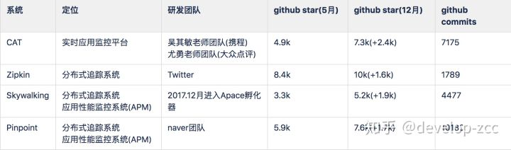
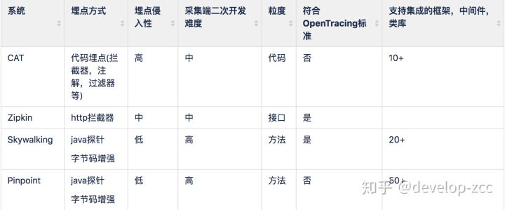
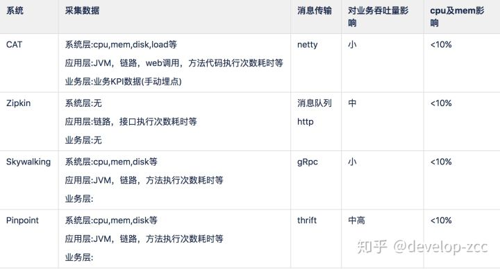
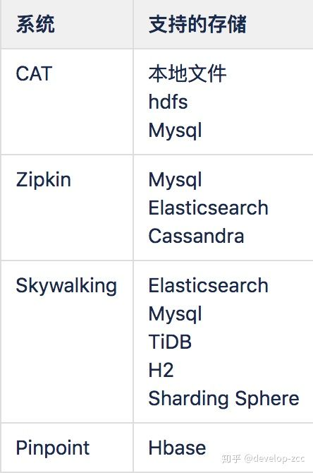
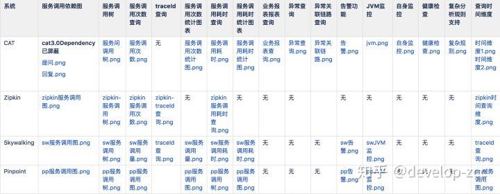
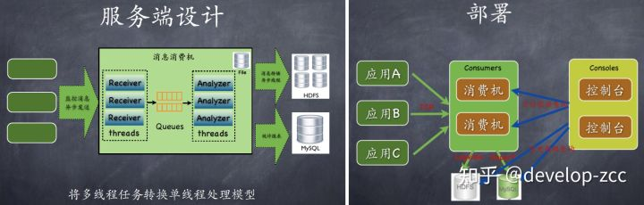
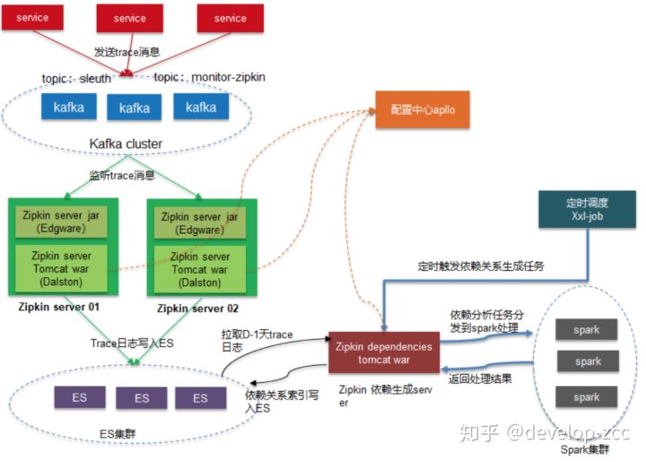
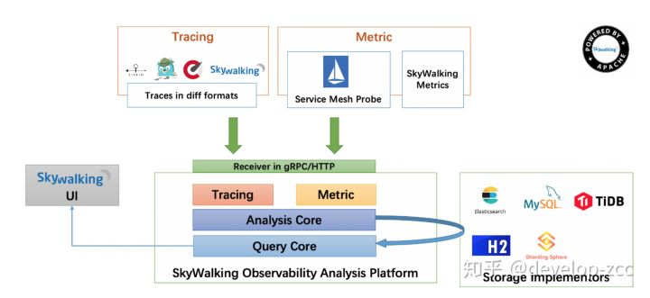
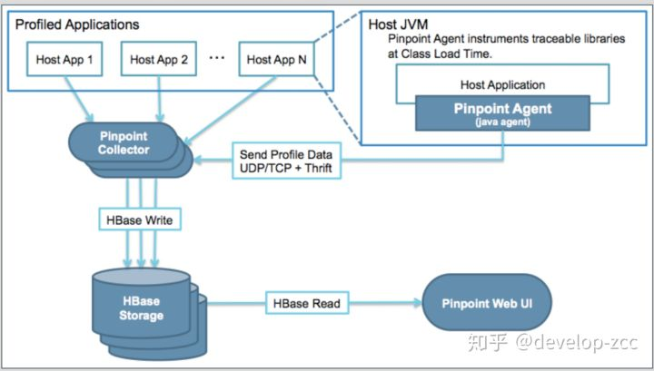

# 监控系统比较 Skywalking Pinpoint Cat zipkin

[develop-zcc](https://www.zhihu.com/people/developzcc)

未来程序员

关注他

16 人赞同了该文章

## 基本信息

1.CAT是一个更综合性的平台,提供的监控功能最全面，国内几个大厂生产也都在使用。但研发进度及版本更新相对较慢。

2.Zipkin由Twitter开源，调用链分析工具，基于spring-cloud-sleuth得到广泛使用，非常轻量，使用部署简单。

3.Skywalking专注于链路和性能监控，国产开源，埋点无侵入，UI功能较强。能够加入Apache孵化器，设计思想及代码得到一定认可，后期应该也会有更多的发展空间及研发人员投入。目前使用厂商最多。版本更新较快。

4.Pinpoint专注于链路和性能监控，韩国研发团队开源，埋点无侵入，UI功能较强，但毕竟是小团队，不知道会不会一直维护着，目前版本仍在更新中

## 埋点方式

1.无侵入方式的埋点对于业务方更透明，接入更便捷，但技术要求高，客户端的二次开发有一定门槛。

2.这几种方式对于各框架，中间件都要由相应的支持，以及同一组件不同版本的支持，由此带来的业务方更新成本无侵入方式肯定更低。

3.CAT虽然能做到代码级粒度，但需要侵入业务代码，增加了业务开发复杂度。

4.OpenTracing标准来自CNCF,对于后面CNCF旗下的产品数据兼容性更强。值得注意的是，Skywalking已经支持istio探针。

5.使用字节码增强技术对于技术升级切换成本较小，只需启动命令修改下。

## 埋点数据传输及性能

1.除了zipkin采集数据较单一，其他组件采集数据差不多

2.网络传输上消息队列应该优于其他，因为在大数据量场景下，消息中间件能够缓冲客户端与服务端吞吐量不平衡的情况，同时实时数据的分流处理，共享更灵活。其他方式要么将数据持久化到本地，要么占用大量内存，要么直接丢弃。

3.性能影响上Pinpoint相对于其他相对更大

4.cpu和mem影响都在10%的可接受范围内

## 数据存储

1.CAT的数据存储选型较落后，无法适应目前大数据量的查询，特别是一些精确查询

2.Pinpoint选择Hbase存储，局限于Hbase基于rowkey查询的限制，对于非rowkey字段的查询不支持

3.目前看来Elasticsearch是作为实时查询，时序查询比较好的一个选择，时间较长的重要历史数据可考虑同步到hive中。同时支持Elasticsearch作为数据源的开源报表工具也很多，如kibana,grafana等

## 功能分析

1.全链路较关注的“服务调用依赖图”，2017年12月就有人在github上提问题默认看不到页面，吴其敏老师2018年1月回答不够成熟，直到9月发布的3.0版本仍然没有开放这块功能，因此CAT在这块相对薄弱

2.服务调用树展示方面，个人觉得Pinpoint做的相对清晰全面，skywalking也还行，zipkin直接到接口级别，CAT虽然能够支持但需要进行额外改造，并且文档资料较少。

3.服务调用次数，耗时等基本都是有的

4.根据traceId查询的需求开发日常使用中还是比较频繁的，CAT和Pinpoint都没有直接提供根据traceId的查询的页面。

5.CAT出了链路，性能监控的功能外，提供了监控方面其他的一些功能，更加综合性。对于接入的服务根据经验及需求能够默认产生一些常用实用的报表。但异常监控，及业务报表功能有很多进一步优化的余地,如异常只能根据异常的类名来过滤，不支持时间窗口，不支持自定义图表等。

6.CAT面向的使用人员包括开发，测试，业务，运维，其他几个更多的是面向开发，测试，运维。我们如果要做一套综合性的监控系统的话这些用户对象使用体验都要考虑，并且不同的对象对于数据查看，展示，操作的需求，数据展示的维度都会有差异。

## 架构设计

### Cat

### zipkin

### skywalking

### Pinpoint

1.采集端，CAT和Zipkin直接嵌入项目或框架，CAT需要机器特定目录下额外的配置文件，Skywalking和Pinpoint也需要在机器实现在机器目录下由agent的jar包，如果后面通过容器发布，可以文件打入镜像中，需要使用的业务方直接在Dockerfile中使用相应的镜像，并配置-javaagent启动参数即可。

2.CAT和Skywalking都在数据存储之前提供了分析，预聚合功能，用于提升后续页面查询的效率，Pinpoint的页面功能基本都是基于原始数据进行分析，因此在数据量较大时页面展示会出现加载非常慢的情况。

3.CAT生产部署要求极其配置较高，堆大小至少10G以上