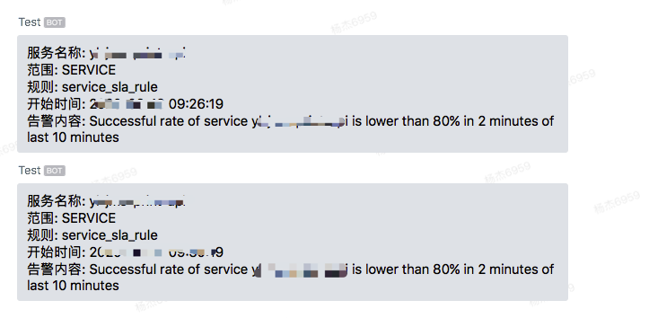

# Apache SkyWalking Alarm

 2020/06/09 [OPS](https://www.jevic.cn/categories/#OPS)

## alarm-settings.yml


> `alarm-settings.yml` 配置为configmap 以便于动态修改加载;

详细配置参考: [deployment/configmap.yml](https://github.com/jevic/skywalking/blob/master/deployment/configmap.yml)

## alarm body


skywalking alarm报警信息如下所示;

```
[{
    "scopeId": 1,
    "scope": "SERVICE",
    "name": "java-app-demo",
    "id0": 23,
    "id1": 0,
    "ruleName": "service_sla_rule",
    "alarmMessage":
    "Successful rate of service java-app-demo is lower than 80% in 2 minutes of last 10 minutes",
    "startTime": 1591951818298
}, {
    "scopeId": 1,
    "scope": "SERVICE",
    "name": "java-app-demo-test",
    "id0": 2,
    "id1": 0,
    "ruleName": "service_sla_rule",
    "alarmMessage":
    "Successful rate of service java-app-demo-test is lower than 80% in 2 minutes of last 10 minutes",
    "startTime": 1591951818298
}]
```

因此,需要对 `body` 数据重新进行处理;

## webhook(企业微信)


### weixin.py

```
# -*- coding:utf-8 -*-
import requests
import json

url = "https://qyapi.weixin.qq.com/cgi-bin/webhook/send"
def Weixin(content):
    querystring = {"key": "6c48b0fd-38c0-xxxx-a314-b76ed88f4fba"}
    payload = {"msgtype": "text", "text": {"content": "%s" % content}}

    headers = {
        'Content-Type': "application/json",
    }

    response = requests.request("POST",
                                url,
                                data=json.dumps(payload),
                                headers=headers,
                                params=querystring)

    print(response.text)
```

### alarm.py

```
# -*- coding:utf-8 -*-
from flask import Flask, request, jsonify
from weixin import Weixin
import json
import time

app = Flask(__name__)


@app.route('/alarm', methods=['POST', 'GET'])
def wechat():
    if request.method == 'POST':
        try:
            data = request.get_data()
            codes = json.loads(data.decode('utf-8'))
            for i in range(len(codes)):
                Message = codes[i]
                name = Message['name']
                scope = Message['scope']
                ruleName = Message['ruleName']
                message = Message['alarmMessage']
                startTime = str(Message['startTime'])
                timeStamp = int(startTime[0:10])
                timeArray = time.localtime(timeStamp)
                StartTime = time.strftime("%Y-%m-%d %H:%M:%S", timeArray)
                AlarmMsg = "服务名称: %s\n范围: %s\n规则: %s\n开始时间: %s\n告警内容: %s" % (name, scope, ruleName, StartTime, message)
                Weixin(AlarmMsg)
            return jsonify({"msg": "ok"})
        except Exception as error:
            print (error)
            return jsonify({"mgs": error})
    else:
        return jsonify({"mgs": "POST only!!"})


if __name__ == "__main__":
    app.run(host='0.0.0.0', port=5100)
```



### alarm images

> 默认端口:5100

> 环境变量: token=xxxx

```
registry.cn-shenzhen.aliyuncs.com/jevic/skywalking:alarm-dingding
registry.cn-shenzhen.aliyuncs.com/jevic/skywalking:alarm-weixin
```

#### docker 运行示例

```
docker run -d --name weixin -p 5100:5100 -e token=xxxxx IMAGE
```

#### k8s yaml

```
apiVersion: apps/v1
kind: Deployment
metadata:
  name: apm-alarm
  labels:
    app: apm-alarm
spec:
  selector:
    matchLabels:
      app: apm-alarm
  replicas: 1
  template:
    metadata:
      labels:
        app: apm-alarm
    spec:
      containers:
        - name: apm-alarm
          image: registry.cn-shenzhen.aliyuncs.com/jevic/skywalking:alarm-weixin
          env:
            - name: token
              value: "xx-xx-4ac3xxa314-xxx"
          ports:
            - containerPort: 5100
              name: apm-alarm
      restartPolicy: Always
---
apiVersion: v1
kind: Service
metadata:
  name: apm-alarm
spec:
  selector:
    app: apm-alarm
  type: NodePort
  ports:
    - name: apm-alarm
      port: 5100
      targetPort: 5100
      protocol: TCP
      # nodePort:
```

------

[backend-alarm](https://github.com/apache/skywalking/blob/master/docs/en/setup/backend/backend-alarm.md) [skywalking 告警](https://skyapm.github.io/document-cn-translation-of-skywalking/zh/6.3.0/setup/backend/backend-alarm.html)