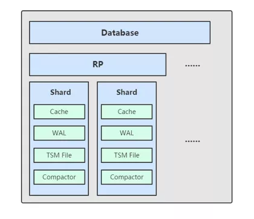
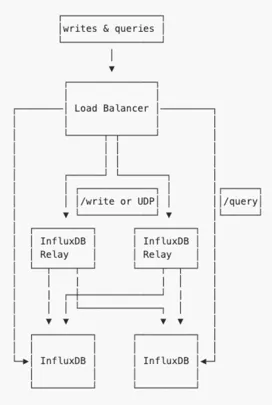
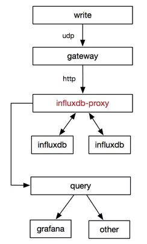
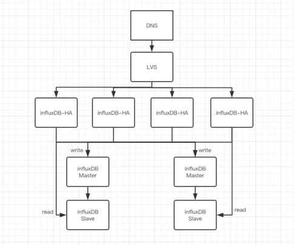
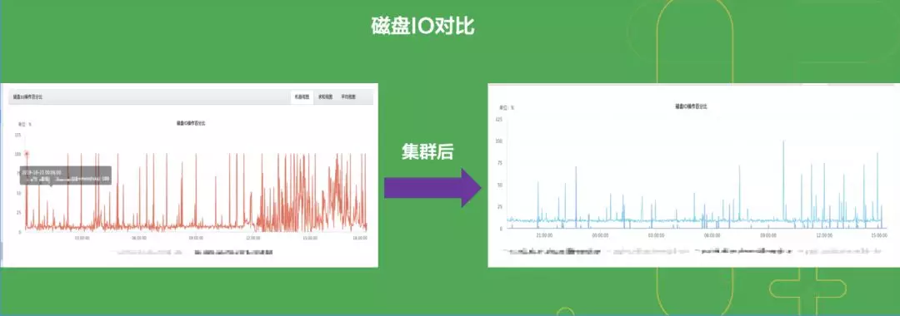
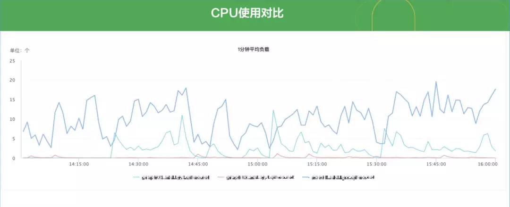
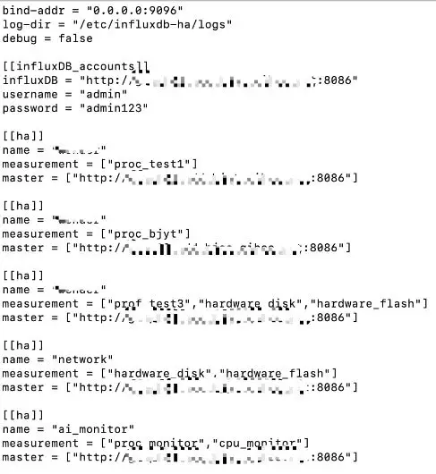
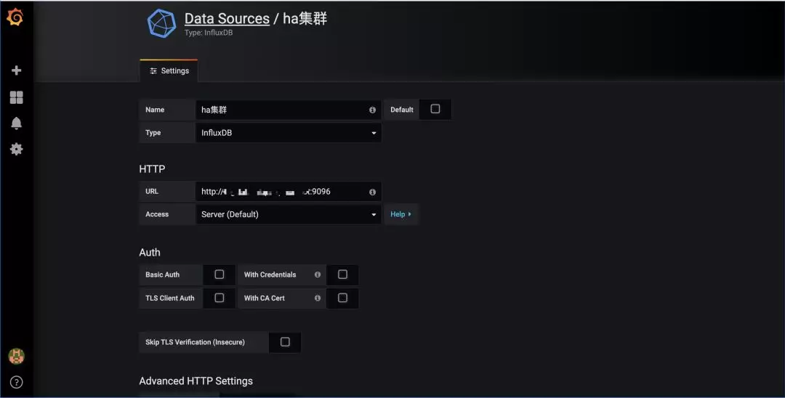

# influxDB集群模式实践

- 360云计算

** 2019 年 12 月 09 日

**[文化 & 方法](https://www.infoq.cn/topic/culture-methods)[最佳实践](https://www.infoq.cn/topic/best-practices)[方法论](https://www.infoq.cn/topic/methodologies)

## 1 基础概念

### TSDB 与传统 DB 比较

1. 传统数据库多用于记录数据的当前值。
2. 时序数据库记录基于时间的一系列数据。

### TSDB 应用场景

由时序产生，并且需要展现其历史趋势、周期规律、异常性的，进一步对未来做出预测分析的，都是时序数据库适合的场景。具体场景：各类设备的监控数据，医学中的血糖、血压、心率的监控数据，金融业中交易、成交数据等。

### 为什么选择 influxdb

1. 开发者社区活跃，使用者众多，开源时间较长。性能经过检验；
2. 类SQL的插入、查询语言，不会增加太大的学习成本；
3. 原生HTTP接口支持各类语言调用；
4. 仅仅作为存储方案，可插拔。

### influxdb 之 TSM 存储引擎概述

- TSM 存储引擎主要由几个部分组成：
- cache。在内存中是一个简单的 map 结构默认配置文件中为1g。
- wal。记录内容和cache一样，目的是为了持久化cache数据，influxdb启动时会加载wal的数据到内存。
- tsm file。用于数据存储。
- compactor。主要进行两类操作：
- cache->snapshot->tsm；
- 合并小tsm成为大的   tsm。

### Shard——TSM 存储引擎之上的概念

1. 按时间戳所在不同范围创建不同Shard；
2. 根据时间可以快速定位要查询的数据资源，加快查询的过程；
3. 让根据时间的批量删除操作变得非常简单且高效。

## 2 项目由来

1. influxdb社区版默认并未提供集群解决方案。
2. 官方开源的influxdb-relay仅仅支持双写功能，并未支持负载均衡能力。
3. 饿了么开源的influx-proxy集群方案组件众多，安装部署、后期维护成本高、复杂度大。
4. 360公司内部需求：提供十万台主机的两百个监控项数据的实时出图、访问，基于这些监控项的告警以及故障预测。
5. 基于上述需求，于是有了influxDB-HA项目。

## 3 程序架构

### 官方开源 influxdb-relay 方案

未解决的问题：

1. 采用双写仅仅解决了数据备份的问题，并未解决influxdb读写性能的问题；
2. 只是写入了数据，查询还是需要去读influxdb。增加了配置文件的复杂度不易维护；
3. 并未对写入失败的数据做任何重试机制的处理。

### 饿了么 influxdb 高可用解决方案

优势：

1. influx-proxy是饿了么在influxdb-relay满足不了其性能要求、配置维护要求痛定思痛后重构的产物；
2. influxdb机器支持动态扩缩；
3. 增加了强大的请求失败后的重试机制。

劣势：

1. 架构中使用的组件较多，增加了使用者的学习成本，且不易于后期的维护；
2. 请求失败重试本身是双刃剑，试想机器性能达到极限，重试无形中又增加了机器的负载；
3. 与自身场景需求不相符，我们内部只是做监控数据的持久化存储，应该是最简单的接入和与influxdb最小的架构改造。

### 360 内部 influxDB-HA 解决方案

优势：

1. 以measurement为最小拆分单元，从而保证以时序查询influxdb的高效性。
2. 支持业务层动态的拆库、拆表操作。

## 4 性能比较

与单机 influxdb 磁盘 IO 对比。

与单机 influxdb CPU 使用对比。

## 5 业务方接入 influxDB-HA 说明

influxDB-HA 管理 influxdb 实例配置。

Grafana 接入 influxDB-HA 说明。

三方程序接入 influxDB-HA 写入数据说明。

1. 完全兼容influxdb原生的/write接口方式写入，且支持原生查询接口的所有参数；
2. 如果您说您以前习惯了使用influxdb的SDK方式写入，那也恭喜您。influxDB-HA支持任何语言的influxdb SDK接入。

## 6 后期迭代计划

一个优秀的项目需要经历无数的版本迭代和优化，而对于开发者而言，能兼容各类需求、适应各类场景是沉淀、提升技术的不二法门。鉴于此，我们应该不断完善 influxDB-HA 以支持 360 内部各类使用场景。接来下，仅提出未来可见的优化点：

1. 接入kafka、RabbitMQ做写入请求之前的缓冲，降低数据丢失的风险；
2. influxDB-HA配置文件的热加载（目前已经通过golang的fsnotify库实现，将来更大规模的influxDB-HA集群应该通过etcd等外部的配置统一管理来实现）；

对接业务方分表，以支持更大数据规模场景下的解决方案，measurement 始终作为 influxDB-HA 集群中可拆分的最小单元，避免不同 measurement 的合并排序问题。

## 7 influxdb 使用注意事项

经过一段时间（近一个多月）的实践和对 influxdb 性能的综合观察，总结出以下结论供我们大家一起探讨：

1、continuous queries/select：

笔者看见很多对于 influxdb 的不满来自于对其性能的诟病。然而有目共睹的是其写入性能是极其优秀的，那究竟查询性能如何呢？

实践总结：对于超过 10 万样本数据的查询操作而言，我们通过索引（即 influxdb 中的 tag）查询将能够节省机器性能，大大降低查询时间。查询操作往往耗死机器的根本原因是：OOM（Out Of Memory）

那么在配置 CQ 时，应该：

- 尽可能使用tag；
- 应该拿写好的CQ充分模拟线上环境的测试，证明性能没问题后再上线。

2、retention policy：

配置数据的留存策略好处是数据持久化，但数据量较大时劣势也非常明显，会占用很大的 CPU，造成读写数据异常。所以配置 RP 时我们必须注意：

- 尽量在读写并发量较小的时刻去操作；
- 可以在influxdb slave库中反复设置RP实践出最佳方式再上线。

**本文转载自公众号 360 云计算（ID：hulktalk）。**

**原文链接：**

https://mp.weixin.qq.com/s/erNqCgUTEIVygNknydlPag

2019 年 12 月 09 日 10:051310