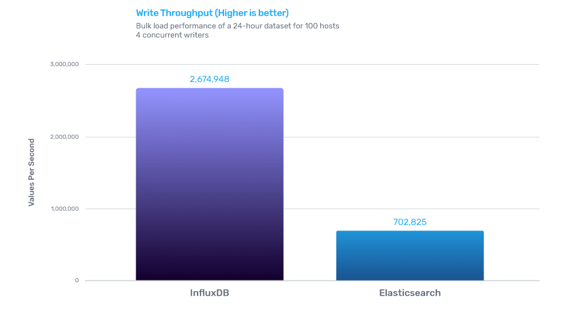
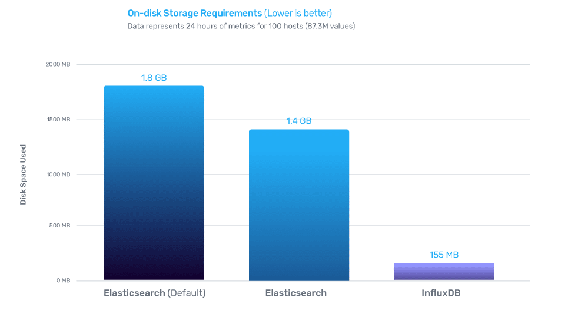
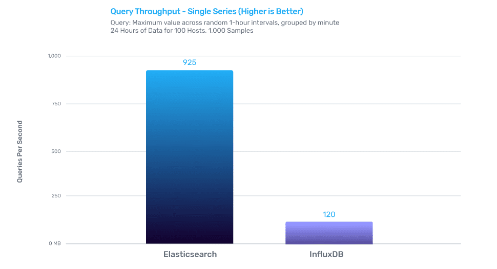

# InfluxDB vs. Elasticsearch for Time Series Data & Metrics Benchmark

By [Chris Churilo ](https://www.influxdata.com/blog/author/chrisc/)/ February 6, 2018 / [Community](https://www.influxdata.com/blog/category/community/), [InfluxDB](https://www.influxdata.com/blog/category/tech/influxdb/) / [1 Comment](https://www.influxdata.com/blog/influxdb-markedly-elasticsearch-in-time-series-data-metrics-benchmark/#comments)

6 minutes

*This blog post has been updated on July 17, 2020 with the latest benchmark results for InfluxDB v1.8.0 and Elasticsearch v7.8.0. To provide you with the latest findings, this blog is regularly updated with the latest benchmark figures.*

At InfluxData, one of the common questions we regularly get asked by developers and architects alike is: “How does InfluxDB compare to [Elasticsearch](https://www.influxdata.com/integration/elasticsearch-monitoring/) for time series workloads?” This question might be prompted for a few reasons. First, if they’re starting a brand new project and doing the due diligence of evaluating a few solutions head-to-head, it can be helpful in creating their comparison grid. Second, they might already be using Elasticsearch for ingesting logs in an existing monitoring setup, but would like to now see how they can integrate metrics collection into their system and believe there might be a better solution than Elasticsearch for this task.

Over the last few weeks, we set out to compare the performance and features of InfluxDB and Elasticsearch for time series workloads, specifically looking at the rates of data ingestion, on-disk data compression, and query performance. InfluxDB outperformed Elasticsearch in two tests, with **3.8****x greater write throughput**, while using **9****x less disk space** when compared against Elastic’s time series optimized configuration. InfluxDB delivered **7.7****x faster** response times for tested queries, compared to response time of cached queries from Elasticsearch.

It’s also important to note that configuring Elasticsearch for time series wasn’t trivial — it requires up-front decisions about [indexing](https://www.elastic.co/guide/en/elasticsearch/reference/current/mapping-source-field.html), [heap sizing](https://www.elastic.co/guide/en/elasticsearch/guide/current/heap-sizing.html), and how to [work with the JVM](https://www.elastic.co/guide/en/elasticsearch/guide/current/_java_virtual_machine.html). InfluxDB, on the other hand, is ready to use for time series workloads out of the box with no additional configuration with a schema and query language designed for working with time series.

We felt that this data would prove valuable to engineers evaluating the suitability of both these technologies for their use cases; specifically, time series use cases involving custom monitoring and metrics collection, real-time analytics, Internet of Things (IoT) and sensor data, plus container or virtualization infrastructure metrics. The benchmark exercise did not look at the suitability of InfluxDB for workloads other than those that are time-series-based. InfluxDB is not designed to satisfy full-text search or log management use cases and therefore would be out of scope. For these use cases, we recommend sticking with Elasticsearch or similar full-text search engines.

*To read the complete details of the benchmarks and methodology,* [*download*](https://www.influxdata.com/resources/benchmarking-influxdb-vs-elasticsearch-for-time-series/?ao_campid=70137000000JgNk) *the “Benchmarking InfluxDB vs. Elasticsearch for Time Series Data & Metrics Management” technical paper or* [*watch the recorded webinar.*](https://www.influxdata.com/resources/lets-compare-benchmark-influxdb-1-4-vs-elasticsearch-5-6-3/)

Our overriding goal was to create a consistent, up-to-date comparison that reflects the latest developments in both InfluxDB and Elasticsearch with later coverage of other databases and time series solutions. We will periodically re-run these benchmarks and update our detailed [technical paper](https://www.influxdata.com/resources/benchmarking-influxdb-vs-elasticsearch-for-time-series/?ao_campid=70137000000JgNk) with our findings. All of the code for these [benchmarks is available on Github](https://github.com/influxdata/influxdb-comparisons). Feel free to open up issues or pull requests on that repository if you have any questions, comments, or suggestions.

Now, let’s take a look at the results…

## Versions tested

**InfluxDB v1.8.0**

InfluxDB is an open source Time Series Database written in Go. At its core is a custom-built storage engine called the [Time-Structured Merge (TSM) Tree](https://www.influxdata.com/blog/new-storage-engine-time-structured-merge-tree/), which is optimized for time series data. Controlled by a custom SQL-like query language named [InfluxQL](https://docs.influxdata.com/influxdb/v1.4/query_language/), InfluxDB provides out-of-the-box support for mathematical and statistical functions across time ranges and is perfect for custom monitoring and metrics collection, real-time analytics, plus IoT and sensor data workloads.

**Elasticsearch v7.8.0**

Elasticsearch is an open-source search server written in Java and built on top of [Apache Lucene](https://lucene.apache.org/). It provides a distributed, full-text search engine suitable for enterprise workloads. While not a time series database per se, Elasticsearch employs Lucene’s column indexes, which are used to aggregate numeric values. Combined with query-time aggregations and the ability to index on time-stamp fields (which is also important for storing and retrieving log data), Elasticsearch provides the primitives for storing and querying time series data.

In building a representative benchmark suite, we identified the most commonly evaluated characteristics for working with time series data. We looked at performance across three vectors:

- **Data ingest performance** – measured in values per second
- **On-disk storage requirements** – measured in Bytes
- **Mean query response time** – measured in milliseconds

Since Elasticsearch is a special-purpose search server and not intended for time series data out of the box, some configuration changes are recommended by Elastic for storing these types of metrics. In our testing, we found that these changes:

- Did not have an impact on write or query performance
- Did make a difference in storage requirements

## About the dataset

For this benchmark, we focused on a dataset that models a common DevOps monitoring and metrics use case, where a fleet of servers are periodically reporting system and application metrics at a regular time interval. We sampled 100 values across 9 subsystems (CPU, memory, disk, disk I/O, kernel, network, Redis, PostgreSQL, and Nginx) every 10 seconds. For the key comparisons, we looked at a dataset that represents 100 servers over a 24-hour period, which represents a relatively modest deployment.

- Number of Servers: 100
- Values measured per Server: 100
- Measurement Interval: 10s
- Dataset duration(s): 24h
- Total values in dataset: **87M** per day

This is only a subset of the entire benchmark suite, but it’s a representative example. If you’re interested in additional detail, you can read more about the testing methodology on [GitHub](https://github.com/influxdata/influxdb-comparisons).

## Write performance

InfluxDB outperformed Elasticsearch by 3.8x when it came to data ingestion.

## On-disk compression

InfluxDB outperformed Elasticsearch for time series by delivering 9x better compression.

## Query performance

InfluxDB for time series delivers 7.7x better performance, when returning cached queries.

## Summary

Ultimately, many of you were probably not surprised that a purpose-built time series database designed to handle metrics would significantly outperform a search database for these types of workloads. Especially glaring is that when the workloads require scalability, as is the common characteristic of real-time analytics and sensor data systems, a purpose-built time series database like InfluxDB makes all the difference.

In conclusion, we highly encourage developers and architects to [run these benchmarks](https://github.com/influxdata/influxdb-comparisons) for themselves to independently verify the results on their hardware and data sets of choice. However, for those looking for a valid starting point on which technology will give better time series data ingestion, compression and query performance “out-of-the-box”, InfluxDB is the clear winner across all these dimensions, especially when the data sets become larger and the system runs over a longer period of time.

## What’s next?

- Download the detailed technical paper: [“Benchmarking InfluxDB vs. Elasticsearch for Time Series Data, Metrics & Management”.](https://www.influxdata.com/resources/benchmarking-influxdb-vs-elasticsearch-for-time-series/?ao_campid=70137000000JgNk)
- Learn more about the [Telegraf + ElasticSearch Integration.](https://www.influxdata.com/integration/elasticsearch-monitoring/)
- Check out the [video playback](https://www.influxdata.com/resources/lets-compare-benchmark-influxdb-1-4-vs-elasticsearch-5-6-3/) of the companion webinar.
- [Download](https://www.influxdata.com/downloads/) and [get started](https://docs.influxdata.com/influxdb/latest/introduction/getting_started/) with InfluxDB.
- Join the [Community](https://community.influxdata.com/)!