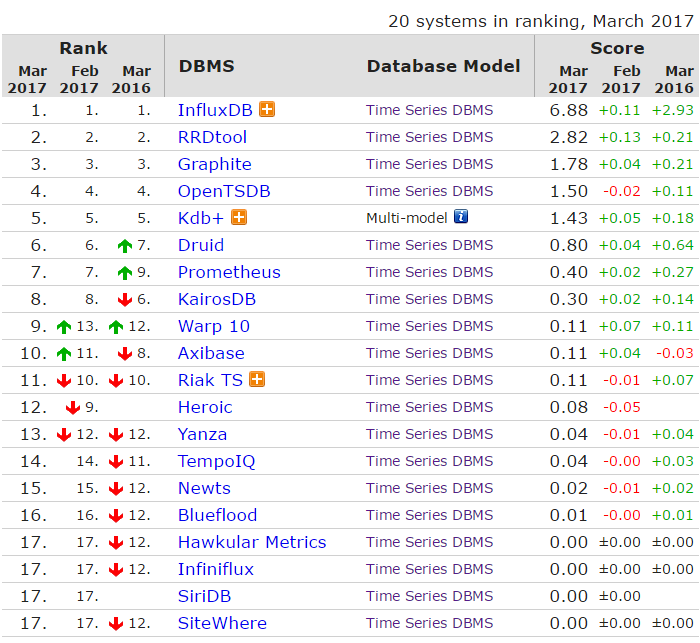

# 降维打击！使用ElasticSearch作为时序数据库

[Golion](https://www.zhihu.com/people/golion)

算法专家

关注他

70 人赞同了该文章

本篇分享最近把ElasticSearch当作时序数据库来用的心得。

**• 需求**

需求是这样的：提供一个后台，选用户画像标签（多选），点确认后弹出“选出了xxx个用户”，再继续点就把用户dump出来、推送消息。现在要做这个后台的数据仓库层。

详细分析一下需求：

**1.** 我们的用户画像走流式计算，每秒大量更新，所以**对插入/更新性能要求很高**。

**2.** 查询条件翻译成SQL就是类似 select count(*) from `table` where (`tags` like '%tag1%') and (`tags` like '%tag2%') and (`tags` like '%tag3%') and ...，**常规数据库算起来比较慢**。

需要一个数据仓库，支持大量插入/更新、大量导出、快速多字符串匹配查询。

于是一开始的选型是用**时序数据库InfluxDB**。这里贴一张截至当前的时序数据库排名（2017-03 [popularity ranking of time Series DBMS](https://link.zhihu.com/?target=http%3A//db-engines.com/en/ranking/time%2Bseries%2Bdbms) ）。

很不幸的是，单机版InfluxDB在压测环节爆了，顶不住插入/更新的量。而分布式InfluxDB又闭源了。接下来尝试了一下ElasticSearch，于是就有了这篇文章了。

**• ES能干这个事么？**

还真能。

**1. 插入/更新性能高**

ES通过**bulk接口**，可以做到批处理，拥有相当高的插入/更新性能。

**2. 查询效率高**

ES的**text类型**的数据在插入/更新时，会被默认分词器把空格隔开的字符串做**分词**。在处理如 where (`tags` like '%tag1%') and (`tags` like '%tag2%') and (`tags` like '%tag3%') and ... 这样的查询条件时，用的是**倒排索引算法**（[Inverted index - Wikipedia](https://link.zhihu.com/?target=https%3A//en.wikipedia.org/wiki/Inverted_index)）而不是字符串匹配，效率极高。

**3. 导出效率高**

用ES的**scroll接口**可以做到这么一件事：**1）**进行一个查询，指定翻页大小、本次查询的索引保存时间，获取一个scroll_id；**2）**通过scroll_id不断地翻页。可以实现大批量导出一个查询的所有数据，不需要重复计算。

**4. 高可用与横向扩展能力**

就不赘述了。

**• 实现与优化**

**1.** 用了3个Node组成的集群，全SSD。3个刚好是满足高可用的最小Master Node数量。每个Node的内存开到31G。

**2.** ES前面顶一层Logstash，Logstash开一个http-input和elasticsearch-output，用HTTP Keep-Alive来接流量。关键配置有：

**1）**input.http.threads默认是4，要开大；

**2）**output.elasticsearch.action => "update"，output.elasticsearch.doc_as_upsert => true，这样可实现upsert操作；

**3）**pipeline.workers跟pipeline.output.workers开到跟核数一致；

**4）**pipeline.batch.size跟output.elasticsearch.flush_size适度开大。

**3.** 整个流程是数据怼Logstash、Logstash怼ES，所以会有ES的数据延后几秒才更新的情况，这样可能会引起一些问题，需要务必留意。

**4.** ES5.0取消了ttl，所以数据的过期要另外处理。

**5.** ES的scroll查询中，通过配置_source来提取部分字段，可以大幅降低网络I/O。

**• 一些惊喜**

我们往ES里存的标签是没去重的原始数据，就是说一个用户的标签可能长这样：

A B A A A C D A

而ES本质上是个搜索引擎，**使用默认的BM25算法搜索用户，排在前面的就自然是重度用户**。

非常不错。

**• 总结**

ElasticSearch除了用来干搜索、运维监控之外，还能用来当时序数据库。在这个Case里，算是**对****InfluxDB等时序数据库产品做降维打击了**，真乃居家旅行、杀人越货的神器。

PS：实在是忙，一眨眼三个月没更新了。一直想写一篇讲怎么用ES做数据分析和简单推荐的文章，希望可以憋出来。