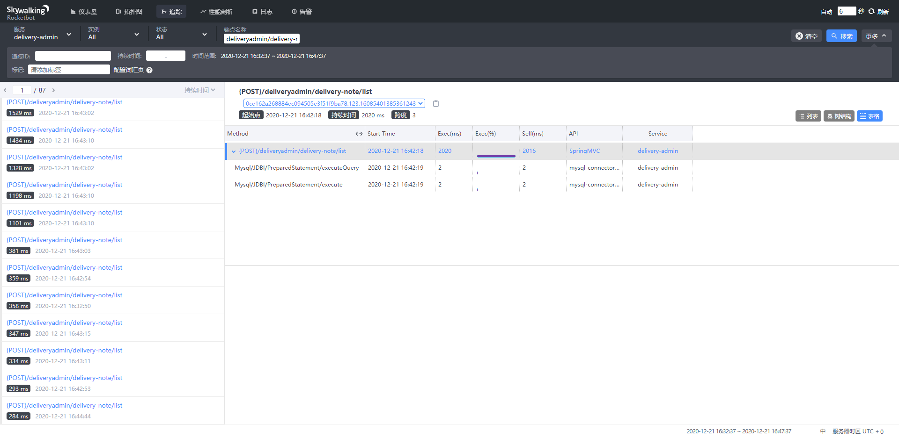
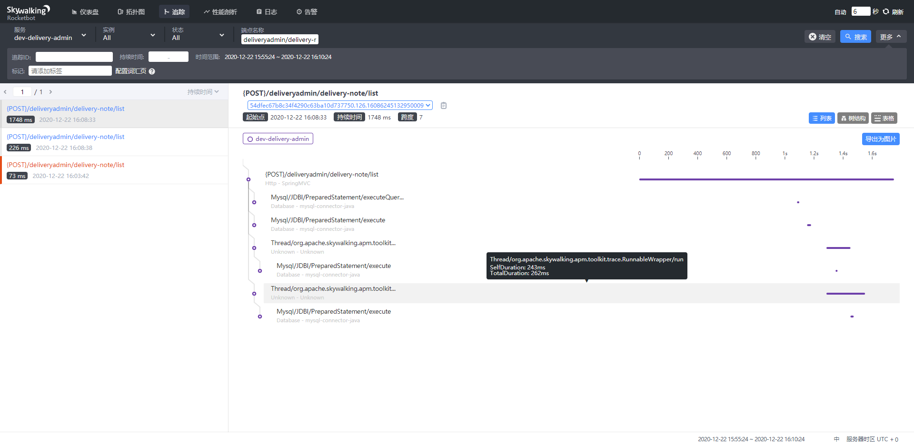

默认情况下skywalking是不支持监控其他线程的(在多线程情况下)

# 需要添加依赖

```
<!-- https://mvnrepository.com/artifact/org.apache.skywalking/apm-toolkit-trace -->
<dependency>
    <groupId>org.apache.skywalking</groupId>
    <artifactId>apm-toolkit-trace</artifactId>
    <version>8.3.0</version>
    <scope>provided</scope>
</dependency>
```

# 对异步线程进行改造

查看所用多线程使用的方式

查看调用函数所需要的类型, 在以下哪三种中选择一个使用

## 1、在线程类上添加注解: @TraceCrossThread

```java
    @TraceCrossThread
    public static class MyCallable<String> implements Callable<String> {
        @Override
        public String call() throws Exception {
            return null;
        }
    }
...
    ExecutorService executorService = Executors.newFixedThreadPool(1);
    executorService.submit(new MyCallable());
```

## 2、使用CallableWrapper包裹原有Callable

```java
    ExecutorService executorService = Executors.newFixedThreadPool(1);
    executorService.submit(CallableWrapper.of(new Callable<String>() {
        @Override public String call() throws Exception {
            return null;
        }
    }));
```

或者使用RunnableWrapper包裹原有Runnable

```java
    ExecutorService executorService = Executors.newFixedThreadPool(1);
    executorService.execute(RunnableWrapper.of(new Runnable() {
        @Override public void run() {
            //your code
        }
    }));
```

## 3、在Supplier类上添加注解: @TraceCrossThread

```java
    @TraceCrossThread
    public class MySupplier<String> implements Supplier<String> {
        @Override
        public String get() {
            return null;
        }
    }
...
CompletableFuture.supplyAsync(new MySupplier<String>());
```

或者

```
    CompletableFuture.supplyAsync(SupplierWrapper.of(()->{
            return "SupplierWrapper";
    })).thenAccept(System.out::println);
```

# 效果

原来的效果:



调整后的效果:

