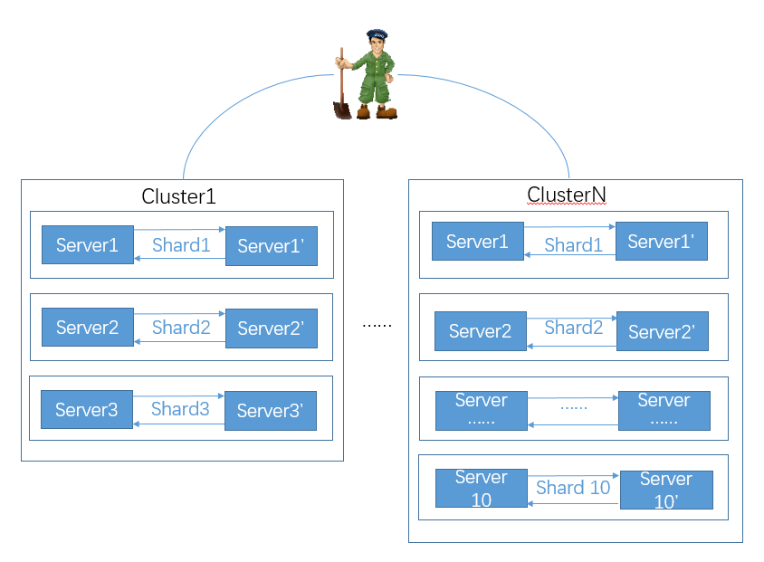
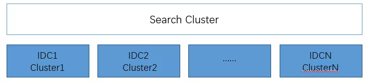
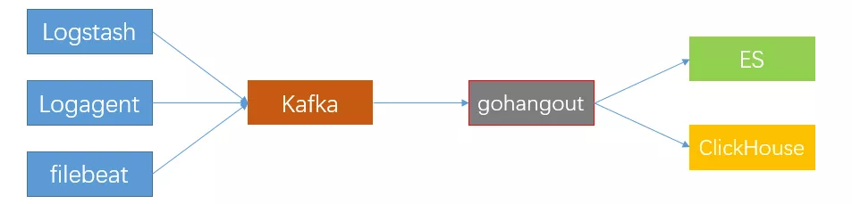
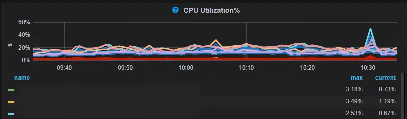
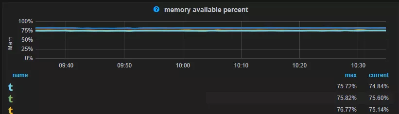
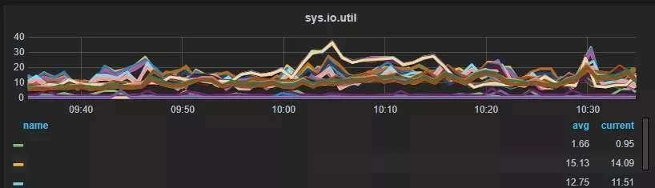
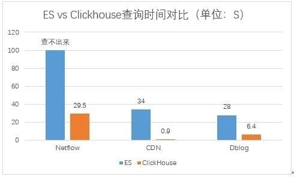

**作者介绍**

 

ElasticSearch是一种基于Lucene的分布式全文搜索引擎，携程用ES处理日志，目前服务器规模500+，日均日志接入量大约200TB。随着日志量不断增加，一些问题逐渐暴露出来：一方面ES服务器越来越多，投入的成本越来越高；另一方面用户的满意度不高，日志写入延迟、查询慢甚至查不出来的问题一直困扰着用户；而从运维人员的角度看，ES的运维成本较高，运维的压力越来越大。

 

**一、为什么选择ClickHouse**

 

ClickHouse是一款高性能列式分布式数据库管理系统，我们对ClickHouse进行了测试，发现有下列优势：

 

**ClickHouse写入吞吐量大**，单服务器日志写入量在50MB到200MB/s，每秒写入超过60w记录数，是ES的5倍以上。在ES中比较常见的写Rejected导致数据丢失、写入延迟等问题，在ClickHouse中不容易发生。

 

**查询速度快，**官方宣称数据在pagecache中，单服务器查询速率大约在2-30GB/s；没在pagecache的情况下，查询速度取决于磁盘的读取速率和数据的压缩率。经测试ClickHouse的查询速度比ES快5-30倍以上。

 

**ClickHouse比ES服务器成本更低。**一方面ClickHouse的数据压缩比比ES高，相同数据占用的磁盘空间只有ES的1/3到1/30，节省了磁盘空间的同时，也能有效的减少磁盘IO，这也是ClickHouse查询效率更高的原因之一；另一方面ClickHouse比ES占用更少的内存，消耗更少的CPU资源。我们预估用ClickHouse处理日志可以将服务器成本降低一半。

 

**相比ES，ClickHouse稳定性更高，运维成本更低。**

 

ES中不同的Group负载不均衡，有的Group负载高，会导致写Rejected等问题，需要人工迁移索引；在ClickHouse中通过集群和Shard策略，采用轮询写的方法，可以让数据比较均衡的分布到所有节点。

 

ES中一个大查询可能导致OOM的问题；ClickHouse通过预设的查询限制，会查询失败，不影响整体的稳定性。

 

ES需要进行冷热数据分离，每天200T的数据搬迁，稍有不慎就会导致搬迁过程发生问题，一旦搬迁失败，热节点可能很快就会被撑爆，导致一大堆人工维护恢复的工作；ClickHouse按天分partition，一般不需要考虑冷热分离，特殊场景用户确实需要冷热分离的，数据量也会小很多，ClickHouse自带的冷热分离机制就可以很好的解决。

 

ClickHouse**采用SQL语法**，比ES的DSL更加简单，学习成本更低。

 

结合携程的日志分析场景，日志进入ES前已经格式化成JSON，同一类日志有统一的Schema，符合ClickHouse Table的模式；日志查询的时候，一般按照某一维度统计数量、总量、均值等，符合ClickHouse面向列式存储的使用场景。

 

偶尔有少量的场景需要对字符串进行模糊查询，也是先经过一些条件过滤掉大量数据后，再对少量数据进行模糊匹配，ClickHouse也能很好的胜任。另外我们发现90%以上的日志没有使用ES的全文索引特性，因此我们决定尝试用ClickHouse来处理日志。

 

**二、用ClickHouse处理日志**

 

ClickHouse高可用部署方案

 

 

 

**1）容灾部署与集群规划**

 

我们采用多Shards、2 Replicas的方式，通过Zookeeper进行服务器间互相备份，允许一个shard一台服务器down机数据不丢失。为了接入不同规模的日志，我们将集群分成6台、20台两种规模的多个集群。

 

 

**2）** **跨IDC部署**

 

借助于ClickHouse分布式表的特性，我们实现了跨集群搜索。携程有多个IDC，日志分布在不同的IDC，为了避免跨IDC搬迁日志，我们在每个IDC都部署一套ClickHouse，然后配置ClickHouse的跨IDC的Cluster，创建分布式表，实现跨多个IDC数据搜索，如下图所示：

 

 

**3）****几个重要的参数说明**

 

- max_threads：32  # 用于控制一个用户的查询线程数；
- max_memory_usage：10000000000 #单个查询最多能够使用内存大小9.31G；
- max_execution_time：30 #单个查询最大执行时间；
- skip_unavailable_shards：1  # 在通过分布式表查询的时候，当某一个shard无法访问时，其他shard的数据仍然可以查询。

 

**4）** **踩过的坑**

 

我们之前将Cluster的配置放在config.d的目录下，当ClickHouse意外重启后，发现查询分布式表时部分shard访问不到的问题，因此我们现在不再使用config.d配置方式，Cluster配置放在metrika.xml中。

 

消费数据到ClickHouse

 

 

 

 

我们使用gohangout消费数据到ClickHouse，关于数据写入的几点建议：

 

- 采用轮询的方式写ClickHouse集群的所有服务器，保证数据基本均匀分布；
- 大批次低频率的写入，减少parts数量，减少服务器merge，避免Too many parts异常。通过两个阈值控制数据的写入量和频次，超过10w记录写一次或者30s写一次；
- 写本地表，不要写分布式表，因为分布式表接收到数据后会将数据拆分成多个parts，并转发数据到其它服务器，会引起服务器间网络流量增加、服务器merge的工作量增加，导致写入速度变慢，并且增加了Too many parts的可能性；
- 建表时考虑partition的设置，之前遇到过有人将partition设置为timestamp，导致插入数据一直报Too many parts的异常。我们一般按天分partition；
- 主键和索引的设置、数据的乱序等也会导致写入变慢。

 

数据展示

 

 

 

我们调研了像Supperset、Metabase、Grafana等几个工具，最终还是决定采用在Kibana3上开发支持ClickHouse实现图表展示。主要原因是Kibana3这种强大的数据过滤功能，很多系统都不具备，另外也考虑到迁移到其他系统成本较高，用户短期内难以适应。

 

目前K3上几种常用的图表（terms、histogram、percentiles、ranges、table），我们都开发了对应的ClickHouse版本，用户体验与原版基本保持一直，查询效率经过优化大幅提升。

 

查询优化

 

 

 

Kibana中的Table Panel用于显示日志的明细数据，一般查询最近1小时所有字段的数据，最终只展示前500条记录。这种场景对于ClickHouse来说非常不友好。

 

针对这个问题，我们将table Panel的查询分两次进行：第一次查询单位时间间隔的数据量，根据最终显示的数据量计算出合理查询的时间范围；第二次根据修正后的时间范围，结合Table Panel中配置的默认显示的Column查询明细数据。

 

经过这些优化，查询的时间可以缩短到原来的1/60，查询的列可以减少50%，最终查询数据量减少到原来的1/120；ClickHouse提供了多种近似计算的方法，用于提供相对较高准确性的同时减少计算量；使用MATERIALIZED VIEW或者MATERIALIZED COLUMN将计算量放在平常完成，也能有效降低查询的数据量和计算量。

 

Dashboard迁移

 

 

 

因为Kibana3上的Dashboard很多，我们开发了一个Dashboard迁移工具，通过修改kibana-init-*索引中Dashboard的配置来进行Dashboard迁移。

 

**三、接入ClickHouse的效果**

 

目前我们一个集群的日志量100T左右（压缩前600T左右），ClickHouse服务器主要监控指标如下：

 

 

ClickHouse相对ES占用更少的内存。ES为了提高查询效率会将很多数据放在内存中，如：segment的索引数据、filter cache、field data cache、indexing buffer等；ES内存的使用量与索引量、数据量、写入量、查询量等成正比。删除（下线）索引、迁移索引或者扩容是应对ES内存问题的常用手段。但是删除（下线）索引导致用户希望保存更长时间数据的需求无法满足，而服务器扩容导致又了成本上升。

 

ClickHouse的内存消耗主要包括内存型的engine，数据索引，加载到内存中待计算的数据，搜索的结果等。在ClickHouse中日志的数据量和保存时间主要和磁盘有关。

 

相比ES，ClickHouse后至少可以节省60%的磁盘空间。如下图所示，Netflow 的日志占用的磁盘空间ClickHouse是ES的32%，CDN日志占用磁盘空间ClickHouse是ES的18%，Dblog的日志ClickHouse是ES的22.5%。

 

 

比较查询速度提升，ClickHouse比ES提升了4.4倍到38倍不等，原来ES上查询不出来的问题基本得到了解决，查询慢的问题有了很大的提升。

 

Netflow由于数据量非常大，导致ES无法查询，ClickHouse中经过优化，查询耗时29.5s，CDN的查询CK和ES快38倍，dbLog的查询CK比ES快 4.4倍；关于查询速度的对比，因为在生产环境，无法保证ES和ClickHouse的环境一样，ES使用的是40核256G的服务器，一台服务器部署一个ES实例，单服务器数据量3T左右。ClickHouse采用的是32核128G的服务器,单服务器数据量大约18T左右，一台服务器部署一个ClickHouse实例。

 

 

用ClickHouse处理日志查询速度得到了很大的提升，基本解决了数据保存时间短的问题，用户使用体验也得到了提升。我们预估使用现在ES日志集群50%的服务器资源就能就能够完成现有ES日志的处理，并能提供比现在更好的用户体验。

 

**四、ClickHouse基本运维**

 

总体来说ClickHouse的运维比ES简单，主要包括以下几个方面的工作：

 

1)新日志的接入、性能优化；

 

2) 过期日志的清理，我们通过一个定时任务每天删除过期日志的partition；

 

3) ClickHouse的监控，使用ClickHouse-exporter+VictoriaMetrics+Grafana的实现；

 

4) 数据迁移，通过ClickHouse分布式表的特性我们一般不搬迁历史数据，只要将新的数据接入新集群，然后通过分布式表跨集群查询。随着时间的推移，历史数据会被清理下线，当老集群数据全部下线后，新老集群的迁移就完成了。确实需要迁移数据时，采用ClickHouse_copier或者复制数据的方式实现。

 

5) 常见问题处理：

 

慢查询，通过kill query终止慢查询的执行，并通过前面提到的优化方案进行优化。

 

Too many parts异常：Too many parts异常是由于写入的part过多part的merge速度跟不上产生的速度，导致part过多的原因主要包括几个方面：

 

- 设置不合理 ；
- 小批量、高频次写ClickHouse；
- 写的是ClickHouse的分布式表；
- ClickHouse设置的merge线程数太少了。

 

无法启动：之前遇到过ClickHouse无法启动的问题，主要包括两个方面：

 

- 文件系统损坏，通过修复文件系统可以解决；
- 某一个表的数据异常导致ClickHouse加载失败，可以删除异常数据后启动，也可以把异常的文件搬到detached目录，等ClickHouse起来后再attach文件恢复数据。

 

**五、总结**

 

将日志从ES迁移到ClickHouse可以节省更多的服务器资源，总体运维成本更低，而且提升了查询速度，特别是当用户在紧急排障的时候，这种查询速度的成倍提升，对用户的使用体验有明显的改善。

 

我们将继续致力于将ES的日志迁移到ClickHouse，并优化日志查询性能，让ClickHouse在日志分析领域为用户提供更大的价值。

 

但是ClickHouse毕竟不是ES，在很多业务场景中ES仍然不可替代；ClickHouse也不仅只能处理日志，进一步深入研究ClickHouse，让ClickHouse在更多领域发挥更大的价值，是我们一直努力的方向。 

 

作者丨Gavin Zhu

来源丨携程技术（ID:ctriptech)

dbaplus社群欢迎广大技术人员投稿，投稿邮箱：editor@dbaplus.cn