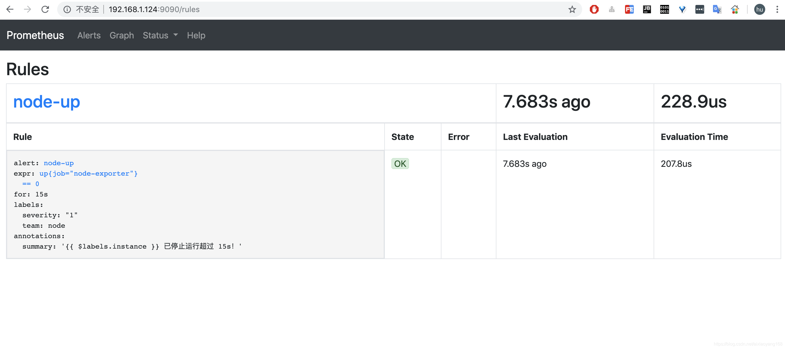
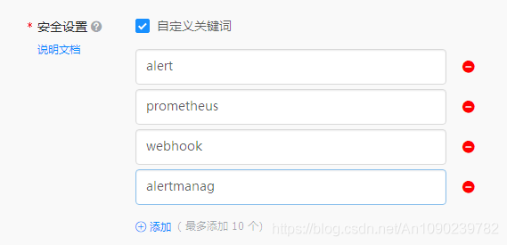

[Docker+Prometheus+Alertmanager+Webhook钉钉告警](https://www.cnblogs.com/aixing/p/13327157.html)


### Docker+Prometheus+Alertmanager+Webhook钉钉告警

- [1、环境部署](https://www.cnblogs.com/aixing/p/13327157.html#1_19)

- - [1.1 二进制部署](https://www.cnblogs.com/aixing/p/13327157.html#11__20)

  - [1.2 docker部署](https://www.cnblogs.com/aixing/p/13327157.html#12_docker_31)

  - - [1.2.1 webhook](https://www.cnblogs.com/aixing/p/13327157.html#121_webhook_33)
    - [1.2.2 alertmanager](https://www.cnblogs.com/aixing/p/13327157.html#122_alertmanager_41)

- [2、 配置文件](https://www.cnblogs.com/aixing/p/13327157.html#2__46)

- - [2.1 alertmanager配置文件](https://www.cnblogs.com/aixing/p/13327157.html#21_alertmanager_47)
  - [2.2 prometheus配置文件](https://www.cnblogs.com/aixing/p/13327157.html#22_prometheus_115)

- [3、AlertManager 配置邮件告警](https://www.cnblogs.com/aixing/p/13327157.html#3AlertManager__132)

- [4、Prometheus 配置 AlertManager 告警规则](https://www.cnblogs.com/aixing/p/13327157.html#4Prometheus__AlertManager__205)

- [5、AlertManager 配置自定义邮件模板](https://www.cnblogs.com/aixing/p/13327157.html#5AlertManager__246)

- [6、prometheus告警规则rules.yml](https://www.cnblogs.com/aixing/p/13327157.html#6prometheusrulesyml_317)

- - [6.1 cpu_over.yml](https://www.cnblogs.com/aixing/p/13327157.html#61_cpu_overyml_318)
  - [6.2 memory_over.yml](https://www.cnblogs.com/aixing/p/13327157.html#62_memory_overyml_333)
  - [6.3 node_down.yml](https://www.cnblogs.com/aixing/p/13327157.html#63_node_downyml_348)

- [踩坑点：](https://www.cnblogs.com/aixing/p/13327157.html#_363)

- - [钉钉机器人的安全设置，我增加了IP限制，导致多次访问不成功，由于必须添加安全设置，所以添加自定义关键字的限制，添加了如下关键字：alert、promethues、alertmanager、webhook。可自行决定添加几个。](https://www.cnblogs.com/aixing/p/13327157.html#IPalertpromethuesalertmanagerwebhook_365)


------

相关内容原文地址：

简书：fish_man：[alertmanager 钉钉告警配置](https://www.jianshu.com/p/9fdd4f3497c6)
CSDN：哎_小羊_168：[Prometheus 监控报警系统 AlertManager 之邮件告警](https://blog.csdn.net/aixiaoyang168/article/details/98474494)
博客园：𝖑𝖚𝖘𝖙4𝖑𝖎𝖋𝖊：[钉钉报警-prometheus-alertmanager](https://www.cnblogs.com/g2thend/p/11865302.html)

------

Docker+Promethues+Grafana环境的安装，可参考网上相关博文或我的Promethues相关栏目，经实践全部已经行得通。

此博文主要记录AlertManager+Webhook的安装及配置，均采用docker方式，告警邮箱感觉认为现在不是很常用，所以告警对象为钉钉机器人。

**报警机制：**
在 prometheus 中定义你的监控规则，即配置一个触发器，某个值超过了设置的阈值就触发告警， prometheus 会推送当前的告警规则到 alertmanager，alertmanager 收到了会进行一系列的流程处理，然后发送到接收人手里。

Alertmanager 主要用于接收 Prometheus 发送的告警信息，它支持丰富的告警通知渠道，例如邮件、微信、钉钉、Slack 等常用沟通工具，而且很容易做到告警信息进行去重，降噪，分组等，是一款很好用的告警通知系统。

# 1、环境部署

## 1.1 二进制部署

```bash
# 二进制包下载
https://github.com/timonwong/prometheus-webhook-dingtalk/releases
wget https://github.com/timonwong/prometheus-webhook-dingtalk/releases/download/v0.3.0/prometheus-webhook-dingtalk-0.3.0.linux-amd64.tar.gz

# 启动服务
./prometheus-webhook-dingtalk --ding.profile="webhook1=https://oapi.dingtalk.com/robot/send?access_token={替换成自己的dingding token}"
```

## 1.2 docker部署

### 1.2.1 webhook

```bash
docker pull timonwong/prometheus-webhook-dingtalk

# 启动容器
docker run -d -p 8060:8060 --name webhook timonwong/prometheus-webhook --ding.profile="webhook1=https://oapi.dingtalk.com/robot/send?access_token={替换成自己的dingding token}
```

### 1.2.2 alertmanager

```
docker run -d --name alertmanager -p 9093:9093 -v /home/prometheus/alertmanager.yml:/etc/alertmanager/alertmanager.yml prom/alertmanager:latest
```

# 2、 配置文件

## 2.1 alertmanager配置文件

alertmanager.yml

```yml
global:
  resolve_timeout: 5m
route:
  receiver: webhook
  group_wait: 30s
  group_interval: 5m
  repeat_interval: 5m
  group_by: [alertname]
  routes:
  - receiver: webhook
    group_wait: 10s
receivers:
- name: webhook
  webhook_configs:
  - url: http://localhost:8060/dingtalk/webhook1/send  
    send_resolved: true
```

详细注释版本：

```yml
global:
# 在没有报警的情况下声明为已解决的时间
  resolve_timeout: 2m
# 配置邮件发送信息
  smtp_smarthost: 'smtp.qiye.aliyun.com:465'
  smtp_from: 'your_email'
  smtp_auth_username: 'your_email'
  smtp_auth_password: 'email_passwd'
  smtp_hello: 'your_email'
  smtp_require_tls: false

  # 所有报警信息进入后的根路由，用来设置报警的分发策略
route:
# 这里的标签列表是接收到报警信息后的重新分组标签，例如，接收到的报警信息里面有许多具有 cluster=A 和 alertname=LatncyHigh 这样的标签的报警信息将会批量被聚合到一个分组里面
  group_by: ['alertname', 'cluster']
# 当一个新的报警分组被创建后，需要等待至少group_wait时间来初始化通知，这种方式可以确保您能有足够的时间为同一分组来获取多个警报，然后一起触发这个报警信息。
  group_wait: 30s

# 当第一个报警发送后，等待'group_interval'时间来发送新的一组报警信息。
  group_interval: 5m

 # 如果一个报警信息已经发送成功了，等待'repeat_interval'时间来重新发送他们
  repeat_interval: 5m

# 默认的receiver：如果一个报警没有被一个route匹配，则发送给默认的接收器
  receiver: default  # 优先使用default发送

# 上面所有的属性都由所有子路由继承，并且可以在每个子路由上进行覆盖。
  routes: #子路由，使用email发送
  - receiver: email
    match_re:
      serverity : email  # label 匹配email
    group_wait: 10s
receivers:
- name: 'default'
  webhook_configs:
  - url: http://localhost:8060/dingtalk/webhook1/send  
    send_resolved: true # 发送已解决通知

- name: 'email'
  email_configs:
  - to: 'email@qq.com'
    send_resolved: true
```

## 2.2 prometheus配置文件

prometheus-config.yml

```yml
# Alertmanager configuration
alerting:
  alertmanagers:
  - static_configs:
    - targets: ["localhost:9093"]
      # - alertmanager:9093

# Load rules once and periodically evaluate them according to the global 'evaluation_interval'.
rule_files:
  - "rules.yml"
  # - "second_rules.yml"
```

# 3、AlertManager 配置邮件告警

AlertManager 默认配置文件为 alertmanager.yml，在容器内路径为 /etc/alertmanager/alertmanager.yml，默认配置如下：

```yml
global:
  resolve_timeout: 5m

route:
  group_by: ['alertname']
  group_wait: 10s
  group_interval: 10s
  repeat_interval: 1h
  receiver: 'web.hook'
receivers:
- name: 'web.hook'
  webhook_configs:
  - url: 'http://127.0.0.1:5001/'
inhibit_rules:
  - source_match:
      severity: 'critical'
    target_match:
      severity: 'warning'
    equal: ['alertname', 'dev', 'instance']
```

简单介绍一下主要配置的作用：

1. global: 全局配置，包括报警解决后的超时时间、SMTP 相关配置、各种渠道通知的 API 地址等等。
2. route: 用来设置报警的分发策略，它是一个树状结构，按照深度优先从左向右的顺序进行匹配。
3. receivers: 配置告警消息接受者信息，例如常用的 email、wechat、slack、webhook 等消息通知方式。
4. inhibit_rules: 抑制规则配置，当存在与另一组匹配的警报（源）时，抑制规则将禁用与一组匹配的警报（目标）。
   那么，我们就来配置一下使用 Email 方式通知报警信息，这里以 QQ 邮箱为例，配置如下：

```yml
global:
  resolve_timeout: 5m
  smtp_from: 'xxxxxxxx@qq.com'
  smtp_smarthost: 'smtp.qq.com:465'
  smtp_auth_username: 'xxxxxxxx@qq.com'
  smtp_auth_password: 'xxxxxxxxxxxxxxx'
  smtp_require_tls: false
  smtp_hello: 'qq.com'
route:
  group_by: ['alertname']
  group_wait: 5s
  group_interval: 5s
  repeat_interval: 5m
  receiver: 'email'
receivers:
- name: 'email'
  email_configs:
  - to: 'xxxxxxxx@qq.com'
    send_resolved: true
inhibit_rules:
  - source_match:
      severity: 'critical'
    target_match:
      severity: 'warning'
    equal: ['alertname', 'dev', 'instance']
```

将其中几个关键的配置说明一下：

1. smtp_smarthost: 这里为 QQ 邮箱 SMTP 服务地址，官方地址为 smtp.qq.com 端口为 465 或 587，同时要设置开启 POP3/SMTP 服务。
2. smtp_auth_password: 这里为第三方登录 QQ 邮箱的授权码，非 QQ 账户登录密码，否则会报错，获取方式在 QQ 邮箱服务端设置开启 POP3/SMTP 服务时会提示。
3. smtp_require_tls: 是否使用 tls，根据环境不同，来选择开启和关闭。如果提示报错 email.loginAuth failed: 530 Must issue a STARTTLS command first，那么就需要设置为 true。着重说明一下，如果开启了 tls，提示报错 starttls failed: x509: certificate signed by unknown authority，需要在 email_configs 下配置 insecure_skip_verify: true 来跳过 tls 验证。

修改 AlertManager 启动命令，将本地 alertmanager.yml 文件挂载到容器内指定位置。

```bash
$ docker run -d
	--name alertmanager
	-p 9093:9093 
	-v /root/prometheus/alertmanager.yml:/etc/alertmanager/alertmanager.yml
	prom/alertmanager:latest
```

# 4、Prometheus 配置 AlertManager 告警规则

在 Prometheus 配置 AlertManager 服务地址以及告警规则，新建报警规则文件 node-up.rules 如下：

```bash
$ mkdir -p /root/prometheus/rules && cd /root/prometheus/rules/
$ vim node-up.rules
groups:
- name: node-up
  rules:
  - alert: node-up
    expr: up{job="node-exporter"} == 0
    for: 15s
    labels:
      severity: 1
      team: node
    annotations:
      summary: "{{ $labels.instance }} 已停止运行超过 15s！"
```

该 rules 目的是监测 node 是否存活，expr 为 PromQL 表达式验证特定节点 job=“node-exporter” 是否活着，for 表示报警状态为 Pending 后等待 15s 变成 Firing 状态，一旦变成 Firing 状态则将报警发送到 AlertManager，labels 和 annotations 对该 alert 添加更多的标识说明信息，所有添加的标签注解信息，以及 prometheus.yml 中该 job 已添加 label 都会自动添加到邮件内容中.
然后，修改 prometheus.yml 配置文件，添加 rules 规则文件。

```yml
# Alertmanager configuration
alerting:
  alertmanagers:
  - static_configs:
    - targets:
      - 172.30.12.39:9093

rule_files:
  - "/usr/local/prometheus/rules/*.rules"
```


Prometheus Alert 告警状态有三种状态：Inactive、Pending、Firing。

- Inactive：非活动状态，表示正在监控，但是还未有任何警报触发。
- Pending：表示这个警报必须被触发。由于警报可以被分组、压抑/抑制或静默/静音，所以等待验证，一旦所有的验证都通过，则将转到 Firing 状态。
- Firing：将警报发送到 AlertManager，它将按照配置将警报的发送给所有接收者。一旦警报解除，则将状态转到 Inactive，如此循环。

# 5、AlertManager 配置自定义邮件模板

AlertManager 也是支持自定义邮件模板配置的，首先新建一个模板文件 email.tmpl。

```bash
$ mkdir -p /root/prometheus/alertmanager-tmpl && cd /root/prometheus/alertmanager-tmpl
$ vim email.tmpl
{{ define "email.from" }}xxxxxxxx@qq.com{{ end }}
{{ define "email.to" }}xxxxxxxx@qq.com{{ end }}
{{ define "email.to.html" }}
{{ range .Alerts }}
=========start==========<br>
告警程序: prometheus_alert <br>
告警级别: {{ .Labels.severity }} 级 <br>
告警类型: {{ .Labels.alertname }} <br>
故障主机: {{ .Labels.instance }} <br>
告警主题: {{ .Annotations.summary }} <br>
告警详情: {{ .Annotations.description }} <br>
触发时间: {{ .StartsAt.Format "2019-08-04 16:58:15" }} <br>
=========end==========<br>
{{ end }}
{{ end }}
```

简单说明一下，上边模板文件配置了 email.from、email.to、email.to.html 三种模板变量，可以在 alertmanager.yml 文件中直接配置引用。这里 email.to.html 就是要发送的邮件内容，支持 Html 和 Text 格式，这里为了显示好看，采用 Html 格式简单显示信息。下边 {{ range .Alerts }} 是个循环语法，用于循环获取匹配的 Alerts 的信息，下边的告警信息跟上边默认邮件显示信息一样，只是提取了部分核心值来展示。然后，需要增加 alertmanager.yml 文件 templates 配置如下：

```yml
global:
  resolve_timeout: 5m
  smtp_from: '{{ template "email.from" . }}'
  smtp_smarthost: 'smtp.qq.com:465'
  smtp_auth_username: '{{ template "email.from" . }}'
  smtp_auth_password: 'xxxxxxxxxxxxxxx'
  smtp_require_tls: false
  smtp_hello: 'qq.com'
templates:
  - '/etc/alertmanager-tmpl/email.tmpl'
route:
  group_by: ['alertname']
  group_wait: 5s
  group_interval: 5s
  repeat_interval: 5m
  receiver: 'email'
receivers:
- name: 'email'
  email_configs:
  - to: '{{ template "email.to" . }}'
    html: '{{ template "email.to.html" . }}'
    send_resolved: true
inhibit_rules:
  - source_match:
      severity: 'critical'
    target_match:
      severity: 'warning'
    equal: ['alertname', 'dev', 'instance']
```

上边模板中由于配置了 {{ .Annotations.description }} 变量，而之前 node-up.rules 中并没有配置该变量，会导致获取不到值，所以这里我们修改一下 node-up.rules 并重启 Promethues 服务。
$ vim /root/prometheus/rules/node-up.rules

```yml
groups:
- name: node-up
  rules:
  - alert: node-up
    expr: up{job="node-exporter"} == 0
    for: 15s
    labels:
      severity: 1
      team: node
    annotations:
      summary: "{{ $labels.instance }} 已停止运行!"
      description: "{{ $labels.instance }} 检测到异常停止！请重点关注！！！"
```

# 6、prometheus告警规则rules.yml

## 6.1 cpu_over.yml

```yml
groups:
- name: CPU报警规则
  rules:
  - alert: CPU使用率告警
    expr: 100 - (avg by (instance)(irate(node_cpu_seconds_total{mode="idle"}[1m]) )) * 100 > 90
    for: 1m
    labels:
      user: prometheus
      severity: warning
    annotations:
      description: "服务器: CPU使用超过90%！(当前值: {{ $value }}%)"
```

## 6.2 memory_over.yml

```yml
groups:
- name: 内存报警规则
  rules:
  - alert: 内存使用率告警
    expr: (node_memory_MemTotal_bytes - (node_memory_MemFree_bytes+node_memory_Buffers_bytes+node_memory_Cached_bytes )) / node_memory_MemTotal_bytes * 100 > 80
    for: 1m
    labels:
      user: prometheus
      severity: warning
    annotations:
      description: "服务器: 内存使用超过80%！(当前值: {{ $value }}%)"
```

## 6.3 node_down.yml

```yml
groups:
- name: 实例存活告警规则
  rules:
  - alert: 实例存活告警
    expr: up == 0
    for: 1m
    labels:
      user: prometheus
      severity: warning
    annotations:
      description: "{{ $labels.instance }} of job {{ $labels.job }} has been down for more than 1 minutes."
```

# 踩坑点：



## 钉钉机器人的安全设置，我增加了IP限制，导致多次访问不成功，由于必须添加安全设置，所以添加自定义关键字的限制，添加了如下关键字：alert、promethues、alertmanager、webhook。可自行决定添加几个。