## HikariCP常用监控指标与故障排查实战

朱政科 2019-11-03 10:22:00

PREEMPTIVE READING

 

 

**dbaplus社群 · 新书抢读-05期-**

**编者有言：**本书由资深数据库连接池专家撰写，褚霸、德哥、张亮、吴晟等近10位专家高度评价，从设计思想、功能使用、原理实现、工程实践、技术扩展5个维度对HikariCP进行全面讲解和深入分析。

 

 

 

**本文将带你抢先阅读**

**第10章及第14章节选内容**

****

**作者介绍**

**朱政科，**资深架构师，十年IT老兵，对各种数据库连接池有深入的研究。曾在阿里等一线互联网公司长期从事中间件的研发及团队管理工作，连续经历过3年“双11”大促，在大量的实践中积累了丰富的经验。热爱开源，热爱新技术，对Apache ShardingSphere、Apache Skywalking等技术社区都做出过贡献。除了中间件技术，先后主导和参与了多个重要的物联网、人工智能等大型项目，对软件系统架构有深刻的积累和沉淀。运营公众号《工匠人生》和知识星球《猪猪的架构师私密圈》。

 

**一、HikariCP七大常用监控指标**

 

连接池的监控指标也会展示部分的配置信息，配置需要根据当前数据库的类型和规模、应用的QPS和RT、系统的并发能力综合考虑。HikariCP配置的信息、原理和建议在前面的章节已经详细介绍过，比较重要的是要规划好初始化连接的大小、最大连接、空闲连接以及心跳语句检查尽量采用性能更高的ping命令等方面。

 

在Druid官方网站上有一个各个数据库连接池对比的整理，Druid非常重视的有指标有LRU 、PSCache 、PSCache-Oracle-Optimized和ExceptionSorter ，如下图所示：

 

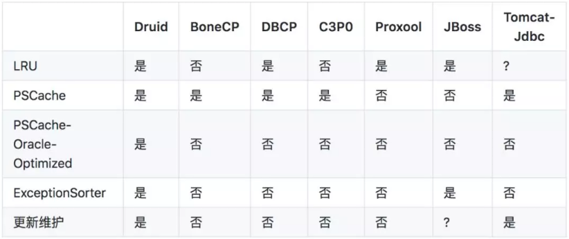

▲ 图1 Druid官方文档数据库连接池对比

 

各种数据库连接池对比：https://github.com/alibaba/druid/wiki/

LRU：性能关键指标，每个Connection对应数据库端的一个进程，如果数据库连接池遵从LRU，有助于数据库服务器优化。

PSCache: 尤其是Oracle中，启用PSCache和不启用PSCache的性能可能是相差一个数量级的。

PSCache-Oracle-Optimized :Oracle 10系列的Driver，如果开启PSCache，会占用大量的内存，必须做特别的处理，启用内部的EnterImplicitCache等方法优化才能够减少内存的占用。

ExceptionSorter：很重要的容错特性，如果一个连接产生了一个不可恢复的错误，必须立刻从连接池中去掉，否则会连续产生大量错误。这个特性，目前只有JBossDataSource和Druid实现。

 

基于Druid官方文档基础之上，我增加了HikariCP以后，又做了如下的梳理：

 

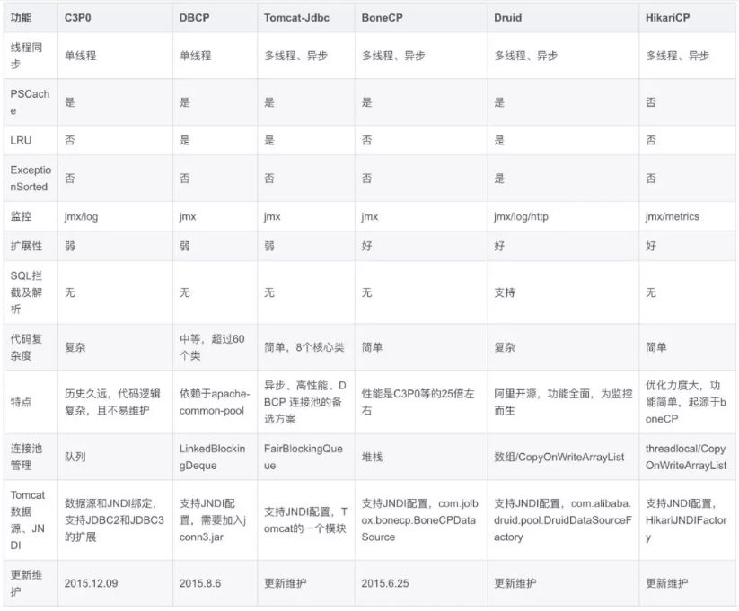

▲ 图2 主流数据库连接池对比增强版

 

从上图可以看到，HikariCP和其他数据库连接池一样都有JMX监控，另外还增加了Metrics监控，而Metrics监控则是HikariCP监控实战的核心发力点。下图是HikariCP连接池Metrics监控的关注点：

 

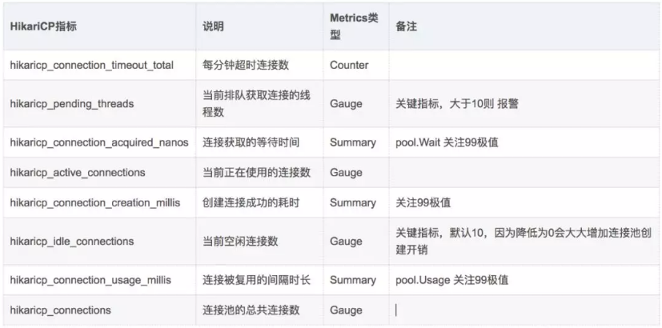

▲ 图3 HikariCP连接池Metrics监控关注点

 

对应的Metrics信息采集完成以后在监控页面显示下图所示：

 

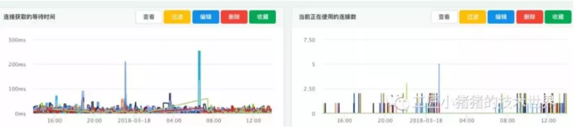

▲ 图4 连接获取的等待时间和当前正在使用的连接数

 

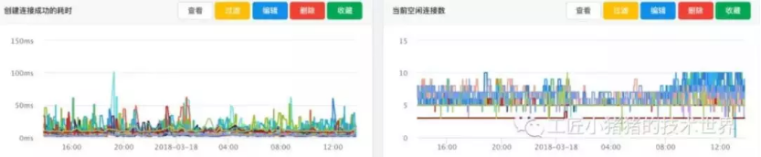

▲ 图5 创建连接成功耗时和当前空闲连接数

 

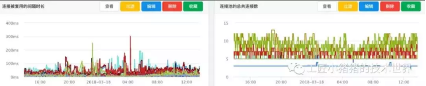

▲ 图6 连接被复用的间隔时长和连接池的总共连接数

 

Metrics一般支持五种类型：

 

- **Gauge：**常规计量，用来统计瞬时状态的数据信息，如系统中处于pending状态的job。
- **Counter：**Gauge的特例，维护一个计数器，用于累计值。
- **Meters：**度量某个时间段的平均处理次数（request per second），如每1、5、15分钟的TPS。
- **Histograms：**统计数据的分布情况，最大值、最小值、平均值、中位数，百分比（75%、90%、95%、98%、99%和99.9%）。
- **Timers：**统计某段代码段执行时间及分布，是基于Histograms和Meters实现的。

 

Prometheus是SoundCloud公司开发的一套开源的监控、报警、时间序列数据库的组合，google SRE的书内也曾提到跟他们BorgMon监控系统相似的实现是Prometheus。现在最常见的Kubernetes容器管理系统中，通常会搭配Prometheus进行监控。如果使用Prometheus进行Metrics监控的话，Metrics一般是四种数据类型，Counter、Gauge、Histograms、Summary。Summary和Histogram十分相似，常用于跟踪事件发生的规模，如：请求耗时、响应大小。同样提供 count 和 sum 全部值的功能。Summary提供一个quantiles的功能，可以按%比划分跟踪的结果。例如：quantile取值0.95，表示取采样值里面的95%数据。

 

除了HikariCP自身的监控以外，数据库服务器的CPU、内存、磁盘、网络以及比如MySQL线程池、锁表等等都是可以协助进行排查的方向。

 

接下来，我们一一来介绍HikariCP监控实战中我们需要重点关注的那些指标。

 

**指标1：hikaricp_pending_threads**

 

hikaricp_pending_threads 表示当前排队获取连接的线程数，Guage类型。该指标持续飙高，说明DB连接池中基本已无空闲连接。

 

我们一起看一个案例，这是之前一个业务应用不可用的时候Metrics监控图，当时所有的线程都在排队等待，该指标已达172，此时调用方已经产生了大量超时及熔断，虽然业务方没有马上找到拿不到连接的根本原因，但是这个告警出来之后及时进行了重启，避免产生更大的影响。

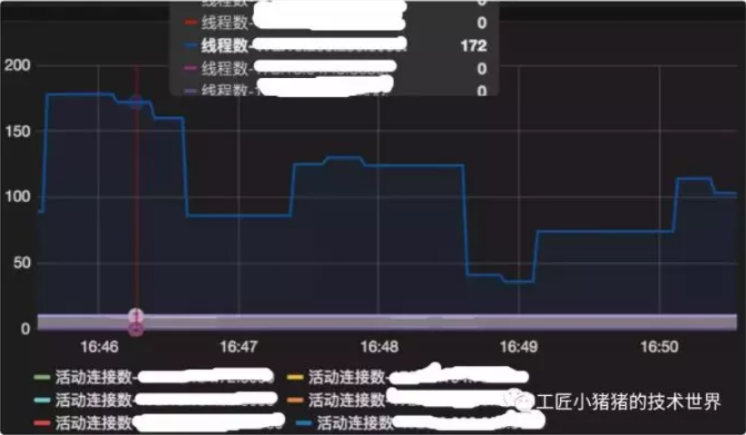

 

▲ 图7 hikaricp_pending_threads指标飙升现场图

 

**指标2：hikaricp_connection_acquired_nanos**

 

hikaricp_connection_acquired_nanos表示连接获取的等待时间，一般取99位数，Summary类型。了解该指标的重要意义，建议阅读HikariCP获取连接getConnection的源码：

 

 

public Connection getConnection(final long hardTimeout) throws SQLException

  {

   suspendResumeLock.acquire();

   final long startTime = currentTime();

   try {

​     long timeout = hardTimeout;

​     do {

​      PoolEntry poolEntry = connectionBag.borrow(timeout, MILLISECONDS);

​      if (poolEntry == null) {

​        break; // 超时…break，抛出异常

​      }

​      final long now = currentTime();

​      if (poolEntry.isMarkedEvicted() || (elapsedMillis(poolEntry.lastAccessed, now) > ALIVE_BYPASS_WINDOW_MS && !isConnectionAlive(poolEntry.connection))) {

​        closeConnection(poolEntry, poolEntry.isMarkedEvicted() ? EVICTED_CONNECTION_MESSAGE : DEAD_CONNECTION_MESSAGE);

​        timeout = hardTimeout - elapsedMillis(startTime);

​      }

​      else {

​        metricsTracker.recordBorrowStats(poolEntry, startTime);

​        return poolEntry.createProxyConnection(leakTaskFactory.schedule(poolEntry), now);

​      }

​     } while (timeout > 0L);

​     metricsTracker.recordBorrowTimeoutStats(startTime);

​     throw createTimeoutException(startTime);

   }

   catch (InterruptedException e) {

​     Thread.currentThread().interrupt();

​     throw new SQLException(poolName + " - Interrupted during connection acquisition", e);

   }

   finally {

​     suspendResumeLock.release();

   }

  }

 

suspendResumeLock.acquire()走到poolEntry == null时已经超时了，拿到一个poolEntry后先判断是否已经被标记为待清理或已经超过了设置的最大存活时间（应用配置的最大存活时间不应超过DBA在DB端配置的最大连接存活时间），若是直接关闭继续调用borrow，否则才会返回该连接，metricsTracker.recordBorrowTimeoutStats(startTime)的就是此指标发挥功能的地方。

 

在Metrics监控中该指标的单位建议配置为毫秒，此指标和刚才提到的hikaricp_pending_threads排队线程数结合，可以初步提出**增大连接数或优化慢查询／慢事务**的优化方案等。

 

- 当排队线程数多而获取连接的耗时较短时，可以考虑增大连接数。
- 当排队线程数少而获取连接的耗时较长时，此种场景不常见，举例来说，可能是某个接口QPS较低，连接数配的小于这个QPS，而这个连接中有较慢的查询或事务，这个需要具体问题具体分析。
- 当排队线程数多且获取连接的耗时较长时，这种场景比较危险，有可能是某个时间点DB压力大或者网络抖动造成的，排除这些场景，若长时间出现这种情况则可认为 连接配置不合理／程序是没有达到上线标准，如果可以从业务逻辑上优化慢查询／慢事务是最好的，否则可以尝试增大连接数或应用扩容。

 

**指标3：hikaricp_idle_connections**

 

hikaricp_idle_connections表示当前空闲连接数，Gauge类型。HikariCP是可以配置最小空闲连接数的，当此指标长期比较高（等于最大连接数）时，可以适当减小配置项中最小连接数。

 

**指标4：hikaricp_active_connections**

 

hikaricp_active_connections表示当前正在使用的连接数，Gauge类型。如果此指标长期在设置的最大连接数上下波动时，或者长期保持在最大线程数时，可以考虑增大最大连接数。

 

**指标5：hikaricp_connection_usage_millis**

 

hikaricp_connection_usage_millis表示连接被复用的间隔时长，一般取99位数，Summary类型。该配置的意义在于表明连接池中的一个连接从被返回连接池到再被复用的时间间隔，对于使用较少的数据源，此指标可能会达到秒级，可以结合流量高峰期的此项指标与激活连接数指标来确定是否需要减小最小连接数，若高峰也是秒级，说明对比数据源使用不频繁，可考虑减小连接数。

 

**指标6：hikaricp_connection_timeout_total**

 

hikaricp_connection_timeout_total表示每分钟超时连接数，Counter类型。主要用来反映连接池中总共超时的连接数量，此处的超时指的是连接创建超时。经常连接创建超时，一个排查方向是和运维配合检查下网络是否正常。

 

**指标7：hikaricp_connection_creation_millis**

 

hikaricp_connection_creation_millis表示连接创建成功的耗时，一般取99位数，Summary类型。该配置的意义在于表明创建一个连接的耗时，主要反映当前机器到数据库的网络情况，在IDC意义不大，除非是网络抖动或者机房间通讯中断才会有异常波动。

 

**二、HikariCP监控指标实战**

 

一般来说，连接风暴和慢SQL两种场景是可以采用上节提到的HikariCP连接池监控的。

 

**实战1：连接风暴**

 

连接风暴，也可称为网络风暴，当应用启动的时候，经常会碰到各应用服务器的连接数异常飙升，这是大规模应用集群很容易碰到的问题。

 

举个例子，在项目发布的过程中，我们需要重启应用，当应用启动的时候，经常会碰到各应用服务器的连接数异常飙升。假设连接数的设置为：min值3,max值10。正常的业务使用连接数在5个左右，当重启应用时，各应用连接数可能会飙升到10个，瞬间甚至还有可能部分应用会报取不到连接。启动完成后接下来的时间内，连接开始慢慢返回到业务的正常值。这种场景，就是碰到了所谓的连接风暴。

 

连接风暴可能带来的危害主要有：

 

- 在多个应用系统同时启动时，系统大量占用数据库连接资源，可能导致数据库连接数耗尽。
- 数据库创建连接的能力是有限的，并且是非常耗时和消耗CPU等资源的，突然大量请求落到数据库上，极端情况下可能导致数据库异常crash。
- 数据库创建连接的能力是有限的，并且是非常耗时和消耗CPU等资源的，突然大量请求落到数据库上，极端情况下可能导致数据库异常crash。

 

曹操专车的一个技术朋友曾经和我说过，那时候采用弹性伸缩，数据库连接池是默认的，有点业务出了点异常，导致某个不重要的业务弹出N台机器，导致整个数据库连接不可用，影响订单主业务。该案例就可以理解为是一次连接风暴，当时刚好那个服务跟订单合用一个数据库了，订单服务只能申请到默认连接数，访问订单TPS上不去，损失惨重方能刻骨铭心。

 

当时我所在公司的DBA也曾经和我分享过两个案例。一次是机房出故障的时候，那时应用全部涌进来，有过一次连接炸掉的情况，这就是一起典型的连接风暴。还有一次是DB在切库的时候产生过连接风暴，瞬间所有业务全部断开重连，造成连接风暴，暂时通过加大连接数解决此问题。当然，单个应用重启的时候可以忽略不计，因为，一个库的依赖服务不可能同时重启。

 

对于连接风暴，一种方案是采用传统的proxy模式，主要还是mysql的bio模型不支持大量连接。负载均衡、故障转移、服务自动扩容都可以在这一层实现。

 

与连接风暴类似的还有如下情况：

 

- 启动时的preparedstatement风暴。
- 缓存穿透。在缓存使用的场景中，缓存KEY值失效的风暴（单个KEY值失效，PUT时间较长，导致穿透缓存落到DB上，对DB造成压力）。可以采用 布隆过滤器 、单独设置个缓存区域存储空值，对要查询的key进行预先校验 、缓存降级等方法。
- 缓存雪崩。上条的恶化，所有原本应该访问缓存的请求都去查询数据库了，而对数据库CPU和内存造成巨大压力，严重的会造成数据库宕机。从而形成一系列连锁反应，造成整个系统崩溃。可以采用 加锁排队、 设置过期标志更新缓存 、 设置过期标志更新缓存 、二级缓存（引入一致性问题）、 预热、 缓存与服务降级等解决方法。

 

**实战2：慢SQL**

 

其实对绝大多数企业而言，瓶颈并不是连接风暴，压垮团队的最后一根稻草往往是慢SQL问题，这样的血案举不胜举。

 

在互联网金融行业，并发不会很高，这和电商不一样。但是相对而言复杂 SQL 却很多，清算、对账的复杂SQL都不少，部分业务的SQL会比较复杂。比如之前有过一次催收线上故障，就是由于慢SQL导致HikariCP连接池占满。由于当时并没有做HikariCP连接池监控，当时是无法看到整个连接池的历史趋势的，也很难看到连接池实时指标，导致整个催收系统无法登录，数百名催收客服整整一下午无法工作。而有了本文提及的HikariCP基于Metrics监控的指标和方案以后，相信可以快速定位这样类似的问题，比如这起案例，当时排队线程数指标hikaricp_pending_threads一定是飙升的，如果再结合APM工具或者Mysql服务端的慢SQL记录，可以直接定位出罪魁祸首。

 

**实战3：监控指标与参数配置**

 

HikariCP连接池监控的Metrics指标往往可以帮助我们进行更加合理的HikariCP的参数调优。根据日常的运维经验，大多数线上应用可以使用如下的Hikari的配置：

 

 

maximumPoolSize: 20

minimumIdle: 10

connectionTimeout: 30000

idleTimeout: 600000

maxLifetime: 1800000

 

HikariCP连接池连接数有动态和静态两种策略。动态即每隔一定时间就对连接池进行检测，如果发现连接数量小于最小连接数，则补充相应数量的新连接以保证连接池的正常运转。静态是发现空闲连接不够时再去检查。

 

特别强调一下minimumIdle参数默认值为10，HikariCP为了追求最佳性能和相应尖峰需求，HikariCP不希望用户使用动态连接数，因为动态连接数会在空闲的时候减少连接、有大量请求过来会创建连接，但是但是创建连接耗时较长会影响RT。还有一个考虑就是隐藏风险，比如平时都是空载的10个机器就是100个连接，其实数据库最大连接数比如是150个，等满载的时候就会报错了，这其实就是关闭动态调节的能力，跟jvm线上xmx和xms配一样是一个道理。动态调节不是完全没用，比如不同服务连一个DB而业务高峰是错开的，这样的情况其实比较少。

 

连接池的分配与释放，对系统的性能有很大的影响。合理的分配与释放，可以提高连接的复用度，从而降低建立新连接的开销，同时还可以加快用户的访问速度。

 

连接池的大小设置多少合适呢？再分配多了效果也不大，一个是应用服务器维持这个连接数需要内存支持，并且维护大量的连接进行分配使用对cpu也是一个不小的负荷，因此不宜太大，虽然sleep线程增多对DBA来说目前线上已经可以忽略，但是能处理一下当然最好。如果太小，那么在上述规模项目的并发量以及数据量上来以后会造成排队现象，系统会变慢，数据库连接会经常打开和关闭，性能上有压力，用户体验也不好。如何评估数据库连接池的性能是有专门的算法公式的，不过经验值一般没有压测准，连接池太大、太小都会存在问题。具体设置多少，要看系统的访问量，可通过反复测试，找到最佳点。

 

数据库连接池的大小最终取决于特定部署情况。例如，具有长时间运行事务和非常短事务混合的系统实际上非常难用任何连接池调优方式，在这些情况下，创建两个池实例可以很好地工作。

 

**三、我是如何排查HikariCP故障的**

 

除了用好HikariCP、监控好HikariCP，读者最关心的问题应该就是如何排查HikariCP线上问题了。我曾经有过长达八个月的数据库连接池HikariCP维护经历，这段时间里公司几百个开发有HikariCP的使用疑难问题都会找我咨询，也是由于这段经历我积累了一定的经验。其实对于HikariCP实战来说，大多数问题查到最后却并不一定是数据库连接池的问题。

 

今天我就分享一个真实的案例，这个案例曾经在我的微信公众号“工匠小猪猪的技术世界”《追光者系列》中发表过，本章重新进行了整理加工，它已不再是一个案例，而是很多经典案例交织在一起的一个经典的诡案实录。希望通过这个案例，读者朋友们能够了解排查数据库连接池的常用思路和手法。

 

为防止被侵权，当时的排查问题的一些文章图片加了水印，目前已经找不到原始图片，希望读者朋友们在阅读时对于图片的水印能够给予一定的理解。

 

1、问题描述

 

 

 

2018年4月19日早上，有业务方反馈每半小时都会打出如下异常：

 

 

HikariPool-1 - Failed to validate connection com.mysql.jdbc.JDBC4Connection@7174224b (No operations allowed after connection closed.)

 

业务方从未见过这样的异常信息，非常担心是否会影响业务。在我告知他“不影响”后，他又连续追问了我三个问题：这种日志需要配置一下消除吗？我能如何调优参数才能关闭这些日志？我的HikariCP的connectionTimeout 是不是每个业务的查询超时时间？

 

我曾经开发并维护了一款Datasource中间件，该中间件集分库分表以及HikariCP数据库连接池的功能于一体，并推广到全公司使用。通过对HikariCP源码的了解，我深知该异常其实并不影响业务；但是我维护这款中间件的八个月期间内，经常有业务方不断得咨询同一个问题，我觉得不能每次给他们一个“没事”的答复，而是很有必要追根溯源该问题产生的根本原因，给业务方一个合理的交代，而不是用敷衍的态度教他如何关闭这些“珍贵”的日志。

在进行了一系列的详细的检查以后，我又从该开发同学处拿到了一系列更加详细的信息：

 

环境相关：

 

1）该业务没有上线，这是线下环境（测试环境）暴露出的问题。

 

2）线上服务查了几个别的服务没有这样的问题。

 

3) 使用ELK扫描出了线下环境有五个应用具有同样的异常。

 

频率相关：

 

4）业务方一开始说线下环境50～100QPS，但是实际验证后发现，线下环境并没有调用。

 

5）当时公司定制的SpringBoot Health Check每10秒执行一次，即执行getConnection检测。

 

6）业务方未做任何配置，HikariCP的默认maxLifetime是30分钟，异常时间间隔相似。

 

7）拉取业务方代码Debug，maxLifetime调整为20分钟，该异常也平均是20分钟输出一次。

 

8）当调小maxLifetime为一分钟时，异常数目每阶段时间出现暴增现象。

 

9）HikariCP的maximumPoolSize为10，按理说每次出现的异常数也应该是10，但是异常每次发生实际是大多落在8个左右，也有可能是9个，极小情况是11个。

 

我之前有使用C3P0的经验，曾经遇到过一样的Exception，那个异常的原因是服务器主动关闭了连接，而客户端还拿那个连接去操作。由于C3P0可以设置一个周期定时主动检测，当时的解决方法是增加了testQuery，保持连接池健康检查心跳。根据类似的经验，估计是Mysql服务器端连接缓存时间设置太短，服务端主动销毁了连接。可当我联系DBA查看测试环境数据库参数时show variables like ‘%timeout%’，却没有任何问题。

 

connectionTimeout并不是获取连接的超时时间，而是从连接池返回连接的超时时间。SQL执行的超时时间，JDBC 可以直接使用 Statement.setQueryTimeout，Spring可以使用@Transactional(timeout=XX)。

 

Communications Link Failure经典问题：

 

使用MySQL的应用，很多开发者都应该遇到过Communications link failure通信链路故障的问题。举个例子，比如我遇到的业务方的一个定时任务，每2-3天只执行1次，那么每次执行的时候经常出现这样的异常。如图13-1所示，Mysql服务器默认的“wait_timeout”是28800秒也就是8小时，也就是说一个连接空闲超过8个小时，Mysql将自动断开它，这就是问题的原因。

 

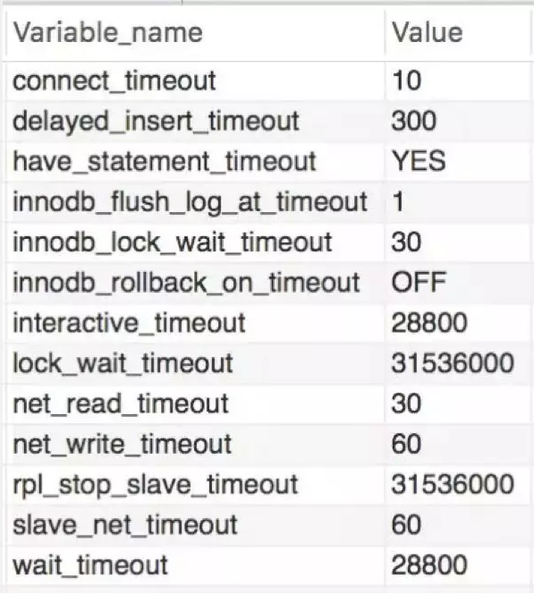

▲ 图8 测试数据库Mysql参数

 

解决这个问题主要有三种做法：

 

方法一：使用JDBC配置autoReconnect=true and maxReconnects=10。**但是autoReconnect在HikariCP中强烈不推荐使用，MySQL的autoReconnect属性并不是为HikariCP设计的且有可能干扰池**，一方面autoReconnect=true这个参数对 mysql5以上的版本不生效，另一方面如果应用程序无法正确处理SQLException的时候，它就会产生一些与会话数据一致性相关的副作用。MySQL文档所述：“The use of this feature is not recommended, because it has side effects related to session state and data consistency when applications don't handle SQLExceptions properly, and is only designed to be used when you are unable to configure your application to handle SQLExceptions resulting from dead and stale connections properly.” 一旦连接离开池，HikariCP就无法帮助解决问题，应该在Statement对象上设置查询超时，或者将MySQL的socketTimeout驱动程序属性设置为查询执行的最长时间。socketTimeout 是一个钝器，它将适用于连接的所有套接字I/O。

 

方法二：将数据库 wait_timeout调大，但是就算调大，连接空闲等待的时间还是会超出等待时间，不能根本解决实际问题。

 

方法三：有些数据库连接池拥有testOnBorrow、testOnReturn、testWhileIdle等属性，意义分别是取得、返回对象和空闲时，是否进行对象有效性检查，默认是false关闭状态，如果设置为True，并提供validationQuery语句即可保证数据库连接始终有效，不过这会牺牲一点性能。以HikariCP举例，就有一个connectionTestQuery属性，这是在从池中给出连接之前执行的查询，以验证与数据库的连接是否仍然存在。当然如果驱动程序支持JDBC4，就不要设置此属性，因为它不支持JDBC4的遗留驱动程序Connection.isValid的API；JDBC4底层是采用性能更好的ping命令进行验证。

 

方法四：有些网上大神的帖子干练到极致，如果数据库就在应用服务器本地，将云服务器上的jdbc连接如果改成localhost连接，居然也能修复掉这个问题。

 

2、Brett经典回答

 

 

 

其实早在stackoverflow已经有用户咨询过类似的问题 了。

 

 

15:20:38.288 DEBUG [] [rdsConfig-8] com.zaxxer.hikari.pool.HikariPool - rdsConfig - Timeout failure stats (total=30, active=0, idle=30, waiting=0)

15:20:38.290 DEBUG [] [rdsConfig connection closer] com.zaxxer.hikari.pool.PoolBase - rdsConfig - Closing connection com.mysql.jdbc.JDBC4Connection@229960c: (connection is evicted or dead)

15:20:38.333 DEBUG [] [rdsConfig connection closer] com.zaxxer.hikari.pool.PoolBase - rdsConfig - Closing connection com.mysql.jdbc.JDBC4Connection@229960c failed

com.mysql.jdbc.exceptions.jdbc4.MySQLNonTransientConnectionException: No operations allowed after connection closed.

 

如上述代码片段所示，该用户每3秒运行一次查询，每次查询的时间都小于0.4s。起初一切运行正常，但大约2小时后，HikariCP开始关闭连接，导致关于'no operations allowed after connection closed'的错误。

 

类似问题：https://stackoverflow.com/questions/41008350/no-operations-allowed-after-connection-closed-errors-in-slick-hikaricp

 

和我的业务方们一样，该用户并不了解HikariCP的原理，只是期望brettw给一个可以规避该问题的配置。brettw的回答是非常经典的，这也是HikariCP的精髓所在：**HikariCP在使用时不会关闭连接。如果使用中的连接到达maxLifetime时它将被标记为驱逐，并且在下一次线程尝试借用它时将被驱逐。**

 

brettw认为，HikariCP已经判断出连接已死，即connection is evicted or dead，因此尝试关闭它，这是预期的逻辑，这也是清理资源至关重要的手段。

 

HikariCP在五种情况下关闭连接：

 

1）连接验证失败。这对应用程序是不可见的。连接已退役并已更换。用户会看到一条日志消息Failed to validate connection...。

 

2）连接闲置的时间超过了idleTimeout。这对应用程序是不可见的。连接已退役并已更换。用户会看到关闭的原因connection has passed idleTimeout。

 

3）一个连接达到了它maxLifetime。这对应用程序是不可见的。连接已退役并已更换。用户会看到一个关闭原因(connection has passed maxLifetime)；如果在到达maxLifetime时应用正在使用该连接，用户会在晚一点看到信息(connection is evicted or dead)。

 

4）用户手动逐出连接。这对应用程序是不可见的。连接已停用并已更换。用户会看到关闭的原因(connection evicted by user)。

 

5）JDBC调用引发了无法恢复的问题SQLException。这应该对应用程序可见。用户会看到关闭的原因(connection is broken)。

 

其实这和生病很像。有人去看医生，说他拉肚子了，那医生能开一样的药么？引起腹泻原因很多，如受凉、饮食不卫生、消化不良、食物过敏、感染病毒。针对不同的症状要采用不同的治疗手段，对症下药。

 

同理，虽然都是No operations allowed after connection closed，但是该用户是打出了connection is evicted or dead，属于第三种情况；而我们的异常命中的是第一种情况 The connection failed validation，所以就是连接已经退役并已更换导致的。

 

3、另一个类似的案例

 

 

 

针对HikariCP的这个问题，我建议用相互独立、完全穷尽的思路去分析。一般来说，是从一个最高层的问题开始逐层向下分解，拆分为子问题，并保证它们之间尽量互不重叠和干扰。为什么这很重要？因为错误的方向往往会让人越陷越深。

 

曾经有网友咨询我应用连接池HikariCP连接数据库Oracle，平均一两天出现一次异常且时好时坏，异常信息是Caused by:java.net.SocketException:Connection reset。据该网友反馈，严重影响线上业务，看到这个问题他束手无策就手动重启，持续了二十多天我们才真正解决。由于当时没有明确的因素分解，我不断陷入到一个个怀疑当中，从参数配置、testQuery、ojdbc的版本等不断尝试均告失败耽误了大量的时间，我又怀疑是Oracle数据库的问题需要DBA介入，甚至要求DBA重装Oracle或者迁移到阿里云RDS。DBA排查以后发现一小时会收到8万次连接登陆请求，连接请求的错误码是，01005，00000，”null password given；login deniied”，如果发起大量请求到数据库，资源耗尽，报错connection reset。和DBA反馈的内容相似，服务端的异常日志由于这个问题达到了几个G。

 

接下来几天内，在生产环境，总是会出现某一些服务不断地发连接到数据库，然后很快连接就达到上千个，导致数据库资源被占用完毕，甚至会有一些服务启动很慢，少数时候服务启动不成功。

 

困扰二十天以后，在Oracle官网论坛里找到一个帖子，按照帖子里的说法，问题的根因和Java的安全随机数生成器的实现原理相关。另外在stackoverflow 也找到了一个类似的回答，这可能与Oracle JDBC驱动程序有关，该驱动程序在Linux上默认使用阻塞随机数生成器，改为如下方式运行Java，问题得到了解决。

 

 

-Djava.security.egd=file:/dev/./urandom

 

对这个故障进行复盘，这个问题本质上还是解决思路上出的问题，我们的精力是有限的，不可能熟悉所有的技术栈，但是提升解决问题的方法和技巧，却是性价比最高的方式之一。

 

回归本章的例子，我们也可以按照这个思路分解一下：

 

- 是不是这几个服务依赖的Datasource中间件版本不同导致的？
- 是不是数据库因为某种原因给断掉了？
- 连接已退役并已更换，这是外部操作的，还是有内部代码操作的？
- 异常是从哪里抛出来的？

 

类似回答：https://stackoverflow.com/questions/14400595/java-oracledb-connection-taking-too-long-the-first-time

 

4、分析问题

 

 

 

针对上述疑点，有条不紊得逐一分析。

 

1）半年来常有业务方咨询此问题，说明这是一个普遍现象；出问题的五个应用进行依赖检查，发现Datasource中间件分布在三种主流版本里，所以这就不是版本的问题，那么这五个应用又有什么共性呢？

 

2）登陆业务方数据库，show variables like '%timeout%’，发现mysql参数并没有问题，咨询了DBA，线下也没有做什么修改。

 

3）由于Datasource中间件封装性比较好，基本可以排除外部操作的情况，操作了内部的connection对象可能性比较大。

 

4）查看HikariCP源码，异常是setNetworkTimeout里面抛出来的，实现类是JDBC4Connection 在ping的时候报错了，如下面代码片段所示。MySQL 把isvalid方法里的错误吃掉了比较坑，原理是isvalid方法里面报错了会调用close方法，然后HikariCP外层又调了一次settimeout就触发了这个warn。

 

 

public boolean isValid(int timeout) throws SQLException {

​    synchronized (getConnectionMutex()) {

​      if (isClosed()) {

​        return false;

​      }

​      try {

​        try {

​          pingInternal(false, timeout * 1000);//ping方式检测

​        } catch (Throwable t) {//mysql吃掉异常，坑

​          try {

​            abortInternal();

​          } catch (Throwable ignoreThrown) {

​            // we're dead now anyway

​          }

​          return false;

​        }

​      } catch (Throwable t) {

​        return false;

​      }

​      return true;

​    }

  }

 

通过以上分析，基本可以猜想除了队首的连接，其他连接可能在10～20分钟以内已经被外部原因断掉了，这是HikariCP合理的防御性警告。

 

在之前的源码解析部分，我们了解到HikariCP使用FastList来保存打开的Statement，FastList从数组尾部开始遍历，当Statement关闭或Connection关闭时需要将对应的Statement从FastList中移除。CopyOnWriteArrayList负责存放ConcurrentBag中全部用于出借的资源，getConnection方法borrow正是ConcurrentBag的CopyOnWriteArrayList，CopyOnWrite是拿的数组首。所以在低QPS的线下环境，健康检测连接池取出对象应该很可能是从CopyOnWrite数组的首部取出的那个。而在高QPS的线上环境，所有连接都处于和数据库活跃的连接建立及切换状态，所以异常数远远小于线下。

 

针对上述猜想，我们需要在HikariCP源码中增加一些调试日志。

 

首先，在com.zaxxer.hikari.pool.HikariPool#getConnection，连接获取的地方，增加如下调试信息，打印每次调用getConnection时连接池中连接的具体信息：

 

 

String.format("Evicted: %s; enough time elapse: %s;poolEntrt: %s;", poolEntry.isMarkedEvicted(), elapsedMillis(poolEntry.lastAccessed, now) > ALIVE_BYPASS_WINDOW_MS,poolEntry);//使用IDEA log expression新增调试信息

if (poolEntry.isMarkedEvicted() || (elapsedMillis(poolEntry.lastAccessed, now) > ALIVE_BYPASS_WINDOW_MS && !isConnectionAlive(poolEntry.connection))) {

​        closeConnection(poolEntry, poolEntry.isMarkedEvicted() ? EVICTED_CONNECTION_MESSAGE : DEAD_CONNECTION_MESSAGE);

​        timeout = hardTimeout - elapsedMillis(startTime);

​      }

 

其次，在com.zaxxer.hikari.pool.HikariPool#softEvictConnection处增加调试信息：

 

 

private boolean softEvictConnection(final PoolEntry poolEntry, final String reason, final boolean owner)

  {

   poolEntry.markEvicted();//在这里可以使用IDEA log expression打印参数信息

   if (owner || connectionBag.reserve(poolEntry)) {

​     closeConnection(poolEntry, reason);

​     return true;

   }

   return false;

  }

 

为什么要打在softEvictConnection这里呢？因为在createPoolEntry的时候注册了一个延时任务，并通过poolEntry.setFutureEol设置到poolEntry中。softEvictConnection，首先标记markEvicted。如果是用户自己调用的，则直接关闭连接;如果从connectionBag中标记不可borrow成功，则关闭连接。这个定时任务是在每次createPoolEntry的时候，根据maxLifetime随机设定一个variance，在maxLifetime - variance之后触发evict。

 

做了如上处理以后我们就安心得等待结果，很快就来了一组数据，如图13-2所示，我们可以看到确实poolEntry.isMarkedEvicted()一直都是false,(elapsedMillis(poolEntry.lastAccessed, now) > ALIVE_BYPASS_WINDOW_MS这个判断为true。另外每次取出的sharedList（即HikariCP的CopyOnWriteArrayLisy），每次getConnection请求都是数组首的7980efe0。

 

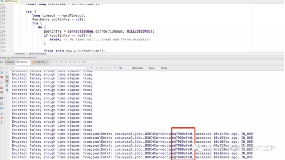

▲图9 第一处调试信息得到的结果

 

softEvictConnection这里的信息在20分钟到了的时候也出现了。

 

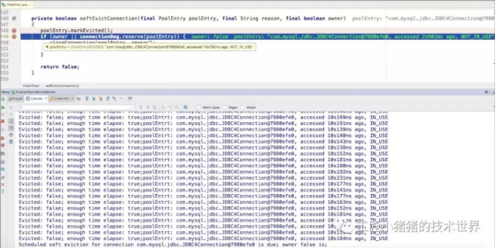

▲ 图10 第二处调试信息得到的结果

 

从这张图我们可以看到，owner是false，第一个触发定时任务的也正好是第一个连接，删除的那个就是每次微服务健康检测HealthCheck连接用的那个。

 

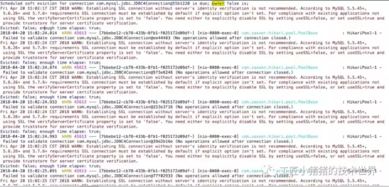

▲ 图11 DEBUG复现线下环境问题

 

我仔细数了一下，确实一共创建了十次SSL，也就是本次周期确实重新连了十次数据库TCP连接。那么问题来了，为什么每次正好是8次或者9次异常日志？

 

HikariCP定时清理任务的执行时间时多少呢？如下代码所示：

 

 

// variance up to 2.5% of the maxlifetime

​      final long variance = maxLifetime > 10_000 ? ThreadLocalRandom.current().nextLong( maxLifetime / 40 ) : 0;

​      final long lifetime = maxLifetime - variance

 

这个定时任务是在每次createPoolEntry的时候，根据maxLifetime随机设定一个variance，在maxLifetime - variance之后触发evict。maxLifetime我现在调试设置的是20分钟。按照20分钟1200秒来算，这个evict的操作是1170秒左右,按理说离20分钟差30秒左右。但是通过观察，好像第一个连接创建的时间比其他连接快4秒，如图13-5所示，第一个连接在15:53:04产生，后续的基本都在15:53:08秒产生。也就是说时间上被错开了，本来10个连接是相近的时间close的，第一个连接先被定时器close了，其他连接是getconnection的时候close的，这样就造成了一个循环。其他连接是getconnection的时候几乎同时被关闭的，就是那些warn日志出现的时候。

 

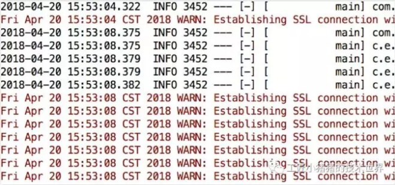

▲ 图12 debug连接日志

 

和我debug得到的结果是一致的，第一个getConnection健康监测是被定时器close的，close之后立马fillpool，所以warn的是小于10的。和我们看到的历史数据一样，8为主，也有9。

 

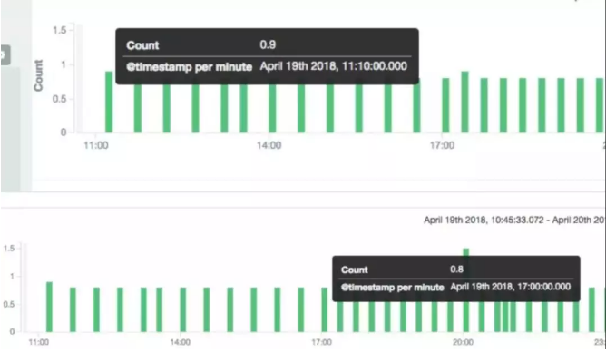

▲ 图13 每个时间段Kibana连接产生日志数

 

定时器close之后的那个新连接，会比其他的连接先进入定时器的调度，其他的9个被循环报错关闭。

 

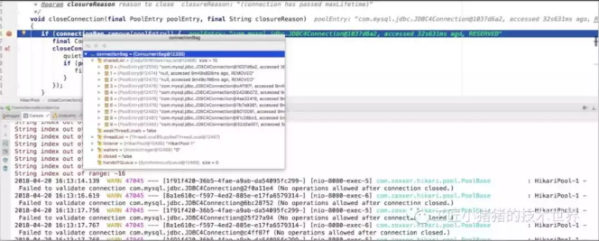

▲ 图14 每个时间段Kibina连接产生日志数

 

getconnection时报错关闭的那些连接，跟被定时器关闭的连接的定时器时间错开，如上图所示，有两个连接序号为1和2已经处于remove的状态了，这应该就是对应8次日志的原因。

 

9次是比较好解释的，第一个连接是同步创建的，构造函数里调用checkFailFast会直接建一个连接，其他连接是 housekeeper里异步fillpool创建的。做了一次测试，这一波果然打了9次日志。

 

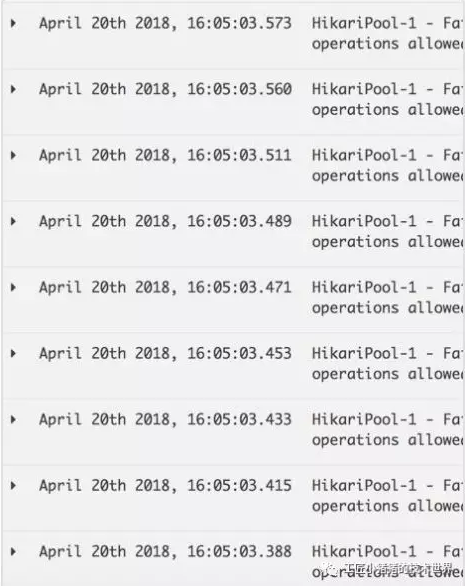

▲ 图15 连接创建数测试结果

 

5、解决问题

 

 

 

根据前面对问题的分析，我们可以确定是外部主动断掉了连接。为了验证猜想，netstat一下。

 

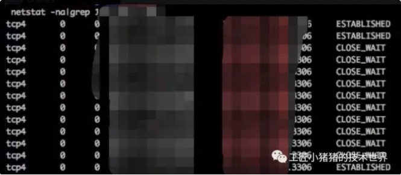

▲ 图16 当时netstat命令返回结果

 

如上图所示，多次netstat之后都发现很快就进入CLOSE_WAIT状态，这就是我们之前第一章《实战 第一个案例》一直分析的TCP的问题，CLOSE_WAIT代表已经断开了，基本不能再用了。其实，就是被对方断开了。这时我再次找到DBA，告诉他我的结论，并直接请他确认这五个服务线下环境连接的数据库是否和其他的有不同的配置区别。经过焦急的等待以后，DBA答复我说，这五个服务连接的数据库都是很早的遗留系统，之前做数据库迁移的时候用proxy代替了，而后端的真实地址是XXX，proxy配置10秒超时，让我推动业务方把五个服务的数据库连接直接配置改为真实的数据库地址。

 

由于公司的微服务数据库配置全都托管在配置中心，我登录了配置中心进行了扫描，一共有五个微服务的配置连到了这个废弃Proxy，和测试环境出问题的五个应用完全一致。通过配置中心可以看到，之前DBA曾经帮业务方统一改过废弃了这个Proxy，但是有些业务方不知道是什么原因居然又改了回去（刚刚好改了几个，连同后面其他开发依葫芦画瓢照抄的配置刚刚好共是五个应用）。这时业务方的同学也说话了，“难怪我navicate 在Proxy上的这个环境Edit一个表要等半天，而在其他环境就秒出”。这也就1.4节分析问题小节中，我提出的这五个应用有什么共性的答案，它们连接到了同一个Proxy。

 

将这个废弃的Proxy改为真正的数据库地址以后，第二天几个业务方的同学向我反馈，问题已经彻底解决了。

 

我也长长舒了一口气，在以后的维护过程中，也再也没有人咨询过这个问题了。

 

6、总结

 

 

 

本文不仅仅是一例HikariCP疑难问题的排查，认真的读者可以看到还有Oracle的Connection Reset案例和Failed to validate connection案例等等实战案例和知识点精心编排于其中。这些案例非常具有代表性，排查HikariCP的问题的套路大多体现在这里，我们需要遵循发现问题、分解问题、分析问题、解决问题的规律，结合源码和工具不断得接近事情的真相，千万不要钻牛角尖不撞南墙不回头导致越陷越深。同时，网上搜索问题的技巧也是值得优化的，比如Oracle的这个问题，搜Connection Reset是不行的，但是搜索Jdbc Connection Reset和Oracle Connection Reset前面几篇都能立马搜到解决方案。

 

本章还有一个精华，就是1.2节的关于HikariCP在五种情况下关闭连接的原因总结和对应异常信息，这是官方文档上所没有的，也是非常值得划重点的。在你没有时间阅读HikariCP源码的情况下，这份总结可以作为工具，是分析、定位、排查问题的锦囊妙计。