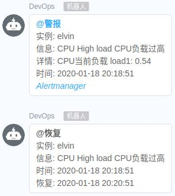

## # AlertManager警报通知 使用webhook 钉钉机器人

#### #启动钉钉webhook服务

```
#dingtalk webhook
docker rm -f dingtalk
docker run -d --name dingtalk --restart always -p 8060:8060 alivv/dingtalk \
--ding.profile="devops=https://oapi.dingtalk.com/robot/send?access_token=xxxxxxxxxx"
```



> AlertManager不支持钉钉api发送，启动webhhook服务作为转发
> 我添加了模板重新编译打包镜像，蓝色的`警报`、`AlertManager`可打开url
> 可设置多个--ding.profile地址使用多个钉钉机器人
> 更信息用法可看原github说明
> github https://github.com/timonwong/prometheus-webhook-dingtalk.git

#### #AlertManager配置webhook

```
# 警报接收者
receivers:
#ops dingtalk
- name: 'dingtalk'
  webhook_configs:
  - send_resolved: true
    url: http://localhost:8060/dingtalk/devops/send
```

> dingtalk/`devops`/send路径里`devops`使用ding.profile=“`devops`”里配置相同的名称

#### #Prometheus测试规则如下

```
  - alert: alert-CPU
    expr: node_load1 > 0.2
    for: 1s
    labels:
      severity: warning
    annotations:
      description: 'CPU当前负载 load1: {{ $value }}'
      summary: CPU High load CPU负载过高
```