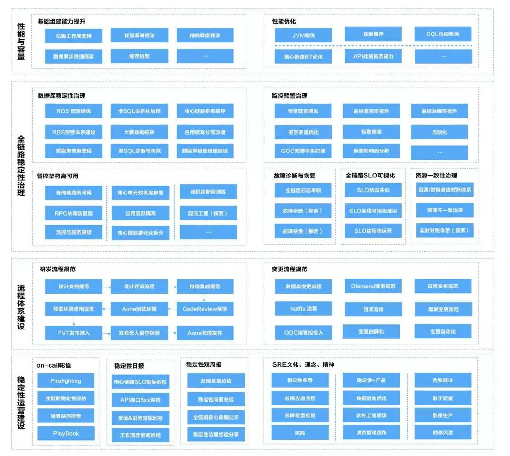
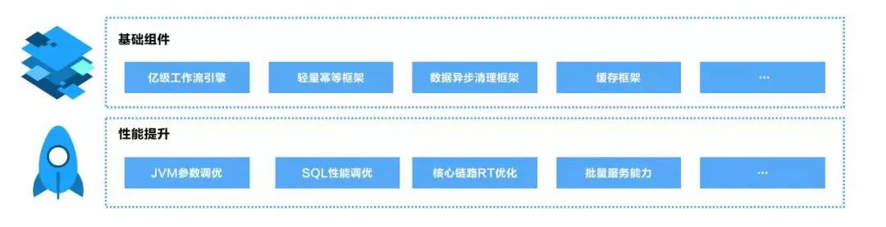
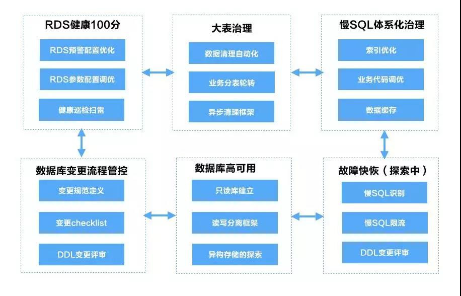
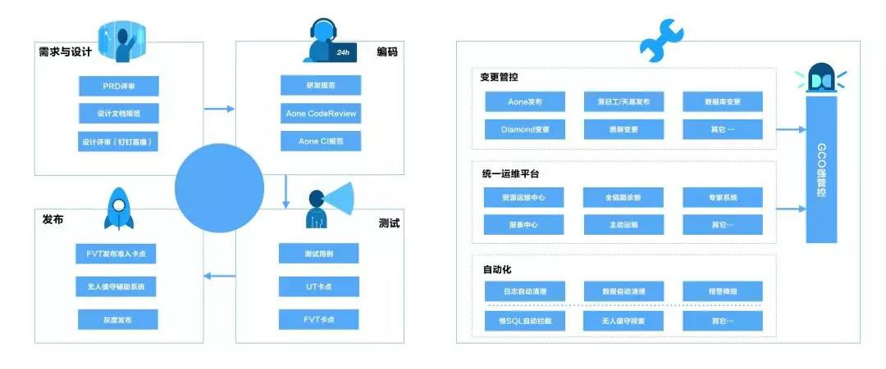
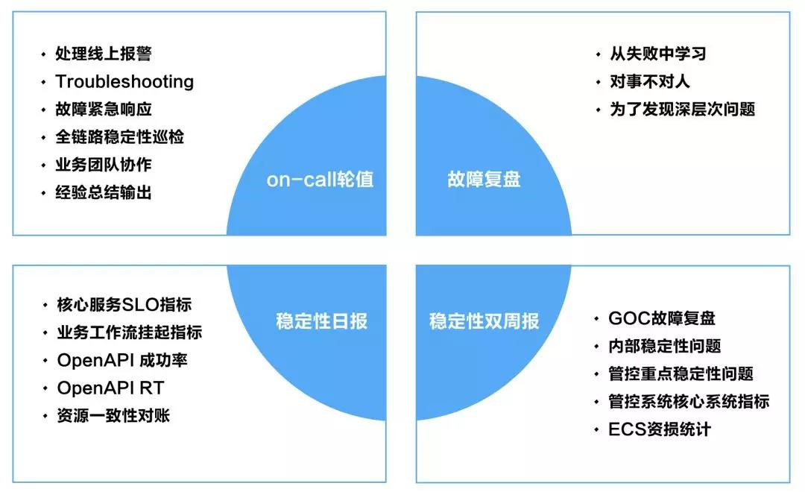
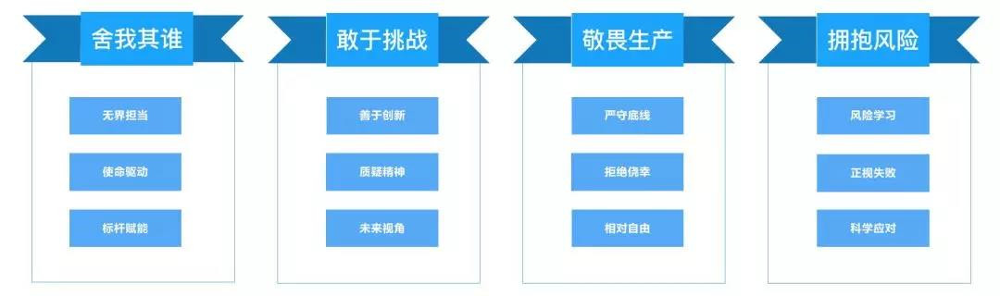

## 以阿里为例，详解SRE的团队建设与职能分工

竹涧 2019-12-31 09:39:34

 

**前言**

 

\1. SRE是什么？

 

 

SRE（Site Reliability Engineering）即网站可靠性工程，提及SRE很多人会联想到运维工程师、系统工程师，其实不然，SRE本质上仍然是软件工程师，下面我们从SRE的发展历史展开来进行介绍。

 

SRE最早在十多年前Google提出并应用，近几年逐步在国内外TOP互联网公司都开始广泛应用。据笔者了解业界SRE落地成功的权威有Google、Netflix等，前者缔造了SRE，并奠定了其权威的地位，而后者将SRE的实践做到了极致，据官方曝露的信息，Netflix仅有的个位数的Core SRE支持了190个国家、数亿用户、数万微服务实例业务规模的运维。

 

近几年随着DevOps的发展，SRE开始被大家熟知，国内的一线互联网公司如BAT、美团也都逐步从组织架构、招聘上均有体现。以阿里为例，不同的BU均有设置SRE团队，然而在不同的部门，SRE的职责划分却不尽相同，那么SRE究竟在做什么？

 

\2. SRE的职责

 

 

 

SRE主要负责Google所有核心业务系统的可用性、性能、容量相关的事情，根据《Site Reliability Engineering 》一书提及的内容，笔者做简单汇总，Google SRE的工作主要包括但不限于如下：

 

- 基础设施容量规划
- 生产系统的监控
- 生产系统的负载均衡
- 发布与变更工程管理
- on-call（轮值） 与 Firefighting（紧急故障救火）
- 与业务团队协作，共同完成疑难问题的处理
- ...

 

而在国内，非常多的SRE部门与传统运维部门职责类似，本质来说负责的是互联网服务背后的技术运维工作。区别于传统的运维SRE，如何在业务研发团队落地SRE，我们做了一年多的探索与实践，笔者认为业务团队SRE的核心是：**以软件工程的方法论重新定义研发运维，驱动并赋能业务演进。**下文将重点介绍弹性计算落地SRE的一些实践及背后的思考。

 

**一、为何要成立SRE？**

 

1.1 面临的挑战

 

 

 

ECS作为阿里云最核心的云产品，对内承担了集团上云、云产品On ECS的重任，是阿里云经济体的基础设施；对外作为亚洲最大的云计算厂商，服务着遍布全球的大中小客户（包括各种专有域、专有云），而ECS管控作为核心调度大脑，重要性不言而喻。

 

随着集团上云、云产品On ECS的进程加速，ECS的OpenAPI调用量达到了数亿/日，ECS峰值创建量达到了 百万/日，ECS管控调度系统在容量规模、极致性能、高可用性等方面，面临着一系列挑战：

 

- 数据库瓶颈，顶配数据库空间仍然无法支撑业务半年发展。
- 慢SQL数量爆发式增长，应用稳定性岌岌可危。
- 全链路预警信息最多每天200+，系统隐患逐步暴雷。
- 工作流框架使用面临瓶颈，无法支撑业务三个月的业务体量，人工运维风险极高。
- 人工运维频率高，研发幸福感下降。
- 长尾请求严重影响服务质量，5XX错误持续走高，影响客户体验。
- 不一致性资源长期无法收敛，资损无法解决。
- ...

 

1.2 SRE应运而生

 

 

 

如何在保障业务高速发展的同时，构建系统高可用的稳定性体系，同时在性能与容量上支撑业务未来3-5年的发展是团队面临的重大挑战。在SRE团队成立之前ECS管控团队是按照业务域进行的团队划分如实例、存储、镜像、网络、体验、ESS、ROS等。而在上述组织架构下研发团队可以在垂直领域做到精深，但团队整体会缺少顶层的视角，很难从局部看到整体，进而看到全局。

 

**康维定律指出 “设计系统的架构受制于产生这些设计的组织的沟通结构”，**简单来说可以理解为：组织架构=系统架构，当我们系统稳定性体系需要跨业务团队的顶层视角来构建的时候，最好的保障就是组织架构的落地，ECS SRE团队应运而生。

 

**二、SRE做了什么？**

 

前文简单介绍了Google SRE团队的职责包括容量规划、分布式系统监控、负载均衡、服务容错、on-call、故障应急、业务协同支持等，同时也简单描述了国内偏系统运维的SRE团队。而ECS SRE落地的探索过程中，吸取业界优秀经验的同时也结合ECS团队的业务及团队特色形成了一套独有的方法论及实践体系。对于此，笔者的观点是：**没有放之四海而皆准的标准，需要我们不断探索的是与“当下、业务、团队“契合的方案，古语谓之“天时、地利、人和”。**

 

下文将整体上介绍ECS SRE团队在稳定性体系建设上所做的一些事情。

 

**< ECS SRE体系大图 >**

 

2.1 容量与性能

 

 

 

前文提到ECS的OpenAPI调用量达到数亿/日，ECS创建峰值达到了百万/日，在此背景下，管控服务的容量与性能面临严峻问题，比如数据库容量面临枯竭、服务长尾请求频现等。随着集团上云、云产品On ECS的演进需求，以及整个云原生大环境的高歌猛进，未雨绸缪已然变成了迫在眉睫。

 

以ECS管控核心的工作流引擎为例，在我们业务体量快速增长的背景下，工作流任务单表一个月的数据就达到了3T+，这意味即使是顶配数据库也无法支撑业务数月的发展。除了工作流，核心的订单、订购、资源表均面临相同问题，如何在业务高速发展的同时，保障业务延续性是我们面临的头号问题。

 

为了解决当下的容量与性能问题，同时面向未来扩展，我们针对ECS自研的基础组建包括工作流引擎、幂等框架、缓存框架、数据清理框架等进行了升级改造，为了后续可以赋能给其它云产品或者团队使用，所有的基础组件全部通过二方包标准输出。

 

 

**1）****基础组件升级****：**通过对ECS管控自研的业务基础组件进行架构升级来应对业务未来的规模化发展。

 

1. **工作流引擎****：**14年ECS团队自研的轻量工作流引擎，与AWS SWF类似， 18年改造后支持数亿级工作流创建，我们当前还在做一些框架可用性、容量与性能相关的优化。
2. **轻量幂等框架：**通过注解自定义业务幂等规则，通过轻量持久化方式支持业务幂等。
3. **数据异步清理框架：**通过注解配置业务数据清理策略。
4. **缓存框架：**通过注解支持业务定义缓存命中与失效规则，并支持批量。

 

**2）****性能优化****：**多维度的性能调优策略来提升管控整体服务的性能指标。

 

1. **JVM调优：**通过不断调整优化JVM参数来减少其FGC次数及STW时间，缩短服务不可用时间，提升用户服务体验 。
2. **数据缓存：**核心链路多级缓存，减少数据库IO，提升服务性能。
3. **SQL性能调优：**通过优化SQL执行效率提升业务性能。
4. **核心链路RT优化：**业务优化保障ECS核心创建、启动链路性能。
5. **API批量服务能力：**批量的服务能力，提升整体服务性能。

 

2.2 全链路稳定性治理

 

 

 

稳定性体系化建设是我们在过去一年摸索中最重要的一环，对此笔者的心得是：**稳定性治理一定要有全链路顶层视野，从上至下进行细分。**下文将简单介绍一下ECS管控稳定性治理体系。

 

**1）数据库稳定性治理**

 

数据库是应用的核心命脉，对于ECS管控来说，所有的核心业务全部跑在RDS之上，如果数据库发生故障，对应用的损害无论从管控面或者数据面都是致命的。所以，SRE做的第一件事情就是守住核心命脉，对数据库稳定性进行全面的治理。

 

首先，我们先来看一下ECS管控在规模化业务下，数据库面临的问题：

 

1. **空间增长过快**，无法支撑业务近期发展需求。
2. **慢SQL频发**，严重影响应用稳定性。
3. **数据库变更故障率高**，DDL大表变更引起的故障占比高。
4. **RDS性能指标异常**，数据库各种性能指标异常。
5. **RDS报警配置混乱**，报警信息存在遗漏，误报的情况。

 

对于数据库的问题我们的策略是数据库+业务两手抓，单纯优化数据库或者业务调优效果都不是最佳的。比如典型的数据库大表问题，占用空间大，查询慢，如果单纯从数据库层面进行空间扩容，索引优化可以解决短期问题，当业务规模足够大的时候，数据库优化一定会面临瓶颈，这个时候需要业务调优双管齐下。

 

下面简单介绍一下优化思路：

 

- 数据库占用空间大问题，两个思路，降低当前数据库占用空间，同时控制数据空间增长。我们通过归档历史数据释放数据空洞来达到数据页复用，从而控制数据库磁盘空间增长；但是delete数据并不会释放表空间，为了释放已经占用大量空间的大表，我们业务上进行了改造，通过生产中间表轮转来解决。

 

- 慢SQL频发问题，数据库优化与业务改造两手抓。数据库层面通过索引优化来提高查询效率，同时减少无效数据来减少扫描行数；应用层面通过缓存降低数据库读次数、优化业务代码等方式减少与规避慢SQL。
- 数据库变更故障率高问题，管控流程增强，增加Review流程。DDL变更类型多，由于开发人员对数据库的专业性与敏感度不够导致数据库引发变更增多，对于这类情况，我们针对DDL变更增加了 检查项列表与评审流程，控制数据库变更风险。
- 数据库性能指标与配置问题，以项目方式推进数据库健康度提升，统一管控数据库预警配置。
- 慢SQL限流与快恢的探索。慢SQL严重情况会导致RDS整体不可用，当前我们正在探索如何通过自动/半自动化的方式限流慢SQL来保障数据库稳定性。

 

下图是ECS在数据库稳定性治理上的几个探索。

 

 

**2）监控预警治理**

 

预警对于问题与故障的发现至关重要，尤其在规模化的分布式系统中，精准而及时的监控可以帮助研发人员第一时间发现问题，减少甚至避免故障的发生。而无效、冗余、不精确的低质量报警不仅耗时耗力，影响SRE on-call人员幸福感，同时也严重影响故障诊断。ECS管控预警质量不高的因素主要包括：

 

- **数量多**，平均每天100+，峰值200+，信噪比低。
- **渠道多**，大量重复报警，干扰大。
- **配置异常**，存在预警丢失情况，风险高。
- **损耗人力**，预警反复出现导致处理预警需要投入大量人力，人效低。
- **黑屏操作风险高**，大量黑屏操作增加生产运维风险，风险高。

 

针对上述情况，我们的策略是针对预警进行体系化整理，实现预警的真实性、准确性、精确性、高质量。我们的打法大概分了以下几个步骤：

 

- **删除无效报警**，清理监控平台历史无效的预警，提高预警真实性。

- **优化预警配置**

\1. 统一预警接收人，保障预警只投递到正确的接收人。

\2. 优化预警等级，设置合理的预警级别。

\3. 划分预警渠道，按照预类型与严重程度进行渠道划分，如致命预警电话预警、严重预警短信预警、普通预警钉钉预警等。

- **自动化一切人肉干预的预警**，反复需要人工参与解决的报警通过自动化方式来解决。比如大量业务日志导致磁盘存储空间不足，可以通过优化log rolling策略实现自动化。

 

**3）故障诊断**

 

关于故障恢复我们有一个1-5-10的理想模型，意思是1分钟发现问题，5分钟定位问题，10分钟恢复问题。1分钟发现问题依赖于前文提到的高质量的监控预警体系，5分钟定位问题则依赖于系统的故障诊断能力，如何基于已有的预警信息实现故障快速诊断面临一系列挑战：

 

- 系统调用链路长，从控制台/OpenAPI到底层虚拟化/存储，RPC链路调用链路大概有10层以上，依赖系统30+，业务串联难度大。
- 系统间依赖复杂，ECS管控自身有多层架构，同时与集团订单、计费等系统相互依赖。
- 影响面分析困难，无法量化故障影响面。

 

在故障诊断体系的建设上，我们初步划分三个阶段：

 

- 全链路Trace模型建立，通过TraceID打通调用调用链路，实现业务串联。
- 核心应用场景故障诊断模型，针对当前业务核心链路以及以往故障的高频场景进行诊断模型训练，由点到面的突破。
- 故障影响面模型，自动分析故障影响用户、资源、资金，方便故障快速恢复及故障善后。

 

**4）全链路SLO**

 

没有100%可靠的系统，对于终端用户而言99.999%和100%的可用性没有本质区别。我们的目标是通过持续迭代优化保障用户99.999%的可用性服务体验，而现状是终端用户发起的行为会经过一系列中间系统，任意一个系统可靠性出现问题都会影响客户体验。而全链路各个节点的稳定性如何衡量是我们面临的问题，对此我们开始了全链路SLO体系建设，主要策略如下：

 

- 识别上下游依赖业务方，签订SLO协议
- 建设全链路SLO可视化能力
- 推进上下游依赖促成SLO达标

 

**5）资源一致性治理**

 

根据分布式系统CAP原理，一致性（Consistency）、可用性（Availability）、分区容错性（Partition tolerance）无法同时满足。ECS管控作为规模化的分布式系统面临同样的问题：资源一致性问题，具体表现在ECS、磁盘、带宽等在ECS管控、订单、计量等多个系统存在数据不一致问题。

 

分布式系统为了保障系统可用性，通常会牺牲部分数据实时一致性，转而通过最终一致性来解决。

 

针对ECS的技术架构及业务特性，我们对保障资源一致性的策略如下：

 

- 数据驱动，首先建立全链路可视化对账体系，所有不一致资源全部数据化。
- 财（钱）、产（资源）两个抓手，从资源和资损两个角度来度量一致性问题。
- 离线（T+1）与实时（一小时对账）两种方式，及时止损。

 

2.3 SRE流程体系建设

 

 

 

ECS在近百人并行研发&核心应用每日发布&全年数千余次发布的背景下，可以做到故障率每年下降的关键因素之一，就是有一套相对完善的研发与变更流程保障。下文将简单介绍ECS SRE在研发与变更流程体系上所做的的一些探索。

 

 

**1）** **研发流程****：**整个软件生命周期研发流程规范升级。

 

**1. 设计流程与规范**

 

**从软件工程角度来看，越早引入问题带来的人力消耗和经济损失就越小。没有被良好设计的系统后续在维护阶段投入的成本要远高于前期设计的投入。**为了把控设计质量我们在设计流程与规范上做了如下探索：

 

- 加强前期设计，统一设计模版。（完整的设计应该包括架构设计、详细设计、测试用例、横向设计、监控预警、灰度方案、发布方案等）
- 线上（钉钉直播）& 线下并行模式进行设计评审。

 

**2. CodeReview升级**

 

之前ECS的CodeReview主要在GitLab平台，其主要问题是gitlab与阿里内部持续集成相关组件集成不够稳定、另外无法设置准入卡点，Aone CodeReview平台很好的解决了与Aone实验室的集成问题，并且提供了代码合入的卡点配置功能，另外我们定义了一套ECS管控的CodeReview流程，如下所示：

 

- 统一研发规范，包括（开发环境规范、编码规范、集团开发规约等）。
- CodeReviw checklist

\1. git commit 关联issues，做到代码与需求/任务/缺陷关联，可追踪。

\2. 静态扫描无Block。

\3. UT通过率100%，覆盖率不低于主干（重点关注UT覆盖率）。

\4. 代码规范符合阿里巴巴代码规约。

\5. 业务关键点Review。

\6. MR要提供标准报备信息，说明变更内容。

 

**3. 全链路CI标准化**

 

我们将ECS管控所有核心应用按照标准模式统一迁移至标准CI平台，大幅提升CI成功率，减少频繁人工干预造成的人力损耗。我们的方案如下：

 

- 标准化CI接入方式，标准化CI pipeline：

\1. prepare environment

\2. run unit tests

\3. run coverage analysis

\4. ...

- UT并行运行模式改造，提升UT运行效率。

 

**4. 全链路日常/隔离环境打通**

 

ECS部署环境复杂度极高，具体表现在部署架构复杂、部署工具多样、依赖多（几乎依赖了集团和阿里云所有的核心中间件及应用），在近百人并行研发的模式下 稳定可靠的全链路日常环境是研发效能与质量的基础保障。

 

全链路日常环境的改造无法一蹴而就，我们当前等构建路径大致如下：

- 全链路容器化，同时支持日常环境与隔离环境。 
- 第三方服务依赖Mock。
- 全链路测试环境打通。

 

**5. \**预\**发****环****境使****用规范**

 

预发环境与生产环境使用相同的数据库，很容易出现预发测试影响生产服务稳定性的问题。在预发与生产无法数据隔离的情况下，我们的短期方案是通过标准化流程来提升预发布代码质量，尽可能减少或规避此类问题发生。

 

- 预发等同于生产，一定要在CI通过、日常基本验证通过后才可以部署预发。
- DDL及大表查询需要Review后才可以上预发，避免预发慢SQL导致RDS稳定性，进而影响生产环境。

 

**6. FVT发布准入**

 

每天凌晨通过运行基于OpenAPI的功能性测试用例集，来验证预发布代码的稳定性，是日常发布准入最后一道防线，FVT 100%通过率极大保障了ECS核心管控每日发布的成功率。

 

**7. 无人值守发布的探索**

 

当前发布模式是发布前一天晚上值班同学基于Develop分支拉取release发布分支部署预发，发布当天观察FVT 成功率100%通过后通过Aone进行分批发布，每批暂停观察业务监控、预警、错误日志，在该模式下核心应用每日发布大概占用0.5人/日。为了进一步提升人效，我们在自动化发布流程上进行来一些探索：

 

- 流水线自动部署预发。
- 自动发布准入校验，通过判断FVT成功率根据业务规则进行自动发布。
- 无人值守发布，理想的发布模型，持续集成及相关发布准入卡点全部通过后，自动化进行发布。

 

**2）****变更流程****：**通过规范变更流程、接入GOC强管控、变更白屏化及变更自动化来提升变更效率，同时保障变更质量。

 

**1. 管控规范流程定义**

 

通过约束现有的管控变更行为如热升级、配置变更、DDL变更、约束配置变更、数据订正、黑屏操作等实现所有变更可监控、可灰度、可回滚。

 

**2. 强管控接入**

 

通过对接集团强管控，来保障所有变更可追溯、可评审。（也期望可以通过平台对接强管控消除人肉提变更的繁琐）

 

**3. 变更白屏化**

 

整合ECS全链资源、管控、诊断、性能、运维、可视化及老嫦娥运维能力，打造统一、安全、高效的弹性计算统一运维平台。

 

**4. 变更自动化**

 

自动化一切需要人工干预的繁琐事项。

 

2.4 稳定性运营体系

 

 

 

稳定性体系的建设中，基础组件的容量性能优化、全链路稳定性体系建设、研发与变更流程的升级是其安身立命的基础，而若想细水长流则离不开文化的建立以及持续的运营。下面是ECS SRE在稳定性运营体系上做的一些探索。

 

 

**1）****o****n-call轮值****：**on-call在Google SRE的模式是7*24小时轮值，负责生产系统的监控预警处理，紧急故障救火等。

 

SRE本质仍然是软件工程师，在ECS管控团队，SRE每个同学在负责研发的同时也要处理线上预警、应对紧急故障以及参与到疑难杂症的排查等日常繁琐的工作，为了保障SRE同学核心研发工作不被打断，我们开始尝试使用on-call轮值机制。

 

**1. on-call的职责**

 

- 监控预警处理，第一时间处理生产环境的监控预警。
- 紧急故障救火，协同业务团队处理生产环境稳定性问题。
- 稳定性问题排查，挖掘生产系统稳定性隐患，进入深水区进行挖掘。
- 全链路稳定性巡检，生产系统核心业务SLO指标、错误日志、RDS健康度、慢SQL巡检等。
- 参与故障复盘，此处的故障包括GOC故障与线上的稳定性问题。
- 经验总结输出，将on-call过程进行的故障诊断、问题处理、故障复盘进行总结。

 

**2. 新人如何快速加入on-call**

 

on-call 模版化，新人按图索骥，目标明确。

on-call 知识库，新人红宝书。

参与到轮值，实践出真知。

 

**2）****如何做故障复盘？**

 

故障复盘机制针对产生故障或者影响内部稳定性的问题进行事后复盘，在ECS内部我们将影响生产稳定性的问题统一定义为“内部故障”，我们的观点是 所有“内部故障” 都可能转化为真实的故障，应该被给予足够的重视度。为此我们内部与集团故障团队也进行了多次的沟通合作，在内部故障的复盘与管理模式上进行了一些探索，下面将介绍故障复盘的一些基本理念及ECS管控在故障复盘上的一些实践。

 

**故障复盘不是为了指责或者惩罚，而是为了发现故障表象背后深层次的技术与管理问题。**

 

- 避免指责
- 对事不对人
- 奖励做正确事的人
- 协作与知识共享

 

**1. 故障复盘的方式**

 

责任人填写故障复盘报告。

SRE与相关干系人参与评审（严重故障线下会议对齐）。

故障干系人按照ETA保障故障Action落地。

 

**2. 故障复盘文档库**

 

故障复盘总结是我们重要的知识资产，我们内部针对每一次故障复盘进行了深刻的总结，形成内部知识库 《Learn From Failure》。

 

**3）****稳定性日常运营**

 

稳定性本身是一个产品，需要日常持续的运营，在ECS管控主要模式有稳定性日报与双周报。

 

稳定性日报，T+1 FBI报表，汇总全链路核心的指标数据如工作流、OpenAPI成功率、资源一致性及资损，主要目的是为了及时发现系统隐患，并推动解决。

稳定性双周报，双周发布，邮件模式，阶段性汇总全链路稳定性问题（包括故障、内部稳定性问题）、核心问题公示、核心链路指标分析等。

 

**三、我认知的SRE**

 

前文概要性介绍了ECS SRE过去的一些实践经验，笔者自18年开始以SRE的角色参与到ECS稳定性治理与研发工作，下文将谈一下自己这一年时间实践SRE的一些感悟，一家之言，供参考。

 

3.1 关于SRE的几个认知误区

 

 

 

**1） SRE就是运维**

 

**SRE不止于运维**，确实部分公司的SRE岗位工作内容与传统的运维或者系统工程师相近，但主流或者说未来的SRE是一个技能综合性岗位，不仅需要运维能力，也需要软件工程能力、技术架构能力、编码能力、以及项目管理与团队协作能力。

 

**2） SRE不需要懂业务**

 

**脱离了业务的架构是没有灵魂的！**不懂业务的SRE是不合格的SRE，SRE要参与的技术与运维架构的优化与未来规划，同时也要协同业务团队完成故障排查，疑难杂症的处理，这些工作没有对业务的理解是无法很好的完成的（甚至无法完成）。

 

3.2 SRE能力模型

 

 

 

前面在“SRE=运维”的误区解答中，简单说明了SRE岗位对技术全面性的需求，下面笔者试着给出一个未来SRE能力模型，仅供参考。

 

 

**1） 技术能力**

 

**a.研发能力**

 

业务团队的SRE首先要具备研发能力，以弹性计算SRE为例，我们会负责业务公共基础组件比如工作流框架、幂等框架、缓存框架、数据清理框架等业务中间件的研发，研发能力是基础。

 

**b.运维能力**

 

SRE是运维在DevOps发展进程中进化而来，无论是手动运维，抑或自动化运维，都需要SRE具备全面的运维能力。在弹性计算团队，SRE负责了生产环境（网络、服务器、数据库、中间件等）的稳定性保障工作，在日常on-call与故障应急工作中，运维能力必不可少。

 

**c.架构能力**

 

SRE不仅要关注业务当前的稳定性与性能，同时要以未来视角对业务进行容量与性能的规划，这一切都建立在对业务系统架构熟知，并具备优秀架构设计能力的基础之上。作为弹性计算的SRE，有一项重要工作就是对技术架构作为未来规划，并提供可执行的Roadmap。

 

**d.工程能力**

 

这里的工程能力主要指软件工程的落地能力以及反向工程能力，首先SRE必须具备软件工程的思维，具备大型软件工程的可落地能力。另外，SRE核心的日常工作之一是稳定性问题以及疑难杂症的处理，反向工程能力在分布式系统规模化下的异常问题排查起到关键作用，尤其在处理陌生问题方面。

 

**2) 软技能**

 

**a.业务能力**

 

不懂业务的SRE是不合格的SRE。尤其是业务团队的SRE，只有在熟悉业务技术架构、发展状况、甚至是业务模块细节的情况下，才能更好的开展诸如架构规划、故障排查工作。以弹性计算SRE为例，必须要熟悉当前弹性计算的业务大图以及后续的发展规划，甚至是核心模块的业务逻辑也必须做到心中有数。

 

**b.沟通能力**

 

作为一名工程师，毫无疑问沟通能力核心的软技能之一。对于SRE来言，需要参与的大部分工作都是跨团队甚至是跨BU的，沟通能力显得尤为重要。在弹性计算团队，作为SRE对内我们要与多个业务兄弟团队紧密沟通协作，保障业务稳定性；对外，要与集团统一的研发平台、基础运维、监控平台、中间件、网络平台等多方团队进行核合作，甚至会走向一线直接面对外部客户，此时谈沟通能力与沟通技巧再重要也不为过。

 

**c.团队协作**

 

SRE要非常重视团队协作，尤其在故障应急上，要协作多方团队，紧密合作，降低故障MTTR。而在日常工作中，SRE要积极协同业务团队以及外部依赖团队，主导并推动稳定性相关工作的落地。

 

**d.项目管理**

 

SRE的工作技术复杂度和事务繁琐度更高，加上日常的on-call和Firefighting，如何保障所有工作可以有条不紊的健康运作，从团队角度看，项目管理非常重要；从个人角度看，时间管理极具价值。仍然以笔者所在的弹性计算SRE团队为例，为了保障稳定性体系的快速落地，在过去一年我们进行了多个小型项目的攻坚，效果甚佳。当前我们正在以虚拟组织、长期项目的方式进行管理运作。

 

**3)思维模式**

 

前面提到了SRE要具备的两项软技能包括团队协作、及工程能力，与此同时需要SRE人员从思维模式上进行转变升华，比如逆向思维、合作意识、同理心、随机应变。

 

3.3 SRE核心理念

 

 

 

以下是笔者自己的从业心得，个人认为的SRE核心理念：

 

- 软件工程的方法论解决生产系统稳定性问题。
- 自动化一切耗费团队时间的事情。
- 稳定性就是产品。
- 团队协作与赋能是关键。
- 没有银弹，寻求适合业务与团队的解决方案。
- 优先做最重要的20%，解决80%的核心问题。

 

3.4 SRE精神

 

 

 

 

- **舍我其谁**，SRE要有强烈的责任意识与使命感，作为稳定性的守护者，在团队协作过程中，要做到无界担当，一杆到底。

- **敢于挑战**，包含两层含义，其一，SRE要坚守稳定性底线，对于任何与之相悖的行为敢于说不；其二，要以未来视角看待问题，要善于创新，勇于挑战。
- **敬畏生产**，SRE是生产环境的守护者，更是破坏者。组织赋予了SRE最大的生产变更权限（给予了SRE最大的自由），这其实更是一种责任，SRE要比任何人都心怀敬意，拒绝一切侥幸行为。
- **拥抱风险**，无论如何专业与谨慎，故障一定会发生。作为SRE要有学习从风险中学习的精神，科学的正视风险，通过不断的学习风险应对，来避免失败。

 

**写在最后**

 

在信息爆炸的时代，技术的发展可谓日新月异，技术人不仅要保持对技术对热情，也要具备思考力，没有放之四海皆准的方案，只有因地制宜、因时制宜的方案。无论如何，从现在开始行动，前路慢慢，上下求索。

 

作者丨竹涧

来源丨阿里技术（ID：ali_tech）

dbaplus社群欢迎广大技术人员投稿，投稿邮箱：editor@dbaplus.cn