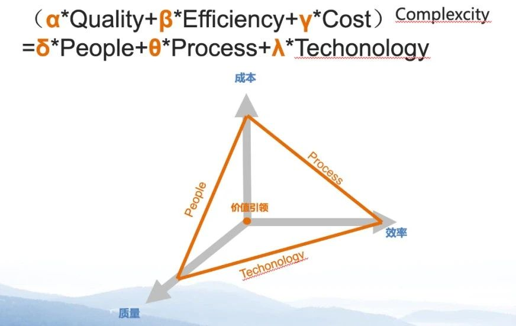
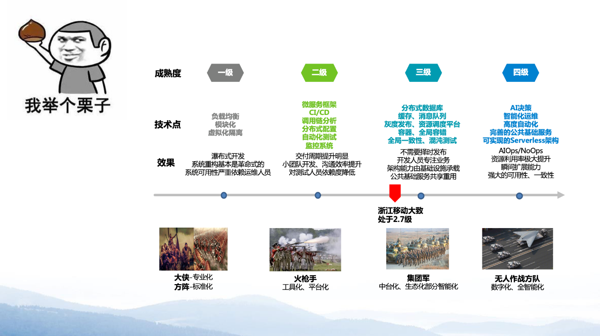
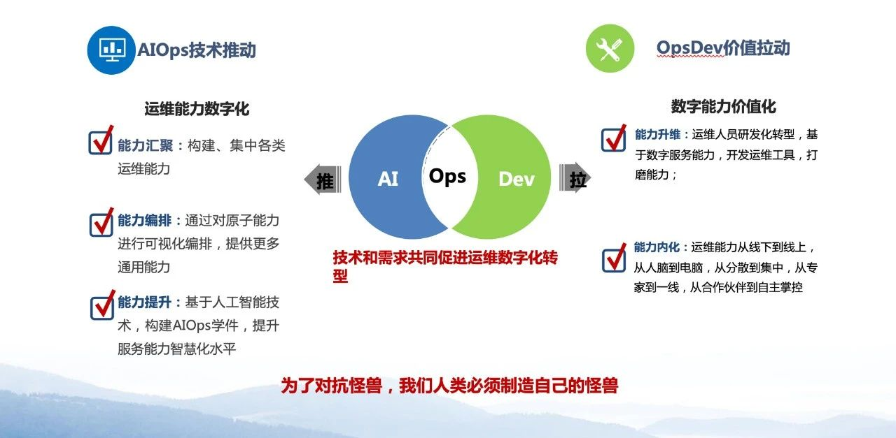
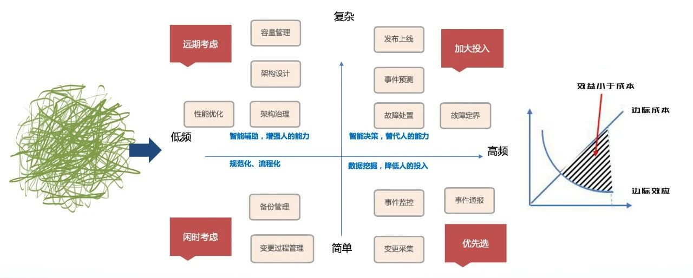
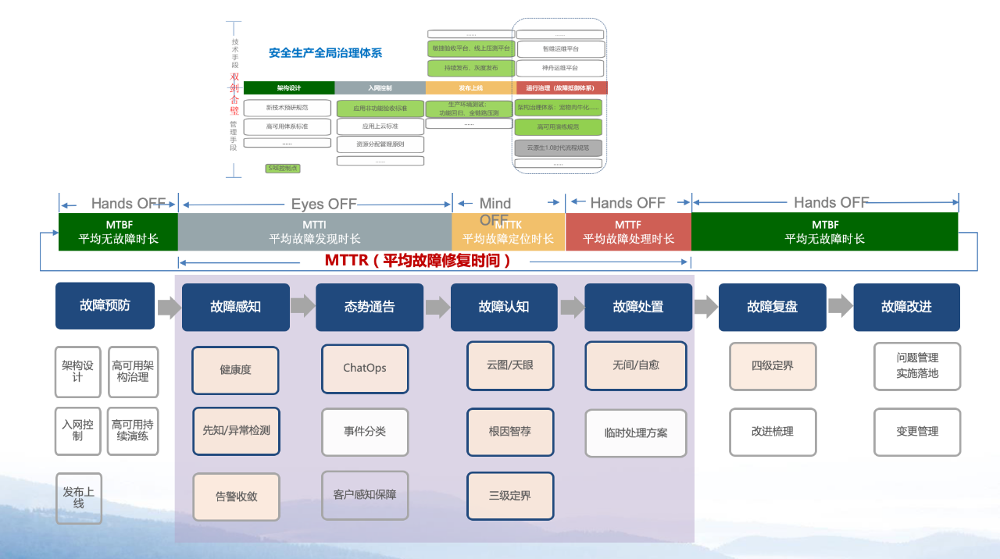
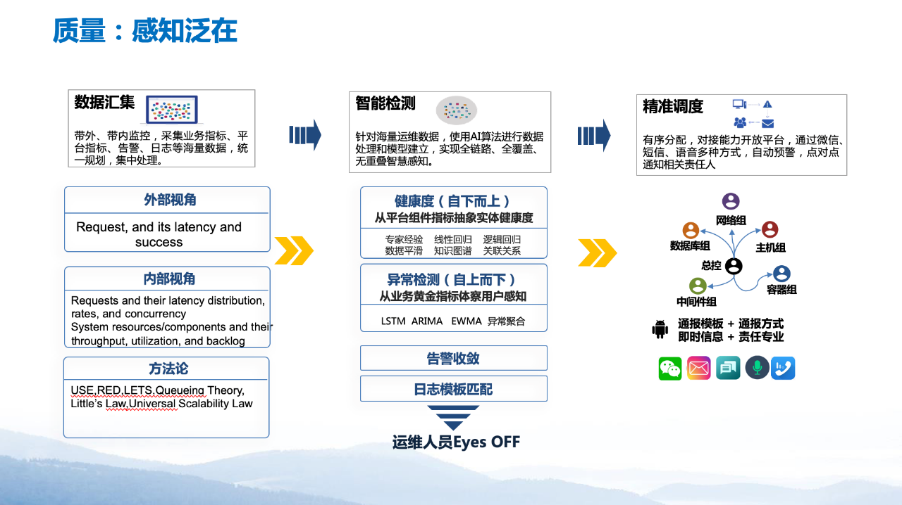
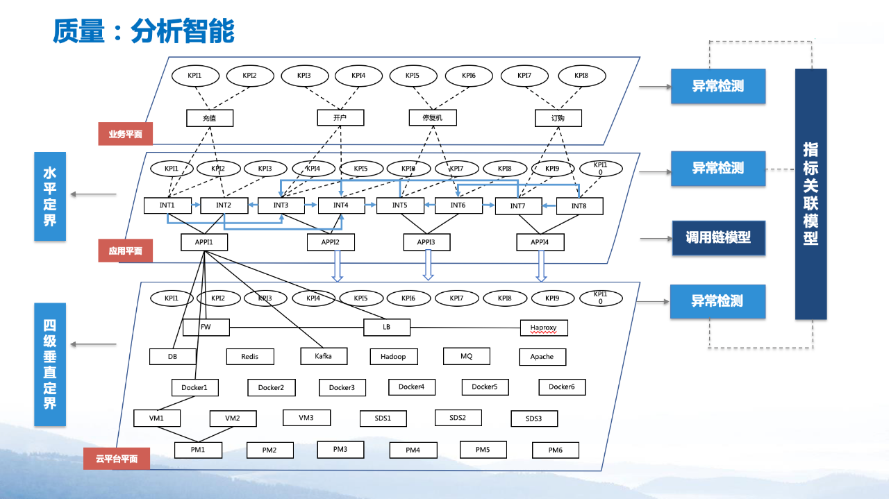
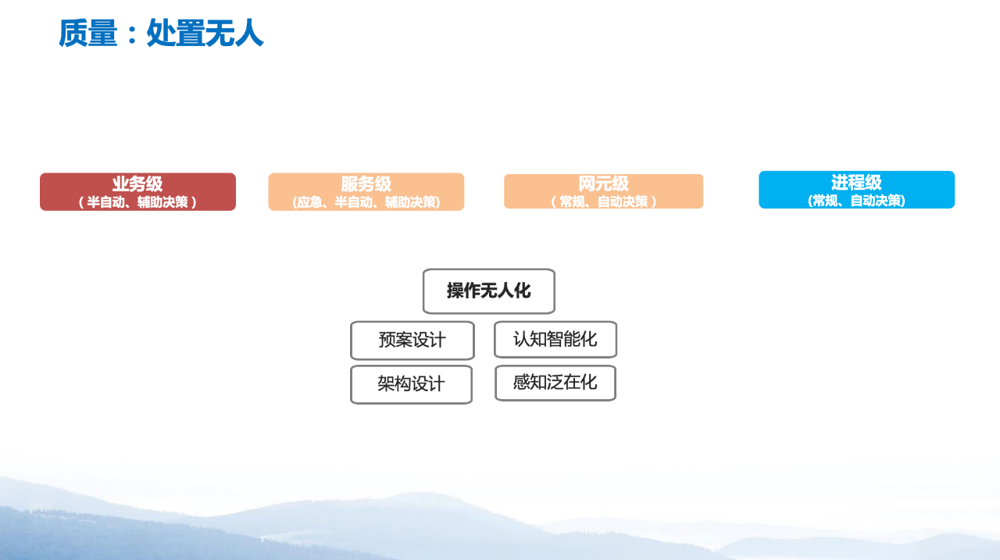
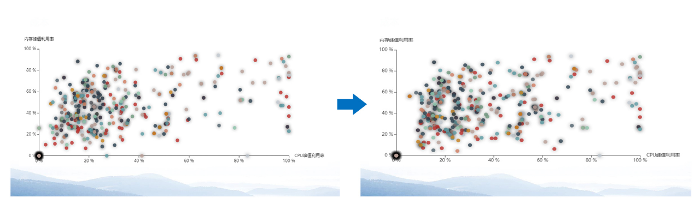
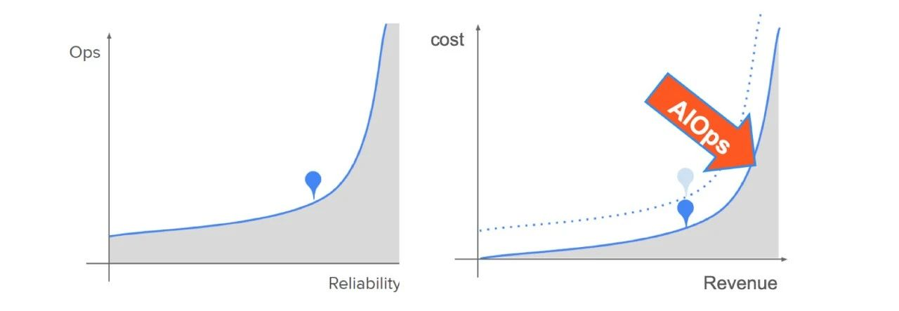

**作者介绍**

**潘宇虹，**浙江移动信息技术部云智能中心工程师，《企业级AIOps实施建议白皮书》核心编写成员，《企业数字基础设施云化管理和服务运营能力成熟度模型》起草人。

 

今天分享的主题是“从2到1到0，浙江移动运维数字化转型探索”。其中，2、1、0分别是运维中的三种角色。

 

 

 

2——**“2线”**，指二线技术专家。

 

1——**“1线”**，对应ITIL中的服务台，对于浙江移动而言，是指我们的GOC组织，其主要的职责是全局监控、全局定界和全局管理。

 

0——**“0线”**，是我们最近打造的运维数字员工，名为“墩墩”。

 

我们希望能够做到让“0线”数字员工完成“1线”GOC的工作，进而让“1线”取代“2线”的工作，将“2线”技术专家释放出来，去做其他价值型工作，比如系统反脆弱性建设。这是浙江移动对运维整体的设计和目标——运维的数字化转型。

 

**而数字化转型的本质，是以数据的自动流动，化解复杂系统的不确定性，以解决优化资源配置效率的问题。**这句话原本讲的是智能制造的本质，而用于运维数字化转型的工作中，也非常合适。浙江移动所追寻的“从2到1到0”的工作模式，正是将资源配置效率的优化做到极致。

 

**为什么要做数字化转型，为什么要做AIOps？**

 

IDC报告中指出：企业IT资源大部分用于日常任务，而用于业务创新的时间却不足15%。从近几年关注论坛和结合实践，我发现大家遇到很多相似的问题——如：设备规模庞大、技术栈复杂、业务变更频繁、监控平台割裂、性能日志晦涩等。

 

这些问题归根结底：不是没有数据，而是数据太多；不是不想分析，而是无从下手。

 

运维困境的本质，可以用以下我自创的小公式来表达：

 

 

它包含两层含义：

 

- 第一，高质量、高效率、低成本，这三者难以三全其美。而这个目标的实现难度随着复杂度的提升呈指数级增加；
- 第二，如何解决这个问题？答案是——用PPT解决。PPT分别指People、 Process和Technology。

 

当所要求的质量、成本、效率的目标发生变化时，或当这个系统能够维护的对象复杂度发生变化的时候，就需要从“PPT”这三个方面去进行调整和匹配：

 

- **People**：也许换一个专家就解决了；
- **Process**：也可能通过优化流程来实现；
- **Technology**：但最主要的方法，还是从技术方面去解决这个问题。

 

“PPT”三维度，在不同的时代、不同的对象、不同的成熟度条件下可能采取不同的手段。中心的圆点代表“价值引领”，PPT不是孤立的，所有的手段都应从价值出发。

 

浙江移动运维的发展历程也始终围绕“PPT”三要素不断演进：

 

 

应对

 

 

 

 

浙江移动在推进运维成熟度不断提升的过程中，提出**AIOpsDev**（即AIOps+OpsDev）概念，帮助我们有效应对运维困境。为什么会是AIOps+OpsDev的组合形式？我们认为现在做任何事情，都是“推”和“拉”结合的。

 

以就餐为例，自助餐可理解为推的方式，提前准备食物，但食物的个性化程度不高；饭店就餐则可理解为拉的方式，现点现做，量身定制；麦当劳、肯德基这种快餐店则为推拉结合，设计食品数量阈值和搭配，比如准备最多不超过10个汉堡，最低不少于5个汉堡，根据人员流动进行配置，既保证了快速服务，又能保持品种多样。 

 

而运维转型也是同理，技术和需求推拉结合促进我们运维数字化的转型。从技术角度推动需要我们做原子能力的储备；从价值出发，拉动我们从运维痛点出发，去构建合适的能力。

 

解构

 

 

 

 

当下运维面临的其实是复杂系统下的复杂问题，所以一定要对其进行解构。

 

当一个复杂问题出现时，我们把它解构成一些小问题，把小问题拆解成小的任务，再将小的任务按照低频到高频、简单到复杂进行优先级划分，永远做性价比更高、边际效益更大的事情。越高频的事情，验证的速度越快。

 

比如，当针对某故障设计了复杂的根因定位系统，但是这个故障可能半年内不再复现，这就导致难以评估该定位系统的优劣。

 

质量

 

 

 

 

这张系统图分为两部分，上半部分是“安全生产全局治理体系”，从架构设计、入网控制、发布上线，到最后的运行治理；下半部分是“运行治理”，主要分为两个大的阶段——“MTBF”，即无故障时期；“MTTR”，即故障时期。

 

**故障时期又分成四阶段：MTTI（故障发现时长）、MTTK（故障定位时长）、MTTF（故障修复时长），最终回到MTBF（无故障运行）阶段。**不同的阶段，对应不同解决方法。有一些用技术手段解决，有一些用管理手段解决。

 

接下来介绍在MTTR（即故障阶段），浙江移动对故障感知、故障定界和故障处置的一些手段。

 

**MTTR（故障阶段）**

 

 

故障感知 

 

 

 

 

首先，对各类运维数据进行统一汇集；其次，使用异常检测算法对业务黄金指标进行检测，基于领域知识对基础网元进行健康度评分建模，自上而下、自下而上双向故障发现；最后，当故障发现的查全查准率提升后，可以使用数字员工进行精准调度。

 

故障定界

 

 

 

 

 

目前我们的故障定界分为两大步骤：

 

第一大步骤是水平定界。业务会经过很多应用系统，当业务出现问题时，首先要界定出现问题的应用系统；

 

第二大步骤是垂直定界，细分为4级：

 

- **1级：**定界是平台问题，还是应用问题；如果是平台问题，则进入2级分析。
- **2级：**定界落实到某一专业组或某技术组件。
- **3级：**定界到具体网元。
- **4级：**定位到具体根因。

 

故障处置

 

 

 

 

“操作无人化”有两个必要基础：

 

- 一是架构设计和对应架构的预案设计；
- 二是感知和认知。

 

在此基础上的故障处置，从场景角度可以分为四级：业务级、服务级、网元级和进程级。

 

我们主要实现是网元级和进程级自愈，这两个级别更适合做自愈，且对认知智能的准确性判断要求相对较低，即使出现错误，还有架构作为保证。目前，浙江移动网元级的自愈率可达70%左右，即有70%的操作不需要人工参与。

 

效率问题

 

 

 

 

很多人认为效率就是做运维自动化，但在实践中，效率最大的敌人是隔阂——当信息不互通的时候，解决问题变得倍加困难。打破隔阂，提升效率，最基本的是对沉淀、挖掘形成的知识进行数据共享。

 

上图的DIKW模型，是从数据共享、信息共享、知识共享到最终实现智慧共享的金字塔层次体系；在层层递进的共享关系中，工具共享始终贯穿这几个阶段。

 

成本问题

 

 

 

优化成本，首先要解决浪费问题，包括时间和空间的浪费。目前我们主要关注更高效地使用已分配的资源，从分析单点的主机、容器，到运营整体平台和应用系统的资源，从而实现对成本的优化。

 

 

由图可见，优化前的左图相比之下资源浪费情况更严重，可以看到大量虚拟机的CPU和内存使用率低效，聚集堆积在图的中央；而优化后，低效资产明显减少了。

 

 

对于整体规划的表达，借鉴了自动驾驶发展路径的思路，这里将质量场景分为：

 

- **Level 0最基础**，即传统运维阶段，类似于自动驾驶Eyes On ；
- **Level 1阶段**，能做到Eyes Temp Off；
- **Level 2阶段**，Eyes、Mind、Hands都可以暂时解放了；
- **Level 3阶段**，在标准环节下跟自动驾驶是一样的。

 

在此基础上，我们添加了一些内容，图中粉红色部分是需要人工处理的事情，蓝色部分是机器要参与决策的。我们的目标是使蓝色区域越来越大。而要跨越这些区域间的gap，需要资源和时间。

 

浙江移动的目标是在中远期达到Level 4阶段。真正实现无人运维可能需要一个“奇点”。

 

 

通过对比实践AIOps前后的投入产出对比图，可以发现AIOps可带来更少的资源投入、更低的成本和更高的收益。

 

**未来展望**

 

 

最后，用这张图来表达对未来的展望。图上只有0和1，它有两层含义：

 

- 第一，我们希望从人和时代发展到BIT时代，构建数字孪生，一切可视化；
- 第二，回到我分享的题目——从2到1到0，我们共同努力解放技术专家的人力，迈向运维新时代。

 