互联网技术普及过程中，数据的监控对每个公司都很重要。近些年，随着一些优秀监控工具（比如Zabbix、Graphite、Prometheus）的成熟，每个公司都会搭建自己的监控体系，来分析整体业务流量和应对异常报警。但随着系统复杂性的提高，微服务的成熟，监控又有了新的问题需要解决，如上下文的链路关系、跨系统的故障定位等相关问题。

 

为减轻公司业务线资源和开发的监控压力，爱奇艺技术产品团队研发了一套全链路自动化监控平台，可以提供统一的监控标准和基础的监控能力，增强故障定位和深度分析能力，提升监控准确性和透明性，本文将基于监控一些经验，和大家分享全链路自动化监控平台。

 

**一、背景**

 

近些年ELK Stack、Cat、以及Google Dapper等监控工具在机器数据分析实时日志处理领域，也都在尝试解决一些新问题，我们对此做了分析。

 

总体来看，ELK Stack重依赖ES，存储能力和查询能力较难扩展。Cat侧重于Java后端。基于Google Dapper的全链路监控思想相对成熟，但多数开源实现的介绍缺少深度分析，查询性能比较差，见下图：

 

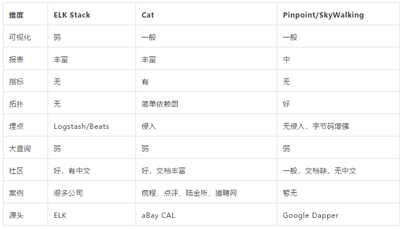

 

另一方面看，随着微服务的成熟，实时监控更加重要，Prometheus等基础监控解决了基本指标和报警问题，部分全链路监控的实现解决链路追踪的问题，但两者各司其职，是互相的补充，却未融成统一的全链路监控平台。

 

基于对这些工具的分析，我们以现有的基础监控和日志采集为基础，融合Google Dapper思想，形成了统一的全链路自动化监控平台，并且可灵活快速接入公司的其他业务。

 

对Google Dapper的改造：

 

- 我们加入了缓存和离线处理的部分，大大提升了查询性能。
- 加入了深度分析部分，能够自动诊断用户具体的报障。
- 在改造链路UI展示的基础上，加入了监控指标，在看服务链路的同时能看到监控指标，体验升级并更易发现性能瓶颈，可指导资源伸缩、可看到容量预警。

 

下面我们总结出全链路监控的四部分：链路采集、指标采集、日志采集、深度分析，并在全链路监控平台中一一落地。

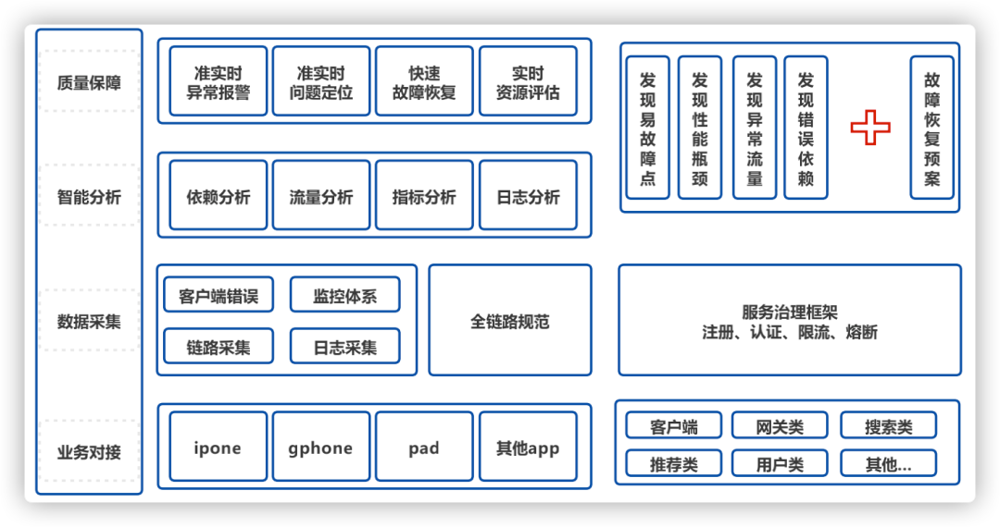

 

图1整体实践

 

**二、平台介绍**

 

总体概览：

 

- **链路采集**包括调用链和服务拓扑，是全链路分析的串联器。
- **指标采集**整合到服务链路上，使全链路具备基础监控能力。
- **日志采集**的数据源，也是全链路分析的数据源。
- **深度分析**包括离线、在线模块，满足全链路的问题定位需求。

 

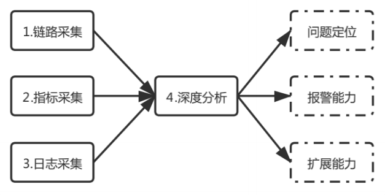

图2全链路分析流程

 

1、链路采集

 

 

 

链路采集，分为调用关系链和服务拓扑两部分:

 

**1）调用关系链**

 

两个系统之间的调用，称之为Span，每个Span会记录服务信息和上下文信息。串联Span关系的字段是Trace id，是每个请求产生的唯一算法值。调用链是由多个Span组成的有向无环图（DAG），表示了一次请求的完整处理过程。

 

图中的每一个节点代表的是一个Span，图中的边表示的是不同服务（或服务内部）的调用关系。通过深度分析Span，我们就能得到每个请求的调用链。

 

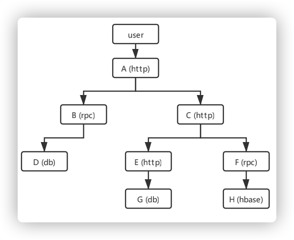

图3 有向无环图DAG

 

调用链需要先接入，然后通过Agent采集日志进行深度分析，接入过程保证低损耗（对系统的影响足够小）、良好的延展性（未来几年的发展中，完全能把控住），接入方式有两种：

 

① 代码侵入模式，按照规范，在相关组件手动埋点投递。

 

② 无侵入模式（保证应用级的透明），支持Java、Go、Lua等Agent，原理采用探针技术，对客户端应用程序没有任何代码入侵，使用方便易于对接。

 

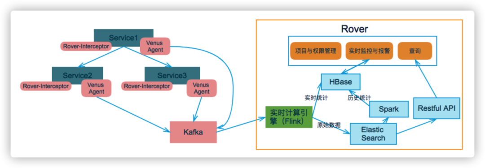

图4 链路采集架构图

 

**我们的设计：**

 

① 链路分析基础能力

 

- 具备调用链检索能力，有具体到接口级别的Trace链路，可根据Trace id来查看调用关系。  
- 调用关系中包含每个节点的响应时间，请求方法和参数、以及自定义的Tag等信息，方便查询和优化链路。

 

② 链路分析优化

 

- 每次查询加入条件，解决全表扫描带来的响应延迟。
- 增加交互能力，老站点上的折叠之类的操作都不是很方便。
- Skywalking支持的无侵入Agent不完整，我们对一些框架和版本做了二次开发。

 

**2）服务链路拓扑**

 

ELK Stack的Kibana没有服务拓扑能力。业界的Skywalking、Zipkin等，具备了服务拓扑能力但可视化比较弱，功能单一，而且目前看到的全链路实现，均未加入客户端节点。

 

**我们的设计：**

 

- 包装了客户端日志，在链路中加上前端节点。
- 在Skywalking基础上，升级了UI页面增强交互和视觉。
- 存储组件从关系型数据库改为图数据库，使得UI有更多的逻辑展示空间和更快的响应速度。

 

最终补全整体链路，提供更友好的可视化（比如我们支持三层展示：首先业务线、业务线内的服务、服务内的调用）。

 

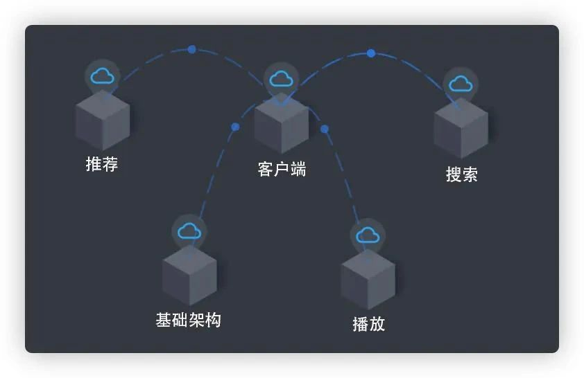

图5 业务线维度 

 

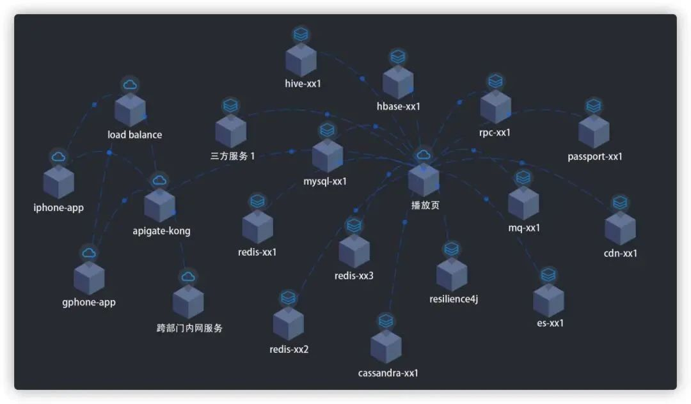

图6 服务维度  

 

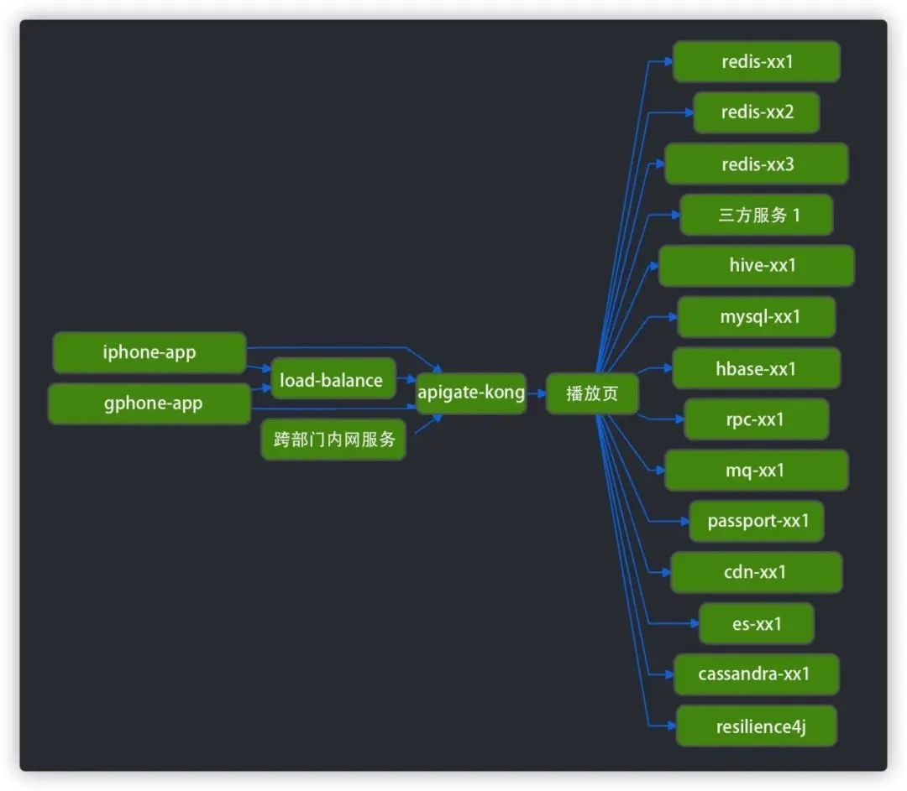

图7 服务维度切换视图 

 

此外，在链路的每个节点都加入了监控指标，包括机器性能、业务指标等聚集。在链路上同时看到监控，便于直观分析架构瓶颈。同时支持自定义指标，可对接现有指标（对基础指标的扩展）。当存在异常节点时，除了报警，在可视化中的颜色也醒目（Warn黄、Error红），能从全局维度发现瓶颈点，指导现有服务伸缩或流控降级处理。

 

 

我们将前后端的服务依赖链路，总结为逻辑链路，并正在加入另外一层物理链路，来显示网络/机房的拓扑。

 

2、指标采集

 

 

 

在指标采集方面：指标采集的技术，如今Graphite、Prometheus配合时序数据库的监控体系，都能做到。问题在于每个业务线都有自己的一套监控，比如同样计算成功率，因为存储或者性能等方面的影响，算法有差异（有的是根据总成功数/总请求数，有的在每台机器的每分钟的成功率聚合的基础上汇总做算数平均或者加权平均）。

 

因此监控统一，整体架构的数据分析才可描述。

 

**我们的设计：**

 

主要是优化流程，统一监控指标，各业务线根据规范投递数据。进而统一监控报警算法，比如Success Rate、QPS、RT、P999、抖动报警、异常检测、容量预估等。

 

统一监控，让各业务线看的说的都是一回事，数据准确后，对比更发现问题。此外，也减少各业务线为监控投入的开发成本。

 

指标的结果，会配合展示在上面讲的链路上，体验升级，易于发现整体架构瓶颈。

 

3、日志采集

 

 

 

在日志采集方面，分为两个阶段：

 

- **ELK Stack的日志监控阶段**，采用的是Logstash/Beats+Kafka+ES，优点是采集灵活，缺点是ES存储能力和查询能力弱。
- **全链路监控方面**，比如蘑菇街的实现，采用的是Logstash+Kafka+ES+Hadoop，优点是解决了ES存储能力问题，缺点是未解决查询能力问题。

 

**我们的设计：**

 

上线初，虽然尝试了用Spark/Flink这些大数据工具来采集，但OPS太大，依然存在延迟。我们做了一些优化，最终方案如下图示： 

 

图9 日志采集流程

 

**落地项：**

 

① 客户端日志，通过Http最终投递到Kafka。后端日志，采用Logstash自动采集。

 

② 当数据收集到Kafka时，根据流量大小，在Kafka提前做好分区。这样在后面Spark流任务中，避免做Reparation，因为这也是耗时操作。

 

③ 采用Spark流任务，设置并行度，分为多个任务并行消费Kafka，存入对应的存储组件。避免一个流存多个存储组件，总延时成倍减少。

 

④ Hikv和ES仅存需要的索引，原始日志存Hbase，存储之间采用索引关联数据。

 

⑤ ES我们用了多数技术优化手段后（比如提高index.refresh_interval的时间间隔、禁止refresh并设置 replicas=0、使用ES自动生成的ids、调整字段mappings、减小单次批量查询数目<1w、批量大小和批次时间调整），性能依然不到预期目标。最终在机器层面进行了优化，老Cpu升级新Cpu，HDD升级SSD，效果明显（十年前的和新出的法拉利的区别）。

 

⑥ 大量日志需存储空间落地，考虑缓存组件的昂贵，在Hikv中采用kv存储，因为日志Value多为字符串，我们先做pb（XML相比，其序列化之后的数据量约为1/3到1/10，解析速度快约20-100倍），提高序列化性能。然后针对pb做gzip（5倍压缩），提高压缩能力。此外，缓存组件的引入，对后面讲到的深度分析，能从根本上减少ES查询压力，保证架构稳定性。

 

⑦ 存储根据业务线隔离，不同的业务线存入自己的存储，性能之间无影响。目前接入的其中一条业务线日志存储OPS高峰在每秒几十万，Hikv在几T（压缩后平均数据长度不到1k），ES每小时数据量在几百G（总量看保存多少小时），Hbase一天落地日志几十T。日志采集达到准实时！

 

4、深度分析

 

 

 

深度分析在报警方面，普遍的问题，比如OPS、RT、Success Rate、P999，仅能反应服务整体质量。但具体到用户的个人APP问题，传统方式都是开发手动排查，需要良好的架构技术和丰富的业务经验，排查周期长且结果模糊。这是业界存在的痛点。

 

**我们的设计：**

 

关联客户端和用户反馈系统，配合链路信息和后端日志，自动发现故障点，离线+实时聚合诊断，最终实现问题准实时定位。 

 

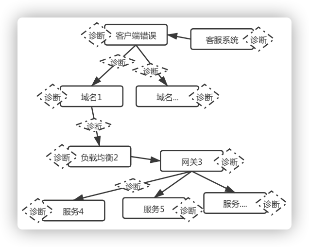

图10 环环相扣的诊断

5、聚合分析思路

 

 

 

① 对接客户端错误和客服系统用户反馈，将粒度细到单条记录作为分析的起点，再根据链路关系，离线聚合该起点对应所有后续链路服务的日志。其中，我们聚合的索引是Device id，因为有的服务无法获得该参数，我们优化了Trace id算法(包含Device id)。首先在服务请求的开始，会全量自动生成Trace id，保证后方服务都有Trace id，从而后方服务能从中提取到Device id。

 

② 所有的节点日志，进行多维度最优诊断，直到发现错误点或遍历结束。配合Easy Rule在不同的场景制定专门的诊断策略，灵活可拓展。策略之外，我们有对用户的行为分析，用来展示用户在一段时间内的请求和行为。

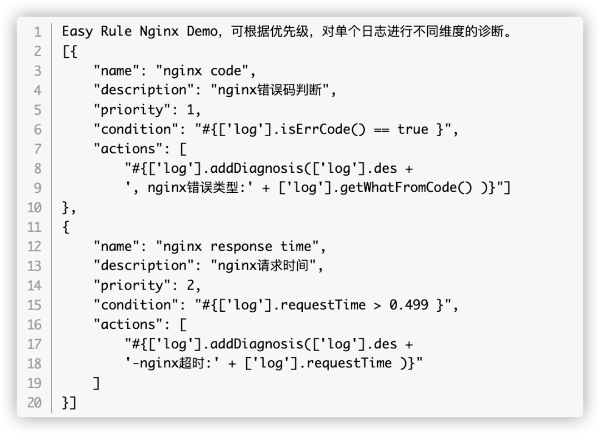

 

 

③ 离线聚合提前解决未来查询或分析产生的性能压力。也能在TTL过期时，删除大量无错的信息，节省资源。离线聚合结束前，有实时聚合能力，双管道保证准实时问题定位。

 

④ 除了时序数据库产生的指标，我们会将部分需要聚合的指标存入Clickhouse，这样能支持更多维度的实施聚合，对监控能力作补充，保证日志采集和深度分析质量。

 

在日志都上报的情况下，该思路覆盖了常规开发操作所能想到的问题。不断的补充策略会让深度分析更智能。

 

**三、整体架构设计**

 

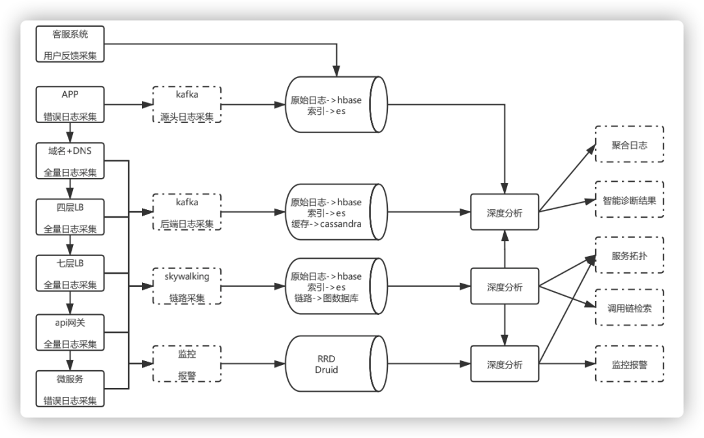

图11 整体架构设计

 

目前在打通客户端和后台链路的基础上，兼容不同系统架构和后台服务实现，各个流程自动化，单条业务线采集OPS高峰在每秒几十万，Hikv数据量在几T（压缩后平均数据长度不到1k），ES每小时数据量在几百G左右（总量看保存多少小时），Hbase一天落地日志量几十T。链路、指标、日志采集和深度分析均达到准时。

 

接入收益：

 

- 统一的指标监控。
- 丰富的报警机制。
- 报警的根因定位。
- 资源的扩容分析。
- 日志的自动分析。
- 跨机房的调用检测。

 

**四、总结**

 

自爱奇艺全链路自动化监控平台上线以来，填补移动端在链路监控上的空白，扩大了可监控的范围，提高了问题定位效率，从链路的角度保障移动端的整体服务质量。

 

- 通过统一技术规范，目前全链路是公司微服务参考架构的一部分。
- 通过自动识别依赖关系，使链路可视化，能够分钟级的聚合指标和报警，及时发现故障点和其中的依赖。
- 通过基于规则引擎的自动化分析，解决错误日志存储时间短导致无法定位的问题，错误日志查找效率提升50%以上，提高了客诉响应速度。并且调用链路的分析，精准辅助发现链路性能瓶颈进行优化，提升整体架构质量。

 

未来，我们会在当前基础上，加入全链路压测（普通压测基本是单系统压测）的功能，使系统具备线上压测和模拟压测的能力，提前感知系统负载能力，使系统的资源伸缩智能化，以应对假期或者热剧等突发流量。