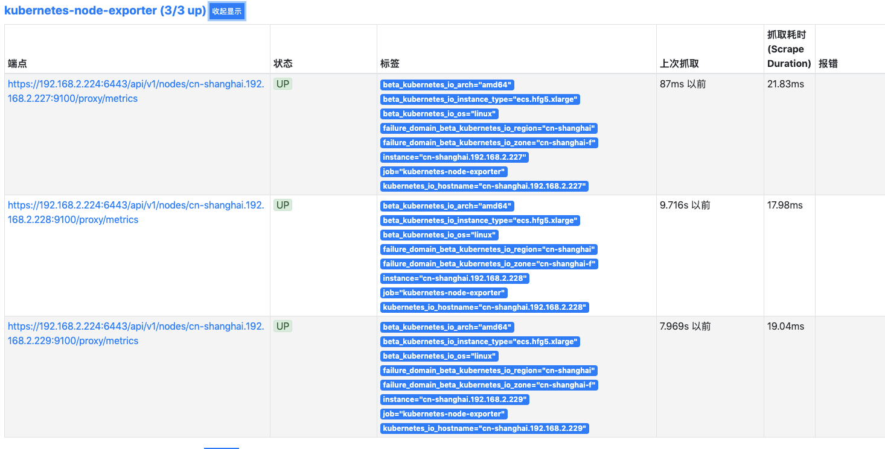

# Kubernetes 集群监控配置必读

更新时间：2020-03-25 00:14:20

  

[本页目录](javascript:void(0))

- [功能简介](https://help.aliyun.com/document_detail/123394.html#h2-u529Fu80FDu7B80u4ECB1)
- [设置Kubernetes访问权限](https://help.aliyun.com/document_detail/123394.html#h2--kubernetes-2)
- [配置Prometheus服务自动发现](https://help.aliyun.com/document_detail/123394.html#h2--prometheus-3)

## 功能简介

作为CNCF第二个毕业的项目（第一个是Kubernetes），Prometheus对Kubernetes有很好的原生支持。通过Prometheus提供的服务自动发现机制，可以实现对Kubernetes集群的自动化监控：当在集群中部署了新的应用时，Prometheus可以自动发现Pod、Service等相关的监控信息；当相关的资源被从Kubernetes集群中删除时，Prometheus也会自动移除这个应用相关的资源监控。

TSDB for Prometheus提供的接口让您可以方便灵活的配置对一个或多个阿里云Kubernetes集群的监控。下面我们详细介绍如何在Kubernetes集群中设置相应的访问权限，以及如何在Prometheus实例中添加相关的配置信息，实现通过Prometheus服务自动发现机制对Kubernetes集群的监控。

## 设置Kubernetes访问权限

为了让Prometheus安全访问Kubernetes接口，Kubernetes提供了ServiceAccount对象，以便应用程序通过相关安全认证信息（如token）访问Kubernetes API。Prometheus的服务发现机制正是通过Kubernetes API实现的，所以我们首先需要为Prometheus创建一个ServiceAccount对象，并通过Kubernetes的RBAC设置访问权限，给ServiceAccount对象绑定一个ClusterRole，该集群角色声明了Prometheus访问Kubernetes集群所需的权限规则。

以下是一个RBAC资源清单YAML文件（名为prometheus-rbac.yaml）的示例：

```
apiVersion: rbac.authorization.k8s.io/v1beta1
kind: ClusterRole
metadata:
  name: alibaba
rules:
- apiGroups: [""]
  resources:
  - nodes
  - nodes/proxy
  - services
  - services/proxy
  - endpoints
  - endpoints/proxy
  - pods
  - pods/proxy
  verbs: ["get", "list", "watch"]
- apiGroups:
  - extensions
  resources:
  - ingresses
  verbs: ["get", "list", "watch"]
- nonResourceURLs: ["/metrics"]
  verbs: ["get"]
---
apiVersion: v1
kind: ServiceAccount
metadata:
  name: alibaba
  namespace: default
---
apiVersion: rbac.authorization.k8s.io/v1beta1
kind: ClusterRoleBinding
metadata:
  name: alibaba
roleRef:
  apiGroup: rbac.authorization.k8s.io
  kind: ClusterRole
  name: alibaba
subjects:
- kind: ServiceAccount
  name: alibaba
  namespace: default
```

创建上述YAML资源清单文件后，使用kubectl命令创建，更新Kubernetes集群配置：

```
kubectl create -f prometheus-rbac.yaml
```

完成上述步骤后，登录“阿里云-容器服务Kubernetes”控制台，从页面左侧导航栏进入“保密字典”分页，找到刚刚创建的ServiceAccount，点击右侧“详情”即可查看该ServiceAccount的token信息。然后将token信息拷贝下来，通过TSDB for Prometheus的管理页面 -> “参数配置”页面，创建一个token文件：

[](http://docs-aliyun.cn-hangzhou.oss.aliyun-inc.com/assets/pic/123394/cn_zh/1562208203577/1.png)

Prometheus实例将使用这个token信息，访问Kubernetes集群API，接下来我们介绍如何配置Prometheus服务自动发现。

## 配置Prometheus服务自动发现

Prometheus通过与Kubernetes API集成来完成自动发现，这里我们通过具体的示例详细介绍如何配置Prometheus支持的几种Kubernetes服务自动发现模式（包括API Server，Node，Pod，Service，Endpoint, Ingress等）。

### API Server

API Server是Kubernetes核心组件之一，为了让Prometheus能获取Kubernetes集群API Server信息，需要利用服务自动发现机制，在Prometheus主配置文件（prometheus.yml）中，配置一个单独的监控任务（job），在kubernetes_sd_configs项下，指定api_server地址以及访问token信息（），Prometheus就会自动从Kubernetes API抓取监控指标，并将其作为当前监控任务的目标（targets）。

Prometheus监控任务配置示例如下：

```
  - job_name: kubernetes-apiservers
    metrics_path: /metrics
    scheme: https
    kubernetes_sd_configs:
    - api_server: https://192.168.2.224:6443/    #从阿里云Kubernetes集群管理页面获取“API Server 公网或内网连接端点”
      role: endpoints
      bearer_token_file: /prometheus/k8s_token    #在Prometheus“参数配置”页面中设置的token文件名
      tls_config:
        insecure_skip_verify: true    
    bearer_token_file: /prometheus/k8s_token
    tls_config:
      insecure_skip_verify: true 
    relabel_configs:
    - source_labels: [__meta_kubernetes_namespace, __meta_kubernetes_service_name, __meta_kubernetes_endpoint_port_name]
      separator: ;
      regex: default;kubernetes;https
      replacement: $1
      action: keep
    - separator: ;
      regex: (.*)
      target_label: __address__
      replacement: 192.168.2.224:6443
      action: replace
```

将上述监控任务配置，通过“参数配置”页面的config文件编辑功能更新到配置文件中后，访问Prometheus控制台，即可看到一个新的监控任务对应Kubernetes API Server:

[](http://docs-aliyun.cn-hangzhou.oss.aliyun-inc.com/assets/pic/123394/cn_zh/1562208221383/2.png)

### Node Metrics

利用Node服务发现模式，在Prometheus主配置文件（prometheus.yml）中，配置一个单独的监控任务（job），在kubernetes_sd_configs项下，指定模式为Node，Prometheus就会自动从Kubernetes集群中发现所有Node节点，并将其作为当前监控任务的目标（targets）。

Prometheus监控任务配置示例如下：

```
  - job_name: kubernetes-node-exporter
    metrics_path: /metrics
    scheme: https
    kubernetes_sd_configs:
    - api_server: https://106.14.40.119:6443/
      role: node
      bearer_token_file: /prometheus/k8s_token
      tls_config:
        insecure_skip_verify: true    
    bearer_token_file: /prometheus/k8s_token
    tls_config:
      insecure_skip_verify: true 
    relabel_configs:
    - separator: ;
      regex: __meta_kubernetes_node_label_(.+)
      replacement: $1
      action: labelmap
    - separator: ;
      regex: (.*)
      target_label: __address__
      replacement: 106.14.40.119:6443
      action: replace
    - source_labels: [__meta_kubernetes_node_name]
      separator: ;
      regex: (.+)
      target_label: __metrics_path__
      replacement: /api/v1/nodes/${1}/proxy/metrics
      action: replace
```

将上述监控任务配置，通过“参数配置”页面的config文件编辑功能更新到配置文件中后，访问Prometheus控制台，即可看到一个新的监控任务对应Kubernetes集群中的节点Nodes:

[](http://docs-aliyun.cn-hangzhou.oss.aliyun-inc.com/assets/pic/123394/cn_zh/1564627578888/1564614627964-d83229c7-cc4e-4f49-be35-c246a5ef4f95.png)

### Node Exporter

**注：该组件需要先在容器集群内安装[Node Exporter](https://github.com/prometheus/node_exporter?spm=a2c4g.11186623.2.16.42911c31VtgMBT)组件**

K8s生态下，Node Exporter被广泛应用于主机监控中，目前Node Exporter支持几乎所有的常见监控指标，如CPU、内存、网络、文件系统、磁盘等。在下面的示例中，我们在K8s集群节点上部署的Node Exporter通过9100端口输出指标，因此在配置中，指向每个node该端口抓取Node Exporter输出的监控指标。

Prometheus监控任务配置示例如下：

```
  - job_name: kubernetes-node-exporter
    metrics_path: /metrics
    scheme: https
    kubernetes_sd_configs:
    - api_server: https://192.168.2.224:6443/
      role: node
      bearer_token_file: /prometheus/k8s_token
      tls_config:
        insecure_skip_verify: true    
    bearer_token_file: /prometheus/k8s_token
    tls_config:
      insecure_skip_verify: true 
    relabel_configs:
    - separator: ;
      regex: __meta_kubernetes_node_label_(.+)
      replacement: $1
      action: labelmap
    - separator: ;
      regex: (.*)
      target_label: __address__
      replacement: 192.168.2.224:6443
      action: replace
    - source_labels: [__meta_kubernetes_node_name]
      separator: ;
      regex: (.+)
      target_label: __metrics_path__
      replacement: /api/v1/nodes/${1}:9100/proxy/metrics
      action: replace
```

将上述监控任务配置，通过“参数配置”页面的config文件编辑功能更新到配置文件中后，访问Prometheus控制台，即可看到一个新的监控任务对应Kubernetes集群中的节点Node Exporter:

[](http://docs-aliyun.cn-hangzhou.oss.aliyun-inc.com/assets/pic/123394/cn_zh/1562208243391/3.png)

### Node-Kubelet

K8s下节点自带的Kubelet组件也自带输出一些监控指标数据，通过10255端口对外暴露。监控Node Kubelet的配置与前述Node Exporter的配置十分类似，主要的区别是指向Kubelet的10255输出端口。

```
  - job_name: kubernetes-node-kubelet
    metrics_path: /metrics
    scheme: https
    kubernetes_sd_configs:
    - api_server: https://192.168.2.224:6443/
      role: node
      bearer_token_file: /prometheus/k8s_token
      tls_config:
        insecure_skip_verify: true    
    bearer_token_file: /prometheus/k8s_token
    tls_config:
      insecure_skip_verify: true 
    relabel_configs:
    - separator: ;
      regex: __meta_kubernetes_node_label_(.+)
      replacement: $1
      action: labelmap
    - separator: ;
      regex: (.*)
      target_label: __address__
      replacement: 192.168.2.224:6443
      action: replace
    - source_labels: [__meta_kubernetes_node_name]
      separator: ;
      regex: (.+)
      target_label: __metrics_path__
      replacement: /api/v1/nodes/${1}:10255/proxy/metrics
      action: replace
```

将上述监控任务配置，通过“参数配置”页面的config文件编辑功能更新到配置文件中后，访问Prometheus控制台，即可看到一个新的监控任务对应Kubernetes集群中的节点Kubelet:

[](http://docs-aliyun.cn-hangzhou.oss.aliyun-inc.com/assets/pic/123394/cn_zh/1562208262277/4.png)

### cAdvisor

cAdvisor为节点上运行的各个容器和整个节点执行资源消耗数据的基本收集。监控cAdvisor的配置与上一节介绍的Node配置十分相似，区别是将_metrics_path访问路径指向…/proxy/metrics/cadvisor

Prometheus监控任务配置示例如下：

```
  - job_name: kubernetes-cadvisor
    metrics_path: /metrics
    scheme: https
    kubernetes_sd_configs:
    - api_server: https://192.168.2.224:6443/
      role: node
      bearer_token_file: /prometheus/k8s_token
      tls_config:
        insecure_skip_verify: true    
    bearer_token_file: /prometheus/k8s_token
    tls_config:
      insecure_skip_verify: true 
    relabel_configs:
    - separator: ;
      regex: __meta_kubernetes_node_label_(.+)
      replacement: $1
      action: labelmap
    - separator: ;
      regex: (.*)
      target_label: __address__
      replacement: 192.168.2.224:6443
      action: replace
    - source_labels: [__meta_kubernetes_node_name]
      separator: ;
      regex: (.+)
      target_label: __metrics_path__
      replacement: /api/v1/nodes/${1}/proxy/metrics/cadvisor
      action: replace
```

将上述监控任务配置，通过“参数配置”页面的config文件编辑功能更新到配置文件中后，访问Prometheus控制台，即可看到一个新的监控任务对应Kubernetes集群中cAdvisor:

[](http://docs-aliyun.cn-hangzhou.oss.aliyun-inc.com/assets/pic/123394/cn_zh/1562208331110/5.png)

### Pod

利用Pod服务发现模式，在Prometheus主配置文件（prometheus.yml）中，配置一个单独的监控任务（job），在kubernetes_sd_configs项下，指定模式为Pod，Prometheus就会自动从Kubernetes集群中抓取正在运行的Pods并将其作为当前监控任务的目标（targets）。

这里我们给出一个没有添加任何过滤（filtering）条件的Pod服务发现配置示例：

```
  - job_name: 'kubernetes-pods'
    scheme: https
    kubernetes_sd_configs:
    - api_server: https://192.168.2.224:6443/
      role: pod
      bearer_token_file: /prometheus/k8s_token
      tls_config:
        insecure_skip_verify: true
    tls_config:
      insecure_skip_verify: true 
    bearer_token_file: /prometheus/k8s_token
    relabel_configs:
    - source_labels: [__meta_kubernetes_namespace]
      action: replace
      target_label: kubernetes_namespace
    - source_labels: [__meta_kubernetes_pod_name]
      action: replace
      target_label: kubernetes_pod_name
    - action: labelmap
      regex: __meta_kubernetes_pod_label_(.+)
    - source_labels: [__meta_kubernetes_pod_annotation_prometheus_io_path]
      action: replace
      target_label: __metrics_path__
      regex: (.+)
    - source_labels: [__address__, __meta_kubernetes_pod_annotation_prometheus_io_port]
      action: replace
      regex: ([^:]+)(?::\d+)?;(\d+)
      replacement: $1:$2
      target_label: __address__
    - source_labels: [__address__]
      separator: ;
      regex: '.*:(.*)'
      target_label: __pod_port__
      replacement: $1
      action: replace
    - source_labels: [__meta_kubernetes_namespace,__meta_kubernetes_pod_name, __pod_port__]
      separator: ;
      regex: (.*);(.*);(.*)
      target_label: __metrics_path__
      replacement: /api/v1/namespaces/$1/pods/$2:$3/proxy/metrics
      action: replace
    - source_labels: [__address__]
      separator: ;
      regex: (.*)
      target_label: __address__
      replacement: 192.168.2.224:6443
      action: replace
```

将上述监控任务配置，通过“参数配置”页面的config文件编辑功能更新到配置文件中后，访问Prometheus控制台，即可看到一个新的监控任务对应Kubernetes集群中Pod监控信息。

[](http://docs-aliyun.cn-hangzhou.oss.aliyun-inc.com/assets/pic/123394/cn_zh/1562208347177/6.png)

前面提到这里给的配置示例没有添加任何过滤条件，因此Prometheus会尝试抓取所有Pod。但实际上并不是所有Pod在其当前运行的端口都有符合Prometheus格式的监控指标输出，所以Prometheus控制台中会显示有一部分端点是DOWN状态，这是符合预期的。

### Service

利用Service服务发现模式，在Prometheus主配置文件（prometheus.yml）中，配置一个单独的监控任务（job），在kubernetes_sd_configs项下，指定模式为Service，Prometheus就会自动从Kubernetes集群中抓取正在运行的服务并将其作为当前监控任务的目标（targets）。

这里我们给出一个没有添加任何过滤（filtering）条件的Service服务发现配置示例：

```
  - job_name: 'kubernetes-services'
    scheme: https
    kubernetes_sd_configs:
    - api_server: https://192.168.2.224:6443/
      role: service
      bearer_token_file: /prometheus/k8s_token
      tls_config:
        insecure_skip_verify: true
    tls_config:
      insecure_skip_verify: true 
    bearer_token_file: /prometheus/k8s_token
    relabel_configs:
    - separator: ;
      regex: __meta_kubernetes_service_label_(.+)
      replacement: $1
      action: labelmap
    - source_labels: [__address__]
      separator: ;
      regex: '.*:(.*)'
      target_label: __service_port__
      replacement: $1
      action: replace
    - source_labels: [__meta_kubernetes_namespace,__meta_kubernetes_service_name, __service_port__]
      separator: ;
      regex: (.*);(.*);(.*)
      target_label: __metrics_path__
      replacement: /api/v1/namespaces/$1/services/$2:$3/proxy/metrics
      action: replace
    - source_labels: [__address__]
      separator: ;
      regex: (.*)
      target_label: __address__
      replacement: 192.168.2.224:6443
      action: replace
```

将上述监控任务配置，通过“参数配置”页面的config文件编辑功能更新到配置文件中后，访问Prometheus控制台，即可看到一个新的监控任务对应Kubernetes集群中Service监控信息。

[](http://docs-aliyun.cn-hangzhou.oss.aliyun-inc.com/assets/pic/123394/cn_zh/1562208363120/7.png)

前面提到这里给的配置示例没有添加任何过滤条件，因此Prometheus会尝试抓取所有Service。但实际上并不是所有Service在其当前运行的端口都有符合Prometheus格式的监控指标输出，所以Prometheus控制台中会显示有一部分端点是DOWN状态，这是符合预期的。

### Endpoint

利用Endpoint服务发现模式，在Prometheus主配置文件（prometheus.yml）中，配置一个单独的监控任务（job），在kubernetes_sd_configs项下，指定模式为Endpoint，Prometheus就会自动从Kubernetes集群中抓取正在运行的Endpoint并将其作为当前监控任务的目标（targets）。

这里我们给出一个没有添加任何过滤（filtering）条件的Endpoint服务发现配置示例：

```
  - job_name: kubernetes-endpoints
    scheme: https
    metrics_path: /metrics
    kubernetes_sd_configs:
    - role: endpoints
    - api_server: https://192.168.2.224:6443/
      role: endpoints
      bearer_token_file: /prometheus/k8s_token
      tls_config:
        insecure_skip_verify: true  
    bearer_token_file: /prometheus/k8s_token
    tls_config:
      insecure_skip_verify: true 
    relabel_configs:
    - separator: ;
      regex: __meta_kubernetes_service_label_(.+)
      replacement: $1
      action: labelmap
    - source_labels: [__meta_kubernetes_namespace]
      separator: ;
      regex: (.*)
      target_label: kubernetes_namespace
      replacement: $1
      action: replace
    - source_labels: [__meta_kubernetes_endpoints_name]
      separator: ;
      regex: (.*)
      target_label: kubernetes_endpoint_name
      replacement: $1
      action: replace
    - source_labels: [__address__]
      separator: ;
      regex: '.*:(.*)'
      target_label: __service_port__
      replacement: $1
      action: replace
    - source_labels: [__meta_kubernetes_namespace,__meta_kubernetes_endpoint_address_target_name, __service_port__]
      separator: ;
      regex: (.*);(.*);(.*)
      target_label: __metrics_path__
      replacement: /api/v1/namespaces/$1/pods/$2:$3/proxy/metrics
      action: replace
    - source_labels: [__address__]
      separator: ;
      regex: (.*)
      target_label: __address__
      replacement: 192.168.2.224:6443
      action: replace
```

将上述监控任务配置，通过“参数配置”页面的config文件编辑功能更新到配置文件中后，访问Prometheus控制台，即可看到一个新的监控任务对应Kubernetes集群中Endpoints监控信息。

[](http://docs-aliyun.cn-hangzhou.oss.aliyun-inc.com/assets/pic/123394/cn_zh/1562208379189/8.png)

前面提到这里给的配置示例没有添加任何过滤条件，因此Prometheus会尝试抓取所有Endpoint。但实际上并不是所有Endpoint都有符合Prometheus格式的监控指标输出，所以Prometheus控制台中会显示有一部分端点是DOWN状态，这是符合预期的。