# 从Zabbix到Prometheus，同程艺龙数据库监控系统的实践

- dbaplus社群

** 2019 年 10 月 28 日

**[数据库](https://www.infoq.cn/topic/Database)[最佳实践](https://www.infoq.cn/topic/best-practices)[数据处理](https://www.infoq.cn/topic/ dataprocessing)

**本文由 dbaplus 社群授权转载。**

## 一、背景

2017 年以前我们运维体系的监控主要还是以 Zabbix 作为主流的解决方案（目前已经不是 Zabbix 了，运维团队基于 Open-Falcon 定制开发了一套统一的运维监控系统，当然这是后话了）。当时数据库这部分的监控服务也是使用的监控运维团队提供的服务。总体来说 Zabbix 的功能还是非常强大的，而且使用也比较简单，基本上写写脚本就能实现指定应用的监控。

我们在 2016 年就已经尝试 MySQL 的容器化，2017 年开始大规模应用。容器化以后 MySQL 数量大幅度上升，通过平台化进行管理。原来使用的 Zabbix 已经无法满足需求：

- 监控指标太多，如果都接入到Zabbix，服务器无法承受(当时的服务器资源情况下)；
- 数据库运维平台对监控告警的管理需要联动处理；
- 数据库运维平台上实例增删时需要监控系统自动发现实例；
- 有趋势预测、数据快速统计的需求；
- 对监控指标画图有自定义的需求。

所以我们 DB 团队内部想选型一款监控系统来支撑以上需求。

## 二、技术选型

关于数据库的监控，我们并不想投入太多人力去维护，毕竟监控系统不是我们的主要工作。所以需要选一款部署简单、服务器资源占用低、同时又能结合告警功能的监控系统。虽然目前开源的监控系统还是有不少的，但是最终评估下来，还是选择了更轻量化的 Prometheus，能够快速满足我们数据库监控的需求。

### 1、易用性

二进制文件启动、轻量级 server，便于迁移和维护、PromQL 计算函数丰富，统计维度广。

### 2、高性能

监控数据以时间为维度统计情况较多，时序数据库更适用于监控数据的存储，按时间索引性能更高，数百万监控指标，每秒处理数十万的数据点。

### 3、扩展性

Prometheus 支持联邦集群，可以让多个 Prometheus 实例产生一个逻辑集群，当单实例 Prometheus Server 处理的任务量过大时，通过使用功能分区(sharding)+联邦集群(federation)可以对其进行扩展。

### 4、易集成性

Prometheus 社区还提供了大量第三方实现的监控数据采集支持：JMX， EC2， MySQL， PostgresSQL， SNMP， Consul， Haproxy， Mesos， Bind， CouchDB， Django， Memcached， RabbitMQ， Redis， Rsyslog 等等。

### 5、可视化

自带了 Prometheus UI，通过这个 UI 可以直接对数据进行查询。结合 Grafana 可以灵活构建精美细致的监控趋势图。

### 6、强大的聚合语法

内置查询语言，可以通过 PromQL 的函数实现对数据的查询、聚合。同时基于 PromQL 可以快速定制告警规则。

## 三、实践

### 1、监控的目的

在做监控系统之前，首先我们要明确监控的目的。在总结相关内容的时候，正好在网上看到了 CNCF 基金会 Certified Kubernetes Administrator 郑云龙先生基于《SRE: Google 运维解密》对监控目的的总结，总结很到位，所以就直接引用过来了。

引用来源：https://www.bookstack.cn/read/prometheus-book/AUTHOR.md

**1）长期趋势分析**：通过对监控样本数据的持续收集和统计，对监控指标进行长期趋势分析。例如，通过对磁盘空间增长率的判断，我们可以提前预测在未来什么时间节点上需要对资源进行扩容。

**2）告警**：当系统出现或者即将出现故障时，监控系统需要迅速反应并通知管理员，从而能够对问题进行快速的处理或者提前预防问题的发生，避免出现对业务的影响。

**3）故障分析与定位**：当问题发生后，需要对问题进行调查和处理。通过对不同监控监控以及历史数据的分析，能够找到并解决根源问题。

**4）数据可视化**：通过可视化仪表盘能够直接获取系统的运行状态、资源使用情况、以及服务运行状态等直观的信息。

一个监控系统满足了以上的这些点，涉及采集、分析、告警、图形展示，完善覆盖了监控系统应该具备的功能。下面就将近我们是如何基于 Prometheus 来打造数据库监控系统的。

### 2、我们的监控系统架构简介

其实我们在 16 年底开始使用到现在，中间也经历过几次架构演进。但是考虑到阅读体验，被替代的方案就不在这细说了，我们着重讲一下目前的架构设计和使用情况。首先看一下总体的架构。

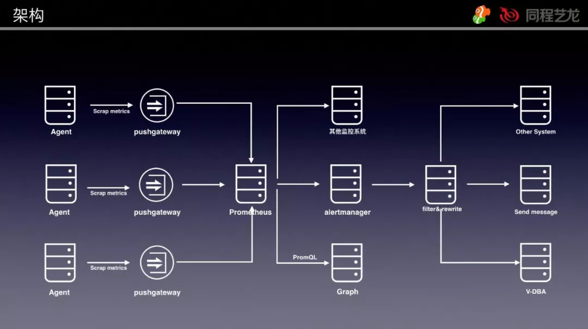

我们逐个介绍一下上面架构图中的内容。

**1）Agent**

这是我们用 golang 开发的监控信息采集 agent，负责采集监控指标和实例日志。监控指标包括了该宿主机的相关信息(实例、容器)。因为我们是容器化部署，单机实例数量大概在 4-20 左右。随着运维平台的实例增删，该宿主机上的实例信息可能会发生变化。所以我们需要 agent 能够感知到这个变化，从而决定采集哪些信息。另外采集间隔时间做到了 10s，监控颗粒度可以做的更细，防止遗漏掉突发性的监控指标抖动。

**2）Pushgateway**

这是我们用的官方提供的组件，因为 Prometheus 是通过 pull 的方式获取数据的，如果让 Prometheus Server 去每个节点拉数据，那么监控服务的压力就会很大，我们是在监控几千个实例的情况下做到 10s 的采集间隔(当然采用联邦集群的模式也可以，但是这样就要需要部署 Prometheus Server。再加上告警相关的东西以后，整个架构会变的比较复杂。)。所以 agent 采取数据推送至 pushgateway，然后由 Prometheus Server 去 pushgateway 上面 pull 数据。这样在 Prometheus Server 在写入性能满足的情况下，单台机器就可以承载整个系统的监控数据。考虑到跨机房采集监控数据的问题，我们可以在每个机房都部署 pushgateway 节点，同时还能缓解单个 pushgateway 的压力。

**3）Prometheus Server**

Prometheus Server 去 pushgateway 上面拉数据的时间间隔设置为 10s。多个 pushgateway 的情况下，就配置多个组即可。为了确保 Prometheus Server 的高可用，可以再加一个 Prometheus Server 放到异地容灾机房，配置和前面的 Prometheus Server 一样。如果监控需要保留时间长的话，也可以配置一个采集间隔时间较大的 Prometheus Server，比如 5 分钟一次，数据保留 1 年。

**4）Alertmanager**

使用 Alertmanager 前，需要先在 Prometheus Server 上面定义好告警规则。我们的监控系统因为是给 DBA 用，所以告警指标类型可以统一管理。但是也会有不同集群或者实例定义的告警阈值是不同的，这里怎么实现灵活配置，我后面再讲。为了解决 Alertmanager 单点的问题(高可用见下图)，我们可以配置成 3 个点，Alertmanager 引入了 Gossip 机制。Gossip 机制为多个 Alertmanager 之间提供了信息传递的机制。确保及时在多个 Alertmanager 分别接收到相同告警信息的情况下，也只有一个告警通知被发送给 Receiver。Alertmanager 支持多个类型的配置。自定义模板，比如发送 HTML 的邮件；告警路由，根据标签匹配确定如何处理告警；接收人，支持邮件、微信、webhook 多种类型告警；inhibit_rules，通过合理配置，可以减少垃圾告警的产生(比如机器宕机，该机器上面所有实例的告警信息就可以忽略掉，防止告警风暴)。我们告警是通过 webhook 的方式，将触发的告警推送至指定 API，然后通过这个接口的服务进行二次加工。

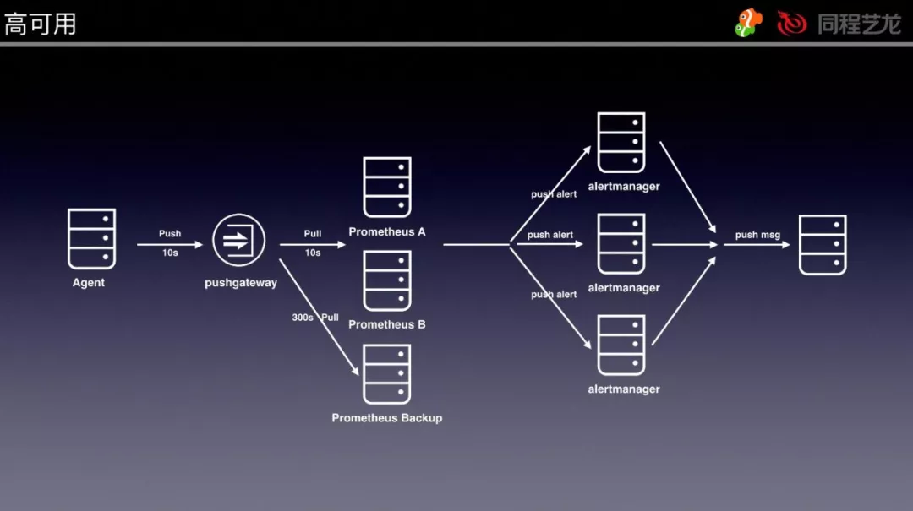

▲ Prometheus 和 Alertmanager 的高可用

**5）filter&rewrite 模块**

这个模块的功能就是实现 MySQL 集群告警规则过滤功能和告警内容改写。

先说一下告警规则过滤，因为上面提到是统一设置了告警规则，那么如果有 DBA 需要对个别集群的告警阈值调整的话就会很麻烦，为了解决这个问题，我们在 Alertmanager 后面做了 filter 模块，这个模块接收到告警内容后，会判断这条告警信息是否超过 DBA 针对集群或者实例(实例优先级高于集群)设置阈值范围，如果超过就触发发送动作。告警发送按照等级不同，发送方式不同。比如我们定义了三个等级，P0、P1、P2，依次由高到低。P0，任何时间都会触发，并且同时触发电话和微信告警；P1，8:00-23:00 只发微信告警，其他时间触发连续三次才触发发送；P2，8:00-23:00 发送微信告警，其他时间发送不发送。

下图是集群和实例的告警阈值管理页面（这是集成在数据库运维平台内部的一个功能），针对每个集群和实例可以独立管理，新建集群的时候会根据所选 CPU 内存配置，默认给出一组与配置对应的告警阈值。

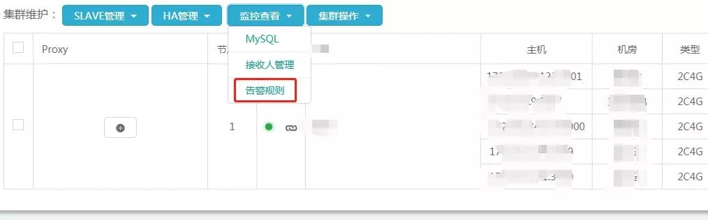

▲ 集群告警规则管理入口

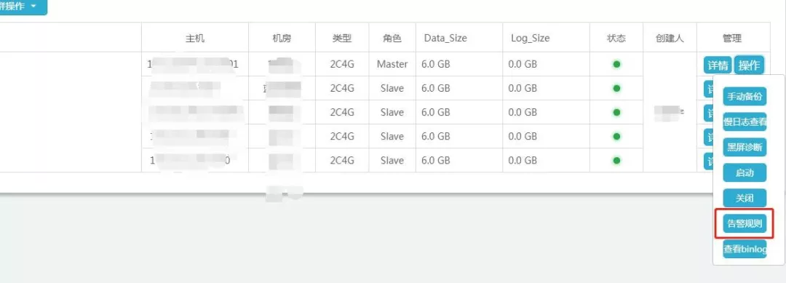

▲ 实例告警规则管理入口

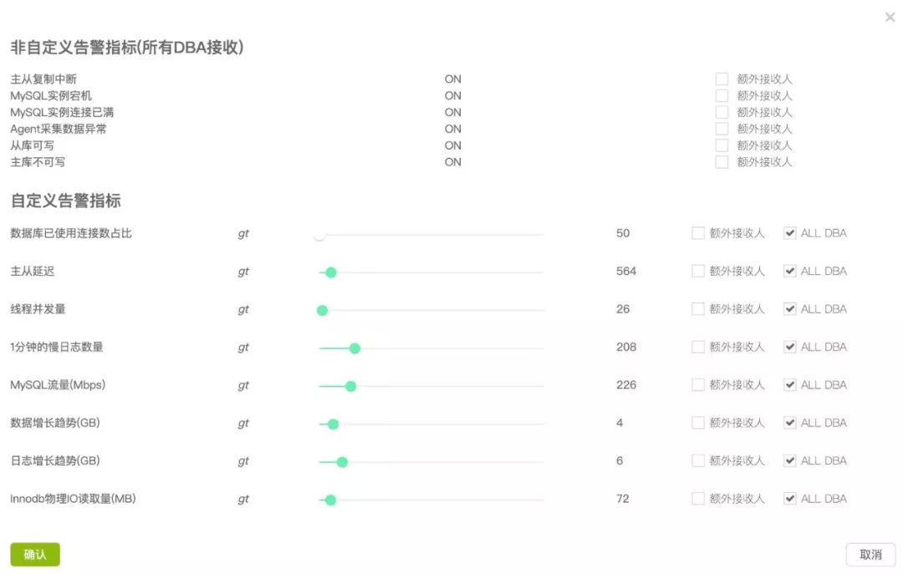

▲ 告警规则管理

接着看一下告警内容 rewrite，比如上图看到的额外接收人，除了 DBA 有些开发同学也想接收告警，但是如果给他们发一个 Thread_running 大于多少的告警，他们可能不明白是什么意思，或者什么情况下会出现这个告警，需要关注什么。所有我们需要做一下告警内容的重写，让开发也能看的明白。下图就是我们改写过后的内容。

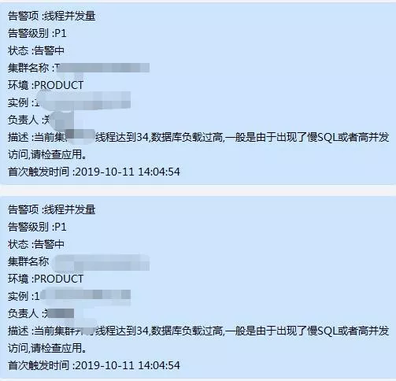

▲ 告警内容 rewrite

还有告警关联，比如某个宿主机的磁盘 IO 高了，但是可能需要定位是哪个实例导致的，那么我们就可以通过这个告警，然后去监控系统里面分析可能导致 IO 高的实例，并且管理报警。如图所示：

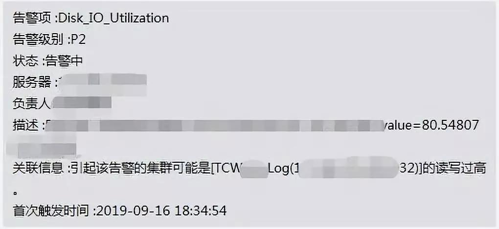

▲ IO 告警关联实例信息

最后说下一告警收敛，比如宿主机机宕机，那么这个宿主机上面的 MySQL 实例都会触发宕机告警(MySQL 实例连续三个指标上报周期没有数据，则判定会为实例异常)，大量的告警会淹没掉重要告警，所以需要做一下告警收敛。我们是这样做的，宕机后由宿主机的告警信息来带出实例的相关信息，一条告警就能看到所有信息，这样就能通过一条告警信息的内容，得知哪些集群的实例受影响。如图所示：

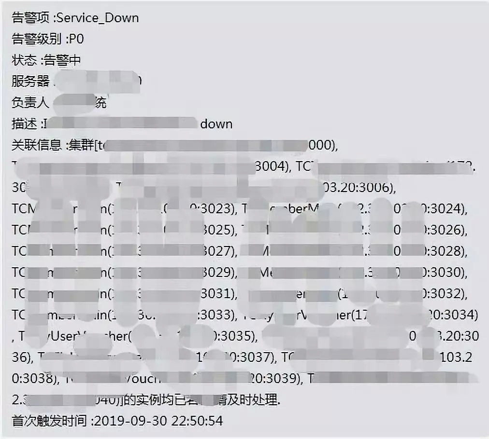

▲ 宿主机宕机关联实例

**6）Graph(画图)**

Prometheus 完美支持 Grafana，我们可以通过 PromQL 语法结合 Grafana，快速实现监控图的展示。为了和运维平台关联，通过 url 传参的方式，实现了运维平台直接打开指定集群和指定实例的监控图。

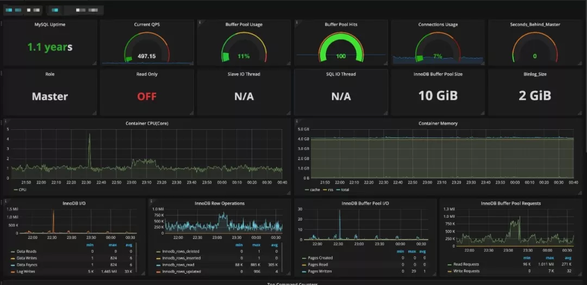

▲ 实例监控图

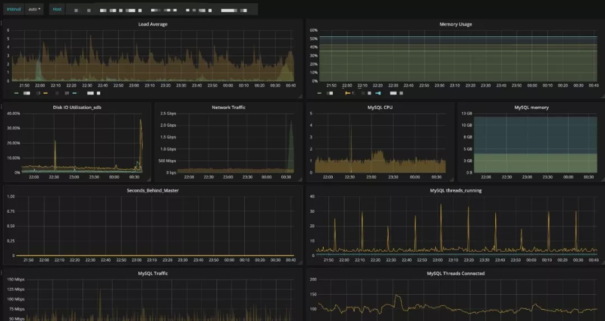

▲ 集群监控图

**7）V-DBA**

这是一个 DBA 的自动化程序，可以依赖告警信息实现一些指定操作，这里举一个过载保护的例子，我们的过载保护不是一直开启的，只有当触发了 thread_running 告警以后才会关联过载保护的动作。具体方案见下图：

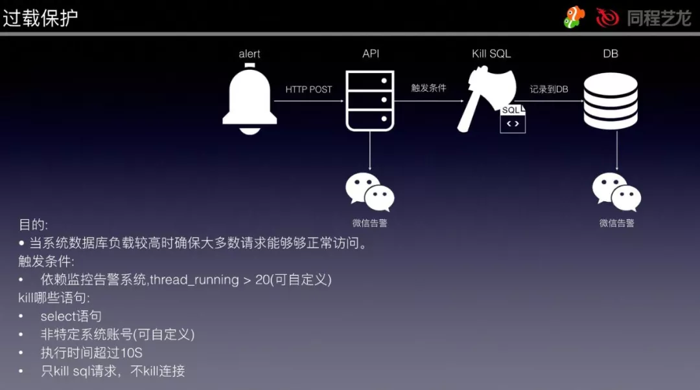

**8）告警管理**

在运维平台上，我们有专门的页面用于管理告警，在手机端也做了适配，方便 DBA 随时都能连接到平台查看处理告警。从下图中可以看到当前触发的告警列表，无颜色标注的标识该告警已经被回复（属于维护性告警，回复以后不发送)，有颜色的这个代表未被回复告警(图中的这个属于 P2 等级告警）。另外可以注意到，这里的告警内容因为是给 DBA 看，所以没有做改写。

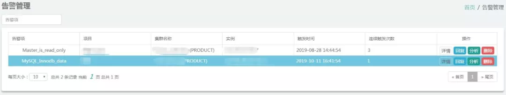

▲ PC 端

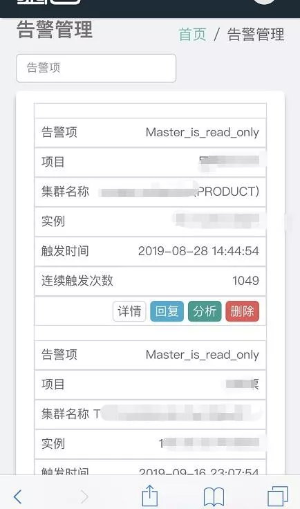

▲ 手机端

基于告警日志，我们结合 ES 和 Kibana 实现了告警数据分析的功能，这种交互式的数据分析展示，能够帮助 DBA 轻松完成大规模数据库运维下的日常巡检，快速定位有问题的集群并及时优化。

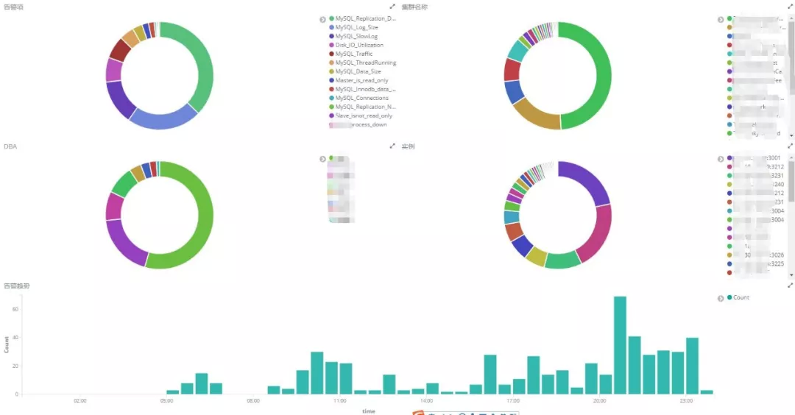

▲ 告警分析

### 3、基于 Prometheus 的其他实践

基于 Prometheus 的方案，我们还做了其他监控告警相关功能扩展。

**1）集群评分**

由于我们做了告警分级，大部分的告警都是 P2 等级，也就是白天发送。以此来降低夜间的告警数量，但是这样一来可能会错过一些告警，导致问题不能及时暴露，所以就做了集群评分的功能来分析集群健康状况。并且针对一个月的评分做了趋势展示，方便 DBA 能够快速判断该集群是否需要优化。如下图所示：

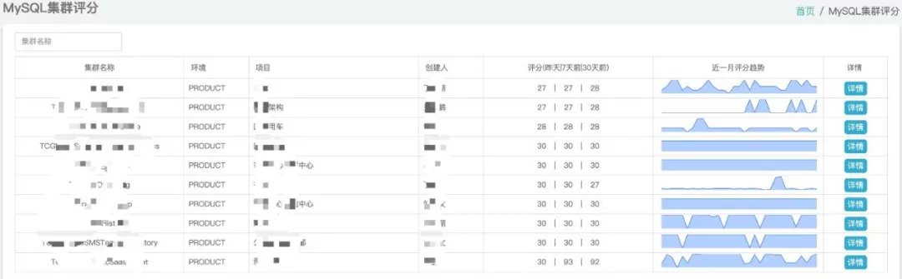

▲ 集群评分

点击详情，可以进入该集群的详情页面。可以查看 CPU、内存、磁盘的使用情况(这里磁盘空间达到了 262%，意思是超过配额了)。另外还有 QPS、TPS、Thread_running 昨日和 7 日前的同比曲线，用来观察集群请求量的变化情况。最下面的注意事项还会标出扣分项是哪几个，分别是哪些实例。

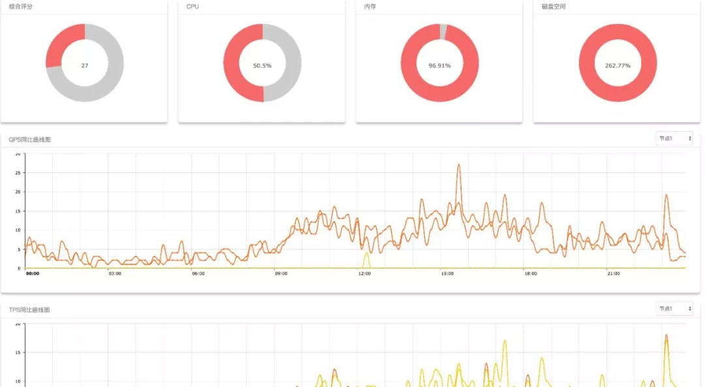

▲ 详情页

**2）指标预测**

针对磁盘空间做了 7 日内小于 200G 的预测，因为多实例部署，所以需要针对当前宿主机上的实例进行当前数据大小、日志大小、日增长趋势的计算。DBA 可以快速定位需要迁移扩容的节点实例。实现方法就是用了 Prometheus 的 predict_linear 来实现的(具体用法可以参照官方文档)。

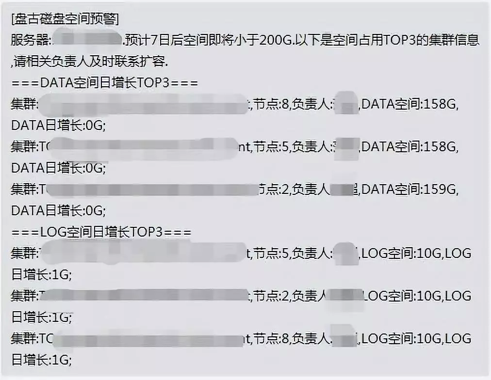

▲ 磁盘空间预警

### 4、日志相关

**1）SlowLog**

SlowLog 管理，我们是通过一套系统来进行收集、分析的，因为要拿到原生日志，所以就没有采用 pt-query-digest 的方式。架构如下：

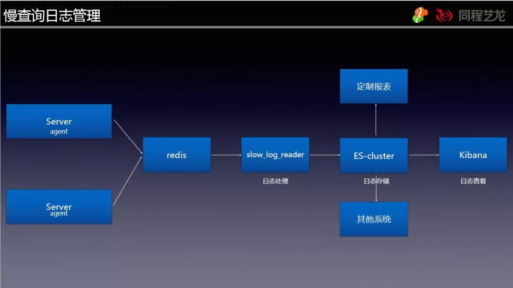

通过 agent 收集，然后将原始的日志格式化以后以 LPUSH 方式写入 redis(由于数据量并不大，所以就没有用 Kafka 或者 MQ)，然后再由 slow_log_reader 这个程序通过 BLPOP 的方式读出，并且处理以后写入 ES。这个步骤主要是实现了 SQL 指纹提取、分片库库名重写为逻辑库名的操作。

写入 ES 以后就可以用 Kibana 去查询数据。

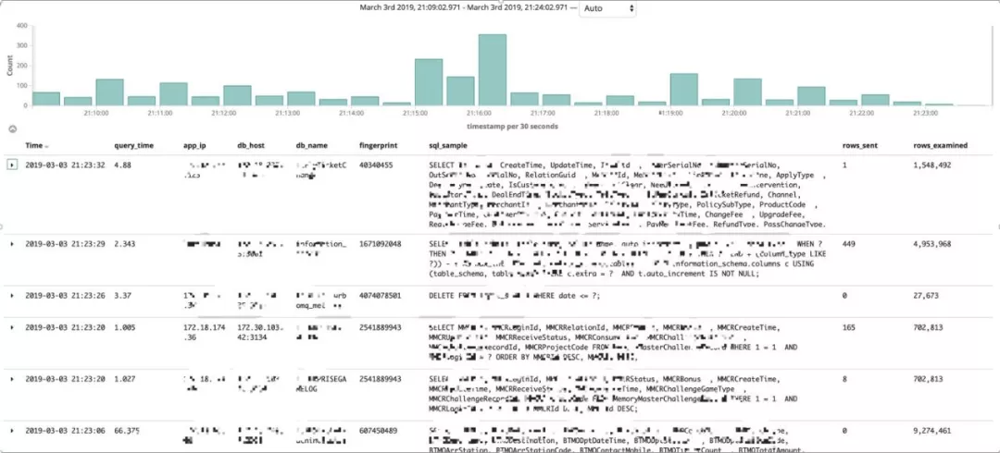

对接到面向开发的数据库一站式平台，业务开发的同学可以查询自己有权限的数据库，同时我们也集成了小米开源的 SOAR，可以用这个工具来查看 SQL 的优化建议。

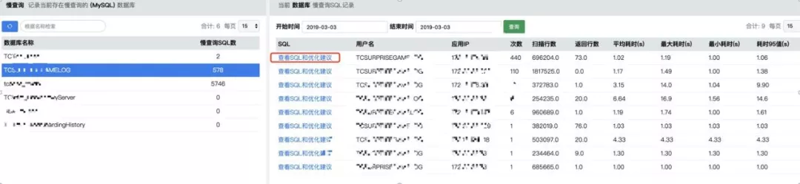

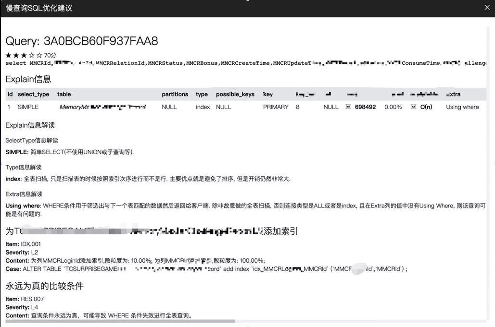

通过 ES 进行聚合，可以给用户订阅慢查询的报表，有选择性的查看相关库的 TOP 慢 SQL 信息信息，有针对性的镜像优化。

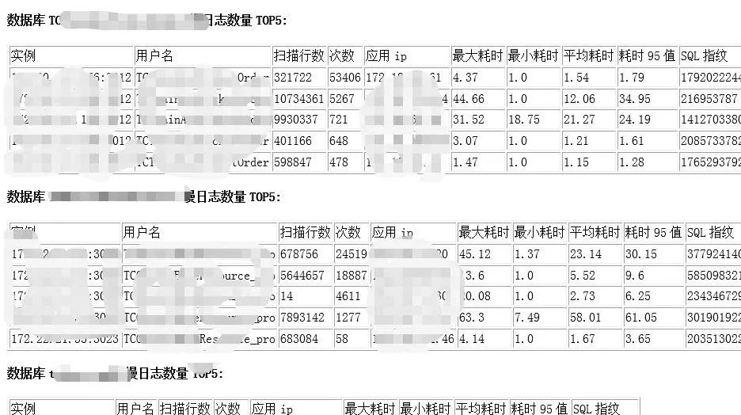

**2）Processlist，InnoDBStatus 数据采集**

为了能够在故障回溯或者故障时查看当时的会话快照和 InnoDBStatus，我们在监控 agent 中内置了这个功能，也是每 10 秒一次，区别是会判断当前 ThreadRunning 是否到达阈值，如果到达才会采集数据，否则不采集。这样的设定既解决了无用日志太多的问题，又解决了性能异常时能够获取到状态信息。下图是日志采集处理的逻辑，其中日志处理模块是和慢查询处理在一个程序中，会话快照的处理逻辑和慢查询类似，这里就不赘述了。

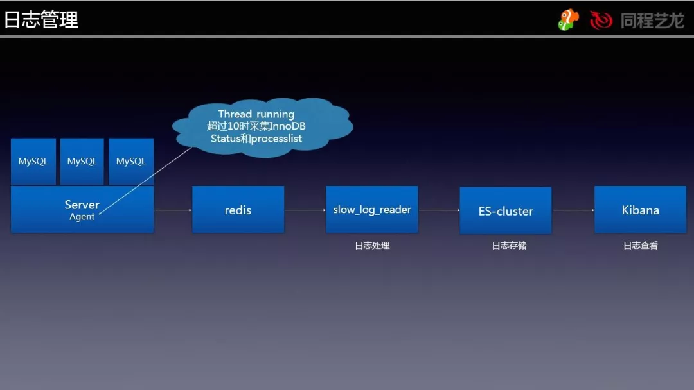

## 四、总结

监控系统没有绝对的谁好谁不好，最重要的是适合自己的团队，能够合理利用最小的成本解决问题。我们从 16 年开始使用 1.x 版本到线下的 2.x 版本，目前基于 Prometheus 的监控系统，承载了整个平台所有实例、宿主机、容器的监控。采集周期 10S，Prometheus 一分钟内每秒平均摄取样本数 9-10W。1 台物理机(不包括高可用容灾资源)就可以承载当前的流量，并且还有很大的容量空间(CPU\Memory\Disk)。如果未来单机无法支撑的情况下，可以扩容成联邦集群模式。

另外本文中提到的监控系统只是我们运维平台中的一个模块，并不是一个独立的系统，从我们实践经验来看，最好是可以集成到运维平台中去，实现技术栈收敛和系统产品化、平台化，降低使用的复杂的。

最后说说在监控方面我们未来想做的事情，目前我们监控数据有了，但是告警只是发送了指标的内容，具体的根因还需要 DBA 分析监控信息。我们计划在第一阶段实现告警指标相关性分析后，可以给出一个综合多个监控指标得出的结论，帮助 DBA 快速定位问题；第二阶段能够更加分析结果给出处理建议。最终依赖整个监控体系，降低运维的复杂度，打通运维与业务开发直接的沟通壁垒，提升运维效率和服务质量。

**作者介绍**：

**闫晓宇**，同程艺龙数据库技术专家，具有多年互联网行业 DB 运维经验，在游戏、O2O 及电商行业从事过 DBA 运维工作。2016 年加入同程艺龙，目前在团队负责数据库架构设计及优化、运维自动化、MySQL 监控体系建设、DB 私有云平台设计及开发工作。

**原文链接**：

[**https://mp.weixin.qq.com/s?__biz=MzI4NTA1MDEwNg==&mid=2650782138&idx=1&sn=7f4e6fba5910f6cd28d40498d9ed79a9&chksm=f3f90c2fc48e8539dc2121451fd9417d1afdfa41519ff70810083909d6cf41e9a47266149b48&scene=27#wechat_redirect**](https://mp.weixin.qq.com/s?__biz=MzI4NTA1MDEwNg==&mid=2650782138&idx=1&sn=7f4e6fba5910f6cd28d40498d9ed79a9&chksm=f3f90c2fc48e8539dc2121451fd9417d1afdfa41519ff70810083909d6cf41e9a47266149b48&scene=27#wechat_redirect)

2019 年 10 月 28 日 08:001954

**[数据库](https://www.infoq.cn/topic/Database)[最佳实践](https://www.infoq.cn/topic/best-practices)[数据处理](https://www.infoq.cn/topic/ dataprocessing)