## 完美避锅！我们重构的监控系统告警太精准了

曹军 2020-10-15 19:56:00

经过团队两个月的努力，新版本的监控系统终于上线了。

 

从早期构思当下痛点，下定决心重做，真正的把一个“系统”升级为“服务”，到快速迭代中实际需求的不断提出、改进，这里总结了迭代过程中的经验和心得，希望给同样为业务监控系统发愁的筒子们一些帮助和启发。

 

故事是从一次类似的评审环节开始的，负责这个监控系统的工程师小曹、小黄和小孙参加了答辩。

 

**一、背景环节（10分钟）**

 

**评委A：**你们是重新做了一个监控+报警系统？？？

**工程师小曹：**是的，叫dolphin。

 

**评委A：**为什么要为系统做重构？做这个系统的意义在哪里？可不可以不做？（灵魂3连问）

**工程师小曹：**好大夫在线从2006年到2020年，经过14年的业务高速发展，监控系统面临的挑战也越来越大，碰到的问题也越来越多，所以我们决定要重做监控系统......

 

**评委B：**为什么不直接使用开源系统？ 

**工程师小曹：**主要有以下4个原因：

 

- 开源系统没有自动报警升级策略，比如我们要求的升级路径是：系统负责人（多人）=> 团队技术负责人 => CTO/CEO；
- 开源系统一般只能简单报警，如报给配置好的特定几个人（一般是运维同学），而我们是希望一线工程师更多的感知、承担相关工作，向DevOps看齐，所以我们需要按照系统负责人拆分报警，要自定义、灵活且容易上手的配置规则和阈值；
- 开源系统配套的报警规则一般是功能存在（短信、邮件、webhook等），但是抽象度不足，比如设置通用型报警规则，报警静默等，即便是强大的alertmanager(https://prometheus.io/docs/alerting/latest/alertmanager/)，也还是过于简单；

- 整体来说，当前的开源监控+报警系统，还只是一个“系统”，而我们需要的是一个“服务”，当然我们也是在这些开源系统上丰富了功能，希望还是去做一个监控、报警服务。

 

**评委A：**感觉你在背作文啊，你的作文有论据么？还是聊聊具体的问题吧。

**工程师小黄：**是的，我们确实遇到了很多的问题：

 

- 之前的版本是基于zabbix和自定义系统结合的，业务运维同学需要7x24h值班，人工打电话叫你起来解决各种问题，不但容易误事，大家还相互埋怨；
- 负责人交接系统的时候，相关报警没有及时更换，导致新负责人没有收到报警，一旦发生故障只能用户上报，时间久，业务受损严重，整体绩效不合格；
- 报警没有升级机制，一线开发、运维长时间没有解决问题，业务持续受损，直到某个大牛医生给老板私聊反馈了这个问题，老板找来技术领导，问咋回事，这个时候技术领导才知道出了这么大的问题，整体绩效不合格；
- 报警规则不灵活，一旦底层故障，大面积短信轰炸，搞不清楚是什么问题，定位时间很长，整体绩效不合格；
- 维护报警规则成本高，新增、修改、删除都需要相关同学进行配置，很麻烦；
- 没有统计分析量化，哪个团队报警多，需要重点干预完全不知道。

 

**评委A：**你们这个系统的目标用户是哪些人？

**工程师小黄：**秉承DevOps的思想，我们的用户当然是一线开发、技术leader、运维和CTO（甚至是CEO）。

 

**评委B：**监控这个概念还是太广了，你们这个系统具体定位是什么？

**工程师小黄：**一般我们将监控系统分为五层来考虑，当然也有人分成三层，大致的意思都差不多：

 

- **客户端监控：**用户行为信息，业务返回码，客户端性能，运营商，版本，操作系统等；
- **业务层监控：**业务数据的监控，例如：登录，注册，下单，支付等等；
- **应用层监控：**相关的技术参数，例如：URL 请求次数，Service 请求数量，SQL 执行的结果，Cache 的利用率，QPS 等等；
- **系统层监控：**物理主机，虚拟主机以及操作系统的参数。例如：CPU 利用率，内存利用率，磁盘空间情况；
- **网络层监控：**网络情况参数。例如：网关流量情况，丢包率，错包率，连接数等等。

 

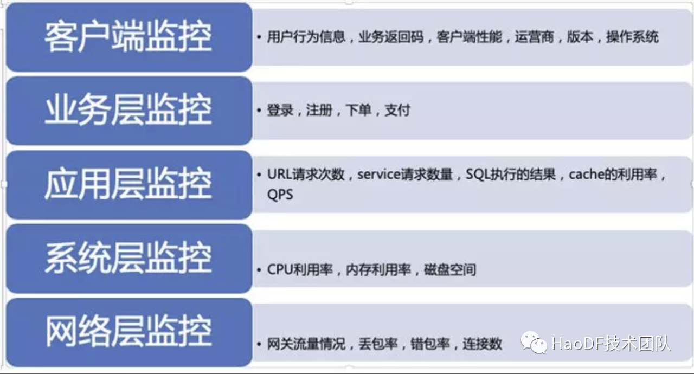

 

目前阶段，我们主要还是定位在客户端、业务层和应用层监控等，基于日志分析的监控。在后续规划中，也会逐步下探到系统层和网络层。

 

 

**二、详细设计考察环节（40分钟）**

 

**评委C：**你们早期监控系统是怎么设计的？

**工程师小黄：**当用户请求到好大夫在线的服务器之后，会产生相应的日志。比如Nginx会有access.log，程序会记录locallog（自定义日志）和tracelog（分布式调用栈日志）等，然后对日志进行收集和存储，最后定时查询告警指标，判断是否要告警，如果要告警，通过邮件和短信进行发送。

 

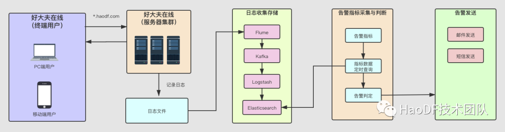

 

**评委C：**这个设计有问题么？

**工程师小黄：****故障可能得不到及时解决**。由于报警发送通道只有邮件和短信，如果故障发生晚上凌晨，大家都在睡觉的时候，即便收到邮件和短信告警的，基本不可能叫起来去处理故障。所以出现的情况是第二天一早就收到了用户的投诉。一看手机发现收到了N条报警短信，故障时长已经非常久了，一份故障总结报告在向你招手！时间一长，故障报告写到了手软之后，每当到了上线日，晚上都会睡不踏实，一段时间就要看看手机没有短信告警，害怕出问题。每当半夜听到手机的震动或者叮的响声，心里就一紧，常常失眠。

 

**评委C：**那这个问题你们是怎么解决的，为什么要这么这么做？

**工程师小黄：**我们加入了电话报警机制，而且是追命连环call，务必要保证把负责人从梦里叫醒，去解决问题。

 

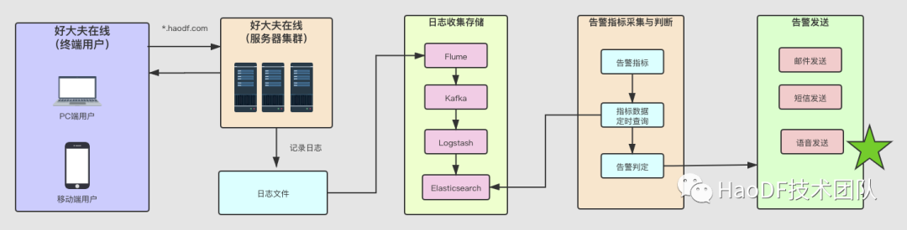

 

当然也不只是简单加上了电话报警这个通路。报警规则往往是分钟级别的，不能一直触发一直报警，所以也加入了电话应答后自动静默的特点，同时伴随着故障升级的特性，后续会再讲。

 

**评委D：**除了电话报警的问题，你们还遇到了别的问题了么？

**工程师小孙：****主要是职责不够明确**。虽然电话告警，能够让故障得到及时的解决。但是早期的告警指标大多数都是兜底监控，监控指标都是监控全量的报错情况，比如sentry(https://sentry.io/)报错全量监控，status状态非0全量监控。报警接收人基本为系统架构部人员和运维人员。导致系统架构部和运维同学频繁的接到电话告警，先判断问题，再找业务部门沟通，效率非常低成本又高，似乎又回到了类似之前值班运维人工值守的状况。

 

**评委D：**那你们是怎么解决这个问题的？

**工程师小孙：**我们抽象了用户、团队、应用、监控项等等基本概念，做到告警规则->团队->对应负责人的自由匹配。每当告警事件产生后，就可以直接找到对应的告警负责人，进行精准告警。

  

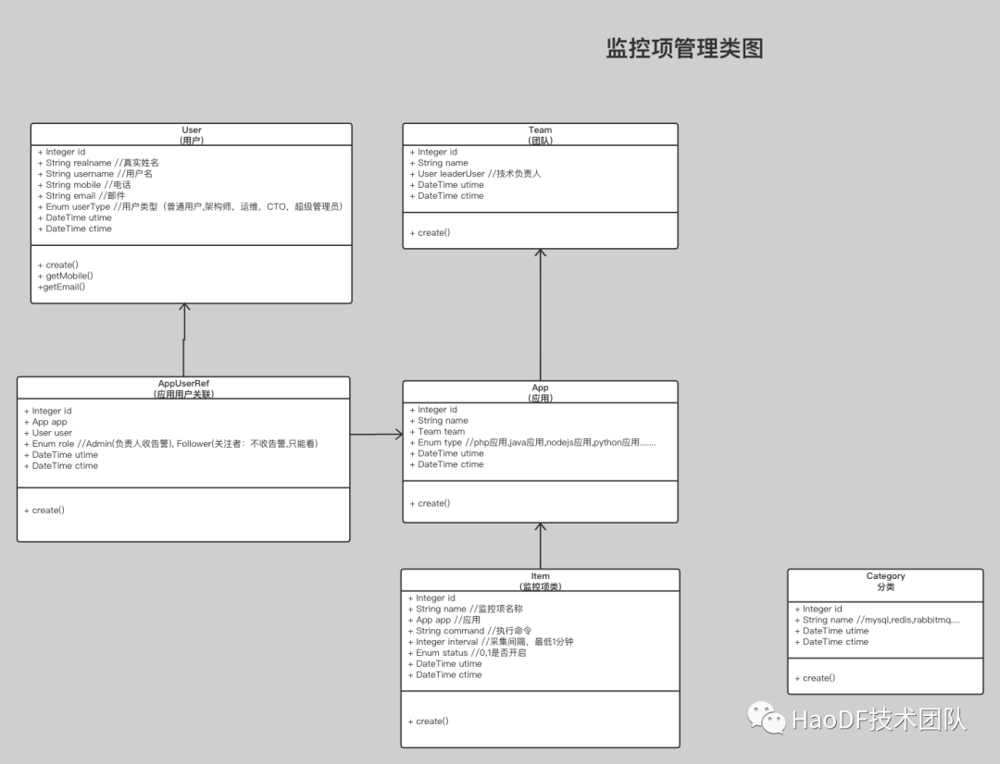

 

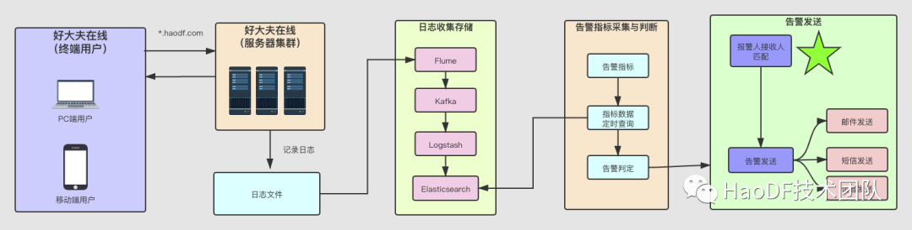

 

**评委D：**这个问题给你们最大的感受是什么？

**工程师小孙：**如果你是运维或者架构师，有没有晚上频繁接到电话告警，担心家人晚上睡不好，自己“主(bei)动(gan)”去另外一个卧室睡觉的！这个功能上线后，世界又回归清静了，当然更多的工程师同学要起来查问题了。。。系统感知能力越强（监控项加的越多），工程师提前消除潜在风险、bug的能力就越强，长期看其实是更有利于大家节假日休息的。

 

**评委E：**那之前说的自动升级报警又是什么？

**工程师小孙：**当故障产生的时候，系统的直接负责人开始排查解决故障，但有时候问题不是很好解决，相关负责人在聚精会神解决问题时，往往又忘了反馈问题，就会导致故障长时间得不到的解决，影响的用户越来越多，投诉也越来越多，直到某个大牛医生将问题私信给了老板，老板叫来技术领导，问咋回事，这个时候技术领导才开始加大资源投入去排查解决问题。针对这类问题，尽管定了相关流程，如10分钟如果没解决要上报，谁跟进，谁协调资源等等，但是一旦故障发生时，很容易忽略时间，最终导致各方都不满意，绩效当然不合格了。

 

**评委E：**那你们是怎么解决的？

**工程师小孙：**我们加入了告警自动升级机制。当故障产生后，系统直接负责人（必须有第一、第二负责人）首先会同时接收到告警信息，一段时间（如15分钟）后，如果问题还没有得到解决，团队技术负责人和系统架构师就会收到告警信息，可以进行协助或者干预了。又过去一段时间（如30分钟）后，问题还是没有得到解决，CTO将会收到报警信息，问题会自动升级上报。

 

升级的好处是技术负责人可以视报警严重程度，决定是否加大资源去排查问题，同时向老板汇报原因，即做到了及时感知问题，不掩盖问题，也不耽误事。

 

当然，这样的后果是系统负责人的压力直接就上去了，他们要花更多的时间去关注系统的稳定性、错误率和bug等，你也不好意思总让CTO接到你们团队的报警是吧？

 

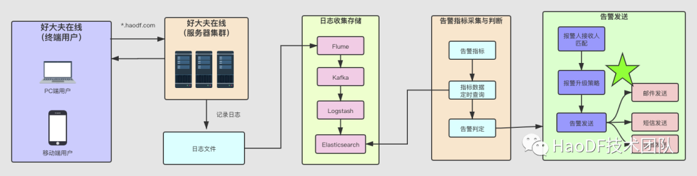

 

**评委E：**这个问题给你们的感受是什么？

**工程师小曹：**流程还是靠系统保障更靠谱，技术要对业务负责，故障都不感知怎么能行？故障、bug出了不可怕，大家第一时间止损，然后总结就行了。不要怕，更不能掩盖问题。

 

**评委F：**真是问题推着设计走啊，那整体来看，新监控系统大体是什么样的？

**工程师小曹：**整体的架构如下图：

 

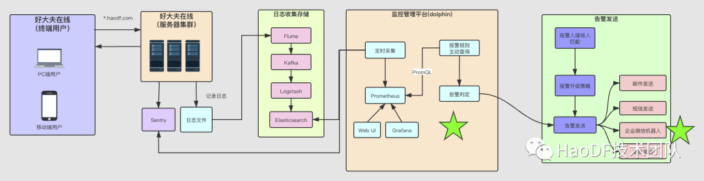

 

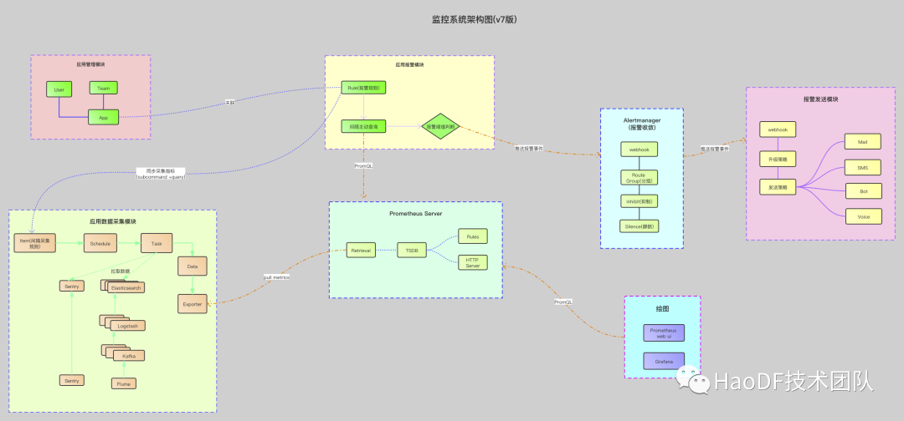

 

**dolphin的主要的新特性如下：**

 

- **告警规则和应用关联，应用和人关联**。只要维护好应用和人的关系，那么告警规则不用频繁的发生变化。并且应用和人的关系在监控系统中由业务自己负责维护：

 

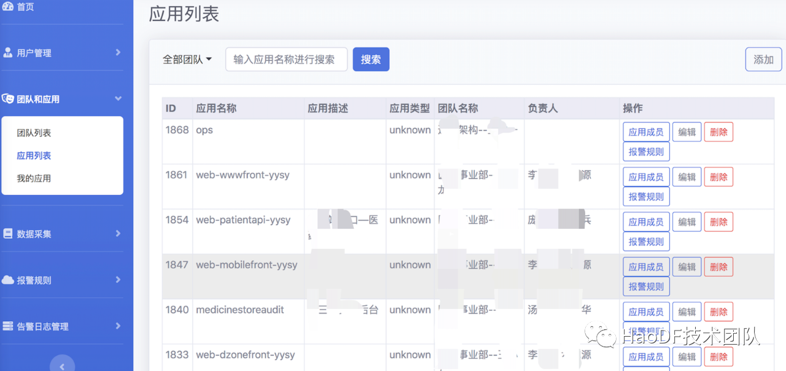

 

- **告警规则新增、修改、删除等维护工作直接给了相关业务部门开发人员，职责明确，不再由特定的人员去维护**：

 

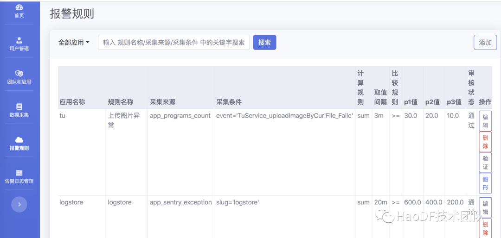

 

- **采用Prometheus技术体系。**定时任务会从Elasticsearch采集监控指标数据，存储到Prometheus中。定时任务通过PromQL去Prometheus查询数据，根据预定义规则判断是否满足告警事件。同时Prometheus Web UI 和Grafana可以直接到Prometheus查询相关数据，用于图形展示。

 

- **添加企业微信群报警机器人功能**。当产生告警事件之后，不仅仅只有打电话，短信，邮件。还可以通过报警机器人，推送告警信息到事业部门的技术群中，并且@系统的相关负责人。这个报警机器人，不仅仅是多了一种告警发送通道，还可以报警产生之后，可以让同部门的更多的同事知道告警信息，协助排查问题：

 

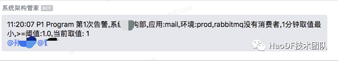

 

- **告警日志历史可以方便查询**：

 

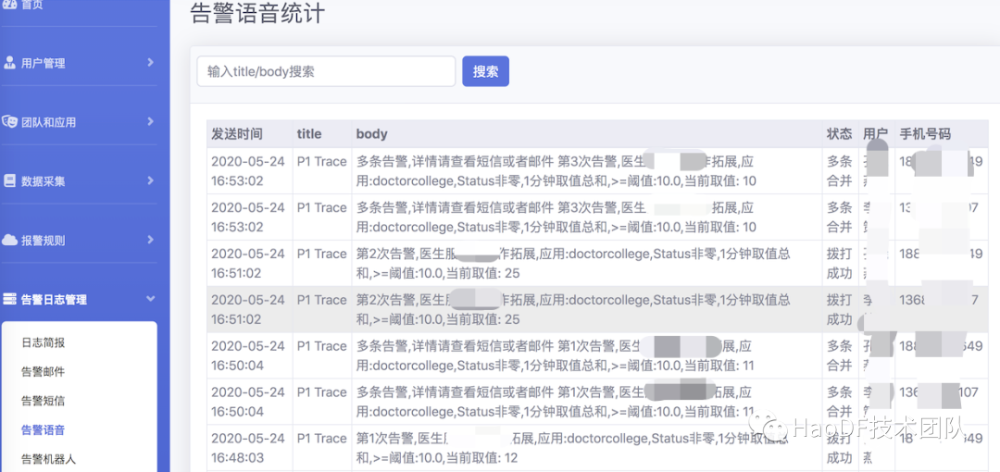

 

- **应用总览**。这个相当于是所有系统的portal入口汇聚，可以方便跳转到各应用的文档页面(设计/使用/介绍等)，关联各个系统的confluence，方便大家整体查找：

 

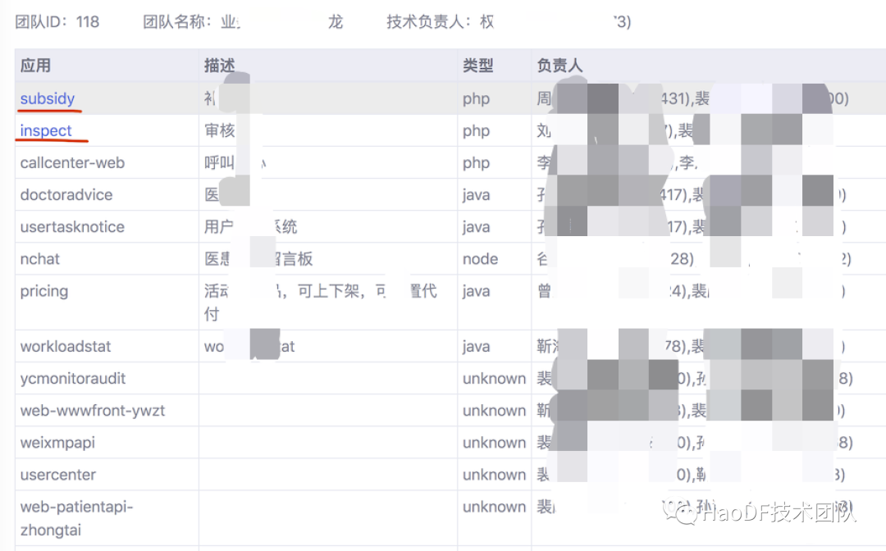

 

- **通讯录、权限和内部hr、OPS系统打通，随时感知人员入、离职状态，提醒技术负责人进行人员变更**：

 

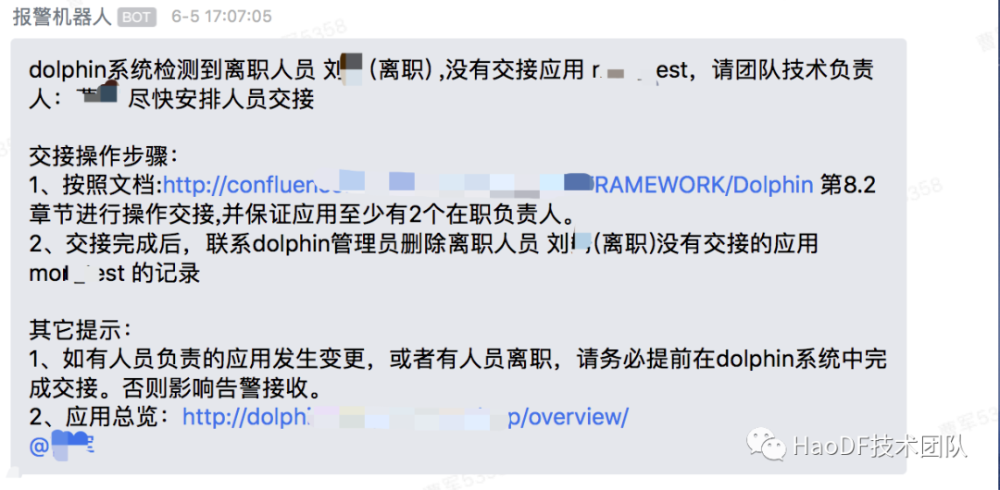

 

**评委F：**听上去都挺不错的，那真实上线之后，有遇到什么没想到的问题么？

**工程师小曹：**还是挺多的，比如缺乏报警静默功能。当程序触发了报警规则，或者有些报警不影响用户，但是需要等到代码上线之后才能修复的，这个时候需要把报警给屏蔽掉。

 

**评委F：**这个问题你们是怎么解决的？

**工程师小黄：**上线静默功能，以在一定时间段降低不必要的报警。架构图如下：

 

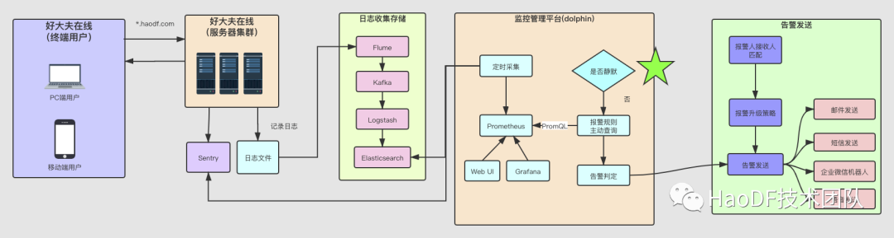

 

页面配置如下：

 

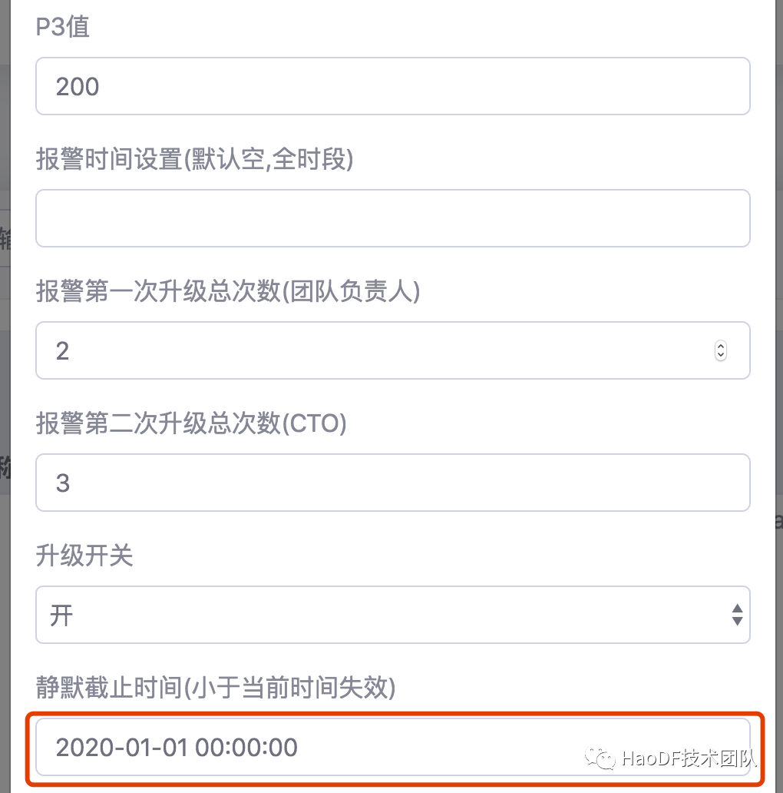

 

有了静默就要防止无休止静默，万一忘了打开就误事了。所以系统会在静默超过一段时间后强制释放，以避免大家遗忘。 

 

另外，告警触达率不高也是我们需要重点关注的。有的应用加的报警规则比较全面，但是有些应用只有基本的sentry，即只关注到了应用层面的报警。但是更多相关中间件的报警项也非常多，业务方如果逐一去加的话，不但繁琐，而且很容易出现诸多问题（经验不足导致误报或者报不出来）。

 

由此，我们设计了通用型报警规则，即把业务方使用的中间件（mq、redis、mysql等等），设立默认规则作用于所有的应用，这样就具备了更多的感知能力。当某个系统依赖的中间件故障时，系统负责人也可以收到相关中间件报警，再加上原有的应用层报警，这样就更容易定位问题了。

 

当然，如果某些应用需要对中间件有自定义规则时，也可以复写通用型报警规则和阈值。如下图：

 

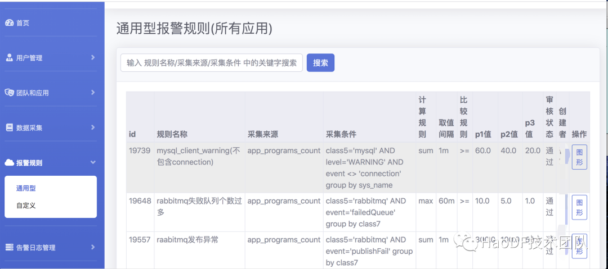

 

**dolphin系统会优先加载应用特有的报警规则和阈值**。

 

这些问题都解决后，各团队基本都开始大规模使用了，简单的配置规则，灵活的联系人变更，及时的报警频率，都收获了好评，当然改进更是源源不断。比如每次报警内容只能推送告警的聚合数字内容，不能推送告警具体的原因，更没有根因分析，不能帮助业务方快速定位问题。每次收到报警，还是要打开电脑，连上vpn，sentry、日志等一顿看，然后发现不影响，确实有点儿烦人，能不能协助进一步定位具体问题原因呢？

 

我们仔细思考、分析了日常报警原因和表象后，发现还是可以进一步提供更丰富的信息出来的，比如：如果是sentry类的报警，可以直接推送相关具体问题的网页截图。更高级的用法是使用另一组同学研发的神器：系统画像系统。画像系统会去帮助设计一个具体信息聚合页，如：status非0报警、错误数据、redis连接超时、mysql慢查询等等，我们将这些对应的聚合页，通过报警机器人自动推送出来。

 

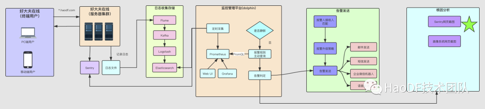

 

- **推送Sentry网页截图：**

 

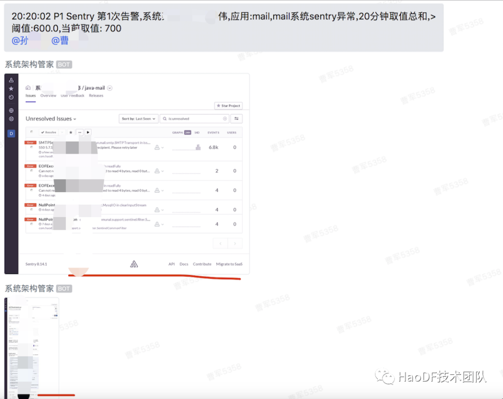

 

- **推送画像系统网页截图：**

 

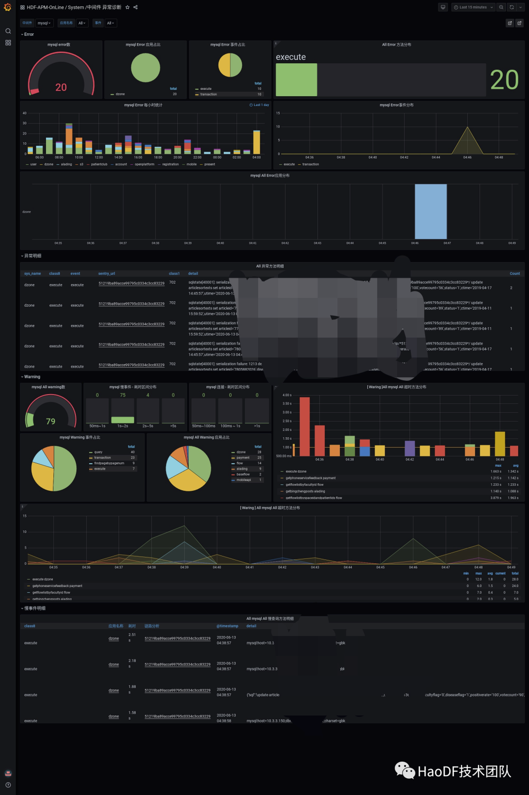

 

**ps：**关于系统画像系统，后续会再单独介绍，感兴趣的同学们可以持续关注下这个神器是如何诞生以及帮助大家快速定位问题的。

 

众评委此刻顿时骚动起来，从他们的眼中我仿佛看到了无数次夜里我爬起来解决问题的身影。。。

 

**三、补充说明环节（10分钟）**

 

**评委A：**你们未来还有什么规划么？ 

**工程师小曹：**主要是以下几方面：

 

- 报警趋势的变化分析，可以评估一个应用是不是在逐步的恶化，及时提示相关系统负责人进行重点关注，不能总是去救火的状态；
- 随着公司整体容器化的进行，dolphin也要对接上容器化，进一步打通p8s、k8s，扩展报警范围和能力；
- 报警机器人强化，当然这也取决于企业微信机器人自定义回复消息能力的开放，目前还是单向的没法互动；
- 高可用和可扩展性持续增强，随着报警项的增多，及时触达率是我们重点关注的；
- 后续继续完善相关文档，能开源出来就更好了。。。

 

**答辩组织者：**评委们，还有其它问题么？ 

**评审N：**挺全面的了，期待早日完善上述特点，特别是机器人交互方式，能够方便大家直接简单操作就更好了。

 

作者丨曹军

来源丨HaoDF技术团队（ID：gh_a0f9bc95946e）

dbaplus社群欢迎广大技术人员投稿，投稿邮箱：editor@dbaplus.cn