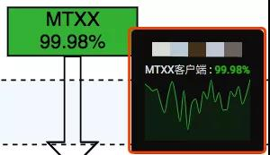

## 美图全链路监控实战，成本低还能直接落地

美图SRE 2020-12-09 15:28:00

 

**一、摘要**

 

本文内容分为3部分，首先简单介绍了美图的业务背景和监控体系，然后是两个美图的监控实践——基于Grafana FlowCharting插件的「监控大盘」实战和基于GrafanaImageRender+企业微信机器人的「图文告警」实战。

 

这两个监控实战都是非常容易落地的，基本是开箱即用，中间只涉及到非常少量的代码工作。本文除了介绍我们做相关技术选型时的一些考量，同时给出了两个实战完整的“step by step”的操作步骤，对于涉及到的少量代码工作，文中也给出了代码样例。希望这两个案例对于大家做监控大盘和富文本告警的工作可以有所参考。

 

**二、美图监控的整体架构**

 

1、 业务背景

 

 

 

在展开技术实战部分的讲解之前，我们先简单了解下美图公司的业务场景和规模。美图公司的业务主要分为 ToC 和 ToB 两类，以「消费者社区」为核心，在「影像美化」、「美妆平台」、「皮肤管理」几个垂直领域均有面向终端用户和面向企业的产品或解决方案。

 

 

美图的产品线覆盖社区、美颜、美妆、短视频、直播等领域，比较知名的C端APP有美图秀秀、美颜相机、美妆相机、美拍等。此外，美图拥有大量的海外用户，知名的产品有 BeautyPlus、AirBrush 等。围绕这些 APP 同时建设有大量的支撑服务，比如基础架构、大数据、AI开放平台、商业化生态等。

 

美图的产品线众多、业务形态丰富、ToC和ToB的服务并存，如何保障众多线上服务的稳定性也就是众多技术同学尤其是SRE同学所面临的挑战。而要保障服务的稳定性，不可或缺的一点就是对服务质量的感知力，也就要求我们建设一套稳定、高效、契合业务的监控系统。美图的监控体系就是建立在前文的场景和规模之下的，下面让我们来深入了解一下。

 

2、监控体系

 

 

 

美图的整个监控体系分为「用户端」和「服务端」两大块。

 

- 「用户端」主要覆盖客户端和中间链路。目前主要基于美图自研的APM(内部代号哈勃)来做客户端的的质量监测，监控的指标有：网络质量、崩溃、卡顿、响应时间、错误率、慢请求等。除此之外，美图还建设有流媒体的监控体系，主要用来覆盖直播推流拉流、点播拉流、CDN质量等；
- 「服务端」的部分涵盖的内容比较多，如果从业务的请求链路来看，服务端的监控会覆盖从「入口层负载均衡」到「业务服务」、到「周边依赖服务」的调用、到「后端资源类服务」等整个请求链路。此外，还有一些基础设施的监控。

 

因为目前美图的业务已经“全量上云”，我们对基础设施的监控就不再过多关注网络设备、服务器等物理硬件相关的内容了，更多地转向了对云上基础设施的监控，比如网络质量、ECS虚机、容器平台、DNS等基础服务等。

 

 

美图整体的监控体系可以参照上图，本图的绘制时间稍微有点早了，但是基本的信息都还是适用的。

 

美图是从2016年开始推进完善上述监控体系的，在这个过程中我们也调研、测试、引入了众多的技术工具和技术栈：

 

- Zabbix、OpenFalcon、OpenTSDB基础监控；
- ELKB日志套件；
- InfluxDB的TICK套件；
- Prometheus；
- Spark、Storm、Kafka、Flink等大数据套件；
- Netdata、Sentry、EagleEye、SkyWalking等。

 

此外，美图也基于开源的组件做了大量的二次开发的工作，同时也建设了一些诸如通知系统NoticeSystem、统一告警平台MTAlert等工具。

 

监控体系涉及的内容比较庞杂，无法在一篇文章中做到全面细致的讲解，下面会将更多的篇幅放在「全链路监控报表」的建设思路上，并且会附带一个监控大盘和告警的实战。

 

3、监控大盘

 

 

 

**1）统一监控报表查看入口到Grafana**

 

经过上述的建设，已有的监控工具已经可以较好的覆盖从客户端到服务端的各个环节了，这时却有了新的问题：监控系统太多、报表散落在各个系统，业务方排查一个问题可能需要在多个系统之间来回切换，体验非常不好。

 

这时候我们希望有一个统一的用户界面来展示不同监控系统的数据，我们也做了一些简单的调研。当时我们调研的方案有：自建前端、用iframe简易嵌套组合、Grafana。

 

自建前端和iframe嵌套的优点都是可以接入更多的监控系统，但是缺点也都比较明显。自建前端是可定制化程度最高的方案，但是需要比较多的适配工作，随着各个监控系统的迭代，平台维护的工作量也是比较可观的；iframe嵌套的方式倒是简单粗暴，但是并没有从本质上解决数据割裂的问题，并且还需要解决不同监控平台之间的用户权限打通的问题。

 

最终我们选择了Grafana作为统一的监控Dashboard工具，当时考量的点主要有：

 

- Grafana对我们当时在用的大部分监控系统(数据源)都有支持，比如Zabbix、OpenTSDB、Prometheus、InfluxDB、Elasticsearch；
- Grafana是Prometheus官方推荐的展示组件，当时我们已经在大量推进业务侧的Prometheus监控，这个点对我们的决策比较重要；
- Grafana的发展很迅猛，社区活跃，有“大一统”之势。

 

于是把原先没有接入到Grafana的数据源做了统一的接入，用Grafana来提供统一的监控用户界面。

 

 

当然，Grafana也有一些问题，比如对一些数据源没有提供支持或者支持不够完美，日志、告警的能力比较弱(现在已经有非常大的改观)等。对于这些问题，我们选择容忍或使用其他方案来配合和覆盖，比如：

 

- ELK技术栈中的日志细节查看还是需要借助Kibana，Grafana则更合适去呈现Elasticsearch的汇总数据或变化趋势；
- Prometheus的PromQL的调试、AlertManager的管理，可能还是原生的UI会更友好；
- 监控告警的需求，我们则更多的依赖我们的告警平台MTAlert来做覆盖。

 

考虑到我们的原始需求(统一的监控UI)，目前Grafana是可以满足我们绝大多数日常的监控可视化需求的。

 

**2）在一张报表(Dashboard)中展示业务链路**

 

在用Grafana解决了数据源散落在多个系统的问题之后，业务方可以不用频繁的在多个监控系统之间做切换了。但是由于请求链路中不同阶段的监控图表还是存放在不同位置的，业务方在实际的使用中还是需要在多个Org、Dashboard或Panel中切换。

 

比如上文提到的典型的请求链路：

 

 

业务方期望能有一个全局的视角，可以在一个页面或者图表中体现出这些环节的监控数据，这时候我们可以怎么做呢？

 

通常的思路就是我们在一张Dashboard中，以业务的维度建立不同层次的Panel，把这个业务相关的各个环节的监控图放到一起，这样业务方在一个页面里去做点击和滚动就可以了，相比前面的方式我们又往前迈了一步。

 

比如下面的两个样例：

 

 

 

Tips：在监控数据、业务线、用户数量比较多的时候，建立一套Grafana的使用规范(共识)是非常有必要的，这套规范可能需要涵盖：

 

- Grafana中各种资源的申请和使用约束；
- 数据源的管理规范；
- 权限管理规范；
- Org、报表命名规范。

 

**3）我们还可以更进一步吗？**

 

回顾一下上面两个阶段中监控报表的发展：

 

- 从监控数据散落在多个系统中，到把汇总数据到同一个平台(Grafana)；
- 再到把不同Org、不同 Dashboard 中的数据汇总到一张 Dashboard 中展示。

 

这个发展路径中，我们都是在试图把(相关联的)监控数据汇总到一个地方，整体的方向是越来越集中的。因为我们的一个诉求是期望可以在更少的页面中去看到更多的信息，以此来辅助我们更好地掌控服务、更快地排查问题。

 

但其实，上面的这些方式都只是解决了“监控数据集中展示”的问题，我们还有一个更核心的诉求之前是一直没有得到满足的：我们希望看到各个监控数据之间的关联关系。我们希望可以通过各层次、各依赖服务、各资源的监控状态，以及它们之间的关联关系，来辅助业务方构建一个更立体的全局视角。

 

比如现在服务SLA告警了，我希望一眼看到整个系统中所有关联模块的状态，希望能够知道这个SLA问题(告警)可能是由什么导致的。如果监控系统可以达到这个目标的话，它就可以辅助业务方打造一个全方位的服务感知能力，也可以让问题排查和定位变得更高效。

 

这个需求类似于「服务链路跟踪」或者「根因定位」，但是这两个领域都是需要大量基础建设和业务适配的，工作量大，推行成本比较高。那我们有没有什么折中的方案，是可以“以较小的代价”来实现(或者部分实现)这个需求呢？接下来，让我们看一下目前在美图推广的一个基于Grafana FlowCharting插件的监控大盘实践，看下这个是否可以给你带来一些参考。

 

**三、 基于FlowCharting的监控大盘实战**

 

1、 FlowChating介绍

 

 

 

FlowCharting是一款Grafana的插件从名字应该就可以大概了解这款插件的用途。flow，流、数据流；charting，图表。这个插件是基于draw.io在线绘图库的，用draw.io可以完成非常复杂的图表的绘制，比如网络拓扑图、数据流量图、技术架构图等，然后我们可以用FlowCharting为图表中的各个元素绑定动态的数据，从而完成一张动态的图表。

 

我们借助这个插件完成了“把服务整个请求链路的监控数据汇总到一张图表”的需求，通过这样的图表我们可以一眼看到服务当前状态的全貌。如下图所示，我们把一个服务从「客户端」到「服务端」以及「依赖服务」和「资源服务」的监控数据都汇总到了一起。通过为不同的监控数据设置不同的阀值、配置不同的颜色，可以更直观的看到整个系统的健康状态。

 

 

这个方案里各个监控数据之间的逻辑关联性可能不像trace系统中那么紧密，需要人工去梳理服务的监控项、绘制可以体现数据链路及逻辑关系的图标，但是它切实解决了之前我们监控数据逻辑性不够直观的问题。当系统出现问题的时候，我们可以快速的从这张图表中看到各层、各组件及组件之间的链路状态，它切实提高了我们在问题排查中的效率。

 

对于这个方案的另一点说明：这个插件只是提供了一种数据可视化的方法，前提还是需要先建设有相关的监控数据。如果你面临的场景跟我们是类似的——已经有各类监控数据，但是苦于如何更直观地把监控数据展示出来，那么这款插件一定值得尝试。

 

2、监控大盘实践Step by Step

 

 

 

**1）第一步：绘制图形**

 

首先，我们需要借助draw.io来绘制我们的业务架构图（如图-业务架构图）。

 

业务架构图

 

流程图绘制工具可采用以下两种方式：

 

- Web在线绘制：draw.io；
- 本地客户端绘制：客户端下载地址。

 

业务架构图绘制完毕后，我们通过点击【其他】-【编辑绘图】可以看到图形的代码。

 

 

**2）第二步：将图导入Grafana**

 

我们先将draw.io中的流程图代码粘贴在Source Centent中，粘贴完毕后，我们就可以从Grafana看板中看到绘制好的图形了。

 

 

- Edit Draw：在线编辑当前图形；
- Prettify：格式化图形代码；
- Minify：合并图形代码；
- Compress/Encode：加密图形代码；
- Extract/Decode：解码图形代码。

 

生成好绘制的图形后，我们就可以开始调整看板的基础配置。

 

 

- Bg Color：可以调整Grafana看板背景色；
- Enable animation：开启动画效果。

 

前提条件：Grafana需要安装并开启FlowCharting插件。详见：https://grafana.com/grafana/plugins/agenty-flowcharting-panel/installation

 

**3）第三步：为图形元素绑定监控数据源**

 

我们需要为关键图形元素添加监控数据源。根据需求可以在报表中添加相应的Query语句。

 

此处各个查询语句的"名称"，会用于下文中关联图形使用。

 

 

**4）第四步：配置图形展示规则**

 

在报表中可以通过添加Rule ，来设置我们图形的展示效果。

 

 

如上图所示，Options是用来关联上一步中添加的监控数据源。

 

- Rule name：规则名称；
- Apply to metrics：与哪个查询语句关联 (支持正则)；
- Aggregation：为数据源选择一个聚合。

 

Type是用来设置数据源展示的指定单位和类型。

 

- Type：类型；
- Unit：单位；
- Decimals：保留几位小数。

 

Thresholds用来设置图形展示的颜色变化规则。

 

- Invert：倒序排列；
- Gradient：使用渐变颜色；
- Icon state：图标状态。

 

Tooltips开启后，将鼠标移动到具体图形上，会自动展示对应监控值一个周期状态，

 

如下图所示：

 

- Label：弹出窗口中展示的标签（默认和查询语句命名的"名称"相同）；
- Direction：垂直显示还是水平显示；
- Color with state：弹出的图形颜色是否和服务状态颜色保持一致。

 

 

Graph Tooltips用来设置弹出图形展示的效果：

 

- Graph type：使用线性或者柱状图；
- Graph Size：弹出的图形大小；
- Scale type：颜色填充部分选择。

 

**5）第五步：关联具体的图形**

 

我们将具体的图形关联到配置好的Rule中，这样就可以在Grafana看板中看到具体图形的状态颜色了。

 

 

Color/Tooltip Mappings颜色映射，图表颜色填充/边框填充等：

- Identify by：选择一种图形的关联类型，有id和Label两种。

   

  

- id：即每个图形的 id。例如流程图代码中的 UD0VAbfAxGPwaQMbtyaW-13；

- Label：即每个图形的"标题"。例如流程图代码中的 value 值 MTXX；

- Regular exression：是否使用正则。如果下方 What 中的值未使用正则，请关闭这个开关以提高性能；

- Buttons：选项的添加和删除；

- What：与哪个图形关联，添加图形关联的方式有两种；

- 手动填写"图形id"或"图形标题"；

- 先点击 Buttons 中的链接标志，再点击图形，会自动读取 Pannel 中的"图形id"或"标题"；

- When：颜色填充触发条件；

- How：填充类型。

 

Label/Text Mappings: 数值映射， 图表与查询结果的数值填充：

 

- When：数值显示条件；
- How：数值显示位置。

 

Link Mappings: 链接映射，点击图形可跳转至指定 URL(比如具体监控项的详情页面)。

 

Event/Animation Mappings: 事件映射。

 

**6）第六步：完善流程图中其他图形**

 

最后，为所有需要监控的图形创建对应的Rule ，整个业务流程监控大盘就制作完毕了。至此，你将收获一张包含动态监控数据的监控大盘。

 

 

**四、基于GrafanaImageRender+企业微信的「图文告警」实战**

 

1、思路介绍

 

 

 

这个部分可以算作是上一个实战的延展，经过上面的建设我们已经有了服务级整体的请求流向图后。如果我们可以在服务发生「告警」的时候，同时把「监控大盘」的信息发出来，让我们在收到服务告警的同时可以快速感知服务的整体状态，这将大大提升我们问题排查的效率。

 

结合目前我们在用的企业IM的群机器人告警通道和Grafana的ImageRender，告警和监控大盘的联动也就水到渠成了。目前美图选用的企业IM是企业微信，我们只需要在服务告警发生的时候，同时将监控大盘的「状态截图」通过企业微信的IM机器人发到各个群组即可。

 

钉钉、飞书等企业IM也都有提供群机器人的功能。

 

结合美图已有的监控告警组件，我们选择的告警发送请求链路为Grafana-Image <-> MTAlert -> 企业微信机器人。 

 

 

**组件说明**

 

- MTAlert为美图自研告警平台，支持配置监控告警。同时支持在触发指定监控告警时，将告警的内容发送给扩展脚本做定制处理；
- GrafanaImageRender是Grafana的一个后端插件，用这个插件可以把Panel或者Dashboard渲染为PNG图片，官方建议独立部署。

 

**告警流程**

 

我们的告警规则是维护在MTAlert中的，当告警发生的时候我们将告警消息发给一个指定的脚本。这个脚本负责根据约定好的规则做过滤和处理，去GrafanaImageRender渲染图片并获取图片的链接，然后将组合后的图文消息发送给指定的企业微信群机器人。

 

用这样的方式，我们就可以在一条告警消息中获取到服务本身及上下游的即时状态，从而让我们对问题的原因和影响范围有一个快速的大致判断，进而缩短问题排查时间，降低MTTR(故障平均修复时间)，提升服务的稳定性。

 

2.「图文告警」实战Step by Step

 

 

 

**1）第一步：创建群机器人并获取Webhook**

 

 

 \> [企业微信 - 如何使用群机器人](https://work.weixin.qq.com/help?doc_id=13376)

 

因告警会包含图片和标题, 使用图文类型消息, 需要发送给Webhook的格式如下: 

 

 

PS: 机器人的频率限制为每个机器人发送的消息不能超过20条/分钟。

 

**2）第二步：获取Grafana-Panel图形链接**

 

- 获取流向图所在Grafana-org的API Keys。 

 

 

可指定Keys的有效时长, 如果不指定, 则key永久有效。

 

- 获取指定Panel的渲染图形链接。点击指定Panel的Share后, 可以看到Direct link rendered image。

 

 

 

- 使用Grafana-Image根据渲染图形链接获取该Panel的png格式的图形链接。

 

curl -H "Accept: application/json"

  -H "Authorization: grafana_api_key"

  -d '{"imageUrl":"http://grafana-panel-url/render/d-solo/panelxxxxx"}'

  "http://grafana-images-server/grafana-images"

 

调用成功可得到如下的返回值：

 

{"pubImg":"http://grafana-images-server/f6cdd1xxxxxxxb01b.png"}

 

我们的GrafanaImageRender为独立部署的模式，通过HTTP方式提供服务。传入一个GrafanaPanel的URL(还有Grafana的API Key)将得到一个可以直接访问(公网下或者受信网络下)的图形的URL。

 

**3）第三步：配置监控告警策略**

 

- 自研MTAlert添加监控策略。此处的Grafana链接为 渲染图形链接(非png格式图形链接)，且该内容会在触发告警时作告警内容的一部分被发送给下游。

 

 

为提升扩展脚本的可扩展性, 我们对告警配置中的grafana链接约定了一个固定的格式：grafana链接&&&&&&微信机器人webhook地址&&&&&&报警名称&&&&&&报警描述&&&&&&

 

- 添加告警扩展, 与监控策略联动。如果使用了告警扩展, 在触发告警后, 告警平台会将告警内容传送对应的扩展脚本。告警扩展对于过滤类型，需要脚本返回 ture OR false。告警平台如果收到 true 的返回，将认为告警需要发出，如果收到 false，则不会发出该告警。

 

 

**4）第四步：告警扩展脚本**

 

告警扩展脚本我们使用了Python，告警扩展会固定调用脚本中的 getExtendData(data) 这个函数，其中 data 为告警平台传送的告警内容。扩展脚本部分代码如下:

 

\# 3. 发送告警

def SendPanelMsg(token, new_panel_url, webhook_url, title, description):

  public_url = GeneratePanelPngurl(token, new_panel_url)

  data = {

​    "msgtype": "news",

​    "news": {

​      "articles": [

​        {

​          "title": title,

​          "description": description,

​          "url": public_url,

​          "picurl": public_url

​        }

​      ]

​    }

  }

 

  \# post

  url = webhook_url

  postdata = json.dumps(data)

  request = urllib2.Request(url, postdata)

  request.add_header('Content-Type','application/json')

  try:

​    response = urllib2.urlopen(request)

​    return 'post Success'

  except Exception as ex:

​    return 'post Exception'

 

def getExtendData(data):

  \# 1. 从告警内容中获取该条告警策略对应的信息: 渲染图形链接, 机器人 webhook, 告警策略名称, 告警策略描述;

  msg_info = json.loads(data)

  msg_data = msg_info['data']

  msg = msg_data['报表地址'.decode('utf-8')]

  msgArr = re.split('&&&&&&', msg)

  if len(msgArr) != 5 :

​    print 'mtalert->业务预警配置->grafana链接 配置有误！格式应为: grafana_panel_url&&&&&&webhook_addr&&&&&&alert_title&&&&&&alert_description&&&&&&'

​    return 'true'

 

  panel_url = msgArr[0]

  webhook_url = msgArr[1]

  title = msgArr[2]

  description = msgArr[3]

 

  \# 2. 获取对应 org 的 Token, 修改渲染图形链接时间范围为当前时间, 生成新的渲染图形链接.

  org_id = GetOrgId(panel_url)

  token = GetOrgToken(org_id)

  panel_time_range = 30

  new_panel_url = GenerateNewPanelUrl(panel_url, panel_time_range)

  

 

  \# 3. 由渲染图形链接请求 Grafana-Image, 获取 png 格式图形链接, 并通过群机器人 webhook 发送带图形的告警.

  SendPanelMsg(token, new_panel_url, webhook_url, title, description)

  return 'false'

 

 

**5）告警实例**

 

 

以上就是这个实战的全部内容了，其实整个实践的思路还是比较简单和清晰的，大家可以根据自己的环境做些灵活的适配。

 

**五、未来展望**

 

基于FlowCharting的大盘实践和信息更丰富的图文告警，相比于传统的监控和告警方式来讲，虽然略新颖，但是基本都还是围绕“工具应用”的层面开展的。这远不是终点，我们还有非常多的事情需要继续去推进，下面是两个较为“清晰”的思路或方向，大家或许可以参考：

 

我们需要有一个认识——“监控只是帮助我们达成某些目标的工具或手段，而不是最终的目的”。因此我们还可以继续往前迈进，做更多的横向连接和扩展。比如：

 

- 如果我们的目标是「服务的稳定性」，我们可以跟服务的弹性策略、异常处理、故障自愈做联动，更好地做服务质量保障；

- 如果我们的目标是「降低成本」，我们的监控数据也可以提供强有力的支撑，配合对监控数据的挖掘，指导我们更好的做容量规划。

 

再有一个较为前沿，也正在如火如荼开展的方向则是「基于DataOps/AIOps的(监控)实践」。通过大数据、机器学习等新兴技术手段，更好的挖掘监控数据的价值，打造更智能的工具体系，用更科学、更智能的方法来辅助运营和生产。

 

当然，未来在监控上可以做的事情也远不止这些，我们可以一同努力、共同期待。

 

**六、全文总结**

 

本文先介绍了美图的监控体系，然后着重讲解了监控大盘的发展：按照将监控数据尽可能集中汇总的思路，我们逐步把监控数据从多个系统收敛到一个系统，然后我们把多个监控报表整合到一个页面中进行呈现，最后我们用FlowCharting这个插件把监控数据的集中展示做到了“极致”，在一张图表中展示。

 

同时巧用FlowCharting插件来体现监控数据之间的关联关系，由此我们就可以用它以较低的成本构建出一个「端到端的全链路监控」了。

 

最后，我们分享的一个基于GrafanaImageRender组件和企业微信群机器人的“图文告警”实战。

 

PS：目前这套监控大盘和图文告警在美图的应用效果非常不错，感兴趣的同学也可以做一些尝试。

 

作者丨石鹏、朱起飞、王苑卜

来源丨公众号：高可用架构（ID：ArchNotes）

dbaplus社群欢迎广大技术人员投稿，投稿邮箱：editor@dbaplus.cn