**作者介绍**

**陈金窗，**资深运维技术专家，从事IT基础设施建设、运维与技术管理20多年。

**刘政委，**资深运维技术与管理人员，大型在线游戏和手游自动化运维老兵。

长期从事云计算相关产品、研发、运维工作，具备丰富理论及实践经验。

中国电信云公司软件工程师，主要负责私有容器云平台的研发工作。

 

在过去的几年中，云计算已经成为及分布式计算最火热的技术之一，其中Docker、Kubernetes、Prometheus等开源软件的发展极大地推动了云计算的发展。本文首先从Prometheus是如何监控Kubernetes入手，介绍Prometheus Operator组件。接着详细介绍基于Kubernetes的两种Prometheus部署方式，最后介绍服务配置、监控对象以及数据展示和告警。通过本文，大家可以在Kubernetes集群的基础上学习和搭建完善的Prometheus监控系统。

 

**一、Prometheus与Kubernetes完美结合**

 

Kubernetes使用Docker进行容器管理，如果说Docker和kubernetes的搭配是云原生时代的基石，那么Prometheus为云原生插上了飞翔的翅膀。随着云原生社区的不断壮大，应用场景越来越复杂，需要一套针对云原生环境的完善并且开放的监控平台。在这样的环境下，Prometheus应运而生，天然支持Kubernetes。

 

1、Kubernetes Operator

 

 

 

在Kubernetes的支持下，管理和伸缩Web应用、移动应用后端以及API服务都变得比较简单了。因为这些应用一般都是无状态的，所以Deployment这样的基础Kubernetes API对象就可以在无需附加操作的情况下，对应用进行伸缩和故障恢复了。

 

而对于数据库、缓存或者监控系统等有状态应用的管理，就是挑战了。这些系统需要掌握应用领域的知识，正确地进行伸缩和升级，当数据丢失或不可用的时候，要进行有效的重新配置。我们希望这些应用相关的运维技能可以编码到软件之中，从而借助Kubernetes 的能力，正确地运行和管理复杂应用。

 

Operator这种软件，使用TPR（第三方资源，现在已经升级为CRD）机制对Kubernetes API进行扩展，将特定应用的知识融入其中，让用户可以创建、配置和管理应用。与Kubernetes的内置资源一样，Operator操作的不是一个单实例应用，而是集群范围内的多实例。

 

2、Prometheus Operator

 

 

 

Kubernetes的Prometheus Operator为Kubernetes服务和Prometheus实例的部署和管理提供了简单的监控定义。

 

安装完毕后，Prometheus Operator提供了以下功能：

 

- 创建/毁坏。在Kubernetes namespace中更容易启动一个Prometheus实例，一个特定的应用程序或团队更容易使用的Operato。
- 简单配置。配Prometheus的基础东西，比如在Kubernetes的本地资源versions， persistence，retention policies和replicas。
- Target Services通过标签。基于常见的Kubernetes label查询，自动生成监控target配置；不需要学习Prometheus特定的配置语言。

 

Prometheus Operator架构如图1所示。

 

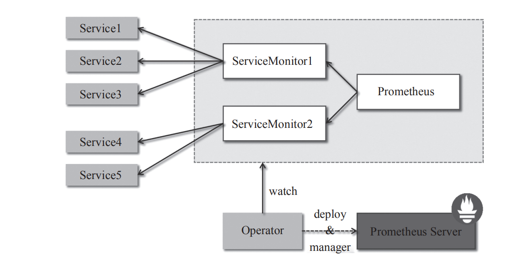

图1　Prometheus Operator架构

 

架构中的各组成部分以不同的资源方式运行在Kubernetes集群中，它们各自有不同的作用。

 

- **Operator：**Operator资源会根据自定义资源（Custom Resource Definition，CRD）来部署和管理Prometheus Server，同时监控这些自定义资源事件的变化来做相应的处理，是整个系统的控制中心。
- **Prometheus：** Prometheus资源是声明性地描述Prometheus部署的期望状态。
- **Prometheus Server：** Operator根据自定义资源Prometheus类型中定义的内容而部署的Prometheus Server集群，这些自定义资源可以看作用来管理Prometheus Server 集群的StatefulSets资源。
- **ServiceMonitor：**ServiceMonitor也是一个自定义资源，它描述了一组被Prometheus监控的target列表。该资源通过标签来选取对应的Service Endpoint，让Prometheus Server通过选取的Service来获取Metrics信息。
- **Service：**Service资源主要用来对应Kubernetes集群中的Metrics Server Pod，提供给ServiceMonitor选取，让Prometheus Server来获取信息。简单说就是Prometheus监控的对象，例如Node Exporter Service、Mysql Exporter Service等。
- **Alertmanager：**Alertmanager也是一个自定义资源类型，由Operator根据资源描述内容来部署Alertmanager集群。

 

**二、在Kubernetes上部署Prometheus的传统方式**

 

本节详细介绍Kubernetes通过YAML文件方式部署Prometheus的过程，即按顺序部署了Prometheus、kube-state-metrics、node-exporter以及Grafana。图2展示了各个组件的调用关系。

 

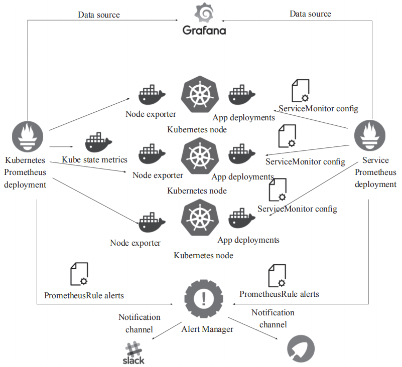

图2　传统方式Kubernetes部署Prometheus

 

在Kubernetes Node上部署Node exporter，获取该节点物理机或者虚拟机的监控信息，在Kubernetes Master上部署kube-state-metrics获取Kubernetes集群的状态。所有信息汇聚到Prometheus进行处理和存储，然后通过Grafana进行展示。

 

1、Kubernetes部署Prometheus 

 

 

 

部署对外可访问Prometheus，首先需要创建Prometheus所在命名空间，然后创建Prometheus使用的RBAC规则，创建Prometheus的configmap来保存配置文件。创建service进行固定集群IP访问，创建deployment部署带有Prometheus容器的pod，最后创建ingress实现外部域名访问Prometheus。

 

部署顺序如图3所示。

 

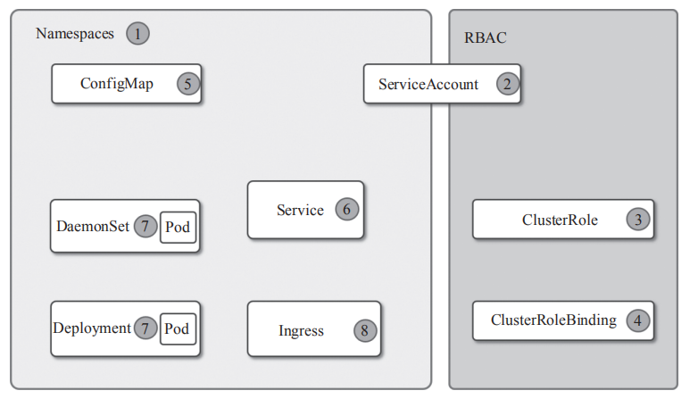

图3　Kubernetes集群架构

 

创建名为monitoring命名空间，相关对象都部署到该命名空间，使用以下命令创建命名空间：

 

 

$ kubectl create -f ns-monitoring.yaml 

 

ns-monitoring.yaml文件内容如下：

 

 

apiVersion: v1

  kind: Namespace

  metadata:

name: monitoring

 

可以看到该YAML文件使用的apiVersion版本是v1，kind是Namespace，命名空间的名字是monitoring。

 

使用以下命令确认名为monitoring的ns已经创建成功：

 

 

$ kubectl get ns monitoring

NAME     STATUS  AGE

monitoring  Active  1d

 

创建RBAC规则，包含ServiceAccount、ClusterRole、ClusterRoleBinding三类YAML文件。Service Account 是面向命名空间的，ClusterRole、ClusterRoleBinding是面向整个集群所有命名空间的，可以看到ClusterRole、ClusterRoleBinding对象并没有指定任何命名空间。ServiceAccount中可以看到，名字是prometheus-k8s，在monitoring命名空间下。ClusterRole一条规则由apiGroups、resources、verbs共同组成。ClusterRoleBinding中subjects是访问API的主体，subjects包含users、groups、service accounts三种类型，我们使用的是ServiceAccount类型，使用以下命令创建RBAC：

 

 

kubectl create -f prometheus-rbac.yaml

 

rometheus-rbac.yaml文件内容如下：

 

 

apiVersion: v1

kind: ServiceAccount

metadata:

  name: prometheus-k8s

  namespace: monitoring

\---

apiVersion: rbac.authorization.k8s.io/v1

kind: ClusterRole

metadata:

 name: prometheus

rules:

\- apiGroups: [""]

  resources: ["nodes", "services", "endpoints", "pods"]

  verbs: ["get", "list", "watch"]

\- apiGroups: [""]

  resources: ["configmaps"]

  verbs: ["get"]

\- nonResourceURLs: ["/metrics"]

  verbs: ["get"]

\---

apiVersion: rbac.authorization.k8s.io/v1

kind: ClusterRoleBinding

metadata:

  name: prometheus

roleRef:

  apiGroup: rbac.authorization.k8s.io

  kind: ClusterRole

  name: cluster-admin

subjects:

\- kind: ServiceAccount

  name: prometheus-k8s

  namespace: monitoring

 

使用以下命令确认RBAC是否创建成功：

 

 

$ kubectl get sa prometheus-k8s -n monitoring

NAME    SECRETS  AGE

prometheus-k8s  1     1d

 

$ kubectl get clusterroleprometheus

NAME   AGE

prometheus  1d

$ kubectl get clusterrolebinding prometheus

NAME   AGE

prometheus  1d

 

使用ConfigMap方式创建Prometheus配置文件，YAML文件中使用的类型是ConfigMap，命名空间为monitoring，名称为prometheus-core，apiVersion是v1，data数据中包含prometheus.yaml文件，内容是prometheus.yaml: |这行下面的内容。使用以下命令创建Prometheus的配置文件：

 

 

$ kubectl create -f prometheus-core-cm.yaml

 

prometheus-core-cm.yaml文件内容如下：

 

 

kind: ConfigMap

metadata:

  creationTimestamp: null

  name: prometheus-core

  namespace: monitoring

apiVersion: v1

data:

  prometheus.yaml: |

​    global:

​      scrape_interval: 15s

​      scrape_timeout: 15s

​      evaluation_interval: 15s

​    alerting:

​      alertmanagers:

​      \- static_configs:

​        \- targets: ["10.254.127.110:9093"]

​    rule_files:

​      \- "/etc/prometheus-rules/*.yml"

​    scrape_configs:

​    \- job_name: 'kubernetes-apiservers'

​      kubernetes_sd_configs:

​      \- role: endpoints

​      scheme: https

​      tls_config:

​        ca_file: /var/run/secrets/kubernetes.io/serviceaccount/ca.crt

​      bearer_token_file: /var/run/secrets/kubernetes.io/serviceaccount/token

​      relabel_configs:

​      \- source_labels: [__meta_kubernetes_namespace, __meta_kubernetes_service_name, __meta_kubernetes_endpoint_port_name]

​        action: keep

​        regex: default;kubernetes;https

 

由于篇幅有限，该配置文件只有一个名为kubernetes-apiservers的job，完整配置请查看源码文件。

 

使用以下命令查看已创建的配置文件prometheus-core：

 

 

$ kubectl get cm -n monitoring prometheus-core

NAME       DATA   AGE

prometheus-core  1     1d

 

通过以下命令查看配置文件prometheus-core的详细信息：

 

 

$ kubectl get cm -n monitoring prometheus-core -o yaml

 

创建prometheus rules配置文件，使用ConfigMap方式创建prometheus rules配置文件，包含的内容是两个文件，分别是node-up.yml和cpu-usage.yml。使用以下命令创建Prometheus的另外两个配置文件：

 

 

$ kubectl create -f prometheus-rules-cm.yaml

 

prometheus-rules-cm.yaml文件内容如下：

 

 

kind: ConfigMap

apiVersion: v1

metadata:

  name: prometheus-rules

  namespace: monitoring

data:

  node-up.yml: |

​    groups:

​    \- name: server_rules

​      rules:

​      \- alert: 机器宕机

​        expr: up{component="node-exporter"} != 1

​        for: 1m

​        labels:

​          severity: "warning"

​          instance: "{{ $labels.instance }}"

​        annotations:

​          summary: "机器 {{ $labels.instance }} 处于down的状态"

​          description: "{{ $labels.instance }} of job {{ $labels.job }} 

​          已经处于down状态超过1分钟，请及时处理"

  cpu-usage.yml: |

​    groups:

​    \- name: cpu_rules

​      rules:

​      \- alert: cpu 剩余量过低

​        expr: 100 - (avg by (instance) (irate(node_cpu_seconds_total{mode=

​          "idle"}[5m])) * 100) > 85

​        for: 1m

​        labels:

​          severity: "warning"

​          instance: "{{ $labels.instance }}"

​        annotations:

​          summary: "机器 {{ $labels.instance }} cpu 已用超过设定值"

​          description: "{{ $labels.instance }} CPU 用量已超过 85% (current 

​                 value is: {{ $value }})，请及时处理。"   

 

本节的配置文件是Prometheus告警信息的配置文件，篇幅有限，可在文件后继续增加告警信息文件。

 

使用以下命令查看已下发的配置文件prometheus-core：

 

 

$ kubectl get cm -n monitoring prometheus-rules

NAME        DATA   AGE

prometheus-rules  11    1d

 

使用以下命令查看配置文件prometheus-core详细信息：

 

 

$ kubectl get cm -n monitoring prometheus-rules -o yaml

 

创建prometheus svc，会生成一个CLUSTER-IP进行集群内部的访问，CLUSTER-IP也可以自己指定。使用以下命令创建Prometheus要用的service：

 

 

$ kubectl create -f prometheus-service.yaml

 

prometheus-service.yaml文件内容如下：

 

 

apiVersion: v1

kind: Service

metadata:

  name: prometheus

  namespace: monitoring

  labels:

​    app: prometheus

​    component: core

  annotations:

​    prometheus.io/scrape: 'true'

spec:

  ports:

​    \- port: 9090

​      targetPort: 9090

​      protocol: TCP

​      name: webui

  selector:

​    app: prometheus

​     component: core

 

使用以下命令查看已创建的名为prometheus的service：

 

 

$ kubectl get svc prometheus -n monitoring

NAME   TYPE   CLUSTER-IP  EXTERNAL-IP PORT(S)  AGE

prometheus  ClusterIP  10.254.192.194  <none>    9090/TCP  1d

 

使用deployment方式创建prometheus实例，命令如下：

 

 

 

$ kubectl create -f prometheus-deploy.yaml

 

prometheus-deploy.yaml文件内容如下：

 

 

apiVersion: extensions/v1beta1

kind: Deployment

metadata:

  name: prometheus-core

  namespace: monitoring

  labels:

​    app: prometheus

​    component: core

spec:

  replicas: 1

  template:

​    metadata:

​      name: prometheus-main

​      labels:

​        app: prometheus

​        component: core

​    spec:

​      serviceAccountName: prometheus-k8s

​      nodeSelector:

​        kubernetes.io/hostname: 192.168.10.2

​      containers:

​      \- name: prometheus

​        image: zqdlove/prometheus:v2.0.0

​        args:

​          \- '--storage.tsdb.retention=15d'

​          \- '--config.file=/etc/prometheus/prometheus.yaml'

​          \- '--storage.tsdb.path=/home/prometheus_data'

​          \- '--web.enable-lifecycle' 

​        ports:

​        \- name: webui

​          containerPort: 9090

​        resources:

​          requests:

​            cpu: 20000m

​            memory: 20000M

​          limits:

​            cpu: 20000m

​            memory: 20000M

​        securityContext:

​          privileged: true

​        volumeMounts:

​        \- name: data

​          mountPath: /home/prometheus_data

​        \- name: config-volume

​          mountPath: /etc/prometheus

​        \- name: rules-volume

​          mountPath: /etc/prometheus-rules

​        \- name: time

​          mountPath: /etc/localtime

​      volumes:

​      \- name: data

​        hostPath:

​          path: /home/cdnadmin/prometheus_data 

​      \- name: config-volume

​        configMap:

​          name: prometheus-core

​      \- name: rules-volume

​        configMap:

​          name: prometheus-rules

​      \- name: time

​        hostPath:

​          path: /etc/localtime

 

使用以下命令查看已创建的名字为prometheus-core的deployment的状态：

 

 

$ kubectl get deployment prometheus-core -n monitoring

NAME   DESIRED CURRENT UP-TO-DATE AVAILABLE AGE

prometheus-core  1     1     1      1      1d

 

返回信息表示部署期望的pod有1个，当前有1个，更新到最新状态的有1个，可用的有1个，pod当前的年龄是1天。

 

创建prometheus ingress实现外部域名访问，使用以下命令创建Ingress：

 

 

$ kubectl create -f prometheus_Ingress.yaml

 

prometheus_Ingress.yaml文件内容如下：

 

 

apiVersion: extensions/v1beta1

kind: Ingress

metadata:

  name: traefik-prometheus

  namespace: monitoring

spec:

  rules:

  \- host: prometheus.test.com

​    http:

​      paths:

​      \- path: /

​        backend:

​          serviceName: prometheus

​          servicePort: 9090

 

将prometheus.test.com域名解析到Ingress服务器，此时可以通过prometheus.test.com访问Prometheus的监控数据的界面了。

 

使用以下命令查看已创建Ingress的状态：

 

 

$ kubectl get ing traefik-prometheus-n monitoring

NAME       HOSTS      ADDRESS  PORTS  AGE

traefik-prometheus  prometheus.test.com80   1d

 

将域名prometheus.test.com指向Ingress服务器，并访问该域名，主界面如图4所示。

 

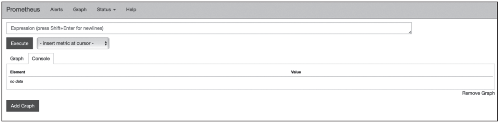

图4　主界面

 

2、Kubernetes部署kube-state-metrics

 

 

 

kube-state-metrics使用名为monitoring的命名空间，在上节已创建，不需要再次创建，通过以下命令确认ns创建是否成功：

 

 

$ kubectl get ns monitoring

NAME     STATUS  AGE

monitoring  Active  1d

 

创建RBAC，包含ServiceAccount、ClusterRole、ClusterRoleBinding三类YAML文件，本节RBAC内容结构和上节中内容类似。使用以下命令创建kube-state-metrics RBAC：

 

 

$ kubectl create -f kube-state-metrics-rbac.yaml

 

kube-state-metrics-rbac.yaml文件内容如下：

 

 

apiVersion: v1

kind: ServiceAccount

metadata:

  name: kube-state-metrics

  namespace: monitoring

\---

apiVersion: rbac.authorization.k8s.io/v1

kind: ClusterRole

metadata:

  name: kube-state-metrics

rules:

\- apiGroups: [""]

  resources: ["nodes","pods","services","resourcequotas",

   "replicationcontrollers","limitranges"]

  verbs: ["list", "watch"]

\- apiGroups: ["extensions"]

  resources: ["daemonsets","deployments","replicasets"]

  verbs: ["list", "watch"]

\- apiGroups: ["batch/v1"]

  resources: ["job"]

  verbs: ["list", "watch"]

\- apiGroups: ["v1"]

  resources: ["persistentvolumeclaim"]

  verbs: ["list", "watch"]

\- apiGroups: ["apps"]

  resources: ["statefulset"]

  verbs: ["list", "watch"]

\- apiGroups: ["batch/v2alpha1"]

  resources: ["cronjob"]

  verbs: ["list", "watch"]

\---

apiVersion: rbac.authorization.k8s.io/v1

kind: ClusterRoleBinding

metadata:

  name: kube-state-metrics

roleRef:

  apiGroup: rbac.authorization.k8s.io

  kind: ClusterRole

  name: kube-state-metrics

\# name: cluster-admin

subjects:

\- kind: ServiceAccount

  name: kube-state-metrics

  namespace: monitoring

 

使用以下命令确认RBAC是否创建成功，命令分别获取已创建的ServiceAccount、ClusterRole、ClusterRoleBinding：

 

 

$ kubectl get sa kube-state-metrics -n monitoring

NAME     SECRETS  AGE

kube-state-metrics  1     1d

$ kubectl get clusterrole kube-state-metrics

NAME      AGE

kube-state-metrics  1d

$ kubectl get clusterrolebinding kube-state-metrics

NAME     AGE

kube-state-metrics  1d

 

使用以下命令创建kube-state-metrics Service：

 

 

$ kubectl create -f kube-state-metrics-service.yaml

 

kube-state-metrics-service.yaml文件内容如下：

 

 

apiVersion: v1

kind: Service

metadata:

  annotations:

​    prometheus.io/scrape: 'true'

  name: kube-state-metrics

  namespace: monitoring

  labels:

​    app: kube-state-metrics

spec:

  ports:

  \- name: kube-state-metrics

​    port: 8080

​    protocol: TCP

  selector:

​    app: kube-state-metrics

 

使用以下命令查看名为kube-state-metrics的Service：

 

 

$ kubectl get svc kube-state-metrics -n monitoring

NAME    TYPE   CLUSTER-IP EXTERNAL-IP PORT(S)  AGE

kube-state-metrics  ClusterIP  10.254.76.203  <none>    8080/TCP  1d

 

使用以下命令创建名为kube-state-metrics的deployment，用来部署kube-state-metrics Docker容器：

 

 

$ kubectl create -f kube-state-metrics-deploy.yaml

 

kube-state-metrics-deploy.yaml文件内容如下：

 

 

apiVersion: extensions/v1beta1

kind: Deployment

metadata:

  name: kube-state-metrics

  namespace: monitoring

spec:

  replicas: 1

  template:

​    metadata:

​      labels:

​        app: kube-state-metrics

​    spec:

​      serviceAccountName: kube-state-metrics

​      nodeSelector:

​        type: k8smaster

​      containers:

​      \- name: kube-state-metrics

​        image: zqdlove/kube-state-metrics:v1.0.1

​        ports:

​        \- containerPort: 8080

 

使用以下命令查看monitoring命名空间下名为kube-state-metrics的deployment的状态信息：

 

 

$ kubectl get deployment kube-state-metrics -n monitoring

NAME   DESIRED  CURRENT UP-TO-DATE AVAILABLE AGE

kube-state-metrics  1     1     1      1      1d

 

使用以下命令查看相关的详细信息：

 

 

$ kubectl get deployment kube-state-metrics -n monitoring -o yaml

$ kubectl describe deployment kube-state-metrics -n monitoring

 

通过上节已部署的Prometheus界面如图5所示。

 

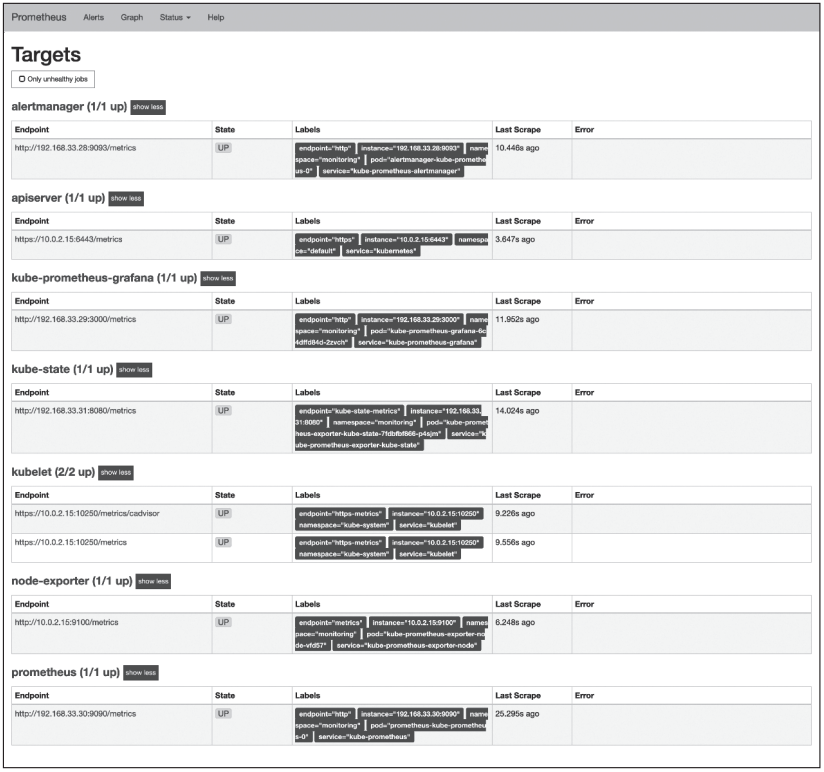

图5　Prometheus监控目标

 

3、Kubernetes部署node-exporter

 

 

 

在Prometheus中负责数据汇报的程序统一称为Exporter，而不同的Exporter负责不同的业务。它们具有统一命名格式，即xx_exporter，例如，负责主机信息收集的node_exporter。本节为安装node_exporter的教程。node_exporter主要用于*NIX系统监控，用Golang编写。

 

node-exporter使用名为monitoring的命名空间，上节已创建，不需要再次创建，通过以下命令确认ns创建是否成功：

 

 

$ kubectl get ns monitoring

NAME     STATUS  AGE

monitoring  Active  1d

 

使用以下命令部署node-exporter service：

 

 

$ kubectl create -f node_exporter-service.yaml

 

node_exporter-service.yaml文件内容如下：

 

 

apiVersion: v1

kind: Service

metadata:

  annotations:

​    prometheus.io/scrape: 'true'

  name: prometheus-node-exporter

  namespace: monitoring

  labels:

​    app: prometheus

​    component: node-exporter

spec:

  clusterIP: None

  ports:

​    \- name: prometheus-node-exporter

​      port: 9100

​      protocol: TCP

  selector:

​    app: prometheus

​    component: node-exporter

  type: ClusterIP

 

使用以下命令查看monitoring命名空间下名为prometheus-node-exporter的service：

 

 

$ kubectl get svc prometheus-node-exporter -n monitoring

NAME       TYPE   CLUSTER-IP  EXTERNAL-IP  PORT(S)  AGE

prometheus-node-exporter  ClusterIP  None     <none>    9100/TCP  1d

 

使用daemonset方式创建node-exporter容器，命令如下：

 

 

$ kubectl create -f node_exporter-daemonset.yaml

 

node_exporter-daemonset.yaml文件详细内容如下：

 

 

apiVersion: extensions/v1beta1

kind: DaemonSet

metadata:

  name: prometheus-node-exporter

  namespace: monitoring

  labels:

​    app: prometheus

​    component: node-exporter

spec:

  template:

​    metadata:

​      name: prometheus-node-exporter

​      labels:

​        app: prometheus

​        component: node-exporter

​    spec:

​      containers:

​      \- image: zqdlove/node-exporter:v0.16.0

​        name: prometheus-node-exporter

​        ports:

​        \- name: prom-node-exp

​          containerPort: 9100

​          hostPort: 9100

​        resources:

​          requests:

​           \# cpu: 20000m

​            cpu: "0.6"

​            memory: 100M

​          limits:

​            cpu: "0.6"

​            \#cpu: 20000m

​            memory: 100M

​        command:

​        \- /bin/node_exporter

​        \- --path.procfs

​        \- /host/proc

​        \- --path.sysfs

​        \- /host/sys

​        \- --collector.filesystem.ignored-mount-points

​        \- ^/(sys|proc|dev|host|etc)($|/)

​        volumeMounts:

​        \- name: proc

​          mountPath: /host/proc

​        \- name: sys

​          mountPath: /host/sys

​        \- name: root

​          mountPath: /rootfs

​      volumes:

​      \- name: proc

​        hostPath:

​          path: /proc

​      \- name: sys

​        hostPath:

​          path: /sys

​      \- name: root

​        hostPath:

​          path: /

​      // 此处可以指定固定IP 192.168.10.3不部署服务

​      // affinity:

​      // nodeAffinity:

​      // requiredDuringSchedulingIgnoredDuringExecution:

​      //   nodeSelectorTerms:

​      //   - matchExpressions:

​      //     - key: kubernetes.io/hostname

​      //      operator: NotIn

​      //      values:

​      //      - 192.168.10.3

 

​      hostNetwork: true

​      hostPID: true

 

查看monitoring命令空间下名为prometheus-node-exporter的daemonset的状态，命令如下：

 

 

$ kubectl get ds prometheus-node-exporter -n monitoring

NAME DESIRED CURRENT READYUP-TO-DATE AVAILABLENODE SELECTOR AGE

prometheus-node-exporter  3  3  333<none>1d

 

从返回信息可以看到，名为prometheus-node-exporter的daemonset，当前有3个实例，都已经是Ready状态，都可用。

 

查看monitoring命令空间下名为prometheus-node-exporter的daemonset的详细状态信息，命令如下：

 

 

$ kubectl get ds prometheus-node-exporter -n monitoring -o yaml

$ kubectl describe ds prometheus-node-exporter -n monitoring

 

4、Kubernetes部署Grafana

 

 

 

Grafana使用名为monitoring的命名空间，前面小节已经创建，不需要再次创建，通过以下命令确认ns创建是否成功：

 

 

$ kubectl get ns monitoring

NAME     STATUS  AGE

monitoring  Active  1d

 

使用以下命令创建Grafana Service：

 

 

$ kubectl create -f grafana-service.yaml

 

grafana-service.yaml文件内容如下：

 

 

apiVersion: v1

kind: Service

metadata:

  name: grafana

  namespace: monitoring

  labels:

​    app: grafana

​    component: core

spec:

  ports:

​    \- port: 3000

  selector:

​    app: grafana

​     component: core

 

使用以下命令查看monitoring命令空间下名为grafana的service的信息：

 

 

$ kubectl get svc grafana -n monitoring

NAME   TYPE    CLUSTER-IP   EXTERNAL-IP  PORT(S)  AGE

grafana  ClusterIP  10.254.254.2  <none>    4444/TCP  1d

 

使用deployment方式部署Grafana，命令如下：

 

 

$ kubectl create -f grafana-deploy.yaml

 

grafana-deploy.yaml文件内容如下：

 

 

apiVersion: extensions/v1beta1

kind: Deployment

metadata:

  name: grafana-core

  namespace: monitoring

  labels:

​    app: grafana

​    component: core

spec:

  replicas: 1

  template:

​    metadata:

​      labels:

​        app: grafana

​        component: core

​    spec:

​      nodeSelector:

​        kubernetes.io/hostname: 192.168.10.2

​      containers:

​      \- image: zqdlove/grafana:v5.0.0

​        name: grafana-core

​        imagePullPolicy: IfNotPresent

​        \#securityContext:

​         \# privileged: true

​        \# env:

​        resources:

​          \# keep request = limit to keep this container in guaranteed class

​          limits:

​            cpu: 10000m

​            memory: 32000Mi

​          requests:

​            cpu: 10000m

​            memory: 32000Mi

​        env:

​          \# The following env variables set up basic auth twith the 

​           default admin user and admin password

​          \- name: GF_AUTH_BASIC_ENABLED

​            value: "true"

​          \- name: GF_AUTH_ANONYMOUS_ENABLED

​            value: "false"

​          \# - name: GF_AUTH_ANONYMOUS_ORG_ROLE

​          \#  value: Admin

​          \# does not really work, because of template variables in exported 

​           dashboards:

​          \# - name: GF_DASHBOARDS_JSON_ENABLED

​          \#  value: "true"

​        readinessProbe:

​          httpGet:

​            path: /login

​            port: 3000

​          \# initialDelaySeconds: 30

​          \# timeoutSeconds: 1

​        volumeMounts:

​        \- name: grafana-persistent-storage

​          mountPath: /var

​        \- name: grafana

​          mountPath: /etc/grafana

​    \# - name: grafana-ldap-grafana

​    \#  mountPath: /etc/grafana

​    \# - name: grafana-ldap-conf

​    \#  mountPath: /usr/share/grafana/conf

​      volumes:

​      \- name: grafana-persistent-storage

​        emptyDir: {}

​      \- name: grafana

​        hostPath:

​          path: /etc/grafana

​     \# - name: grafana-ldap-grafana

​      \# configMap:

​       \#  name: grafana-ldap-grafana-configmap

   \# - name: grafana-ldap-conf

   \#  configMap:

   \#   name: grafana-ldap-conf-configmap

 

查看monitoring命令空间下名为grafana-core的deployment的状态，信息如下：

 

 

$ kubectl get deployment grafana-core -n monitoring

NAME     DESIRED CURRENT UP-TO-DATE   AVAILABLE  AGE

grafana-core  1     1     1      1      1d

 

要查看monitoring命令空间下名为grafana-core的deployment的详细信息，使用以下命令：

 

 

$ kubectl get deployment grafana-core -n monitoring -o yaml

$ kubectl describe deployment grafana-core -n monitoring

 

创建grafana ingress实现外部域名访问，命令如下：

 

 

$ kubectl create -f grafana-ingress.yaml

 

grafana-ingress.yaml文件内容如下：

 

 

apiVersion: extensions/v1beta1

kind: Ingress

metadata:

  name: traefik-grafana

  namespace: monitoring

spec:

  rules:

  \- host: grafana.test.com

​    http:

​      paths:

​      \- path: /

​        backend:

​          serviceName: grafana

​          servicePort: 4444

 

查看monitoring命名空间下名为traefik-grafana的Ingress，使用以下命令：

 

 

$ kubectl get ingress traefik-grafana -n monitoring

NAME     HOSTS       ADDRESS  PORTS   AGE

traefik-grafana  grafana.test.com     80    1d

 

查看monitoring命名空间下名为traefik-grafana的Ingress的详细信息，使用以下命令：

 

 

$ kubectl get ingress traefik-grafana -n monitoring -o yaml

 

将grafana.test.com解析到Ingress服务器，此时可以通过grafana.test.com访问Grafana的监控展示的界面。

 

**三、通过Operator方式部署Prometheus**

 

传统方式部署步骤相对复杂，随着Operator的日益成熟，推荐使用Operator方式部署Prometheus。通过Operator方式部署Prometheus，可将更多的操作集成到Operator中，简化了操作过程，也使部署更加简单。本节详细介绍在Kubernetes中使用Operator方式部署整套Prometheus监控。

 

1、Kubernetes基础环境

 

 

 

部署Prometheus依赖的基础环境如下：

 

- Kubernetes版本为1.14.0。
- helm版本为v2.13.1。
- 按需要安装coreDNS、Nginx。

 

本节使用Helm安装。Helm chart根据实际使用修改。

 

2、安装Prometheus Operator

 

 

 

使用git下载prometheus-operator源码，并进入到源码目录，如下所示：

 

 

git clone https:// github.com/coreos/prometheus-operator.git

cd prometheus-operator

 

使用git将软件切换到v0.29.0版本，并进入到helm目录：

 

 

git checkout -b v0.29.0 v0.29.0

cd helm

 

使用helm在名为monitoring的命名空间下安装prometheus-operator，命令如下：

 

 

helm install prometheus-operator --name prometheus-operator --namespace monitoring

 

使用helm命令查看安装结果，命令如下：

 

 

$ helm ls prometheus-operator

NAME REVISION   UPDATE DSTATUS CHART APP VERSION  NAMESPACE

prometheus-operator 1 Thu Apr 11 10:30:11 2019DEPLOYED  prometheus-operator-0.0.29 0.20.0monitoring

 

3、部署kube-prometheus

 

 

 

创建kube-prometheus/charts目录，使用如下命令：

 

 

mkdir -p kube-prometheus/charts

 

使用Helm打包kube-prometheus所依赖的chart包，命令如下：

 

 

helm package -d kube-prometheus/charts alertmanager grafana prometheus exporter-kube-

dns exporter-kube-scheduler exporter-kubelets exporter-node exporter-kube-controller-

manager exporter-kube-etcd exporter-kube-state exporter-coredns exporter-kubernetes

 

使用Helm在名为monitoring的命名空间下安装kube-prometheus，具体命令如下：

 

 

helm install kube-prometheus --name kube-prometheus --namespace monitoring

 

使用以下命令查看安装结果：

 

 

$ helm ls kube-prometheus

NAME REVISION UPDATED STATUSCHART APP VERSION   NAMESPACE

kube-prometheus 1 Thu Apr 11 11:55:44 2019 DEPLOYED kube-prometheus-0.0.105 monitoring

 

**四、服务配置**

 

本节主要介绍Prometheus的静态配置和服务发现配置，以及静态配置和动态服务发现配置的用法。

 

1、静态配置

 

 

 

静态配置是Prometheus中简单的配置，指定获取指标的地址，并分配所获取指标的标签。Prometheus最简单的配置是静态目标，如下配置文件：

 

 

scrape_configs:

  \- job_name: 'prometheus'

​    static_configs:

​      \- targets: ['localhost:9090', 'localhost:9100']

​        labels:

​          group: 'prometheus'

 

scrape_configs表示定义收集规则，指定了：localhost:9090和localhost:9100作为获取信息的地址，并给获取的信息打上了group=prometheus的标签。

 

2、服务发现配置

 

 

 

Prometheus支持多种服务发现机制：文件、DNS、Consul、Kubernetes、OpenStack、EC2等。基于服务发现的过程并不复杂，通过第三方提供的接口，Prometheus查询到需要监控的Target列表，然后轮训这些Target获取监控数据，下面主要介绍Kubernetes服务发现机制。

 

目前，在Kubernetes下，Prometheus通过与Kubernetes API集成主要支持5种服务发现模式：Node、Service、Pod、Endpoints、Ingress。不同的服务发现模式适用于不同的场景，例如：node适用于与主机相关的监控资源，如节点中运行的Kubernetes组件状态、节点上运行的容器状态等；service和igress适用于通过黑盒监控的场景，如对服务的可用性以及服务质量的监控；endpoints和pod均可用于获取Pod实例的监控数据，如监控用户或者管理员部署的支持Prometheus的应用。

 

以下配置文件指定了间歇时间是30s，超时间是10s，从目标获取数据的http路径是

/metrics，使用http协议。kubernetes服务发现配置列表中指定了服务发现模式为endpoints，命名空间为monitoring。relabel_configs允许在抓取之前对任何目标及其标签进行修改：

 

 

scrape_configs:

\- job_name: monitoring/kube-prometheus/0

  scrape_interval: 30s

  scrape_timeout: 10s

  metrics_path: /metrics

  scheme: http

  kubernetes_sd_configs:

  \- api_server: null

​    role: endpoints

​    namespaces:

​      names:

​      \- monitoring

  relabel_configs:

  \- source_labels: [__meta_kubernetes_service_label_app]

​    separator: ;

​    regex: prometheus

​    replacement: $1

​    action: keep

  \- source_labels: [__meta_kubernetes_service_label_chart]

​    separator: ;

​    regex: prometheus-0.0.51

​    replacement: $1

​    action: keep

  \- source_labels: [__meta_kubernetes_service_label_prometheus]

​    separator: ;

​    regex: kube-prometheus

​    replacement: $1

​    action: keep

  \- source_labels: [__meta_kubernetes_endpoint_port_name]

​    separator: ;

​    regex: http

​    replacement: $1

​    action: keep

  \- source_labels: [__meta_kubernetes_namespace]

​    separator: ;

​    regex: (.*)

​    target_label: namespace

​    replacement: $1

​    action: replace

  \- source_labels: [__meta_kubernetes_pod_name]

​    separator: ;

​    regex: (.*)

​    target_label: pod

​    replacement: $1

​    action: replace

  \- source_labels: [__meta_kubernetes_service_name]

​    separator: ;

​    regex: (.*)

​    target_label: service

​    replacement: $1

​    action: replace

  \- source_labels: [__meta_kubernetes_service_name]

​    separator: ;

​    regex: (.*)

​    target_label: job

​    replacement: ${1}

​    action: replace

  \- source_labels: [__meta_kubernetes_service_label_app]

​    separator: ;

​    regex: (.+)

​    target_label: job

​    replacement: ${1}

​    action: replace

  \- separator: ;

​    regex: (.*)

​    target_label: endpoint

​    replacement: http

​    action: replace

 

以上配置文件对应Prometheus服务发现界面中monitoring/kube-prometheus/0，如图6所示。

 

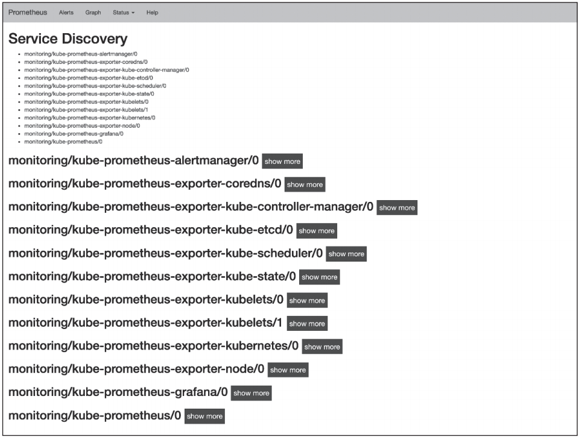

图6　Prometheus服务发现

 

**五、监控对象**

 

Prometheus可以监控Kubernetes非常多的对象，本节主要介绍Docker容器、kube-apiserver、kube-state-metrics以及主机等几个方面。完整的Targets可以通过Prometheus界面查看，如图7所示。

 

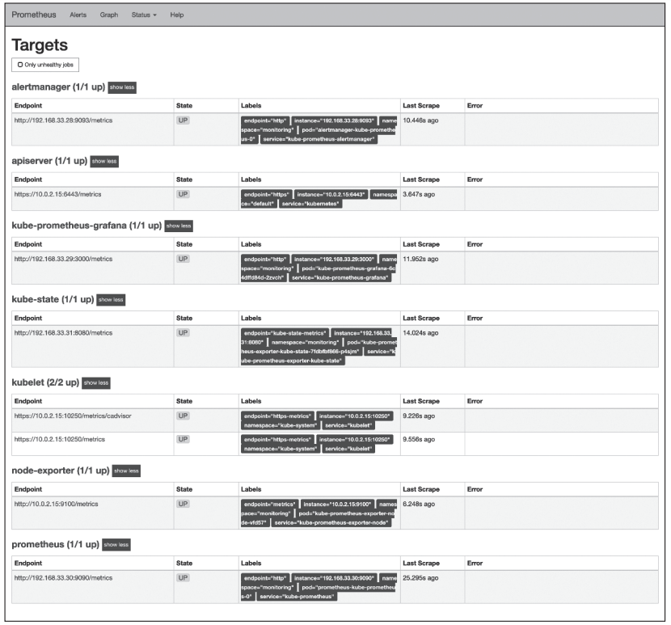

图7　Prometheus监控Kubernetes环境服务

 

1、容器监控

 

 

 

Kubernetes直接在Kubelet组件中集成了cAdvisor，cAdvisor会自动采集当前节点上容器CPU、内存、文件系统，网络等资源的使用情况。以下是Prometheus配置中容器监控的部分代码：

 

 

\- job_name: monitoring/kube-prometheus-exporter-kubelets/1

  honor_labels: true

  scrape_interval: 30s

  scrape_timeout: 10s

  metrics_path: /metrics/cadvisor

  scheme: https

  kubernetes_sd_configs:

  \- api_server: null

​    role: endpoints

​    namespaces:

​      names:

​      \- kube-system

  bearer_token_file: /var/run/secrets/kubernetes.io/serviceaccount/token

  tls_config:

​    ca_file: /var/run/secrets/kubernetes.io/serviceaccount/ca.crt

​    insecure_skip_verify: true

  relabel_configs:

  \- source_labels: [__meta_kubernetes_service_label_k8s_app]

​    separator: ;

​    regex: kubelet

​    replacement: $1

​    action: keep

  \- separator: ;

​    regex: (.*)

​    target_label: endpoint

​    replacement: https-metrics

​    action: replace

 

以上配置文件指定了间歇时间为30s，超时间为10s，从目标获取数据的http路径是

/metrics/cadvisor，使用https协议，指定了服务发现模式为endpoints，命名空间为kube-system，指定了token file和tls ca file。relabel_configs允许在抓取之前对任何目标及其标签进行修改，指定了source_labels为__meta_kubernetes_service_label_k8s_app。

 

2、kube-apiserver监控

 

 

 

apiserver的监控主要是kube-apiserver，配置文件与容器监控类似。Prometheus配置中关联job的部分配置文件如下：

 

 

\- job_name: monitoring/kube-prometheus-exporter-kubernetes/0

  scrape_interval: 15s

  scrape_timeout: 10s

  metrics_path: /metrics

  scheme: https

  kubernetes_sd_configs:

  \- api_server: null

​    role: endpoints

​    namespaces:

​      names:

​      \- default

  bearer_token_file: /var/run/secrets/kubernetes.io/serviceaccount/token

  tls_config:

​    ca_file: /var/run/secrets/kubernetes.io/serviceaccount/ca.crt

​    insecure_skip_verify: true

  relabel_configs:

  \- source_labels: [__meta_kubernetes_service_label_component]

​    separator: ;

​    regex: apiserver

​    replacement: $1

​    action: keep

  \- source_labels: [__meta_kubernetes_endpoint_port_name]

​    separator: ;

​    regex: https

​    replacement: $1

​    action: keep

  \- separator: ;

​    regex: (.*)

​    target_label: endpoint

​    replacement: https

​    action: replace

 

3、kube-state-metrics监控

 

 

 

kube-state-metrics关注于获取Kubernetes中各种资源的最新状态，如deployment或者daemonset。prometheus中关联kube-state-metrics的部分配置文件内容如下：

 

 

\- job_name: monitoring/kube-prometheus-exporter-kube-state/0

  honor_labels: true

  scrape_interval: 15s

  scrape_timeout: 10s

  metrics_path: /metrics

  scheme: http

  kubernetes_sd_configs:

  \- api_server: null

​    role: endpoints

​    namespaces:

​      names:

​      \- monitoring

  relabel_configs:

  \- source_labels: [__meta_kubernetes_service_label_app]

​    separator: ;

​    regex: exporter-kube-state

​    replacement: $1

​    action: keep

  \- source_labels: [__meta_kubernetes_service_label_component]

​    separator: ;

​    regex: kube-state

​    replacement: $1

​    action: keep

  \- separator: ;

​    regex: (.*)

​    target_label: endpoint

​    replacement: kube-state-metrics

​    action: replace

 

4、主机监控

 

 

 

主机监控是通过node-exporter组件来获取操作系统层面信息的，关联配置文件如下：

 

 

\- job_name: monitoring/kube-prometheus-exporter-node/0

  scrape_interval: 15s

  scrape_timeout: 10s

  metrics_path: /metrics

  scheme: http

  kubernetes_sd_configs:

  \- api_server: null

​    role: endpoints

​    namespaces:

​      names:

​      \- monitoring

  relabel_configs:

  \- source_labels: [__meta_kubernetes_service_label_app]

​    separator: ;

​    regex: exporter-node

​    replacement: $1

​    action: keep

  \- separator: ;

​    regex: (.*)

​    target_label: endpoint

​    replacement: metrics

​    action: replace

 

**六、数据展现**

 

随着业务越来越复杂，对软件系统的要求也越来越高，这意味着我们需要随时掌控系统的运行情况。因此，对系统的实时监控以及可视化展示，就成了基础架构的必须能力。Grafana是一个跨平台开源的度量分析和可视化工具，可以将采集的数据查询可视化地展示，并及时通知。

 

前面小节讨论监控数据的收集和部分处理，本节会使用已收集并处理的数据，通过Grafana展示到Web界面。主要包括在Kubernetes中部署、配置和使用Grafana。

 

1、在Kubernetes集群中安装Grafana

 

 

 

使用helm在名为monitoring的命名空间下安装Grafana。命令如下：

 

 

helm install --name grafana grafana/ --namespace monitoring

 

使用以下命令查看安装结果：

 

 

$ helm ls grafana

NAME REVISION UPDATEDSTATUS CHART   APP VERSION NAMESPACE

grafana  1 Thu Apr 11 11:00:52 2019  DEPLOYED  grafana-0.0.37     monitoring

 

把服务alertmanager、grafana-grafana、kube-prometheus的类型改为NodePort。使用如下命令获取service的信息：

 

 

$kubectl get svc--namespace monitoring

 

使用如下命令编辑修改alertmanager、grafana-grafana、kube-prometheus的service，将服务类型修改为NodePort：

 

 

$kubectl edit svcalertmanager--namespace monitoring

$kubectl edit svcgrafana-grafana--namespace monitoring

$kubectl edit svckube-prometheus--namespace monitoring

 

2、配置Grafana

 

 

 

安装完成后可以打开Grafana界面，通过如下命令获取开放的端口号：

 

 

$ kubectl get svc grafana-grafana -n monitoring

NAME       TYPE    CLUSTER-IP   EXTERNAL-IP  PORT(S)    AGE

grafana-grafana  NodePort  10.96.120.206  <none>    80:30747/TCP  26d

 

打开http://192.168.99.101:30747配置界面，点击添加数据源。填写Prometheus数据源名称类型以及HTTP URL，保存并测试。测试通过后，添加或导入所需模板。点击主界面Create--->import，上传或粘贴所需JSON文件，点击Load。Grafana官方模板下载地址为：

 

 

https://grafana.com/dashboards

 

Grafana有许多可以使用的插件，参见官网：

 

 

https://grafana.com/plugins?utm_source=grafana_plugin_list

 

3、集成Grafana展示数据

 

 

 

根据前几节的安装配置，可以自由配置展示监控内容。在Grafana界面可以查看所有已存在的仪表盘模板列表、已部署的pod、deployment、statefulset，如图8至图10所示。

 

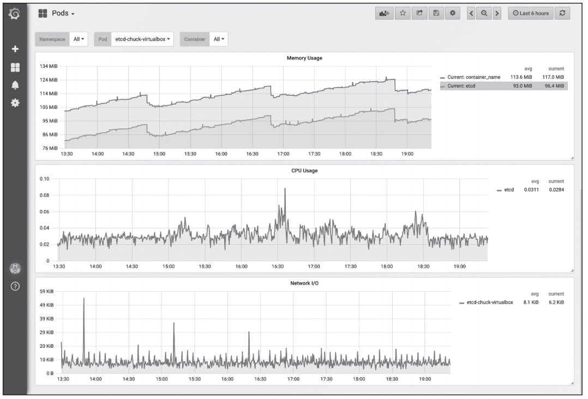

图8　Grafana中显示单pod状态信息

 

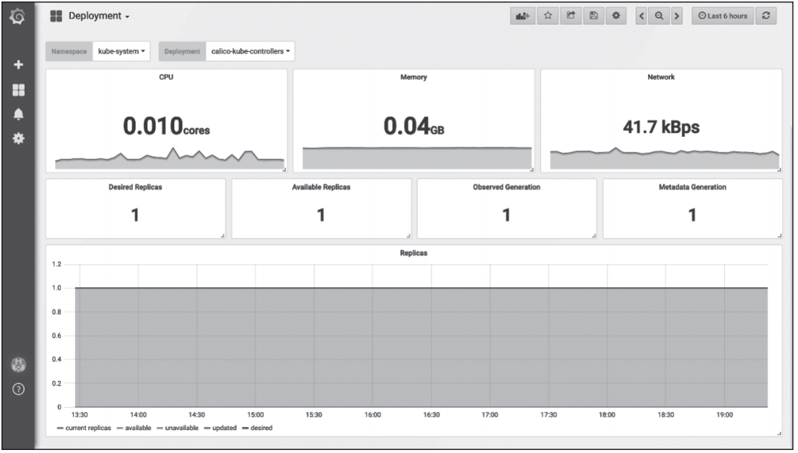

图9　Grafana中显示Deployment类型pod状态信息

 

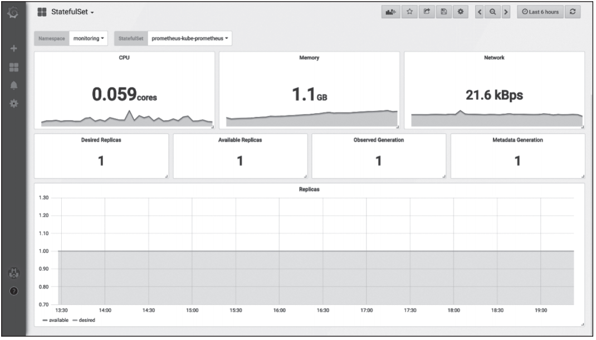

图10　Grafana中显示StatefulSet类型pod状态信息

 

导入主机信息模板，该模板使用Node-exporter获取的数据，展示如图11所示。

 

**七、告警**

 

随着业务复杂性的增加，告警系统越来越重要，及时有效的告警可以在故障到来之前，提前预知风险，提前处理问题，将不良影响最小化。

 

使用Prometheus进行告警分为两部分。Prometheus服务器中的警报规则会向Alertmanager发送警报。然后，Alertmanager管理这些警报，包括静音、禁止、聚合，以及通过电子邮件、PagerDuty和HipChat等方法发送通知。

 

设置告警和通知的主要步骤如下：

 

- 设置并配置Alertmanager。
- 配置Prometheus与Alertmanager协同信息。
- 在Prometheus中创建告警规则。

 

1、安装Alertmanager

 

 

 

使用helm在名为monitoring的命名空间下安装Alertmanager，命令如下：

 

 

helm install --name alertmanager alertmanager/ --namespace monitoring

 

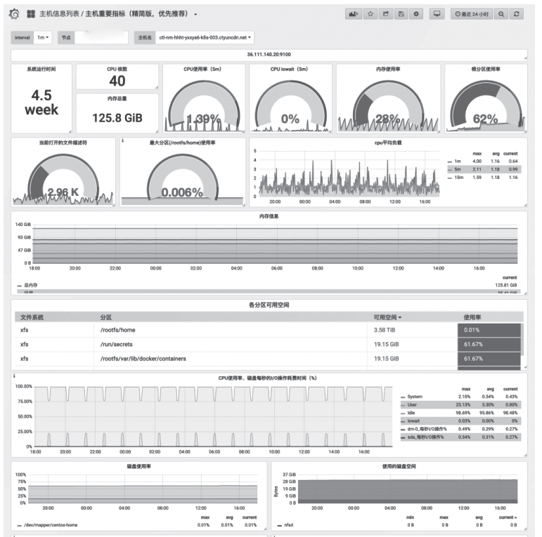

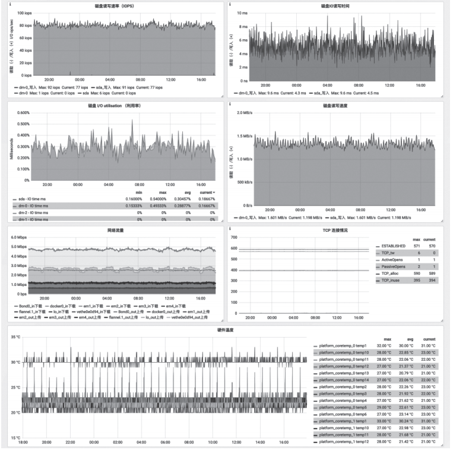

图11　Grafana中显示pod状态信息

 

使用以下命令查看安装结果：

 

 

$ helm ls alertmanager

NAME REVISION UPDATED STATUS CHART APP VERSION NAMESPACE

Alertmanager 1 Thu Apr 11 11:00:34 2019 DEPLOYED alertmanager-0.1.70.15.1  monitoring

 

Prometheus与Alertmanager关联配置文件信息如下：

 

 

alerting:

  alert_relabel_configs:

  \- separator: ;

​    regex: prometheus_replica

​    replacement: $1

​    action: labeldrop

  alertmanagers:

  \- kubernetes_sd_configs:

​    \- api_server: null

​      role: endpoints

​      namespaces:

​        names:

​        \- monitoring

​    scheme: http

​    path_prefix: /

​    timeout: 10s

​    relabel_configs:

​    \- source_labels: [__meta_kubernetes_service_name]

​      separator: ;

​      regex: kube-prometheus-alertmanager

​      replacement: $1

​      action: keep

​    \- source_labels: [__meta_kubernetes_endpoint_port_name]

​      separator: ;

​      regex: http

​      replacement: $1

​      action: keep

 

2、告警规则

 

 

 

在Prometheus全局配置文件中，通过rule_files指定一组告警规则文件的访问路径，配置文件如下：

 

 

rule_files:

\- /etc/prometheus/rules/*.yaml

 

默认部署中包含alertmanager.rules、kube-scheduler.rules、general.rules等rules。本节不做详细介绍。

 

3、微信告警

 

 

 

在某些情况下除了Alertmanager已经内置的集中告警通知方式以外，对于不同的用户和组织而言还需要一些自定义的告知方式。通过Alertmanager提供的webhook支持可以轻松实现这一类的扩展。

 

首先需要申请微信企业号，申请地址为：

 

 

https://work.weixin.qq.com/

 

在Alertmanager配置文件中，加入微信配置信息即可：

 

 

global:

  resolve_timeout: 2m

  wechat_api_url: 'https:// qyapi.weixin.qq.com/cgi-bin/'

  wechat_api_secret: 'xxx'

  wechat_api_corp_id: 'xxx'

 

route:

  group_by: ['alertname']

  group_wait: 10s

  group_interval: 10s

  repeat_interval: 1h

  receiver: 'wechat'

receivers:

\- name: 'wechat'

  wechat_configs:

  \- send_resolved: true

​    to_party: '1'

​    agent_id: '1000002'

 

**八、小结**

 

Kubernetes与Prometheus有着十分相似的历程，均是源自Google内部多年的运维经验，并且相继从CNCF基金会正式毕业。它们分别代表了云原生模式下容器编排以及监控的事实标准。

 时

本文首先介绍了Kubernetes的监控的基本原理，以及两种基于Kubernetes安装Prometheus的实际方案。然后介绍了服务发现和监控对象是如何配置。最后通过Grafana可视化展示监控界面和Alertmanager告警处理。

 

**>>>>**

 

**更多阅读材料**

 

- https://github.com/coreos/prometheus-operator/blob/master/Documentation/user-guides /cluster-monitoring.md.
- 闫健勇，等. Kubernetes权威指南：企业级容器云实战［M］.北京：电子工业出版社，2018.
- https://github.com/coreos/prometheus-operator.