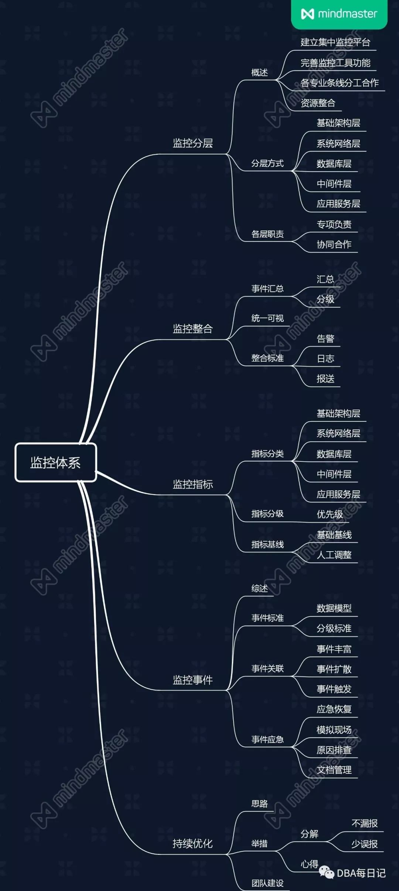
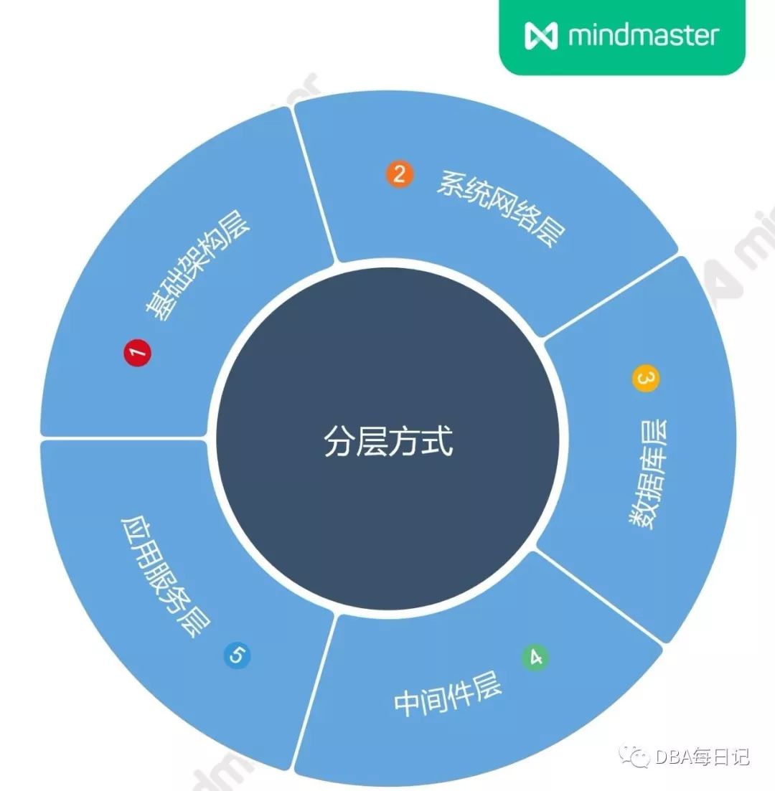
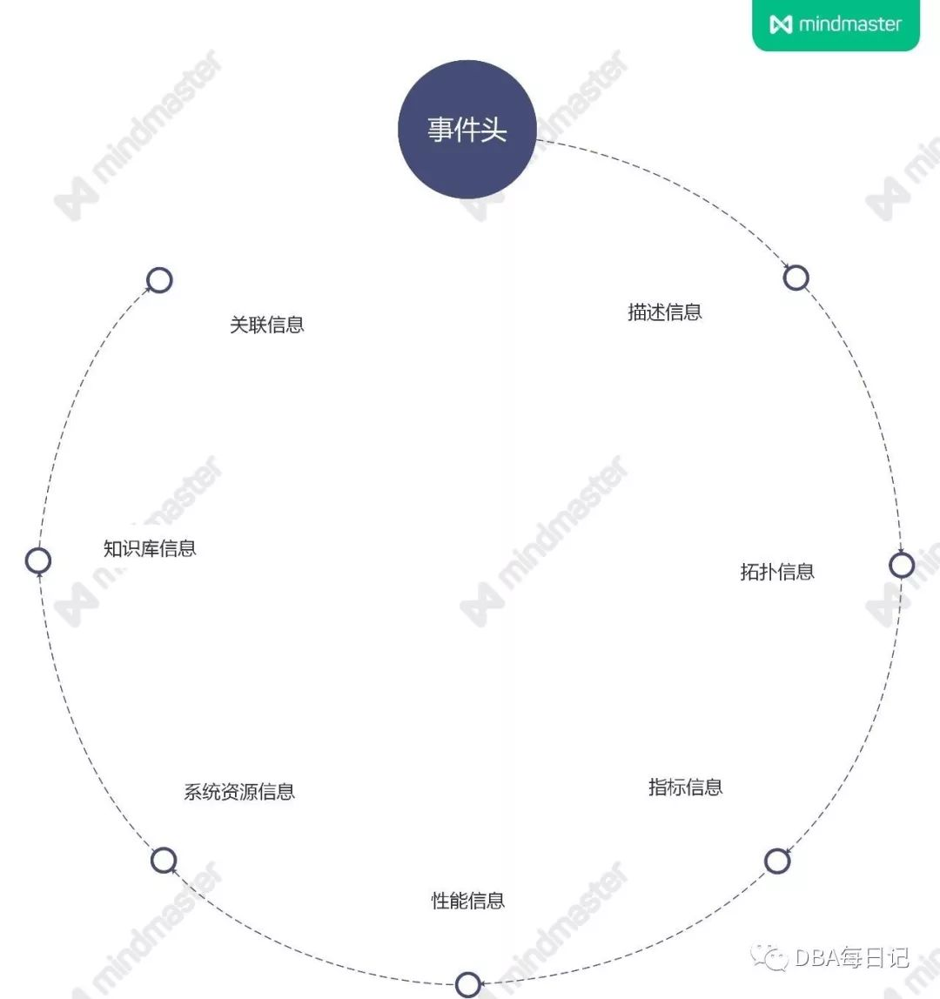

## 金融行业IT运维监控体系的建设内幕

孙慷 2020-02-18 10:41:48

**作者介绍**

**孙慷，**现任某公司系统架构部资深DBA，负责行业核心业务系统运营维护，主要涉及Oracle、MySQL等数据库管理、IT运维管理工作。对数据库多业务场景性能优化有着丰富的实践经验，专注于数据库性能优化、IT运维自动化工作。

 

此文基于笔者前东家（某金融行业龙头）的IT运维体系建设及自身经验积累铺展开来，解读IT运维监控体系建设内幕。

 

IT运维体系的架构中，IT运维监控是IT运维体系中重要的组成部分，作为运维的生命线，安全生产保障的生命线仍需强调。运维的安全生产保障，主要以“监、管、控”为核心，其中“监”则主要指的是监控。

 

笔者在工作过程中积累的监控体系建设知识进行总结，梳理成体系，思维导图如下：

 

 

**一、监控体系分层**

 

1、概述

 

 

 

多年运维经验的积累，往往己沉淀下来不少监控工具，同时也有不同专业线条的工具，在基础架构、系统网络、数据库、中间件、应用层面等采用不同的监控工具。对于这些工具，通常采用以下方式处理：

 

1）建立集中监控平台：在一体化运维体系中，监控平台贯穿所有环节，可以对生产系统涉及的各种环境的实时运行状况监控，监控平台事件驱动的特性也为一体化运维体系起到驱动的作用。为了提高投入效率，减少重复投入，建立集中监控平台实现统一展示、统一管理是迫切需要的，集中监控也能够同时实现两地三中心建设，具备灵活的扩展性，支持运维数据分析等功能；

 

2）完善监控工具功能：当前并没有哪一个监控工具可以覆盖所有生产系统的运行指标，不同的专业线条需要不同的监控工具，因此需要不断完善沉淀监控工具。另外监控平台从WEB、APP、到DB均采用了多中心双活分布式架构部署，但为了保证监控覆盖能力，部份重要的环节仍建议不仅限一套监控工具。

 

3）各专业条线对各条线的监控负责：术业有专攻，各专业条线是最清楚自己需要监控哪些指标的团队，各专业条线对监控覆盖率、监控准确率负责，监控平台的建设方负责平台体系的建设，提供基础技术支撑。

 

4）资源整合：不同的专业条线、不同的分析技术可以有不同的监控工具，采用这种多点开花的建设方式更有助于监控面与深度的完善，所有的工具最终需要进行标准化的整合。

 

基于上面4个处理思路，明确主要的建设目标、减少重复建设，需要对监控工具进行体系化管理，体系化管理首先要做的就是进行监控体系分层。

 

2、分层方式

 

 

 

不同的监控体系有不同的分层体系，以专业条线方式分层方式如下：

 

 

1）基础架构层：包括运营商网络专线、机房（机房内的设施，比如制冷、安防等），基础设施层的监控分为状态、性能、质量、容量、架构等几个层面。

 

2）系统网络层：包括系统服务器、存储、网络设备等服务器的可用性状态。

 

3）数据库层：主要是指数据库的使用情况。

 

4）中间件层：主要针对中间件的使用情况。

 

5）应用服务：主要是针对应用服务可用性、应用营业状态、应用性能几方面。

 

3、各层职责

 

 

 

1）基础架构层

 

- 状态监控包括机房供电、空调等软硬件状态，如设备状态等；
- 性能监控包括设备的性能情况等；
- 容量监控包括设备负载使用率、专线带宽使用率、出口流量分布等；

 

由于基础设施硬件往往己有设备健康性的检测机制，建议向这类厂商提要求，将设备的运行事件主动送到监控平台整合。

 

2）系统网络层

 

- 存储：包括存储设备，以及设备上的硬盘读写错误、读写超时、硬盘掉线、硬盘介质错误
- 网络监控包括设备错包、丢包率，针对网络设备以及网络链路的探测延时、丢包率监控等；
- 服务器上的内存（内存缺失、内存配置错误、内存不可用、内存校验）、网卡（网卡速率；电源：电源电压、电源模块是否失效）、风扇、Raid卡
- 虚拟机
- 容器：Docker等

 

存储、物理设备、虚拟机等参考基础设施层由厂商主动汇总事件到监控平台。

 

3）数据库中间件层

 

主要包括中间件、数据库，以及其它开源分布式中间件等工具，这方面包括很多，以数据库为例，包括：CPU（CPU整体使用率、CPU各核使用率、CPU 负载）、内存（应用内存、整体内存、Swap等）、磁盘IO（读写速率、IOPS、平均等待延时、平均服务延时等）、连接等。

 

这一层的工具能够采用成熟工具或自研的方式，可选的空间比较大，建设过程中，中间件与数据库两块是值得让DBA、中间件管理员深度挖掘监控指标覆盖面。

 

4）应用服务层

 

- 服务可用性监控：如服务、端口是否存在，是否假死等
- 应用性能：应用处理能力，比如交易量、成功率、失败率、响应率、耗时

 

**二、监控整合**

 

监控的分层方式促进了每一个专业层的监控覆盖面与深度，防止建设失控。

 

在监控整合上，主要从事件汇总、统一可视、监控数据汇总三方面进行梳理。

 

1、事件汇总

 

 

 

监控应该尽可能简单地把需要人介入或关注的信息展示给运维团队，能通过自动化自愈解决、分析定位过程则不在一级视图提供。

 

第一部分监控分层中提到，完善监控工具，这些工具在运营过程中每天都会产生大量事件，为了实现监控集中展示，集中管理，需要建设一个事件汇总的模块实现事件统一汇总，并对不同层面、不同专业角度的事件进行关联分析，更全面的感知系统运行状况。

 

- 从可视化角度看，不同的工具有不同的监控事件展示界面，多个运维视图增加了运维技能要求，需要更多的人力去管理生产；
- 缺少对各类事件进行汇总与数据分析，无法反映生产系统整体的运行状况，如能将这些事件数据汇总起来，则可以直观地管控应用状况； 
- 同一个生产问题往往会带来多个维度的生产运行问题，如果监控指标足够丰富往往会有上百条以上，不能准确、快速定位问题根源。
- 每天能触发阀值的告警很多，以经验的方式很难让一线监控团队无时无刻能准确的定位哪些是高优先级的告警，比如磁盘空间到了70%的确需要有人去关注，评估是否进行数据清理、扩容，但这类告警属于低优先级的事件。

 

事件汇总模块需要有几个基本要求：

 

事件汇总：汇总不同层次、不同专业条线、不同类型事件是监控集中管理的基础。

 

事件收敛：前面提到同一个故障会触发多类指标的告警，同一个指标在故障未解除前也会重复产生大量的告警事件，如果将全部事件都展示出来，那对于监控处理人员将是灾难性的，所以需要进行事件收敛。

 

事件分级：对于不同的事件需要有适当层次的事件分级，事件升级的策略。事件分级是将事件当前紧急程度进行标识显示，事件升级是对于低级的事件当达到一定的程度，比如处理时间过长，则需要进行升级。

 

事件分析：事件分析是建立事件的关联关系。

 

2、统一可视

 

 

 

不同监控工具有着不同界面，不同的操作方法，对工具的掌握程度依赖于运维人员的经验，监控管理很难形成标准化，不利于监控的集中管理、释放人力成本。所以，监控事件汇总后，需要有一个统一的可视化，支持统一展示、多类型展示形式、多维用户视角、支持按需订阅的特点。具体包括：

 

支持事件的统一展示：支持不同角色用户管理不同的事件，包括事件的受理、分派、督办、升级、解除、转工单等闭环操作，无需在不同工具上多次操作。

 

多维监控：根据不同机构、不同用户的关注点，比如一线运维主要关注实时告警，二线运维主要关注事件丰富与故障树等辅助定位，值班人员主要关注当天监控事件处理情况，团队管理者主要关注团队内监控事件与重要业务系统运行状况，主管经理主要关注整合的运行情况与人员处理情况，开发人员需要有协助处理的视角数据等。

 

支持订阅展示：针对不同的业务运营场景、不同的用户进行布局、推送数据、监控指标的订阅式展示。

 

3、整合标准

 

 

 

关于数据整合，需要不同的监控线条自行判断整理不同监控工具事件数据的整合，主要从告警、日志、报送几个角度分析出发。

 

**三、监控指标**

 

监控有赖于运维各专业条线协同完善，通过将监控体系进行分层、分类，各专业条线再去有重点的丰富监控指标。

 

1、指标分类

 

 

 

1）基础架构层

 

- 环境动力：暖通系统（如空调、机房环境、漏水等）、电力系统（如配电柜等）、安防系统（如消防、门禁等）等
- 安全设备：防火墙、入侵检测、防病毒等

 

2）系统网络层

 

- 虚拟化：虚拟网络资源、虚拟主机、虚拟存储资源等
- 存储设备：磁盘阵列、虚拟带库、物理磁带库、SAN、NAS等
- 服务器：大中小型机、X86服务器
- 网络设备：路由器、网络交换机、多层交换机、负载均衡设备

 

3）数据库层

 

- 数据库：ORACLE、MYSQL、SQL SERVER等
- 其它系统软件：备份软件

 

4）中间件层

 

中间件：WEBSPHERE、WEBLOGIC、TOMCAT、REDIS等

 

5）应用服务层

 

服务可用性：服务状态、日志刷新、端口监听、网络连通性等

 

2、指标分级

 

 

 

需要重点强调一下监控指标的分级与上升机制问题，监控最重要目标是不漏报，为了不漏报在实际实施过程中会出现监控告警过多的困难。如何让运维人员在不漏处理监控事件，又能快速解决风险最高的事件？则监控指标需要有明确的分级与上升机制：

 

1）分级与上升机制

 

有监控指标，就需要针对监控指标定义阀值，监控阀值的设立需要有分级机制

  

对于升级，是指一个预警当长时间未处理时，需要有一个上升机制，转化为告警，以督办运维人员完成监控事件的处理。

 

分级与上升需通过流程管理加以落实。 

 

3、指标基线

 

 

 

1）基础基线

 

需要对系统运行的情况设定一个基础基线，基线越准确，误报率越低。

 

有些情况判断一个监控指标是否是事件，需要将多个指标放在一起看才能判断。比如WINDOWS集群下的SQL SERVER进程内存长期都占95%以上，如果将内存作为基线画线，就会是一条高负载的线，所以可以考虑将CPU、内存两个指标合并作为一个基线指标。

 

2）基线的人工调整

 

系统运行过程中难免会因为业务运营推广等导致历史基线不能反映指标是否合理，这时候需要有一个人工调整基线的入口，运维人员可以重新绘制基线。

 

**四、监控事件**

 

1、监控事件

 

 

 

监控事件反映的是IT基础架构、中间件、数据库、应用程序等运行过程中发生的问题。监控系统通过采集运行数据，通过数据判断规则生成事件，监控事件还涉及事件的处理、事件的关联分析，并驱动事件的解决。

 

事件关联、事件应急、事件分析、智能处理方面的建设思路有哪些？

 

2、事件标准

 

 

 

1）数据模型

 

事件数据主要包含数据信息、静态信息、现场信息、知识库信息、关联信息。

 

静态信息包含描述信息，描述信息主要包含相关人员描述信息、服务器描述信息、工单信息等，这块丰富数据可以通过CIMS获取，这部份丰富数据有助于事件处理过程中关联分析。

 

事件现场信息包含指标信息、性能信息、系统资源信息等，这部份信息主要是反映事件的现场数据。知识库信息主要指相似历史事件及其处理方式等信息。关联信息主要包含从属事件信息、关联影响信息。

 

 

2）分级标准

 

分级是将事件当前紧急程度进行标识显示，事件升级是对于低级的事件当达到一定的程度，比如处理时间过长，则需要进行升级。我们将监控事件等级事件级别分为通知、预警、故障三种：

 

- 通知：指一般的通知信息类事件。
- 预警：指已经出现异常，即将要引起生产故障的事件。
- 故障：指已经发生问题，并且已经影响到生产流程的事件，如果需要进一步细化故障级别，可以分为一般故障和紧急故障：一般故障不需要紧急处理的故障，紧急故障需要管理员紧急处理的故障。

 

事件细分的粒度需根据各运维团队的管理要求而定。

 

3、事件关联

 

 

 

1）事件丰富

 

事件丰富包括事件描述丰富、事件现场丰富（指标信息丰富、系统资源信息丰富）、知识库丰富，提高运维人员分析问题的能力。

 

事件主要丰富方法如下：

 

- 与第三方监控系统对接，获取事件相关信息。如与CIMS系统对接，获取服务器等相关配置信息进行CIMS数据丰富；
- 指标信息丰富：获取事件发生前后一段时间内的相关指标信息数据（如CPU/内存等），进行指标信息丰富；
- 相关事件丰富：根据拓扑关系模型、应用关系关联模型将相近事件时间范围内的事件进行丰富展示；
- 知识库丰富：建立事件处理方案知识库，记录事件处理的方法和流程，为事件处理人提供参考依据，以及为后续自动化运维提供理论支撑。

 

2）事件扩散

 

事件发生之后，监控系统需要能自动分析事件的关联信息，帮助运维人员尽可能的还原事件现场，提高分析问题的能力。

 

3）事件触发

 

系统在设置报警策略时，可针对指标进行触发条件设置，触发条件按照类型分为阈值触发、基线触发、智能预测。

 

系统根据不同的触发类型设置，采用的判断方式也不一样。具体如下：

 

**阈值触发**

 

系统支持指标的阈值触发设置，当指标值达到设置的阈值时即可进行报警。

 

- 阈值的设置范围只能在该指标的数值范围内进行设置。
- 阈值在设置时需要指定数值单位，防止数值因单位不同出现判断错误。
- 在设置阈值时系统支持实时查看指标当日折现图和历史基线，帮助运维人员正确判断阈值的设置范围。

 

**基线触发**

 

系统支持指标的基线触发设置，当指标值达到设置的基线时即可进行报警。

 

- 基线设置可按照历史基线进行设置。
- 系统支持在选定的基线基础上进行上浮或下沉幅度的设置。
- 在设置基线时系统支持实时查看指标当日折现图和历史基线，帮助运维人员正确判断基线的设置范围。
- 系统支持按照平均基线进行设置。
- 基线设置时需要有一定的历史数据作为依据。

 

**智能预测**

 

智能预测主要是通过历史数据的分析，通过智能算法预测未来可能出现的问题。

 

4、事件应急

 

 

 

1）应急恢复

 

运维最基本的指标就是系统可用性，应急恢复的时效性是系统可用性的关键指标。通常来讲应急恢复的方法有不少，比如：

 

- 服务整体性能下降或异常，可以考虑重启服务；
- 应用做过变更，可以考虑是否需要回切变更；
- 资源不足，可以考虑应急扩容；
- 应用性能问题，可以考虑调整应用参数、日志参数；
- 数据库繁忙，可以考虑通过数据库快照分析，优化SQL；
- 应用功能设计有误，可以考虑紧急关闭功能菜单；
- 等等

 

2）模拟事故现场

 

故障处理中，理论上应该在应急前进行现场保护以备问题原因排查的跟进。现场信息主要包含进程内部状态信息、日志信息。实际应用过程中可以结合工具进行现场模拟。

 

3）问题排查

 

**是否为偶发性、是否可重现**

 

故障现象是否可以重现，对于快速解决问题很重要，而且能重现的故障往往可能是服务异常、变更等工作导致的问题。

 

如果故障是偶发性的，是有极小概率出现的，则比较难排查，这依赖于系统是否有足够的故障期间的现场信息来决定是否可以定位到总是原因。

 

**是否进行过相关变更**

 

大部份故障是由于变更导致，确定故障现象后，如果有应的变更，有助于从变更角度出现分析是否是变更引起，进而快速定位故障并准备好回切等应急方案。

 

**关联方配合分析问题**

 

避免各关联团队同时无头绪的排查的同时，对于牵头方在缩小范围后需要开放的态度去请求关联方配合定位，而对于关联方则需要有积极配合的工作态度。

 

**是否有足够的日志**

 

定位故障原因，最常用也最有效的方法就是分析日志，对运维人员不仅需要知道业务功能对应哪个服务进程，还要知道这个服务进程对应的哪些应用日志，并具备一些简单的应用日志异常错误的判断能力。

 

4）文档管理

 

故障的表现虽然形式多种多样，但实际的故障处理过程中，应急措施往往重复使用几个常用的步骤，所以应急文档首先要针对这些常用的场景。

 

另外，有了应急方案，还要保证运维人员持续去更新，这就需要先让运维人员经常使用这个手册。如果一个手册没有场景可以用，那就需要管理者为运维人员创造机会去使用这个手册，比如应急演练。

 

**五、持续优化**

 

1、思路

 

 

 

监控系统建设目标是完善监控能力，持续优化是必不可少的环节。

 

2、措施

 

 

 

1）目标分解

 

**不漏报**

 

漏报可以从两个层面看，一个是监控工具不具备某一方面的监控能力；一个是监控工具具备监控能力，但因为使用者使用问题导致未覆盖监控。前者需要完善监控能力，比如针对生产故障举一反三式的优化，或由不同专业条线主动增加监控能力，后者则需要考虑几个问题：

 

- 管理上有没有要求指标的100%覆盖率
- 覆盖率的要求是否确实可以落地，或功能上是否设计极不友好

 

前面两个问题需要从管理手段上解决，最后一个问题需要在监控系统中解决，即尽可能让需要覆盖的监控指标从技术上落地，减少对运维人员主动性上的依靠，同时监控系统要快速从技术上响应新的监控指标的落地。

 

**减少误报**

 

误报带来的问题也很大，大量、反复的误报告警会让运维人员麻木，进而忽视监控报警，错过了真正的监控事件的处理，所以监控误报情况也需要重视。

 

2）心得

 

第一阶段：减少监控报警数量

目标：每周报警总量上有所下降

 

主要工作：

 

- 抓突出的报警指标，调整阀值，比如CPU、内存、空间、应用性能这几块大头，如果阀值不合理将带来大量告警，对这几类指标阀值做优化会有事半功倍的效果；
- 抓每个指标突出的组、系统进行针对性整改，可能就是某个团队或某些管理员不重视监控，解决主要矛盾的成效也很明显；
- 针对重复性的告警，优化监控系统，减少重复报警。

 

第二阶段：减少监控误报率

目标：60%告警即故障（排除磁盘、表空间类）

 

主要工作：

- 区分监控级别，告警即故障：分析确认哪类监控报警必须作为事件处理
- 所有预警即关联工单，对预警工单阀值进行分析调整；
- 完成基线的监控功能上线功能，提高监控准确率；
- 完成应用部署与监控维护期关联，减少未设置维护期导致的监控报警；
- 完成应用启停集中处理，减少应用启停带来的维护期报警。

 

第三阶段：提高监控对故障的覆盖率

目标：80%故障来自监控

 

主要工作：

每周分析生产事件的发现环节，对于非监控发现的故障进行专项分析；

 

第四阶段：提高监控事件处理效率

目标：监控告警1小时内关闭

 

主要工作：

- 对监控报警耗时进行分析，并通报
- 针对无法快速恢复的监控报警优化功能处理

 

3、团队建设

 

 

 

因为有持续优化的工作，所以最好能够有一个持续的监控优化团队，区分于监控系统工具建设团队，作为监控的使用角色，有几个目标：

 

- 将持续优化的工作进行落地；
- 作好数据分析，比如监控的事件量是否突增，某些系统的事件是否陡增，误报量是否过多，故障哪些不是通过监控发现，未通过监控发现的故障是否完成监控覆盖面整改，监控功能有哪些不友好等等。

 

作者丨孙慷

来源丨数据与人（ID：shujuyr）

dbaplus社群欢迎广大技术人员投稿，投稿邮箱：editor@dbaplus.cn