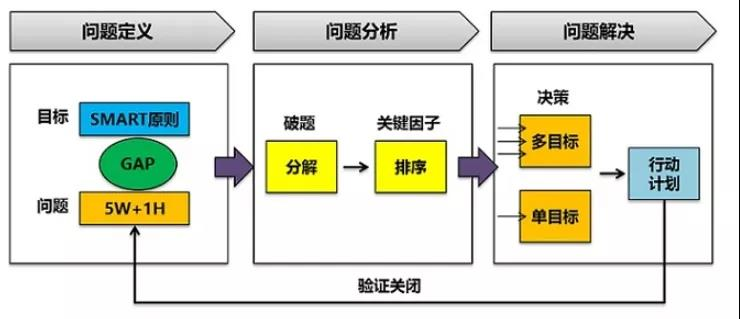
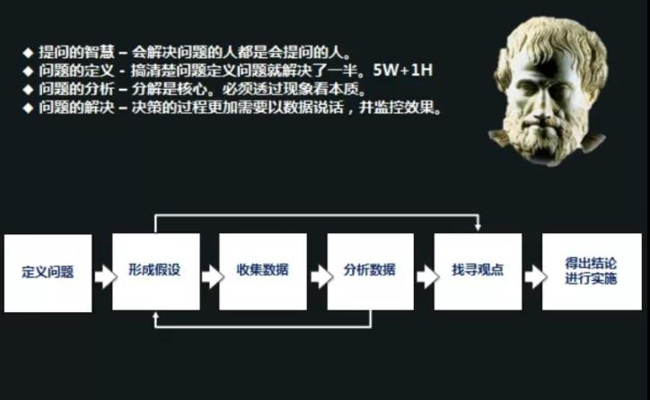
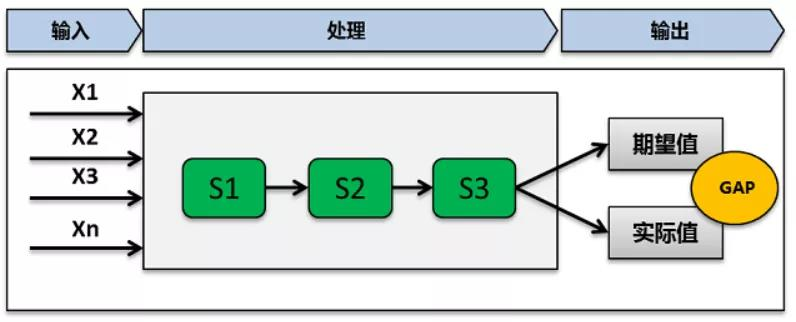
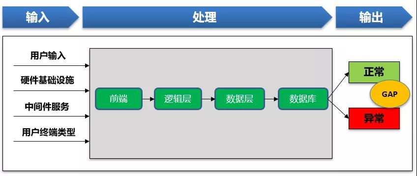
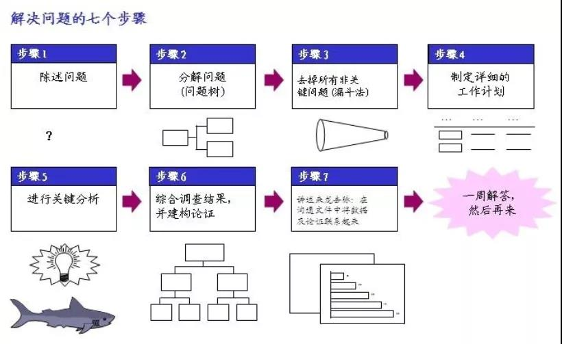
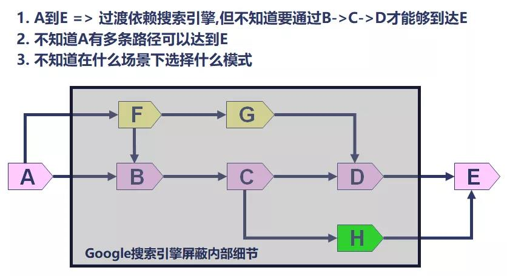
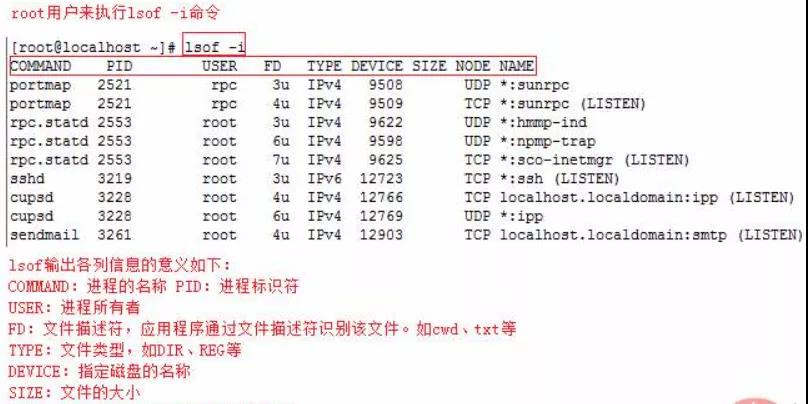
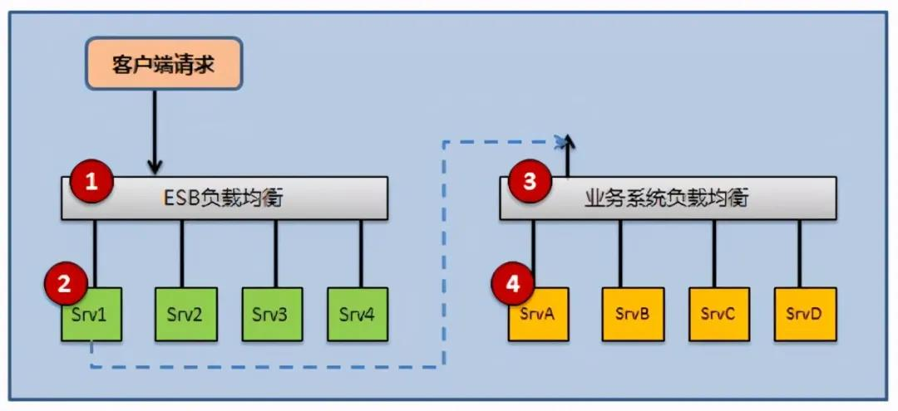
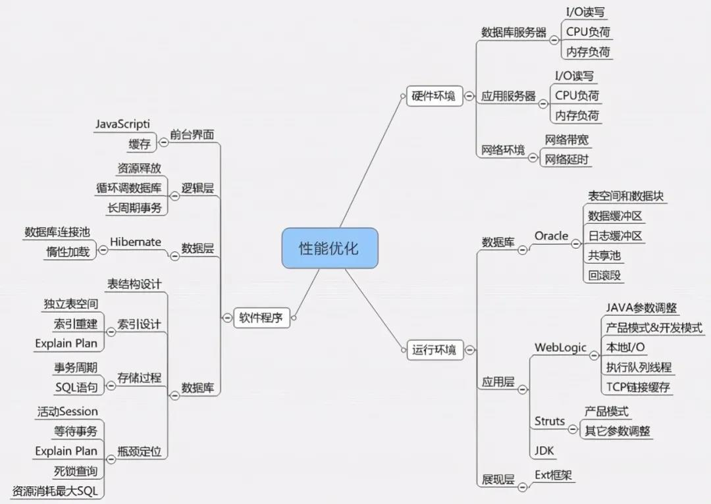

## 快、狠、准排查各类系统故障的运维套路

[DBAplus社群](http://dbaplus.cn/) 2020-11-12 16:39:33

今天准备谈下对于IT人员面对技术类问题分析和解决的一些思路和实践总结，在很早以前我就谈到过，对于开发人员在后期需要的不是简单的新业务功能的设计和开发能力，而是问题分析和解决能力。这类问题分析和解决本身又包括了两个方面内容：

 

- 其一是IT系统运行类问题和故障的分析和解决；
- 其二是面对复杂业务问题时候将其转化为技术解决方案能力。

 

在前面我讲思维类文章的时候就专门谈到IT人员应该关注自己思维能力的提升，这个思维能力实际上包括了分析和认知事物，独立的问题分析和解决两个层面的内容。

 

- 对于第一个层面在IT领域更多的就是架构设计的能力，将现实的业务需求和场景转化为抽象的架构设计语言和架构模型的能力；
- 而第二个层面在IT领域里面即是面对问题或故障的时候进行问题分析诊断，假设和验证，快速解决的能力。

 

而对我们当前很多IT人员来说，实际上两个方面的能力都欠缺，既不能独立的进行整体架构设计，对负责的业务进行自顶向下，分而治之的建模和设计。也不能在面对生产环境关键故障或问题的时候快速定位，并找到根源快速解决。而是将自己大量的时间花费在重复的事务性工作上，花费在对各类新技术的狂热追求上。

 

实际上自己也从不反对保持对新技术的学习兴趣。但是任何新技术，如果你实际的工作环境没有实践的机会，那么大量新技术下应该出现的类似性能，安全，可靠性等问题你都无法真正得到实践验证和解决。

 

**在这种情况下对新技术也只能够停留在理论阶段而无太大意义。**

 

 

对于问题分析和解决的核心逻辑，可以先参考我前面发布的文章：《问题分析和解决逻辑-麦肯锡七步成诗仅是开始》(http://blog.sina.com.cn/s/blog_493a84550102z8l9.html) 在前面这篇文章里面，结合麦肯锡问题分析七步法，对问题分析核心逻辑进行了详细的描述。

 

**一、技术问题解决的关键点**

 

我写过不少的关于技术问题分析和诊断的文章，这些问题基本也是来源于真实的项目实践。

 

即使到现在有些问题也没有完全得到定位和最终解决，包括我们找了Oracle专家和顾问，也不是说马上就能够满足我们解决掉该技术问题。

 

简单来说，如果一个技术问题，你能够直接快速的根据异常或问题关键字在网上搜索到相关的答案，这种问题都谈不上真正有挑战的技术问题。

 

对于技术问题的解决，基于前面实践的问题定位、分析和解决的思路，我还是想谈下在解决技术问题中的一些关键点和思考逻辑方面的内容。

 

 

**1、个人前期大量实践经验的积累**

 

这点相当重要，任何知识库，搜索都代替不了个人已有的知识经验积累。

 

 

为什么说工作经验很值钱？

 

往往就是因为你在一个专业领域有大量实践积累，大量问题分析解决经验积累。这些经验可以帮助你在遇到问题的时候快速地对问题进行预判和定位，包括提出最可能的假设路径。

 

当前解决问题，很多都是非结构化解决问题方法，即是优先提出最可能的假设，然后再去验证假设是否能够真正解决问题。

 

那么有经验的人往往就最容易提出最可能的假设路径，而减少对各种不可能弯路的尝试。一个问题本身有A到E五个独立假设路径，而最可能路径是A，你解决问题速度慢的原因往往就是你最后才假设和尝试到A路径并解决问题，而有经验的人往往一开始就选择了假设A进行验证。

 

**要积累这种经验，必须在问题解决后及时复盘，将其抽象为经验和方法论。**

 

**问题定位的重点就是缩小范围和确定边界。**一个问题出现之后最重要的就是快速的定位。

 

比如一个业务系统查询故障，要快速的定位是基础设施资源的问题，还是数据库和中间件的问题，还是说程序的问题。

 

如果是程序的问题，又需要马上定位到究竟是前端的问题，还是逻辑层的问题或数据库的问题。

 

只有快速的确定边界和定位问题，才能够有针对性的去解决问题。任何问题的定位都是追溯到引发问题的根源，而不是解决问题的表象，类似头痛医头脚痛医脚。

 

**那么如何缩小范围和快速的确定边界？**

 

 

比如我们假设一个最简单的场景：问题的产生经历了A-》B的两个过程。那么如何快速的确定问题是在A阶段产生的还是在B阶段产生的呢？

 

对于这个问题，我们有如下的问题定位方法和思路可以参考和借鉴：

 

- **替换法：**比如将A替换为A1，如果问题消失，那么说明问题出在A阶段；
- **断点法：**在A和B之间设置断点监控输出，判断A输出是否正常；
- **假设法：**假设A阶段有问题，对A阶段的参数进行调整，观察问题是否解决。

 

当然还有其他很多的问题定位方法，但是对于所有问题定位和确定边界的方法中，最有效的仍然是类似于快速查找中的二分法，通过二分法可以快速的帮助我们缩小范围和定位问题。

 

我们进一步对上面逻辑举例说明，比如一个软件应用出现Bug的场景，如下图：

 

 

**可以看到看到要分析和定位Bug为何困难？**

 

引入问题既可能是我们的输入出现错误，我们面对的软硬件环境运行状态有问题，也可能是我们实际程序处理构成出现问题。

 

即使你定位到程序处理问题，那么还可能是逻辑层，数据访问层或数据库多个点导致的问题。

 

 

**2、善用搜索引擎**

 

 

要明白，任何你遇到过的技术问题，往往都有前人遇到过，踩过坑，并总结和分享到互联网上面。因此善用互联网和搜索引擎，进行基于问题关键字的技术检索仍然是解决技术问题的关键途径。

 

即使搜索引擎没有帮助我们解决最终的问题，往往也会帮助我们在搜索的过程中学习与该技术问题相关的很多知识。

 

要搜索，一个重点就是选择搜索的关键字，对于关键字的选择没有一次就选择准确的话，自己就要多次尝试和迭代，直到能够准确的描述问题为止，同时在搜索的过程中搜索的答案往往也可以帮助你进一步的细化关键字。

 

比如对于系统运行故障或问题，对于关键字的描述，应该包括：

 

- 从数据库，中间件和业务系统错误日志中提取关键字信息；
- 从你产生问题的环境，背景，场景中增加缩小检索范围的关键字信息；
- 从搜索到的网页中挖掘更加有意义的描述类似问题的关键字信息。

 

同时对于搜索而言，特别是技术问题的搜索，有官方知识库的要优先搜索官方的知识库：比如对于Oracle产品相关的技术问题，我们也会先搜索Oracle官方的Support网站，同时搜索类似StackOverFlow网站，这些网站往往有更加全部的技术问题解决文章。

 

搜索技术文章，那么国外的技术网站相对来说更加全面，而对于百度这块相对弱，很多国外技术网站内容甚至都搜索不到，这时候可以尝试Google或Bing搜索。

 

 

**3、技术问题解决和复盘**

 

在前期我们实施Oracle SOA项目的时候，遇到了将服务封装和注册接入到OSB后，客户端消费和调用服务出现消息报文内容被截断的问题。

 

由于该问题出现概率不高，并且消费端系统本身有重试机制，也暂时不影响到具体的OSB服务运行和使用。虽然到现在为止，造成该问题的原因究竟是客户端服务器配置，负载均衡，网络，报文本身，OSB套件本身的Bug缺陷等哪方面还没有最终确认，但是整个问题排查和分析过程还是有意义的。

 

在问题排查和分析过程中，对于各类超时时间的含义，OSB的一些关键配置，报文解析，Http Post报文发送长短连接，Tomcat的一些配置都进行了了解，同时通过该问题的分析，也发现了在技术问题分析过程中的一些问题，供后面在分析问题中借鉴和参考。

 

 

**4、确定问题边界始终是最重要的**

 

客户端发送报文到服务器端接收报文，当前现象是客户端Log日志报文是完整的，而OSB上Log的日志报文不完整。

 

那么究竟是客户端，服务端，还是网络传输过程中出现的问题？这个问题边界的确定相当重要。

 

实际上在几天的问题分析和排查中对于问题边界一直没有最终确认，导致问题也一直没有很肯定的得到定位究竟在哪里，也导致最终问题没有得到明确的解决和排查。

 

比如上面说的消息报文不完整这个问题，要确定边界实际上常规思路也就两种，

 

- 一种就是修改程序代码进行更加详细的日志记录；
- 另外一种就是增加Trace监控。

 

比如该问题可以在客户端进行Http或TCP Trace，同时在服务器端也进行Http TCP Trace，通过两边的Trace信息才能够最终确定问题的边界在哪里。

 

但是在生产环境很难这样去做，

 

- 一个是接口服务调用并发量大导致Trace日志的量也巨大，而且不止这一个接口服务在调用；
- 一个是协调的需要配合的资源也太多，很难去联合排查和跟踪。

 

 

**5、问题复现很重要**

 

故障的复现是我们分析和定位问题的一个基础，问题如果随机偶然发生往往是最难解决的。当你面对问题的时候，你需要定位，那就需要问题能够复现才方便不断地去Debug或Trace。

 

 

在该问题的解决过程中，由于该异常是偶然出现，不定时而且是没有规律出现，所以也给我们排查问题造成了很大的麻烦。

 

虽然在问题排查过程中，我将出现问题的异常日志，和前后正常的实例都进行了导出分析，对出现问题的服务器Server节点、调用方、调用时间段都进行了分析，但是没有明显的发现出现问题的规律究竟在哪里。

 

同时该问题具有很高的随机性，往往是第一次调用不成功，但是同样的报文在第二次或第三次就调用成功，同时每次对于报文的截断长度都不相同。这导致很难分析具体什么场景下调用不成功。

 

即由于问题不能在特定的输入条件下重现，导致我们很难对问题进行进一步的分析和定位，也导致我们很难去进行特定的跟踪和边界确定。同时也很难在测试环境对该问题进行进一步的分析，和各种参数条件修改后的测试和验证。

 

即由于问题不能在特定的输入条件下重现，导致我们很难对问题进行进一步的分析和定位，也导致我们很难去进行特定的跟踪和边界确定。同时也很难在测试环境对该问题进行进一步的分析，和各种参数条件修改后的测试和验证。

 

以上都导致问题很难快速定位和分析，只能够大范围的场景+异常的关键字搜索，然后搜索到相关的可能解决方案后，一个个的去尝试看是否能够解决。

 

但是，这种方式带来巨大的问题，即：

 

由于测试环境问题不复现，我们无法在测试环境做这个事情。那么搜索到的解决方案验证只能够在生产环境做，但是生产环境根据规定是绝对不允许随意去修改配置和调整参数的。

 

这也正是我们看到很多大型IT项目上线，往往会预留3个月左右的试运行期间的原因，在试运行期间生产环境的日常运维和配置修改不会严格受控管理，也方便及时分析和解决问题。

 

 

**6、网上搜索很难搜索到完全一致的异常场景**

 

由于项目采用的Oracle SOA Suite 12c套件产品，当前在国内并没有大范围的应用，所以如果用百度搜索基本搜索不到有用信息，改用Google或Bing很多信息也无法搜索到。

 

因此在该问题的排查过程中，我们基本都在Oracle Support网站进行了所有相关知识点的排查，同时选择各类关键字进行搜索引擎的搜索，其中包括了:

 

- Weblogic Tomcat Post Timeout KeepAliveOSB-；
- 长连接 超时 OSB-382030；
- Failed to parse XML text等。

 

但是并没有搜索到完全一致的场景。

 

对于一个最相似的关于Failed to parse XML document的场景，我们进行了相关的调整，即将KeepAlive设置为False，同时对Post Timeout设置为120秒，但是仍然出现在120秒超时时间到达后任何没有Post到完整的请求而导致超时的问题。

 

由于无法搜索到完全类似的场景，也导致我们很难根据网上给出的方法进行进一步测试和验证。并且Oracle顾问对于该问题也只能给出进行Tcp Trace的无用建议。

 

 

**7、关键基础技术知识缺乏，导致问题分析和提出假设不合理**

 

 

在原来问题的分析和解决中，由于搜索引擎往往会给出完全类似的场景，我们只需要根据搜索引擎给出的排查思路对问题进行排查即可。

 

因此解决起来效率很高，对于具体底层原理性的内容我们并不需要掌握和了解，只需要能够选择合适的关键字，通过搜索引擎搜索到最合适的内容然后进行排查即可。

 

但是这次问题，特殊点就在于搜索引擎根本无法给出完全类似的文章。这就导致需要基于问题提出各种合理的假设，并对假设进行逐一验证。

 

**那么如何提出合理的假设？**

 

这里就涉及到对于TCP底层协议，各个超时值的含义和原理，Tomcat Server的参数配置，OSB代理服务的解析过程，Weblogic的关键参数配置和含义，负载均衡策略，乃至Docker容器和IP映射等很多内容都有技术积累才可能提出最合理的思路。

 

比如在排查过程中，我会想到是否需要将Tomcat 的MaxPostSize值调大的假设，但是该异常是Tomcat向Weblogic Server进行Post请求发送数据，对于Tomcat 的MaxPostSize根本不会影响到这个Post请求，而只有Weblogic上的Post Size才会有影响。这个假设本身就不合理。而要快速的判断这些假设不合理，你就必须提前有这些关键的基础技术知识和背景积累。

 

包括对于Keep Alive长连接，Keep Alive的Time out超时时间设置是否会对该服务异常调用操作影响，实际上由于对Keep Alive长连接和各类Timeout的具体含义理解的并不深入，也使得很难判定究竟是否有影响，也只能是注意尝试去排除可能性，这些也都导致了很难快速的定位出问题根源究竟在哪里。

 

 

**8、涉及到外围干系人协同时问题解决困难**

 

这个也是解决服务接口问题的一个关键影响。对于接口服务运行问题，往往涉及到业务系统消费方，业务系统提供方，OSB服务总线，网络，负载均衡设备等多个相关因素和厂商。

 

对于一个问题的排查往往需要协调多方的资源在约定的时间相互配合才能够完成，这些都直接导致排查难度很大，很难依靠个人一方力量就完成。

 

在原来类似大项目实施过程中，也经常会遇到这些接口问题的分析和排查，往往也都是问题造成严重影响后，各方才会真正重视该问题，并各自协调资源形成联合的问题排查团队进行问题分析和排查，最终才能够解决问题。

 

虽然截止现在问题没有得到最终解决，但是整个分析过程仍然有意义，特进行本文总结。

 

**二、问题复盘-文件句柄打开过多**

 

在前面已经谈到，问题分析解决后需要及时复盘，对于问题复盘不是简单的问题解决总结，而是对整个问题分析思考过程进行梳理，包括在问题解决中究竟踩了哪些坑，走了哪些弯路，这些经验教训对后续问题的解决有哪些参考意义等。

 

**问题描述：**服务器响应很慢，服务调用出现超时，接着查询相关的错误日志信息。在错误日志信息里面包括了IO Exception的too many open files信息，也包括了socket receive time out的socket连接超时的信息。

 

 

**1、应用服务器监控情况检查**

 

在拿到这个问题后，由于原来也出现过服务响应慢和调用超时的问题，所以首先排查的是应用服务器本身的健康状况，因此开始用jstat检查服务器本身的cpu和内存的使用情况，经过检查服务器本身完全正常。

 

 

**2、数据库连接池和线程池检查**

 

在检查这个后接着检查数据库连接池和线程池的情况，经过检查虽然有排队情况，但是连接池本身都还有大量剩余，也不存在连接池超了的情况。

 

 

 

**3、错误日志检查**

 

在这个检查完后回到问题错误日志，由于当前有两个错误，即：

 

- 问题A文件打开过多，问题B服务连接超时，那现在有一个关键问题就是究竟是A问题导致了问题B，还是B问题导致了问题A，还是A和B本身就是在同一时间导致的两个本身不相关的问题，在这个时候其实并没有完全肯定的结论。

 

这就导致我们需要从两条问题路径去查找问题的根源，然后再进行总结和收敛。

 

要知道对于问题B连接超时，Oracle官方的Support网站知识库包括问题解决的6到7个场景的排查，整个排除起来是相当困难的。

 

而且该问题是老服务器出现的新问题，而不是完全新增加服务器出现的问题。那必须就要考虑是否和新部署和上线的服务和应用有关系。

 

 

**4、回溯近期所做的代码变更**

 

现在回到文件打开数过多的问题，经过基本问题查看，发现的就是文件句柄打开太多，那么我们要做的就是对新增加的修改和变更进行查看，还是否存在文件句柄没有关闭的情况。

 

 

**5、异常-》文件打开太多-》进一步定位是哪些文件**

 

经过代码的Review我们没有发现这种情况。那接着很自然就是要进一步去定位和分析究竟哪些文件句柄打开没有关闭？

 

而查这个问题的方法是lsof进行log数据，有发现我们的hpunix小型机居然这个命令无法使用，没有办法我们先单纯的调高的最大文件打开数现状但是问题依然存在。

 

注意在这个时候我们停在这里了，没有进一步去想如何解决这个问题，而转到去分析服务超时问题。

 

**注：**当我们在进行问题分析诊断的时候，选择的没有问题的标准解决路径，不要轻易因为阻碍而放弃，你会发现最终你又会回到这个关键路径上。

 

在面对服务超时的问题的时候，我们又走了弯路，即直接根据metalink排查方式对各个问题场景进行分析和排除，对中间件的参数和设置进行了大量的修改，但是最终该问题还是没有解决。

 

之所以说走了弯路的原因主要在于没有很好地去分析当前服务器出现服务超时的具体原因，对应当前场景没有做具体的分析。

 

 

**6、进一步分析问题产生的场景和边界**

 

所以后续还是回到当前场景的分析，在当前服务器我们新增加部署了哪些服务，这些服务是否需要逐个进行排除，我们实际的服务运行是都超时，还是个别服务超时？这个服务超时究竟是发生在哪边？具体的边界在哪里这些问题都需要进一步搞清楚才能有后续行动。

 

 

**1）边界确认：不是所有服务调用都超时**

 

第一个情况就是不是所有的服务都出现超时的问题，主要出现超时的服务都是某种类型的服务，然后我们对超时的服务和服务超时日志进行排除，包括具体的防火墙设置，长事务运行的服务本身等。

 

**2）边界确认：不止是新增加的服务超时，老服务也超时**

 

现超时的服务并不是都是新增加的服务，也包括了已经有的老的服务运行，确实是一个很奇怪的现象。在服务超时设置参数都进行调整后，继续观察服务器的健康状况和错误日志记录，发现继续出现too many files open的错误。

 

在这个时候发现还是得回到too many file open这个异常日志上进行进一步的分析原因。

 

 

**7、回归到在hpunix上安装lsof组件**

 

 

要详细分析必须有详细的log日志以进行定位，到这个时候发现还是必须首先得安装上lsof组件，接着就是查找资料重新在hpunix上安装上lsof组件，组件安装后进行详细的lsof日志。

 

然后每1个小时左右新取一次lsof的数据，通过对lsof数据的分析发现确实存在文件句柄不断的增加而无法释放的情况。

 

**到了这一步后出现两个小问题分支：**

 

- 一个是对lsof数据发现对oracle数据库连接使用的是1524后门端口，开始怀疑是这个端口使用有问题，但是后面否定了该假设；
- 那还是回到文件句柄问题上。

 

那这个问题的关键就是：究竟是哪些文件句柄不算在增加？

 

后面对lsof日志进行详细分析，发现了总是60多个文件句柄不断的在增加和打开，这些文件句柄反复打开多次，而且file inode值也是一样的，到了这个时候关键的想法就是**如何通过file inode查找到具体是哪些文件**？

 

因为在实际的日志记录中只有文件的路径而没有文件的名称，一时在这个地方停滞。

 

到了这一步，没有办法，要做的还是详细的研究lsof日志中的每一个字段的具体含义，找寻如何通过file inode找寻到具体文件的方法。

 

那先想到的就是文件系统中的文件本身是否有inode的说法，后面看到通过ls命令是可以查找到每个文件的文件句柄的。那自然我们可以对所有的文件通过ls查找并导出inode信息，然后和lsof中的文件句柄进行比对找到具体的文件。

 

根据该思路我们到处所有文件属性信息进行比对，最终找到文件句柄不断打开的文件是哪些。

 

一看到这些文件在不断的打开，问题根源点基本就找到了，这些文件都是和我们的底层一个服务组件有关系的，那么接着看打开这些文件的方法，在打开这些文件的使用完成后释放及时进行了资源的释放。

 

 

**8、源码最终定位-saxReader类文件处理**

 

经过源代码分析，发现了具体的问题就是文件不断的打开，但是不是手工对文件句柄进行关闭。

 

但是我们的生产环境为何没有出现通用的问题，这个是和saxReader类处理文件的方法是有关系的，saxReader类对文件是会进行关闭，但是具体时间我们并不清楚。

 

那生产环境为何没有出现同样的问题，是否是在fgc的时候会进行回收，这个也只是一个假设，暂时没有做进一步的验证，但是至少分析出对于文件的大量持续打开肯定是需要修改的。

 

在对代码进行修改后重新部署，部署完成后进行观察，没有再进一步出现过too many files的文件IO异常。但是接着还是继续出现一些服务超时异常。

 

 

**9、问题因果要分清**

 

但是任何服务超时异常都不会再引起too many files打开的异常，突然发现刚开始出现的问题A和问题B，实质是反应出了我们当前应用存在两个偏独立的问题，虽然两个问题间可能存在相互影响，但是问题本身偏独立，都有各自的问题导致根源。

 

在进一步分析服务超时问题的时候，我们对服务调用调用详细日志数据进行分析，发现大多数服务都是正常的，而仅仅是个别服务出现了服务调用超时的问题，那么接着还是对单独的个别服务进行原因查找。

 

由于是个别服务的问题，我们完全可以怀疑是服务提供方系统出现了问题，那么就需要对服务提供方提供的服务能力进行原因定位和查找，最终找到了一个原因即对方的操作导致了对方数据库出现死锁而服务一直处于等待和锁定状态，基于这个假设我们后续进行了证实确实是该原因。

 

到这一步基本所有的问题根源点和原因都基本确认清楚，通过该次问题定位，分析和解决，进一步完善了对应服务应用性能和问题定位的分析和解决方法，从CPU内存再到IO，从服务异常日志再到服务详细的调用日志信息，基本形成了一个完整的诊断方法。

 

**三、问题复盘-服务调用超时**

 

最近跟踪OSB服务运行超时，发现一个很奇怪的现场，即在调用业务系统的时候出现1500秒超时返回的情况。而在OSB本身做服务封装设置的时候，我们会设置两个时间，如下：

 

- Socket Read Time out : 该超时设置为600s；
- Connectoin Time out：连接超时设置为30s。

 

也就是说实际在OSB配置里面并没有出现过1500秒超时的任何配置情况。

 

后面询问业务系统，得到的答复是业务系统那边有5分钟，即300s的超时设置。但是即使如此，也应该是返回300s的超时错误，而不是1500s。

 

一开始我们始终在分析，是否是300s超时，重试了5次，导致看到的最终超时设置是1500s，因此我们将OSB的所有配置参数又全部检查了一遍，结果没有检查到任何的有5分钟的超时配置项，同时也没有检查到有任何的重试次数是5次的检查项。

 

在OSB业务服务配置的时候，确实可以配置重试，但是我们当前的设置为：

 

- 最大重试次数为 0；
- 是否支持应用程序重试，这个是true。

 

但是既然最大重试次数为0，即使后面的这个checkbox为true，也不应该去进行重试。

 

因为从调用其它的业务系统的接口服务返回情况来看，都没有发生过相应的重试操作。同时后续在和业务系统测试的过程中，将该checkbox取消选择，同样会发生1500秒的错误，因此暂时确定和该参数关系并不大。

 

后面详细查看日志，会发现整体过程为：

 

 

2018-10-24 11:25:38开启调用

Oct 24, 2018 11:35:49,172 AM GMT+08:00 报600s挂起

Oct 24, 2018 11:50:46,140 AM GMT+08:00 报Connection Reset

在600s即到了我们设置的Read out timeout的实际，会报出如下异常信息：

WatchRule: (log.severityString == 'Error') and ((log.messageId == 'WL-000337') or (log.messageId == 'BEA-000337'))

 WatchData: MESSAGE = [STUCK] ExecuteThread: '7' for queue: 'weblogic.kernel.Default (self-tuning)' has been busy for "610" seconds working on the request "Workmanager: SBDefaultResponseWorkManager, Version: 0, Scheduled=false, Started=true, Started time: 610222 ms

 ", which is more than the configured time (StuckThreadMaxTime) of "600" seconds in "server-failure-trigger". Stack trace:

  java.net.SocketInputStream.socketRead0(Native Method)

 

这个异常是和600s超时相关的一个异常信息，即Socket Read timeout，同时在报出这个异常信息后，该线程在60秒后又进行了一次重试，即：

 

 

<[STUCK] ExecuteThread: '7' for queue: 'weblogic.kernel.Default (self-tuning)' has been busy for "670" seconds working on the request "Workmanager: SBDefaultResponseWorkManager, Version: 0, Scheduled=false, Started=true, Started time: 670227 ms

 ", which is more than the configured time (StuckThreadMaxTime) of "600" seconds in "server-failure-trigger". Stack trace:

 

而后续在日志中搜索不到线程7的相关记录，同时在间隔900秒后出现Connection Reset的报错。

 

 

javax.ws.rs.ProcessingException: java.net.SocketException: Connection reset

at org.glassfish.jersey.client.internal.HttpUrlConnector$3.run(HttpUrlConnector.

 

即初步分析很可能的原因是服务调用本身在5分钟在业务系统端超时了，但是业务系统端没有对连接进行处理或关闭，导致在OSB侧这个连接被并没有感知到。

 

因此一直等待到600s的时候出现超时，而这个时候超时本身不是检测到业务系统端出现问题的超时，或其它原因导致这个thread被stuck，连接被挂起。因此又等待了900秒后出现了连接重置。

 

基于上面的分析我们进一步查找900s相关的设置，在Weblogic的DataSource连接池里面有一个900s收缩频率的设置，该900s的含义为：在收缩为满足需要而增大了的连接池前需等待的秒数。如果设置为 0，则将禁用收缩。而现在这个值我们设置为900s。

 

**进一步查找资料，找到进一步信息为：**

 

在Weblogic Server日志中可以观察到大量的Connection for pool "SCDS" closed信息，表示系统在某一时刻会批量关闭一批连接，一般断掉物理连接会这么做（WebLogic 配置池收缩也会这么做，如果未配置的话默认为900s检查一次，从您的配置文件发现未配置池收缩）。从线程名称看，是应用程序的线程关闭了连接。

 

即在600s连接出现挂起的时候，一直等待900s，在weblogic连接池检查和收缩的时候才将该连接正式关闭和回收掉，从而返回Connection Reset的错误。

 

该假设还没有得到进一步的验证，但是从整个过程和日志分析来看，基本能够说得通。

 

在该问题分析中，我们最大的一个错误分析就是根据300s和1500s想当然的判断是重试了5次导致，而一直在查找为何会进行重试，而对重试配置进行检查和验证。

 

**简单来说就是前面的假设本身就是错误的，但是验证假设上走太多弯路。**因此还得重新回到问题本身。

 

前面分析了在600秒出现线程阻塞和挂起的时候，再等待了900秒出现连接超时，因此从时间上看是1500秒超时。

 

为了印证这个假设，我们将Read Time out的时间修改为400秒，那么就应该是1300秒报出服务超时的异常错误，但是最终测试的结果仍然是1500秒超时。

 

因此前面这个假设不成立。

 

对于该超时，在OSB集群侧没有任何5分钟超时的设置，而检查F5负载均衡的超时配置文档可以看到，F5负载均衡设备上有一个idle time out的超时设置，默认就是300秒。

 

任何问题的诊断分析，往往无法提出明确合理的假设时候，仍然需要回归到问题产生过程和链路，然后通过分而治之的方式确定具体的问题点和边界。

 

因此为了解决该问题，首先还是要确定是否和负载均衡设备有关系。对于当前的服务调用，需要通过经过ESB服务集群，业务系统的服务集群，才能够完成。如下：

 

 

即整个服务请求的调用过程是为1->2->3->4的顺序，需要同时经过1和3两个负载均衡设备。那么整个服务调用超时就和1,2,3,4四个节点的配置都会相关。

 

因此为了进一步进行验证，我们尝试对如下路径直接调用以排查问题：

 

- **不走业务系统的负载均衡 1-2-4路径调用**

 

在该模式下通过管控系统和通过SOAPUI分别进行调用测试。发现整体调用能够成功，有成功的实例返回。

 

对于通过管控调用的时候会出现有重试的现象，但是通过SOAPUI调用的时候没有发现重试。

 

其次对于客户端调用仍然会出现5分钟调用超时，返回Connection Reset的错误。但是这个时候实际上服务仍然还运行，即2-4的连接仍然在运行并能够成功运行完，因此可以看到成功的服务运行实例数据。

 

- **不走ESB和业务系统两边的集群，走2-4直接进行接口服务调用**

 

在该模式下，我们通过SOAPUI对接口服务进行调用测试，能够成功调用，有成功的实例返回，同时对于客户端也可能得到成功的返回信息。

 

即既有成功的实例，客户端也返回成功。即我们希望达到的一个结果。

 

- **走两边的集群模式 1-2-3-4路径进行调用**

 

这个即是最初的调用模式，我们还是使用SOAPUI进行调用，发现会出现调用重试，同时最终服务运行失败，报1500秒的超时错误。

 

在客户端也会报出连接超时错误。即和我们最初看的现象是一致的。但是具体为何会发起5分钟后的重试，以及是否该重试是由负载均衡设备发起的暂时不明确。

 

在负载均衡上面，我们看到有tcp_tw_recycle参数配置，但是暂时不确定自动触发重试是否和该参数的设置有关系，从网上文章来看是不建议对该参数配置进行启用。

 

该超时问题经过分析，基本确定是负载均衡的超时设置引起的。因此解决就简单的，即对两个集群对应的负载均衡超时设置都进行调整，同时确保该超时时间>OSB服务配置中的Read Time out时间即可。

 

最终问题得以解决。

 

**四、JVM内存溢出问题分析**

 

网上有很多关于Java JVM内存溢出的问题和解决方案，实际上对于这类问题已经属于一种很常见的问题，已经形成了一种标准的问题解决和诊断方法论。

 

最佳方法就是按照这个步骤去诊断，而不是靠你自己经验去提出各种假设，因为在这种情况下你提出的假设很可能都是瞎猜，反而浪费了大量时间。

 

**既对于问题在你没有足够经验的时候一定遵循通用方法论步骤去解决。**

 

再回到内存溢出问题，这个问题通用步骤如下：

 

 

到了这里，我们基本回归到通用问题解决方法论。

 

由于是生产环境问题，而且由于是商用产品，我无法在测试环境重现，也无法进行静态代码检查。因此首先还是需要进行Java GC的内存回收日志分析。

 

对于JVM内存溢出问题详细分析可以参考：《从表象到根源-一个软件系统JVM内存溢出问题分析解决全过程》。（http://blog.sina.com.cn/s/blog_493a84550102z8m1.html）

 

**五、业务系统性能问题分析诊断**

 

如果一个业务系统上线前没有性能问题，而在上线后出现了比较严重的性能问题，那么实际上潜在的场景主要来自于以下几个方面：

 

- 业务出现大并发的访问，导致出现性能瓶颈；
- 上线后的系统数据库数据日积月累，数据量增加后出现性能瓶颈；
- 其它关键环境改变，比如我们常说的网络带宽影响。

 

正是由于这个原因，当我们发现性能问题的时候，首先就需要判断是单用户非并发状态下本身就有性能问题，还是说在并发状态才存在性能问题。

 

对于单用户性能问题往往比较容易测试和验证，对于并发性能问题我们可以在测试环境进行加压测试和验证，以判断并发下的性能。

 

 

对于详细的业务系统性能问题分析和诊断可以参考：《业务系统性能问题诊断和优化分析》。（http://blog.sina.com.cn/s/blog_493a84550102z8t2.html）

 

以上是对于技术类问题分析和解决的一些思考和总结，供大家参考。

 

作者丨人月神话

来源丨http://blog.sina.com.cn/s/blog_493a84550102z9mz.html

dbaplus社群欢迎广大技术人员投稿，投稿邮箱：editor@dbaplus.cn