## 饿了么监控体系：从架构的减法中演进而来

黄杰 2019-11-28 10:54:18

**本文根据黄杰老师在〖\**2019 Gdevops全球敏捷运维峰会-广州站\**〗现场演讲内容整理而成。**

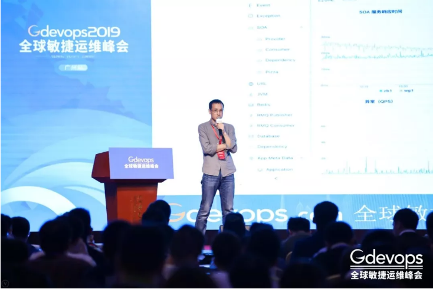

**（文末可获取完整PPT）**

 

**讲师介绍**

**黄杰，**前饿了么框架工具部监控平台负责人。2015年加入饿了么，负责整个监控平台的构建及周边工具链的建设。之前曾在携程、eBao等多家公司工作，在监控、消息系统及大数据等领域积累了丰富经验。

 

**分享概要**

1、背景

2、遇到的问题

3、场景化

4、系统设计

 

大家好！很荣幸有这样的机会和大家交流，今天分享的主题为《饿了么监控体系的演进》。

 

我差不多是2015年中加入饿了么，主要是负责饿了么整个监控平台的搭建，从0开始搭建这套监控系统。

 

今天主要从以下四块给大家讲一下，整个过程我们遇到了哪些问题，怎么来解决这些问题，以及用怎么样的设计来支撑起这个系统。

 

**一、背景**

 

其实整个饿了么监控系统在演进过程中主要分为如下3个阶段：

 

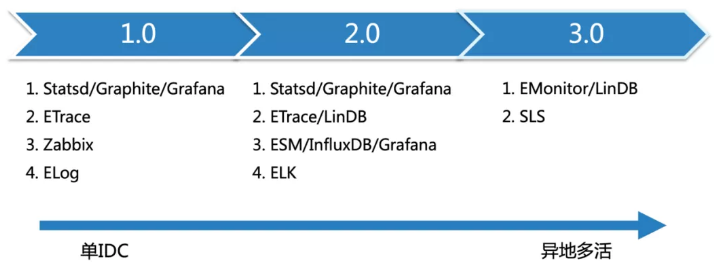

 

- 第一阶段：主要由Statsd/Graphite/Grafana负责业务层的监控，ETrace负责全链路监控，Zabbix负责服务器层面的监控，ELog负责分布式日志搜索；
- 第二阶段：整个饿了么也从单IDC演进成异地多活架构，所以对监控也提出了更高的要求，基于这个我们也自研LinDB，以支持多活架构下的监控，Zabbix慢慢被ESM/InfluxDB/Grafana所替换，使用ELK替换原来的日志方案；
- 第三阶段：主要做一个减法，即把原来StatsD/Graphite/ETrace/ESM/InfluxDB统一到了EMonitor+LinDB这样的平台，以提供给用户一套统一的监控平台，日志开始使用阿里云的SLS；

 

**二、遇到的问题**

 

在这过程中我们主要遇到了哪些问题，然后我们怎么去解决这些问题。

 

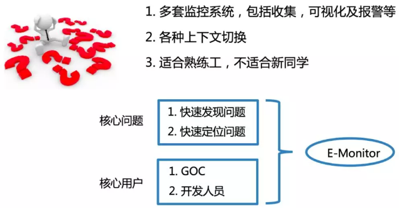

 

之前也介绍了原来有多套监控系统，当出现问题的时候，需要从多套监控系统里面回来切换，其实这种上下文的切换是很影响定位问题的时间，一旦故障时间很长的话就意味着故障的影响范围也会变大。

 

那我们怎么来解决这个问题呢？

 

我们希望有这么样一套系统能针对于任何人员快速上手。围绕着快速发现问题和快速定位问题这两个点，来构建这套系统。

 

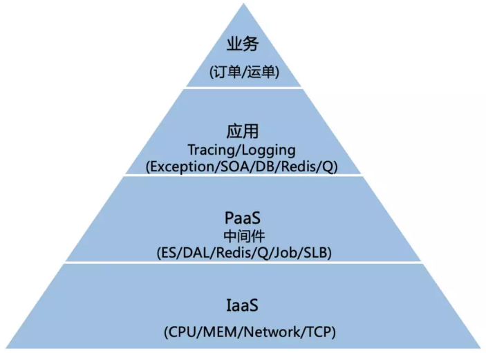

 

其实监控也可以像业务架构一下进行分层，如上图，可以分为，业务监控，应用监控，PaaS层监控及IaaS层监控。

 

不同用户在每一层的视角是不一样的，但是如何把各层的数据串联起来是一个关键点。

 

再结合Logging/Tracing/Metric三者的关系，我们是通过Tracing把上面各层的关系给串联起来。

 

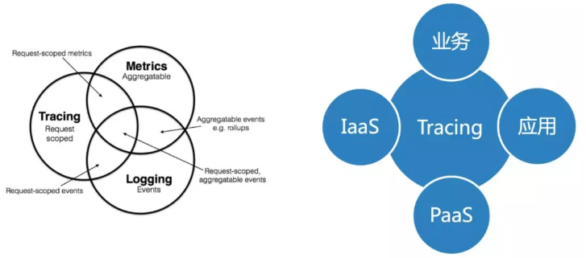

 

最终，我们提供了一套一站式的监控平台，同时支持PC和Mobile 2个平台。

 

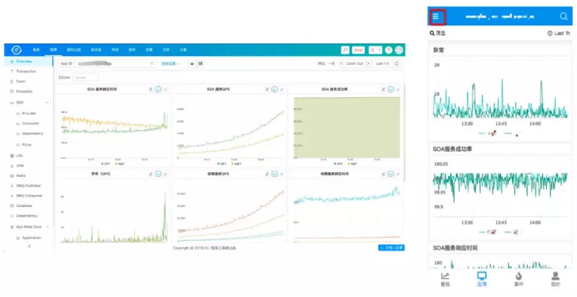

 

**三、场景化**

 

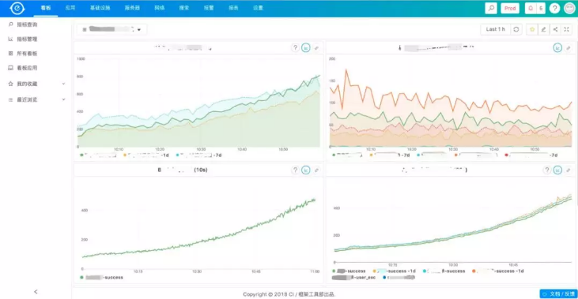

 

首先，我们来看一下业务监控，很多公司的业务监控都是用Grafana来做可视化，饿了么原来也一直用Grafana，现在已经全部使用EMonitor。

 

相比Grafana，EMonitor会更多的与别的监控集成，如一个业务监控有问题，点击一下有问题的曲线就可以到相关的应用监控，也可以比较方便的也报警配置集成。同时所有的Dashboard都与具体的业务线有关。

 

同时系统也是自动的集成发布及报警事件，如果与相关曲线有关的应用有报警或者变更，就会直接在图上画上红线(报警)和绿线(变更)，这些使用都不需要额外的操作，都是系统自动完成的。

 

40%~50%的事故都是与变更有关系，这样当有变更导致的问题可以直接在监控上看到，马上回滚解决问题。

 

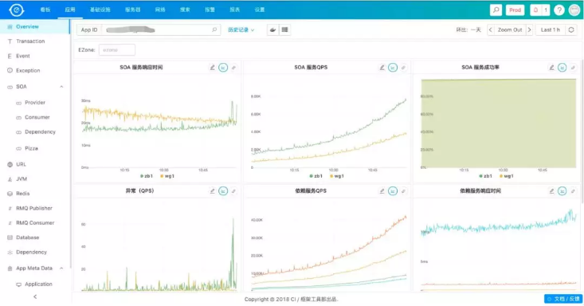

 

说完业务监控，我们再来看一下应用层监控，这块主要依托于全链路监控，主要用于问题的定位。

 

大家可以看到，这块基本上覆盖了整个应用所有内部及依赖的监控，而且这些基本上都使用方是透明的，使用方只需要使用我们部门提供的基础服务就可以了，会在这些基础的SDK进行监控埋点。

 

同时，有时直接放一个当前的监控数据，很难反应问题，因为不知道相比之前是变好了，还是变差了，所以我们会对所有的监控曲线都做同比和环比，这样就可以直观的反应问题。

 

接下来我以几个日常排障中使用比较多的功能介绍一下。

 

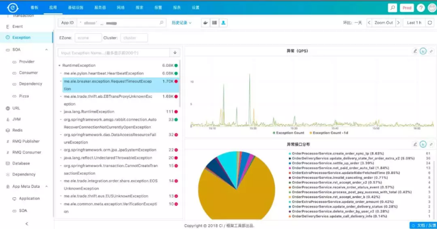

 

首先来看一下，错误异常。

 

基本上当出问题的时候，大家都会上来看一下有没有报异常什么的，针对于异常我们也增加了当某个异常出现的时候，到底影响了哪些接口的请求，以方便业务方做判断。

 

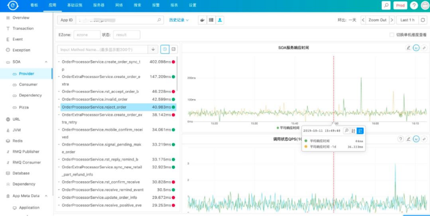

 

再来看一下SOA相关的监控，SOA会反应当一个服务有问题的时候，是自身有问题还是依赖的服务有问题，可以看到一个服务的RT，成功率，及哪些调用方等。

 

那么当应用所依赖的基础设施有问题的时候，怎么办呢？

 

其实这部分可以分两部分来看，一部分是Client是不是有问题，还有一部分是Server端有没有问题，因为有了Client的访问数据，所以就可以很方便的知道这个应用使用了哪些基础设施，这些基础设施有没有问题。

 

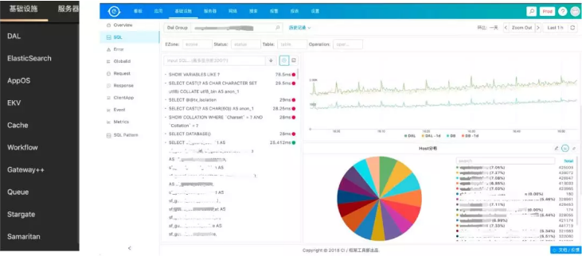

 

这里主要讲一下数据库，因为日常来说业务开发跟数据库打交道是非常多的，所以我们在DAL这层做了很多监控，基本上做到了针对每条SQL都做了监控，可以看到每条SQL的RT，成功率等。主库怎么样、从库怎么样。

 

针对IaaS层的监控，我们自研了一套监控系统，来采集服务器CPU/Memory/Network等数据，同时也支持使用方根据自己的需求来写自己的Plugin来采集数据，如怎么来监控Redis/MySQL等。

 

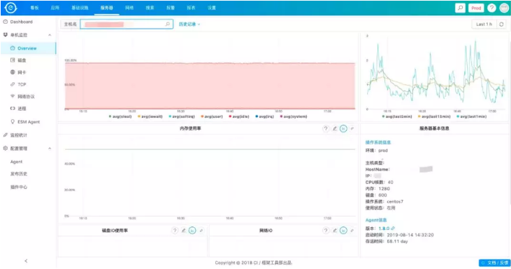

 

说了这么多，基本上都是监控图表，那么怎么来查看日志呢？

 

其实这个是整个系统的另外一个亮点，应该所有的这些图表都是可以支持下钻的，如发现有问题，只要鼠标点击一下就可以看到对应的日志。

 

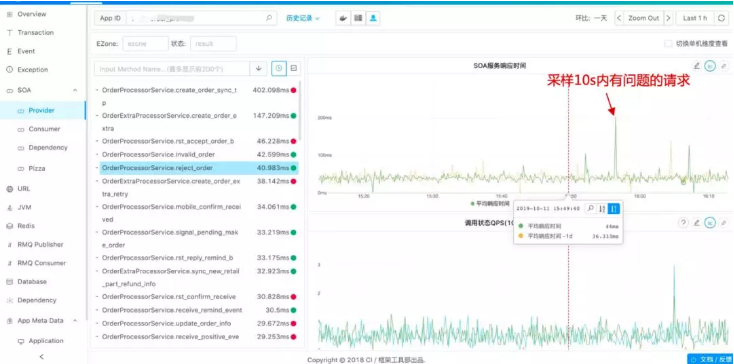

 

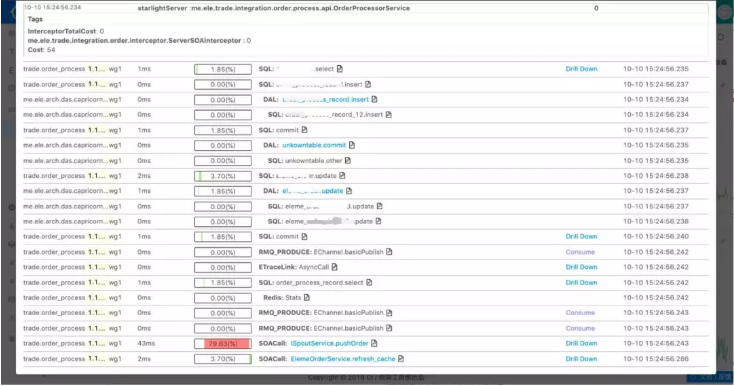

 

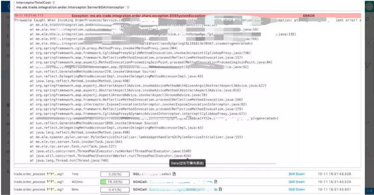

 

**四、系统设计**

 

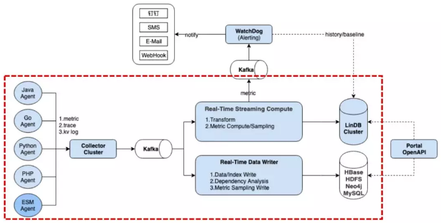

 

- 系统从原来的Pipeline慢慢演进成类似Lambda架构；
- 支持多IDC，每个IDC都会部署红色框里面的组件；
- 全量日志，通过指标+采样的方式；
- 支持Java/Golang/Python/PHP/C++/Node.js；
- 所有监控数据计算窗口为10S；
- 自研+开源组件构建了整套系统。

 

针对于数据的处理计算，我们自研了一套计算平台Shaka也支持所有监控数据的清洗及计算。

 

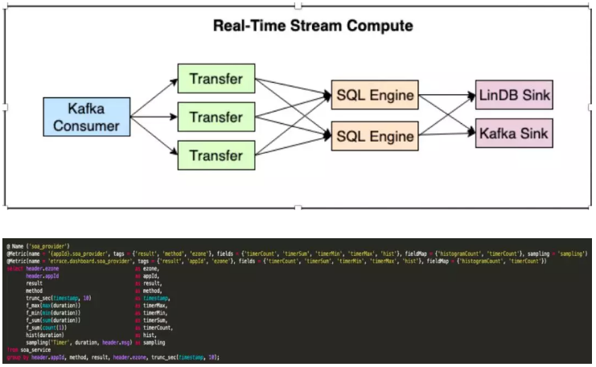

 

- 基于CEP(Esper) 实现类SQL的计算；
- 非结构化的数据转换成结构化数据；
- UDF处理异常数据分析及采样。

 

最后介绍一下，支撑起所有监控数据存储的自研时序数据库 - LinDB。

 

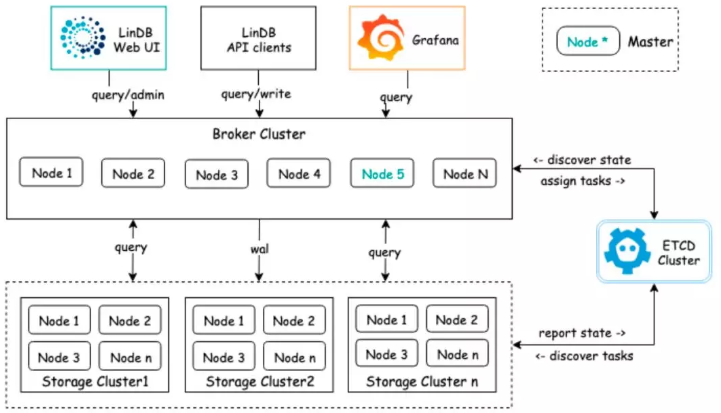

 

- 采用Metric + Tags + Fields方式；
- 基于Series Sharding，支持水平扩展；
- 自动的Rollup，s->m->h->d；
- 高可靠性，支持多副本，支持跨机房；
- 自监控，数据治理；
- 列式存储，具有时序特性的LSM存储结构；
- 倒排索引。

 

目前的数据量如下：

 

- 36台服务器，分不同集群；
- 每天增量写入140T；
- 高峰TPS: 750W DPS/s；
- 10S存30天，历史可查2年以上；
- 磁盘占用50T (压缩率在60倍左右)；
- 查询P99：500ms ~ 1s。

 

这块我们目前也在做开源版本，如果对这块有兴趣可以关注我们：

- https://github.com/lindb/lindb
- https://lindb.io/

 

今天的分享就到这里，最后为一直在监控领域奋战的同学打一下气，做监控真的很有意思，接触的面也很多，面对大数据量冲击的同时，还需要考虑产品层的沉淀。

PPT下载链接：https://pan.baidu.com/s/1djJB8Sr2Gc_btnjPDgPncg