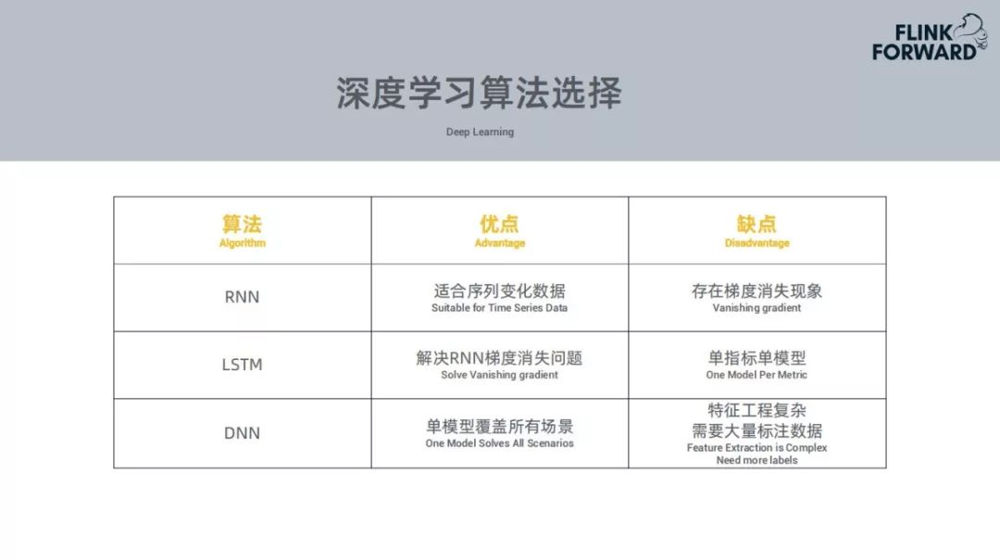

## 告警数下降10倍，携程实时智能检测平台实践

潘国庆@携程 2020-03-25 11:07:25

**作者介绍**

**潘国庆，**携程大数据研发经理。2016年加入携程大数据平台团队，主导了Muise平台从Storm至Spark Streaming再到Flink的架构升级与技术演进，目前负责携程实时智能异常检测的架构设计与研发。拥有5年大数据领域研发经验，拥有于实时计算的研究与推广。

 

将实时计算和深度学习相结合，可解决某种特定的业务场景。本次将分享基于tensorflow和flink构建携程的实时智能检测平台。

 

今天分享的主要内容分为四个部分：

 

- Background
- What is Prophet
- AI and Real Time
- Challenges and Future

 

**一、背景介绍**

 

每个公司都会有监控平台，大部分的监控平台都是根据规则告警做监控指标的预警，规则告警一般都是根据统计学的方式，例如，某个指标的同比、环比的上升或下降，这就需要设置阈值或者一个衡量的百分比。因此，会出现很多问题：

 

 

- 规则告警会出现复杂的配置
- 规则告警的效果比较差
- 规则维护成本比较高

 

除了以上问题，携程还有一些其他的问题，公司级别的监控系统有三个，根据不同的业务场景会构建相应的监控平台，在公司内部大大小小的监控平台会有十多个，在每个监控平台构建配置对用户而言是非常繁琐的，根据以上的问题，携程构建了实时平台Prophet。

 

**二、什么是Prophet？**

 

Prophet是一站式异常检测解决方案，主要的灵感来源是来自Facebook的Prophet，但是所做的内容是有很多区别的。

 

**1、Prophet一站式异常检测解决方案包括**

 

 

- 基于时序类型的数据
- 以监控平台为接入对象，不是以用户为目标，将规则告警全部下线，应用智能告警代替
- 采用深度学习的算法来实现异常的智能告警
- 基于实时计算的引擎实现异常的实时预警

 

**2、Prophet的系统架构**

 

 

- **底层为Hadoop底层。**YARN作为资源调度引擎，主要运行Flink作业任务，HDFS主要是存储Tensorflow训练的模型。
- **中间层是引擎层。**数据要实时必须要存储在消息队列当中，使用的是kafka，想要实现实时的异常预警使用的是flink的计算引擎，深度学习的训练引擎使用的是tensorflow，还会基于时间序列的数据库存储数据。
- **上层是对外提供服务的平台层**。Clog的作用是采集作业日志，Muise是实时计算平台，Qconfig是提供作业中需要的配置项，Hickwall简单的监控告警平台。

 

 

**3、Flink**

 

当前有很多实时计算引擎，选择Flink作为计算引擎有以下原因：

 

 

- **高效的状态管理**，在异常检测中需要很多的状态信息需要存储，Flink自带的state backends能够很好的存储中间状态
- **提供丰富的窗口**，比如滚动窗口、滑动窗口以及其他窗口，携程使用的是滑动窗口，后续会进一步讲解
- **支持多种时间语义**，一般使用的是Event Time
- **不同级别的容错语义**。

 

**4、Prophet的操作流程**

 

 

对于用户而言需要做什么事情？对于用户而言是无感知的，并不需要在携程监控平台配置监控指标，用户只需要在常用的监控的平台配置监控告警，选择智能告警就可以。后续的所有工作都是智能监控平台与智能告警平台进行交互。

 

用户配置监控平台的指标，监控平台会把用户的配置指标同步到Prophet平台，接收到新的指标就会进行模型训练，使用tensorflow训练模型，实时数据导入到kafka中，对于历史数据，如果用户能够提供接口就会使用，没有就会使用消息队列中积累的数据集进行训练，训练完成就会上传至HDFS，更新配置，在配置中心会传到Flink，需要对应的加载模型，推送的实时数据会保存到时序数据库中，因为在后面的异常检测中会需要用到。

 

中间是模型训练的过程，当模型训练完成，Flink的作业监听到配置发生更新，尝试加载新的模型，实时的消费kafka中的数据，最终产生一个预测结果，异常的告警结果都会写回到Kafka，各个监控平台都会消费消息，获取各自监控平台的告警消息。整个过程对用户都无感知的。

 

**三、智能化与实时化**

 

**1、智能化挑战**

 

 

- 负样本少，异常发生频率低
- 业务指标类型多，订单、支付等
- 业务指标形态多，周期波动、稳定、非周期

 

 

针对以上问题尝试使用了很多种深度学习的算法，如下：

 

RNN和LSTM需要给每个指标训练一个模型，基于这个模型预测当前数据集的走向，拿预测数据集和当前的数据集进行比对，进行异常检测。每个指标都需要训练一个模型，需要消耗比较大的资源，好处就是准确率比较高。

 

DNN模型，一个模型可以搞定所有业务场景，问题是特征的提取会比较复杂，需要提取特征不同频率的指标，对于这个特征需要用户对大量数据进行标注，判定那种情况归属为异常，这种情况比较复杂。

 

**2、模型训练的流程**

 

携程的业务基本两个星期更新一个版本，每个业务指标每两周都会尝试训练一次，模型的训练数据也是两周一次。

 

 

**数据预处理。**比如空值或null值，在数据中会有很多的异常区间，因此需要根据之前的预测值把这些异常区间的异常值进行替换；还有需要把节假日的数据进行替换，节假日的情况会比较复杂，会有相对用的应对方式，这个模型主要是平日的数据的训练周期。

 

**提取特征。**提取不同时序的特征，或者是频率特征，然后训练一个分类模型，判断这个特征是一个什么类型的指标，比如说周期或者非周期，针对不同的指标会使用不同的模型。

 

**3、模型的动态加载**

 

 

模型训练完成上传，通知到配置中心，Flink作业收到信息，会从HDFS中拉取模型，为了将每一个模型均匀的分布在每个Task Manager中，所有的监控指标会根据id均匀的分布在Task Manager。

 

**4、数据实时消费与预测**

 

 

要做一个实时的异常检测，从kafka消息队列中消费一个当前的实时数据，Flink Event Time+滑动窗口，监控的时间粒度很多种，例如选取分钟的力度，选取十分钟，Flink作业中会开一个窗口，长度为10个时间点，当数据积累到十分钟就可以进行数据的实时预测，会使用前面的五个数据来预测下一个数据，采用平滑的方式依次向后移动，从而获得五个实际值和预测值的对比。

 

 

然而在实际情况下并非这样简单。现实情况下会出现很多的数据缺失，这些数据有可能再也不能消费，比如说由于网络抖动的原因再也找回这些数据。需要对这些确实的数据进行插补，使用均值或者标准差替换缺失数据。如果在一个区间内的数据是异常值，需要使用上一批次训练出来的预测值，将异常数据进行替换，作为模型的输入，得到一个新的预测值。

 

**5、实时异常检测**

 

 

**① 基于异常类型与敏感度判断。**不同指标会有不同的异常类型，有的是下降的异常，有的是上升的异常。其次会有一个敏感度，分为中高低，对于高敏感度异常，发生简单抖动就会认为会有一个异常，对于中敏感度连续出现这样的抖动才会认为是异常。

 

**② 基于预测集与实际集的偏差判断。**判断为某个区间为异常区间，需要同上周期的同一时间做对比，如果偏差较大，则认为这是一个异常区间。

 

**③ 基于历史同期数据均值与标准差判断。**潜在异常还需与历史周期数据比较来最终确认是否存在异常。

 

 

上面所说的技术都能够应用于这样的场景：

 

**常见问题：**对于用户来说，监控指标太多，监控的维度也比较多。比如一个指标可能有 max、min 等不同的统计方式，监控指标的数量就会比较多。其次，用户能力有限，很难每日查看监控告警。

异常原因：发生异常的原因一般会是技术性问题。如发布新版本上线时可能存在的 bug 导致业务出现下跌。少数的情况是由于外部因素的影响，比如调用外部链接或者服务，外部服务宕掉导致自己的服务出现问题。

 

**解决方案：**用户为 Prophet 提供的检测结果进行标注，选择检测结果的正确性。用户的标注数据会用到 Prophet 以后的模型训练中用于优化数据集。

 

**6、节假日场景**

 

 

节假日场景的问题如下：

 

**① 不同业务间上涨或下跌的趋势不同。**比如携程的机票或者火车票基本在节前会上升到一定量，到节假期的期间会逐渐下降；对于酒店，节假期间会上升很多。因此不同业务的趋势是不一样的。

 

**② 上涨幅度大，容易产生漏报。**针对图中上升较大的部分可能会产生漏报，例如上周最高的订单量为1000单，但是本周作为节假日最高订单量为2000单，下降50%也会和上周持平，这样模型可能会检测不到。

 

**③ 下跌幅度大，容易产生误报。**上周为1000单，这周跌到500单，这是个正常值，但是继续下跌就会产生误报。

 

**④ 小业务活动多，波动剧烈。**

 

 

针对节假日场景出现的问题，携程也做了很多的应对准备。维护每年的节假日信息表。程序会自动判断距离下个节假日还有一周的时候，自动提取某个指标过去两年内的不同节假日的数据，然后统计跟当前时段的数值的相似度，使用当前数据拟合过去的数据。基于当前和历史的数据训练一个新的模型。

 

 

当前基本覆盖了携程的所有的业务线。覆盖了大部分重要的业务指标，把公司级别的系统监控平台都已经接入，可以覆盖95%的异常，报警的准备率达到75%。每个数据过来都会触发数据的实时消费和预测，告警的延迟是毫秒级别的，告警的数量较以前下降十倍左右。

 

 

上面的效果对比基于2019年4月-5月的数据。左边的Prophet的命中达到90%，规则告警只达到74%。

 

 

上图是告警数量的对比。Prophet的告警数量比规则降低了5倍到10倍左右。

 

**四、挑战与展望**

 

**1、遭遇挑战**

 

 

- 资源消耗大，单指标单模型，模型数量等同于指标数量
- 节假日影响大，业务指标节假日趋势不同告警准确性受影响
- 无法适用于全部场景，波动剧烈的非周期性指标hold不住，比如遇到大促、活动等。

 

对于上面的遇到的挑战，我们陆陆续续进行了改进。

 

**2、未来展望**

 

 

① 在通用模型中，并没用着重分析DNN模型的应用，前面的所有流程和处理的逻辑都是针对LSTM。DNN模型可以一个模型通用于各个监控指标的，准确率相对LSTM要低，但是是能够涵盖一个比较多的场景。对于重要的指标，比如订单、支付等重要的业务指标，使用LSTM，对于其它而言可以使用DNN模型。

 

② 节假日算法上线，采用节假日对齐方式依据上个节假日的数据加权作为训练数据，当前节假日算法已经运行半年多。

 

③ 覆盖全部监控平台，接入更多的监控平台与指标当前已经覆盖了70%-80%的监控平台。

 

④ Flink作业会有一些性能的指标，未来打算用智能告警做一个自我监测的平台，自我预警，从而带来更好的效果。

 

作者丨潘国庆@携程

来源丨DataFunTalk（ID：datafuntalk）

dbaplus社群欢迎广大技术人员投稿，投稿邮箱：editor@dbaplus.cn