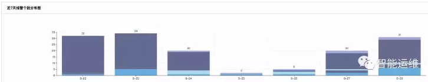
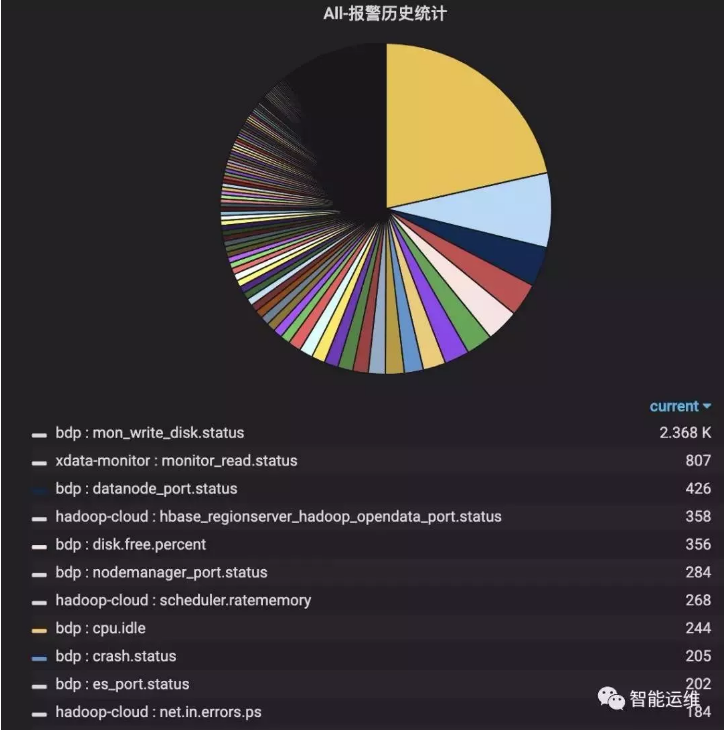
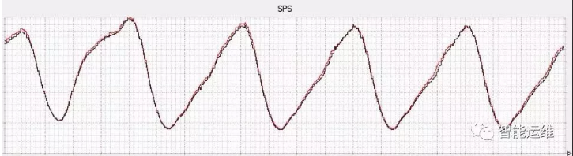
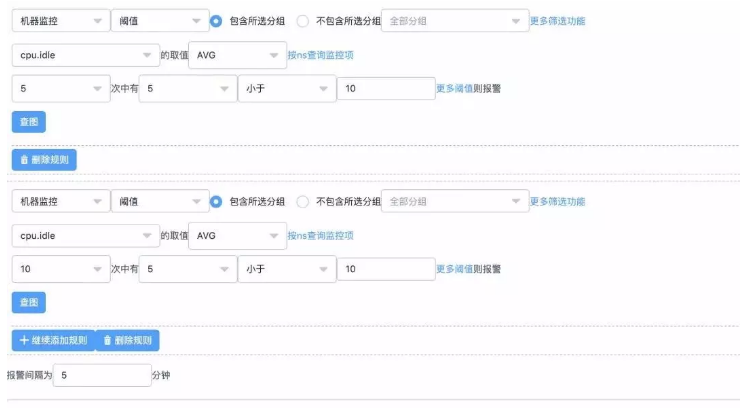
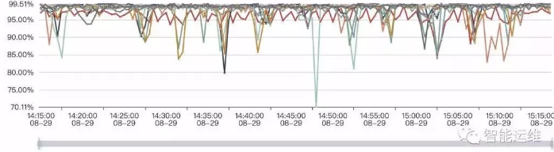
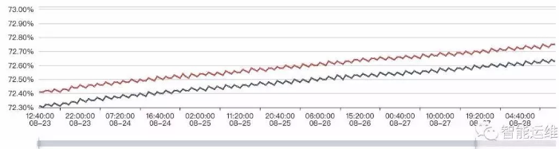
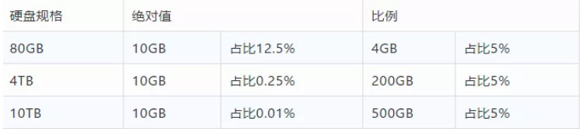

## 摆脱无效报警？十年运维监控报警优化经验总结

焦振清 2019-10-17 17:00:32

**Google SRE每周十条故障报警**

 

运维工程师面试者第一个问题是：需要值班吗？

 

笔者自己也曾经历过月入十万的时期，在那个时候，数个系统同时发布下一代版本，而老系统还需要过渡很长时间，工作量直接翻倍。

 

大家只能勉强应付一线运维工作，团队成员开始陆续离职，而新人又无法在短时间内上手，整体情况不断恶化，持续半年左右才缓过劲来。

 

下面两张截图是我挑选的两个团队一周报警数的对比图，前者的单日报警量最高是55348条，后者单日的报警量最高为34条，两者相差1600倍，而前者才是国内很多互联网运维团队的真实写照。

 

 

 

在管理大规模集群的情况下，究竟有多少报警量才是合理的呢？

 

Google SRE每周只有十条报警，如果超过十条，说明没有把无效报警过滤掉（Google SRE仅负责SLA要求为99.99%的服务）。

 

笔者所在的团队要求则是，每周至多两晚有报警，单日报警量不能超过50条（比Google SRE放水好多啊）。

 

通过控制单日报警数量，严格约束夜间报警天数，确保最少不低于四人参与值班，笔者所在的团队，近几年来，不仅少有因为值班压力而离职的同学，而且我们每年都能持续招聘到985前20名学校的多个研究生。

 

那么，怎么做到呢，以下是笔者的一些经验分享。

 

**运维工程角度看报警优化**

 

**1）报警值班和报警升级**

 

基于值班表，每天安排两人进行值班处理报警，将值班压力从全团队压缩在两人范围内，从而让团队能够有足够的时间和人力进行优化工作。

 

同时，为了避免两个值班人员都没有响应报警，可以使用报警升级功能，如果一个报警在5min内值班人员均未响应，或者15min内未处理完毕，或者有严重故障发生，都可以将报警进行升级，通告团队其他成员协助处理。

 

如果公司的监控系统暂不支持值班表功能，则通过人工定期修改报警接收人的方式进行。

 

而对于监控系统不支持报警升级的问题，通过自行开发脚本的方式，也能在一定程度上得到解决。

 

也可以将报警短信发送至商业平台来实现。总之一句话，办法总比问题多。

 

对于报警值班人员，需要随时携带笔记本以方便处理服务故障，这个要求，和报警数量多少以及报警的自动化处理程度并无关系，仅和服务重要性有关。

 

对于节假日依然需要值班的同学，公司或者部门也应该尽量以各种方式进行补偿。

 

**2）基于重要性不同，分级应对**

 

一个问题请大家思考一下，如果线上的服务器全部掉电后以短信方式通知值班人员，那么线上一台机器的根分区打满，也通过短信来通知是否有必要。

 

上述的问题在日常工作也屡屡发生，对于问题、异常和故障，我们采取了同样的处理方式，因此产生了如此多的无效报警。

 

Google SRE的实践则是将监控系统的输出分为三类，报警、工单和记录。

 

SRE的要求是所有的故障级别的报警，都必须是接到报警，有明确的非机械重复的事情要做，且必须马上就得做，才能叫做故障级别的报警。其他要么是工单，要么是记录。

 

在波音公司装配多个发动机的飞机上，一个发动机熄火的情况只会产生一个”提醒“级别的警示（最高级别是警报，接下来依次是警告、提醒、建议），对于各种警示，会有个检查清单自动弹出在中央屏幕上，以引导飞行员找到解决方案。

 

如果是最高级别的警报，则会以红色信息，语音警报，以及飞机操纵杆的剧烈震动来提示。如果这时你什么都不做，飞机将会坠毁。

 

 

**3）故障自愈**

 

重启作为单机预案，在很多业务线，可以解决至少50%的报警。没有响应，重启试试，请求异常，重启试试，资源占用异常，重启试试，各种问题，重启都屡试不爽。

 

换言之，针对简单场景具有明确处置方案的报警，自动化是一个比较好的解决方案，能够将人力从大量重复的工作中解放出来。

 

自动化处理报警的过程中，需要注意以下问题：

 

- 自动化处理比例不能超过服务的冗余度（默认串行处理最为稳妥）；

- 不能对同一个问题在短时间内重复多次地自动化处理（不断重启某个机器上的特定进程）；

- 在特定情况下可以在全局范围内快速终止自动化处理机制；

- 尽量避免高危操作（如删除操作、重启服务器等操作）；

- 每次执行操作都需要确保上一个操作的结果和效果收集分析完毕（如果一个服务重启需要10min）。

   

 

**4）报警仪表盘，持续优化TOP-3的报警**

 

如下图示，全年TOP-3的报警量占比达到30%，通过对TOP-3的报警安排专人进行跟进优化，可以在短时间大幅降低报警量。

 

 

TOP-3只是报警仪表盘数据分析的典型场景之一，在TOP-3之后，还可以对报警特征进行分析，如哪些模块的报警最多，哪些机器的报警最多，哪个时间段的报警最多，哪种类型的报警最多，进而进行细粒度的优化。

 

同时，报警仪表盘还需要提供报警视图的功能，能够基于各种维度展示当前有哪些报警正在发生，从而便于当短时间内收到大量报警，或者是报警处理中的状态总览，以及报警恢复后的确认等。

 

**5）基于时间段分而治之**

 

下图是国内非常典型的一类流量图，流量峰值在每天晚上，流量低谷在每天凌晨。

 

 

从冗余度角度来分析，如果在流量峰值有20%的冗余度，那么在流量低谷，冗余度至少为50%。

 

基于冗余度的变换，相应的监控策略的阈值，随机也应该发生一系列的变化。

 

举例来说，在高峰期，可能一个服务故障20%的实例，就必须介入处理的话，那么在低谷期，可能故障50%的实例，也不需要立即处理，依赖于报警自动化处理功能，逐步修复即可。

 

在具体的实践中，一种比较简单的方式就是，在流量低谷期，仅接收故障级别的报警，其余报警转为静默方式或者是自动化处理方式，在流量高峰期来临前几个小时，重新恢复，这样即使流量低谷期出现一些严重隐患，依然有数小时进行修复。

 

这种方式之所以大量流行，是因为该策略能够大幅减少凌晨的报警数量，让值班人员能够正常休息。

 

**6）报警周期优化，避免瞬报**

 

在监控趋势图中，会看到偶发的一些毛刺或者抖动，这些毛刺和抖动，就是造成瞬报的主要原因。

 

这些毛刺和抖动，至多定义为异常，而非服务故障，因此应该以非紧急的通知方式进行。

 

以CPU瞬报为例，如果设置采集周期为10s，监控条件为CPU使用率大于90%报警，如果设置每次满足条件就报警，那么就会产生大量的报警。

 

如果设置为连续5次满足条件报警，或者连续的10次中有5次满足条件就报警，则会大幅减少无效报警。对于重要服务，一般建议为在3min内，至少出现5次以上异常，再发送报警较为合理。

 

 

**7）提前预警，防患于未然**

 

对于很多有趋势规律的场景，可以通过提前预警的方式，降低问题的紧迫程度和严重性。

 

下图是两台机器一周内的磁盘使用率监控图，可以预见，按照目前的增长趋势，必然会在某一个时间点触发磁盘剩余空间5%的报警，可以在剩余空间小于10%的时候，通过工单或者其他非紧急方式提醒，在工作时间段内，相对从容的处理完毕即可，毕竟10%到5%还是需要一个时间过程的。

 

 

**8）日常巡检**

 

提前预警面向的是有规律的场景，而日常巡检，还可以发现那些没有规律的隐患。

 

以CPU使用率为例进行说明，近期的一个业务上线后，CPU使用率偶发突增的情况，但是无法触发报警条件（例如3分钟内有5次使用率超过70%报警），因此无法通过报警感知。

 

放任不管的话，只能是问题足够严重了，才能通过报警发现。

 

这个时候，如果每天有例行的巡检工作，那么这类问题就能够提前发现，尽快解决，从而避免更加严重的问题发生。

 

**9）比例为主，绝对值为辅**

 

线上机器的规格不同，如果从绝对值角度进行监控，则无法适配所有的机器规格，势必会产生大量无意义的报警。

 

以磁盘剩余空间监控为例，线上规格从80GB到10TB存在多种规格，从下图表格看，比例比绝对值模式能更好的适配各种规格的场景（EXT4文件系统的默认预留空间为5%，也是基于比例设置的并可通过tune2fs进行调整）。

 

 

对于一些特殊场景，同样以磁盘剩余空间为例进行说明，例如计算任务要求磁盘至少有100GB以上空间，以供存放临时文件，那这个时候，监控策略就可以调整为：磁盘剩余空间小于5%报警且磁盘剩余空间绝对值小于100GB报警。

 

**10）Code Review**

 

前人埋坑，后人挖坑。在解决存量问题的情况下，不对增量问题进行控制，那报警优化，势必会进入螺旋式缓慢上升的过程，这对于报警优化这类项目来说，无疑是致命的。

 

通过对新增监控的Code Review，可以让团队成员快速达成一致认知，从而避免监控配置出现千人千面的情况出现。

 

**11）沉淀标准和最佳实践**

 

仅仅做Code Review还远远不够，一堆人开会，面对一行监控配置，大眼瞪小眼，对不对，为什么不对，怎么做更好？大家没有一个标准，进而会浪费很多时间来进行不断的讨论。

 

这时候，如果有一个标准，告诉大家什么是好，那么就有了评价标准，很多事情就比较容易做了。

 

标准本身也是需要迭代和进步的，因此大家并不需要担心说我的标准不够完美。

 

基于标准，再给出一些最佳的监控时间，那执行起来，就更加容易了。

 

以机器监控为例进行说明，机器监控必须覆盖如下的监控指标，且阈值设定也给出了最佳实践，具体如下：

 

- CPU_IDLE < 10 ；

- MEM_USED_PERCENT > 90；

- NET_MAX_NIC_INOUT_PERCENT > 80 （网卡入口/出口流量最大使用率）；

- CPU_SERVER_LOADAVG_5 > 15 ；

- DISK_MAX_PARTITION_USED_PERCENT > 95 （磁盘各个分区最大使用率）；

- DISK_TOTAL_WRITE_KB（可选项）；

- DISK_TOTAL_READ_KB（可选项）；

- CPU_WAIT_IO（可选项）；

- DISK_TOTAL_IO_UTIL（可选项）；

- NET_TCP_CURR_ESTAB（可选项）；

- NET_TCP_RETRANS（可选项）。

   

**12）彻底解决问题不等于自动处理问题**

 

举两个例子，大家来分析一下这个问题是否得到彻底解决：

 

如果一个模块经常崩掉，那么我们可以通过添加一个定时拉起脚本来解决该问题。

 

那这个模块崩掉的问题解决了吗？其实并没有，你增加一个拉起脚本，只是说自己不用上机器去处理了而已，但是模块为什么经常崩掉这个问题，却并没有人去关注，更别提彻底解决了。

 

如果一个机器经常出现CPU_IDLE报警，那么我们可以将现在的监控策略进行调整。

 

比如说，以前5min内出现5次就报警，现在可以调整为10min内出现20次再报警，或者直接删除这个报警策略，或者将报警短信调整为报警邮件，或者各种类似的手段。

 

但这个机器为什么出现CPU_IDLE报警，却并没有人去关注，更别提解决了。

 

通过上面两个例子，大家就理解，自动化处理问题不等于解决问题，掩耳盗铃也不等于解决问题，什么叫做解决问题，只有是找到问题的根本原因，并消灭之，才能确保彻底解决问题，轻易不会再次发生。

 

还是上面自动拉起的例子，如果仔细分析后，发现是内存泄露导致的进程频繁崩掉，或者是程序bug导致的coredump，那么解决掉这些问题，就能够彻底避免了。

 

**如何解决团队内部的值班排斥情绪**

 

每个运维团队早晚都会面对团队高工对值班工作的排斥，这也是人之常情。

 

辛辛苦苦干了几年了，还需要值班，老婆孩子各种抱怨，有时候身体状况也不允许了，都不容易。

 

不同的团队，解决方式不同，但有些解决方案，会让人觉得，你自己都不想值班，还天天给我们打鸡血说值班重要。

 

更严重一些的，会让团队成员感受到不公平，凭什么他可以不值班，下次是不是我们大家也可以找同样的理由呢。

 

笔者的团队是这样明确说明的：

 

保证值班人员数量不低于四人，如果短时间内低于四人，那么就需要将二线工程师短暂加入一线值班工作中，为期不超过三个月。

 

对于希望退出值班列表的中级工程师，给三个月不值班时间，如果能将目前的报警短信数量优化20%-50%，则可以退出值班序列，但如果情况反弹，则需要重回值班工作。

 

团队达到一定级别的工程师，就可以转二线，不参与日常值班工作，仅接收核心报警，且对核心报警的有效性负责，若服务故障核心报警未发出，则每次罚款两百。

 

团队负责人不参与值班工作，但需要对单日报警数量负责，如果当周的日报警数量大于要求值，则每次罚款两百元。如果团队成员数量低于四人时，则需要加入值班列表。

 

**写在最后**

 

在团队的报警量有了明显减少后，就需要对报警的准确性和召回率进行要求了，从而才能持续的进行报警优化工作。

 

所谓的准确性，也就是有报警必有损，而召回率呢，则是有损必有报警。

 

最后，祝愿大家都不在因为值班工作而苦恼！

 

作者丨焦振清

来源丨智能运维（ID：Automate_Everything）

dbaplus社群欢迎广大技术人员投稿，投稿邮箱：editor@dbaplus.cn