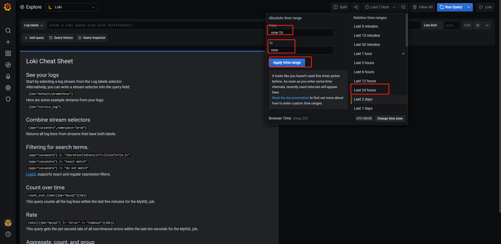
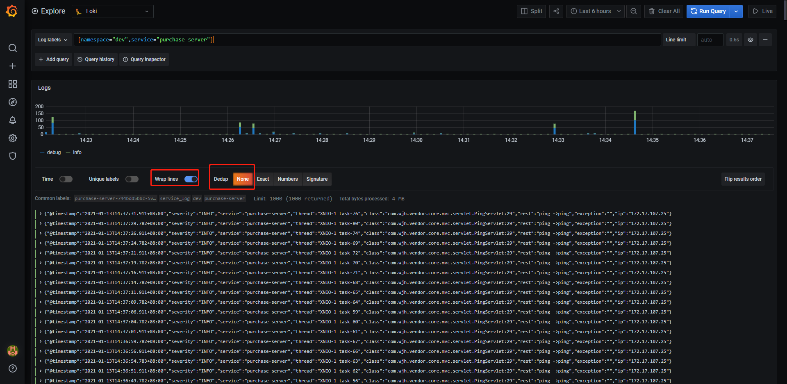
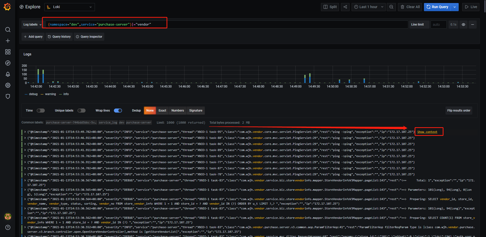
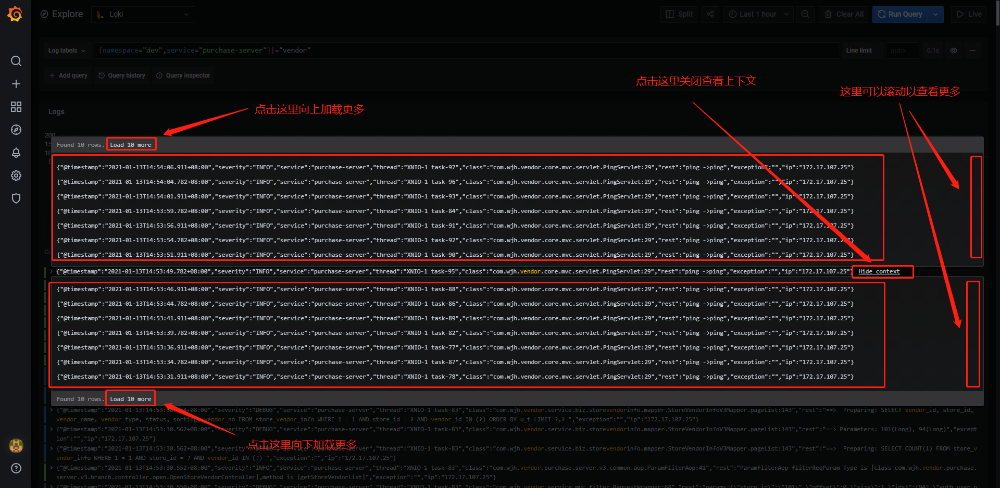
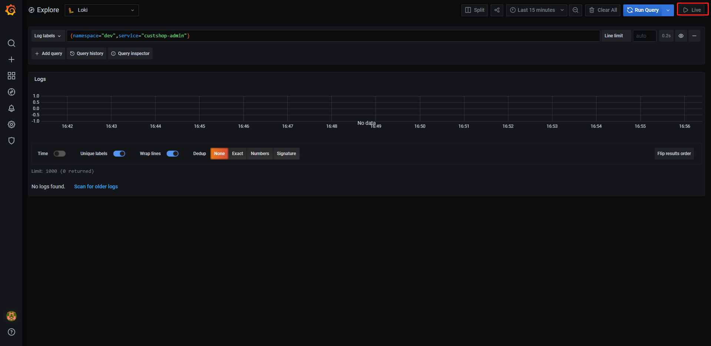
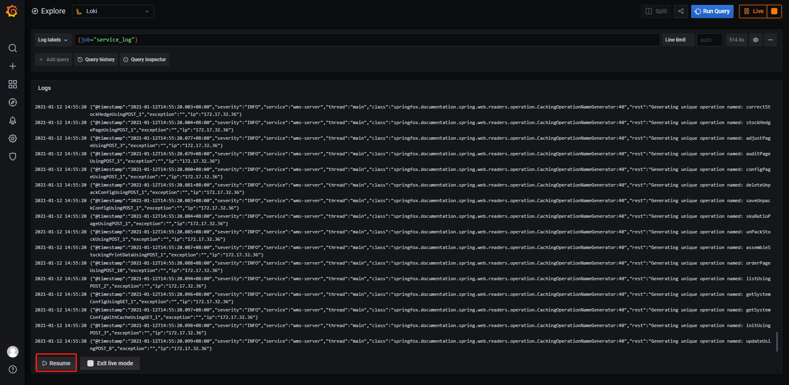
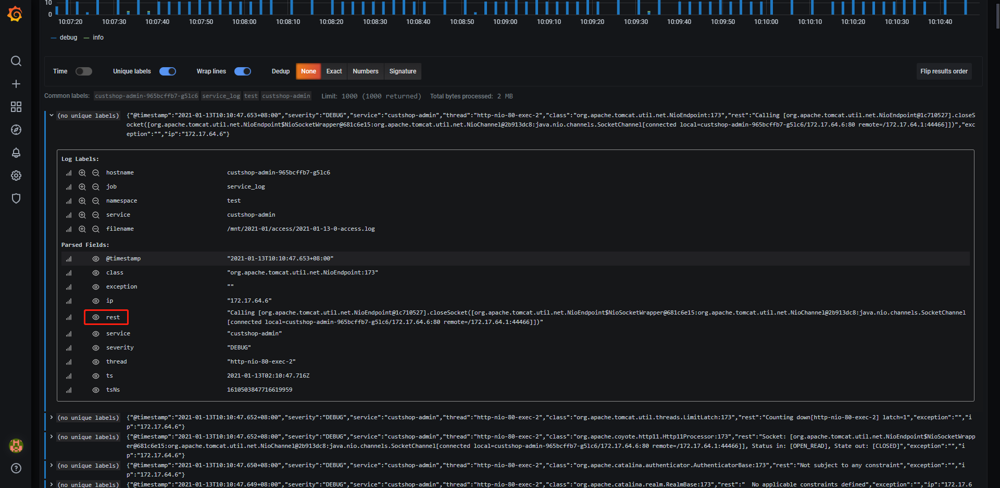
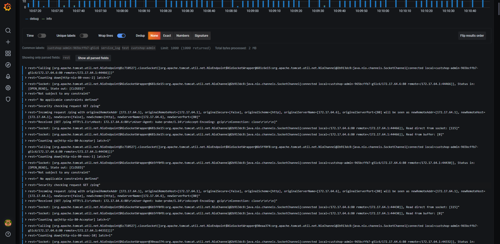

浏览器访问日志服务地址+`/explore`

# 搜索

## 搜索指定的服务以及服务容器

搜索key声明:

| 搜索key   | 含义             | 值列举/说明    | 值含义         |
| --------- | ---------------- | -------------- | -------------- |
| namespace | 命名空间或者环境 | dev            | 开发环境       |
|           |                  | stage          | 测试环境       |
| service   | 服务名           | <各自的服务名> | <各自的服务名> |
| hostname  | 容器名称         | <容器名称>     | <容器名称>     |

容器名称可以从运维系统获取


查询语法:

{namespace="$namespace",service="$service", hostname="$hostname"}

案例数据:

{namespace="dev",service="custshop-admin", hostname=""}

点击Run Query进行查询

## 指定字符串

在输入框上加入

```
|="字符串值"
```

同时搜索多个字符串, 多个条件并存( a or b)

```
|~ "字符串1|字符串2"
```

前后过滤多个条件(a and b)

```
|="字符串值1" |="字符串值2"
```

如果字符串中包含特殊字符:

方式1: 使用\去转义即可

方式2: 使用``包裹即可, 尽量不要使用这个, 因为目前版本这样搜索出来的结果没有高亮

```
|=`:`
```

## 指定指标

目前应用于告警的查询语句中

{{.指标名}}

如果指标有多层则使用为{{.指标名1_指标名2}}

```
| json | line_format "{{.severity}}" |= "DEBUG"
```

## 指定时间范围

可以查看最近一天或者一个小时或者1分钟

也可以查看指定时间范围

选取时间范围过大会导致查询过慢(底层原理并非为前期建立索引导致), 但是实际上也并不慢



# 查看

适配多行去展示



## 查看检索条件的上下文

找到一条查询记录, 在尾部点击 `Show context`




## 实时查看(自动滚动)

点击右上角的Live即可



自动滚动模式下滚手动滚动会导致自动滚动石失效, 需要点击左下角的Resume恢复自动滚动




## 查看指定指标

点击指定指标即可



效果如下




