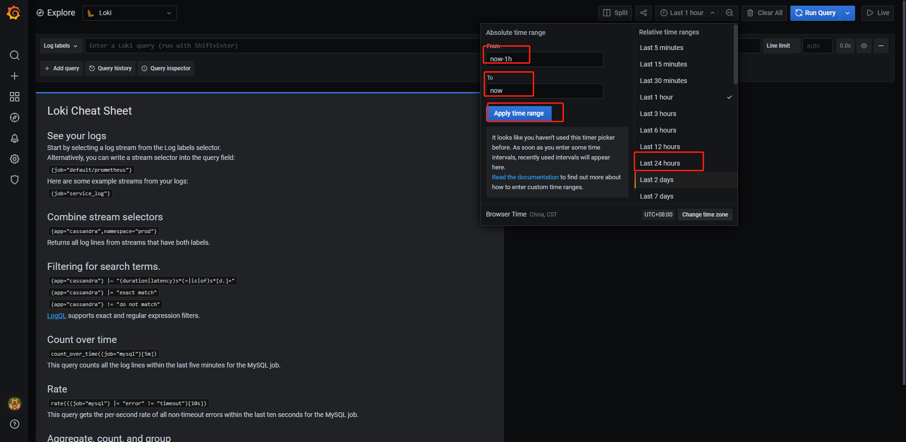
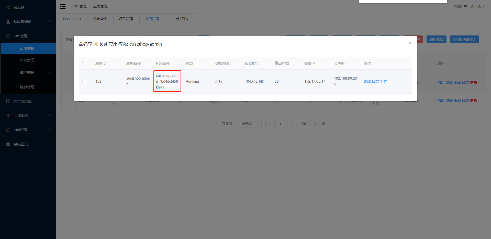
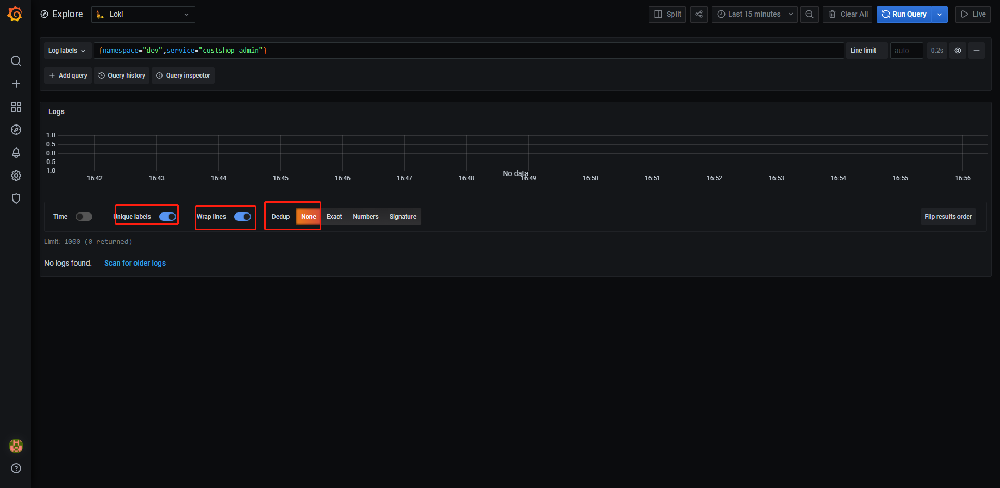
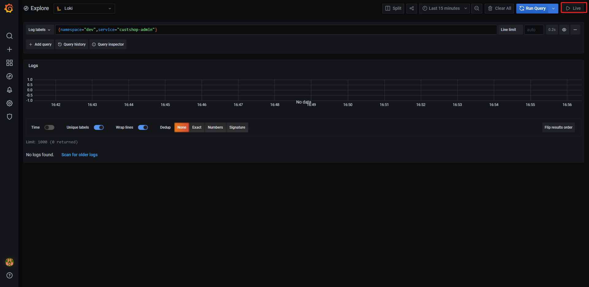

浏览器访问日志服务地址+`/explore`

# 调整时间范围

可以查看最近一天或者一个小时或者1分钟

也可以查看指定时间范围

选取时间范围过大会导致查询过慢(底层原理并非为前期建立索引导致), 但是实际上也并不慢

# 查看指定的服务以及服务容器

值声明:

|           |                  |                |                |
| --------- | ---------------- | -------------- | -------------- |
| namespace | 命名空间或者环境 | dev            | 开发环境       |
| service   | 服务名           | <各自的服务名> | <各自的服务名> |
| hostname  | 容器名称         | <容器名称>     | <容器名称>     |

容器名称可以从运维系统获取

查询语法:

{namespace="$namespace",service="$service", hostname="$hostname"}

案例数据:

{namespace="dev",service="custshop-admin", hostname=""}

点击Run Query进行查询

# 一些过滤

# 实时查看(自动滚动)

点击右上角的Live即可

