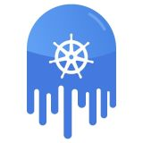

[ k8s技术圈](https://jishuin.proginn.com/u/468320)|1322020-10-15 20:56000

小白之前有通过Grafana设置Loki数据源的骚操作来做日志告警，虽然能直接在Grafana面板上配置告警，但它们还是没办法集中维护和管理。小白前面介绍了那么多关于Loki的文章，那么它有没有像Prometheus一样的rules来管理策略呢？答案是肯定的！

根据Loki的RoadMap，Ruler组件将于`Loki 1.7.0`版本正式推出。那么小白今天先带大家尝尝鲜，体验下在Loki里日志告警的正确姿势。

#### Loki Ruler

Loki1.7将包含一个名为Ruler的组件，它是从Crotex项目里面引入进来的（还记得Loki分集群的架构吗？）Ruler的主要功能是持续查询rules规则，并将超过阈值的事件推送给Alert-Manager或者其他Webhook服务。结合Cortex，Loki的Ruler组件也是如上的架构。可以看到loki和cortex的架构主要区别只剩下Configs API了。?不过，牛逼的是借助注册到consul的一致性hash环，Loki的ruler同样支持多实例的分布式部署，实例和实例之间会自己根据分片协调需要使用的rules。不过这是一个动态的过程，`任何ruler实例的添加或删除都会导致rules的重新分片`。

当前启用Loki的ruler组件比较简单，只要将下列的相关配置引入，并在Loki启动的参数里面加入`-target=ruler`即可。

```
ruler:
    # 触发告警事件后的回调查询地址
    # 如果用grafana的话就配置成grafana/explore
    external_url:
  
    # alertmanager地址 
    alertmanager_url: 
    enable_alertmanager_v2: true
  
    # 启用loki rules API
    enable_api: true
    
    # 对rules分片，支持ruler多实例
    enable_sharding: true
  
    # ruler服务的一致性哈希环配置，用于支持多实例和分片
    ring:
        kvstore:
            consul:
                host: :8500
            store: consul
  
    # rules临时规则文件存储路径
    rule_path: /tmp/rules
   
    # rules规则存储
    # 主要支持本地存储（local）和对象文件系统（azure, gcs, s3, swift）
    storage:
      type: local
      local:
        directory: /loki/rules
      
    # rules规则加载时间    
    flush_period: 1m
```

> 想快速体验Ruler的同学，可以用小白之前docker-compose来部署demo
>
> https://github.com/CloudXiaobai/loki-cluster-deploy/tree/master/demo/docker-compose

#### Alert配置

Loki的rulers规则和结构与Prometheus完全兼容，唯一的区别在于查询语句不同。在Loki中我们用`logQL`来查询日志指标。一个典型的rules配置说明如下：

```
groups:
  # 组名称
  - name: 
    rules:
      # Alert名称
      - alert: 
        # logQL查询语句
        expr: 
        # 产生告警的持续时间
        pending.
        [ for:  | default = 0s ]
        # 自定义告警事件的label
        labels:
        [ :  ]
        # 告警时间的注释
        annotations:
        [ :  ]
```

举个栗子，如果小白想通过日志查到某个业务日志的错误率大于5%就触发告警，那么可以配置成这样：

```
groups:
  - name: should_fire
    rules:
      - alert: HighPercentageError
        expr: |
          sum(rate({app="foo", env="production"} |= "error" [5m])) by (job)
            /
          sum(rate({app="foo", env="production"}[5m])) by (job)
            > 0.05
        for: 10m
        labels:
            severity: page
        annotations:
            summary: High request latency
```

当告警事件产生时，我们在alert-manager上就能收到该事件的推送。

**Ruler用途**

- 还没用metrics做应用监控告警时

对于有些业务可能没有暴露自己程序运行时的metrics时，这个时候我们可以借助查询日志的方法去构建相关的指标告警是比较容易的。比如上面提到的应用错误率的告警。

- 黑匣子监控

对于完全不受我们控制的应用（开源服务或者三方闭源产品），在他们不提供监控指标时，我们采用查询日志指标的方式不失为一个快速的方法。

下面这个就是某大佬利用nginx日志和logQL做的监控和告警大盘，简直不要太炫酷。


- 响应应用的事件

对于有些应用的特殊的事件，我们也可以利用Loki的ruler来做相关的通知，比如检查日志中的base auth认证泄漏事件

```
- name: credentials_leak
  rules: 
    - alert: http-credentials-leaked
      annotations: 
        message: "{{ $labels.job }} is leaking http basic auth credentials."
      expr: 'sum by (cluster, job, pod) (count_over_time({namespace="prod"} |~ "http(s?)://(\\w+):(\\w+)@" [5m]) > 0)'
      for: 10m
      labels: 
        severity: critical
```

- High-Cardinality高基告警

看过小白之前《Loki最佳实践》的同学知道，在Loki中high-cardinality会严重拖慢查询效率。这部分查询会在接下来的`LogQL v2`语法中实现。