# Loki-Promtail-Grafana抓取处理日志项目：三

[一. 准备](https://www.zhangruitang.com/268/2/#一_准备)[问题的提出](https://www.zhangruitang.com/268/2/#问题的提出)[二. 安装和配置](https://www.zhangruitang.com/268/2/#二_安装和配置)[Docker安装并启动Prometheus](https://www.zhangruitang.com/268/2/#Docker安装并启动Prometheus)[Docker安装并启动node exporter](https://www.zhangruitang.com/268/2/#Docker安装并启动node_exporter)[启动并配置Alert Manager](https://www.zhangruitang.com/268/2/#启动并配置Alert_Manager)[在Prometheus中配置Alert Manager告警规则](https://www.zhangruitang.com/268/2/#在Prometheus中配置Alert_Manager告警规则)[创建一个springboot工程来显示触发告警的信息](https://www.zhangruitang.com/268/2/#创建一个springboot工程来显示触发告警的信息)[触发告警](https://www.zhangruitang.com/268/2/#触发告警)

## 一. 准备

### 问题的提出

在之前配置好了Loki系列之后，我们现在能在相应的位置查看日志信息，包括ERROR、WARN等信息，但是Loki和Grafana的官方还并没有把Alert，也就是告警功能发布，所以在Grafana上面直接是显示的该数据源（Loki）的Alert不可用。

在此我就引入了Prometheus+Alertmanager+Node exporter来完成告警模块。

在把Prometheus等插件装上服务器之前，我现在自己的Windows 10 pro机器中的docker进行测试。

Docker的安装在此我不赘述，win10下直接就有安装包安装。重要的是对Prometheus等插件的安装和配置。我参考了以下文章的一些方法：https://blog.csdn.net/aixiaoyang168/article/details/98474494

## 二. 安装和配置

### Docker安装并启动Prometheus

首先把在Docker中pull Prometheus，在控制台中输入：

docker pull prom/prometheus

之后，电脑会自动下载Prometheus的最新版（latest）。

然后就需要输入以下内容来部署Prometheus：

docker run --name prometheus -d -p 9090:9090 prom/prometheus:latest

\# --name指定Docker中的名称，-p指的是部署端口 最后的是包名称

部署完成后我们就可以在浏览器中输入localhost:9090来打开Prometheus的主窗口：

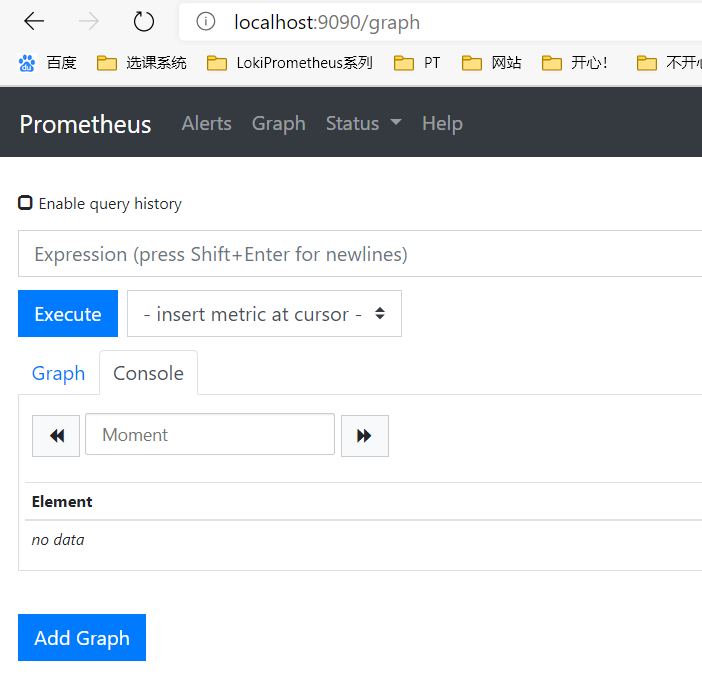首页自动定位到了graph界面

### Docker安装并启动node exporter

首先在Docker中pull node exporter，但是在控制台中直接使用docker run命令，而并没有pull的话，他会检测到，然后自动pull最新版（latest）的node exporter，所以我们在此直接使用docker run命令：

docker run --name node-exporter -d -p 9100:9100 prom/node-exporter:latest

部署完成后我们可以在浏览器中输入localhost:9100来验证。

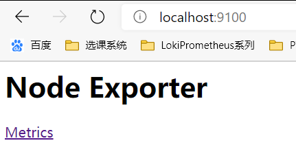安装成功并启动

- Prometheus配置node exporter

接下来，我们需要将node exporter信息配置到 Prometheus 中，来让 Prometheus 定期获取 exporter 采集的信息，那么就需要修改prometheus.yml配置文件，在scrape_configs下新增一个 job，内容如下：

  \- **job_name:** 'node-exporter' # 新增的job名称

​    **static_configs:**

​      \- **targets:** ['localhost:9100'] # 此处是node exporter的请求地址，默认是http方式，请求地址的默认后缀位/metric，如果有更改，那么久需要配置metrics_path。

然后重新载入Prometheus服务：

docker run --name prometheus -d -p 9090:9090 -v 配置文件根目录:yml文件目标位置 prom/prometheus --config.file=yml文件目标位置/prometheus.yml 

然后打开Prometheus的界面，就能够在targets中查看到已经载入了node exporter的服务了：

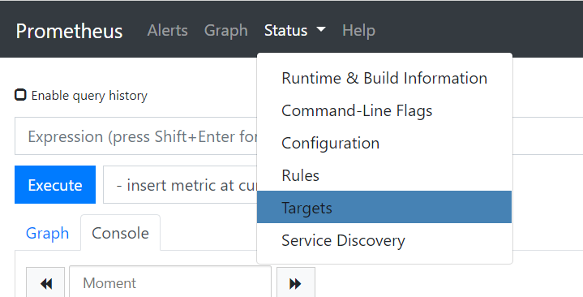选择targets

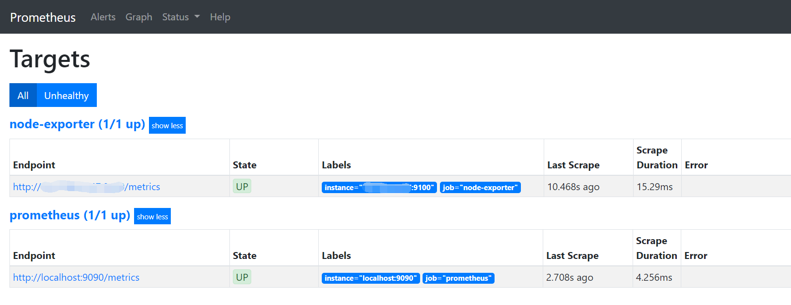此处两个job都处于up状态了。

### 启动并配置Alert Manager

同样，我们首先通过docker run来完成pull和run：

docker run --name alertmanager -d -p 9093:9093 prom/alertmanager:latest

完成后，我们可以在浏览器中输入localhost:9093来验证AlertManager是否安装成功。

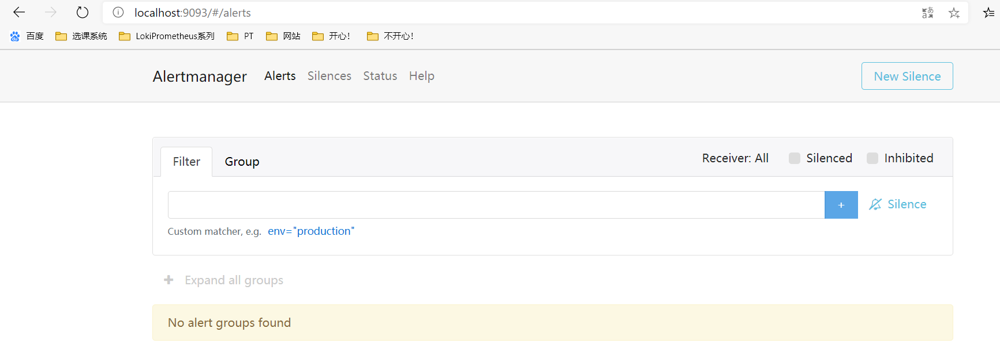安装成功，但是我们还没有配置告警，所以是没有数据返回的。

此时我想通过webhook来完成告警，此时我需要创建一个alertmanager.yml来配置告警信息：

**global:**

  **resolve_timeout:** 5m

**route:** # route用来设置报警的分发策略

  **group_by:** ['alertname'] # 采用哪个标签来作为分组依据

  **group_wait:** 10s # 组告警等待时间。也就是告警产生后等待10s，如果有同组告警一起发出

  **group_interval:** 10s # 两组告警的间隔时间

  **repeat_interval:** 1h # 重复告警的间隔时间，减少相同邮件的发送频率

  **receiver:** 'web.hook' # 设置默认接收人

**receivers:**

\- **name:** 'web.hook'

  **webhook_configs:**

  \- **url:** 'http://localhost:5050/getMessage' # 注意，这个输出的url是需要后续配置的

**inhibit_rules:**

  \- **source_match:**

​      **severity:** 'critical'

​    **target_match:**

​      **severity:** 'warning'

​    **equal:** ['alertname', 'dev', 'instance']

然后就修改启动命令，把alertmanager.yml配置进AlertManager的启动中，在控制台输入：

docker run -d --name alertmanager -p 9093:9093 -v 本地路径:yml文件目标位置 prom/alertmanager --config.file=yml文件目标位置/alertmanager.yml 

### 在Prometheus中配置Alert Manager告警规则

我们首先新建一个规则文件 node-up.rules:

**groups:**

\- **name:** node-up

  **rules:**

  \- **alert:** node-up

​    **expr:** up{job="node-exporter"} == 0

​    **for:** 15s

​    **labels:**

​      **severity:** 1

​      **team:** node

​    **annotations:**

​      **summary:** "{{ $labels.instance }} 已停止运行超过 15s！"

这里的意思是，如果在Prometheus中检测到node exporter停止了15秒以上，就会触发告警。也就是说，我们把node exporter关掉15秒以后就会触发报警。

之后，需要在prometheus.yml中添加规则文件的位置：

**rule_files:**

  \- "/设置的位置/*.rules"

设置的位置需要在docker中重新引入：

添加 -v 本地位置:.rules的位置（也就是设置的位置）

### 创建一个springboot工程来显示触发告警的信息

创建Springboot工程在此就不赘述，我们只需要spring web服务，所以不需要添加更多的依赖。

然后我们新建一个controller：

**package** *com.zrt.webhook_init*;

**import** *org.slf4j.Logger*;

**import** *org.slf4j.LoggerFactory*;

**import** *org.springframework.web.bind.annotation.RequestMapping*;

**import** *org.springframework.web.bind.annotation.RestController*;

**import** *org.springframework.ui.Model*;

@RestController

**public** **class** webhookController {

​    **private** **static** **final** Logger log = LoggerFactory.getLogger(webhookController.class);

​    @RequestMapping("/getMessage")

​    **public** **String** index(Model model){

​        **try**{

​            log.info("webhook已发送信息给指定url");

​        }

​        **catch** (Exception e){

​            log.error(e.getMessage(),e);

​        }

​        **return**"启动完毕。";

​    }

}

这里的意思是，如果我们对webhook的指定位置发送了/getMessage信息，也就是告警触发，那么就能够在控制台验证结果。然后让工程跑起来，那么也就相当于开始监听了。

### 触发告警

上边我们定义的 rule 规则为监测 `job="node-exporter"` Node 是否活着，那么就可以停掉 `node-exporter` 服务来间接起到 Node Down 的作用，从而达到报警条件，触发报警规则。

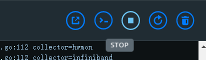我们可以直接在docker中停止node exporter

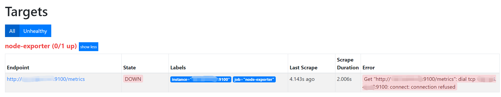然后在Prometheus的界面中我们可以看见node exporter已经处于DOWN状态了。

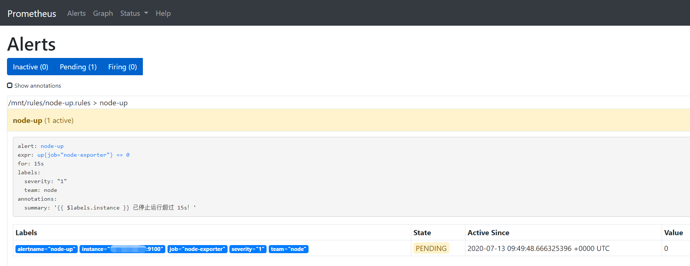接下来在Prometheus的Alert界面中发现我们之前设置的告警已经进入预备状态。

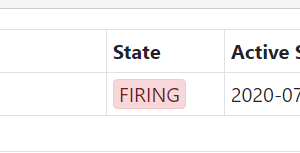等到规定的15s后，报警将触发，也就是进入FIRING状态

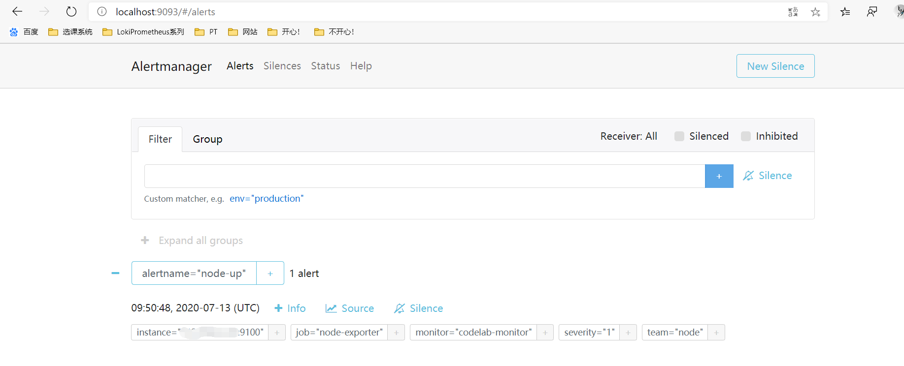我们在AlertManager的界面中可以收到告警。

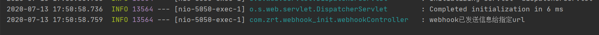最后我们在springboot的工程中验证到webhook已经发送了消息了。

至此，我们就完成了告警系统的测试，接下来就要实际部署到服务器上了。