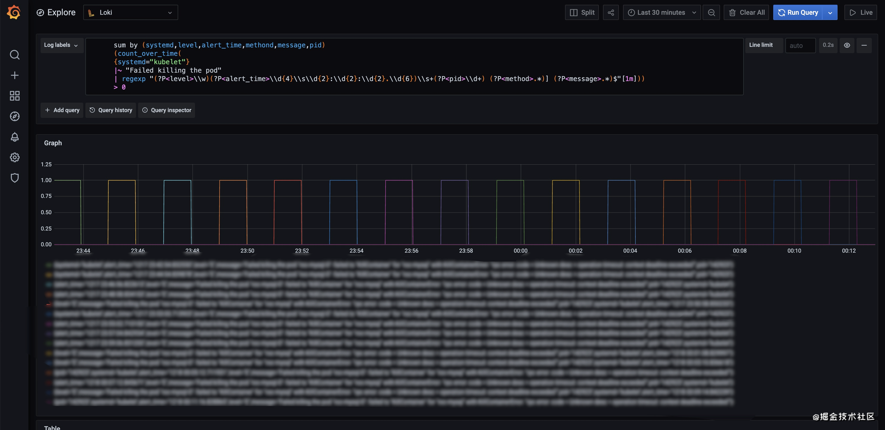

# 年轻人，不讲武德？Loki告警日志内容的骚方法

2020-12-21 14:21:22 阅读数 6056 收藏 0

很多小伙伴在用Loki的Ruler配置日志告警规则时都会有一个大胆的想法：

*“ 要是能把日志内容告出来该多好 ”*

在LogQL V1的时代，受限于简单的日志过滤解释器影响，我们往往只能通过简单的聚合函数将日志转化成区间向量加以告警，它的规则大改就像这个样子：

```
rules:
  - alert: xxx告警
    expr: sum(count_over_time({<日志标签>} |~ "xx关键字或者正则匹配字符串"[1m])) by (xxx) > 0
    for: 0
    labels:
      service: xxx服务
    annotations:
      summary: "xxx服务出现xx错误{{ $labels.value }}次"
```

可以看到使用V1的语法将日志转成区间向量后，只保留日志流中原本的标签，而这里面的信息量极少，对于我们接收到日志告警时，期待看到的关键信息来说是远不够的。

有的同学就说了，*“ 那我把关键信息放到日志流的label中不就好了？”*

当然可以，不过考虑到两个成本，我相信你很快就会放弃这个想法。

**1. 日志采集端的逻辑过于复杂**

直接在日志采集端提取日志的关键信息作为标签，虽然理论上可行，不过在不同的业务、实例里面都要维护这套规则本身会带来大量的运维配置操作，相比在中心的的Loki实例上直接查询，时间成本上来说得不偿失。

**2. 过多的日志流标签拖垮Loki性能**

稍微了解Loki的小伙伴应该都知道，Loki不会索引日志内容，而是对日志流进行索引的，这样它能通过日志流的标签快速的查询出与之对应的日志内容。所以在小白之前文章中提到[《Loki最佳实践》](https://juejin.cn/post/"Loki最佳实践")无界限的Label会造成高基，严重则直接拖垮集群。

那么有没有骚方法来解决上述矛盾呢？经过小白的测试，当下我们通过LogQL V2的语法还真可以解决这个问题。

## 1. 主要思路

[LogQL v2](https://grafana.com/docs/loki/latest/logql)的主要更新点在于将以往的`log-filter`换成了`log-pipeline`。在日志管道内我们可以通过`Parser Expression`将日志内容解析到label当中在做聚合处理。它大改的流程如下：

```
日志流 -> 日志解析器 > 日志流（包含新label）> 日志过滤器 > 聚合函数
```

当下日志解释器分别支持`regexp`、`logfmt`和`json`这3种类型的格式处理。接下来小白分别对这3种格式的日志做一个简单的处理

### regexp - 正则解析

大部分情况下我们的日志没有经过特殊格式化，它就像如下格式一样，这里我拿kubelet杀死nginx容器失败的日志来做告警样例

**日志格式**

```
E1217 23:38:52.832192  142923 kubelet_pods.go:1093] Failed killing the pod "nginx: failed to "KillContainer" for "nginx" with KillContainerError: "rpc error: code = Unknown desc = operation timeout: context deadline exceede
```

**告警规则**

```
rules:
  - alert: kubelet faild killing pod 
    expr: |
      sum by (systemd,level,alert_time,method,message,pid)
      (count_over_time(
      {systemd="kubelet"} 
      |~ "Failed killing the pod"
      | regexp "(?P<level>\\w)(?P<alert_time>\\d{4}\\s\\d{2}:\\d{2}:\\d{2}.\\d{6})\\s+(?P<pid>\\d+) (?P<method>.*)] (?P<message>.*)$"[1m]))
      > 0
    for: 0
    labels:
      severity: high
    annotations:
      summary: "服务: {{ $labels.systemd }}
                进程: {{ $labels.pid }}
                时间：{{ $labels.alert_time }}
                级别: {{ $labels.level }}
                方法：{{ $labels.method }}
                内容：{{ $labels.message }}"
```

我们可以用expr中的语句在grafana的Expolre中进行验证，如果能得到如下的度量指标这表示语句正常

### logfmt格式

[logfmt](https://brandur.org/logfmt)格式的日志是一个可阅读性较好的结构化格式，LogQL V2的解释器能够直接提取logfmt的日志，下列我们以docker的日志为例子,我们要将error级别中关于OCI运行时报错的内容告警出来：

**日志格式**

```
time="2020-12-17T04:09:13.227200674+08:00" level=error msg="Handler for POST /containers/7912b27694555c0d6645011ad901d94425b032cd48fe3f2f3c9d0e631e1cee79/start returned error: OCI runtime create failed: container_linux.go:345: starting container process caused \"process_linux.go:303: getting the final child's pid from pipe caused \\\"EOF\\\"\": unknown"
```

**告警规则**

```
rules:
  - alert: Docker OCI runtime exec faild
    expr: |
      sum by (time,level,systemd,msg)
      (count_over_time(
      {systemd="docker"}
      | logfmt
      | level = "error"
      |~ "OCI" [1m]))
      > 0
    for: 0
    labels:
      severity: high
    annotations:
      summary: "服务: {{ $labels.systemd }}
                时间：{{ $labels.time }}
                级别: {{ $labels.level }}
                内容：{{ $labels.msg }}"
```

同样我们在Explore中进行验证

### json格式

[json](https://www.json.org/json-zh.html)是一种轻量级的数据交换格式，虽然可阅读性没有logfmt那么好，不过好在简单和易解析的优势，在很多开源服务里面也采用了此格式。在LogQL中json解释器的用法和logfmt一样，小白转化一下大家自然明白：

**日志格式**

```
{"time":"2020-12-17T04:09:13.227200674+08:00","level":"error","msg":"Handler for POST /containers/7912b27694555c0d6645011ad901d94425b032cd48fe3f2f3c9d0e631e1cee79/start returned error: OCI runtime create failed: container_linux.go:345: starting container process caused \"process_linux.go:303: getting the final child's pid from pipe caused \\\"EOF\\\"\": unknown"}
```

**告警规则**

```
rules:
  - alert: Docker OCI runtime exec faild
    expr: |
      sum by (time,level,systemd,msg)
      (count_over_time(
      {systemd="docker"}
      | json
      | level = "error"
      |~ "OCI" [1m]))
      > 0
    for: 0
    labels:
      severity: high
    annotations:
      summary: "服务: {{ $labels.systemd }}
                时间：{{ $labels.time }}
                级别: {{ $labels.level }}
                内容：{{ $labels.msg }}"
```

## 2. 启用Ruler

### Ruler配置

当前启用Loki的Ruler组件比较简单，只要将下列的相关配置引入，并在Loki启动的参数里面加入`-target=ruler `即可。

```
ruler:
    # 触发告警事件后的回调查询地址
    # 如果用grafana的话就配置成grafana/explore
    external_url:
  
    # alertmanager地址 
    alertmanager_url: <alertmanager_endpoint>
    enable_alertmanager_v2: true
  
    # 启用loki rules API
    enable_api: true
    
    # 对rules分片，支持ruler多实例
    enable_sharding: true
  
    # ruler服务的一致性哈希环配置，用于支持多实例和分片
    ring:
        kvstore:
            consul:
                host: <consul-endpoint>:8500
            store: consul
  
    # rules临时规则文件存储路径
    rule_path: /tmp/rules
   
    # rules规则存储
    # 主要支持本地存储（local）和对象文件系统（azure, gcs, s3, swift）
    storage:
      type: local
      local:
        directory: /loki/rules
      
    # rules规则加载时间    
    flush_period: 1m
```

> 想快速体验Ruler的同学，可以用小白之前docker-compose启动的[loki-cluster-deploy](https://github.com/CloudXiaobai/loki-cluster-deploy/tree/master/demo/docker-compose)来部署demo

### 调整Limit限制

由于我们用聚合函数将日志转成series，对于将日志内容提取到标签中，Loki是有一个默认的长度限制的，我们需要在limits_config中合理调整。

```
limits_config:
  #label的name长度
  max_label_name_length: <int> | default = 1024]
  #label的value长度，这里就是日志内容的最大长度
  max_label_value_length: <int> | default = 2048]
  #label的name个数，如果解释器内容太多则需要调整此配置
  max_label_names_per_series: <int> | default = 30]
  #最大查询series的个数，解释器提取的键值对对应一个唯一的series
  max_query_series: <int> | default = 500]
```

> 合理的调整limits_config将影响我们LogQL v2语句查询结果，大家在用的时候请结合自己实际场景灵活调整

## 3. 总结

LogQL v2的语法给我们带来了很多骚操作，不过目前它仍然是单行的处理日志，期待告警时将该行的日志上下文一同打印出来，目前是不太可能实现的，我们只能通过告警的时间和内容再去Loki中查询当时的日志现场。