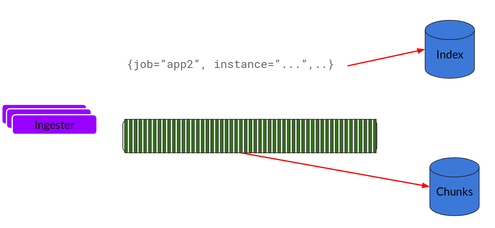
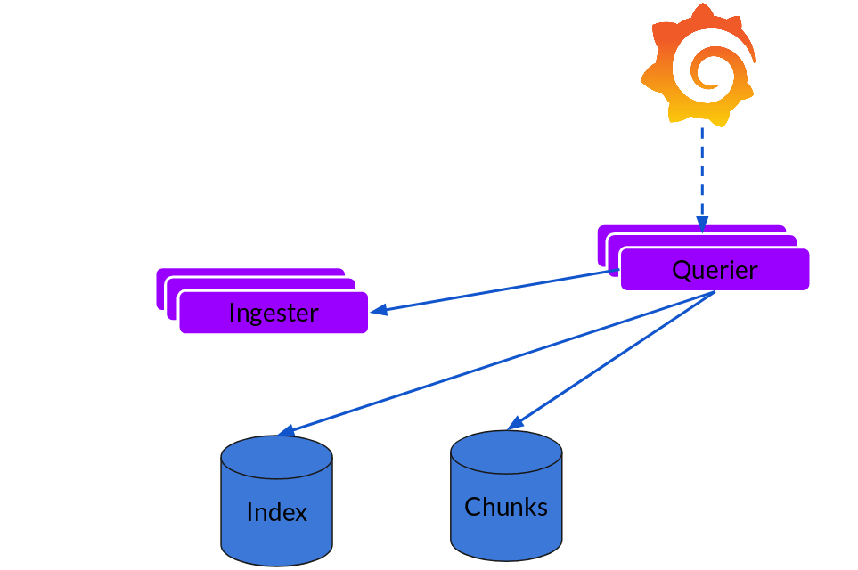

# 持久化数据无惧Pod崩溃！Grafana开源日志分析工具Loki

- Goutham Veeramachaneni

- 无明

** 2018 年 12 月 20 日

**[云原生](https://www.infoq.cn/topic/CloudNative)[运维](https://www.infoq.cn/topic/operation)[最佳实践](https://www.infoq.cn/topic/best-practices)

## 动机

Grafana 是事实上的时间序列数据仪表盘解决方案。它支持 40 多个数据源（截至撰写本文时），仪表盘功能现在也很成熟，包括可以添加团队和文件夹。我们现在希望从仪表盘解决方案转变为可观察性平台，成为你需要调试系统时的首选。

## 完全可观察性

可观察性意味着什么？现在有太多的定义。对我而言，可观察性就是系统及其行为和表现方式的可见性。可观察性可以分为 3 个部分（或支柱）：指标、日志和跟踪信息。它们互相作用，帮助你快速找出问题所在。

以下示例说明了我如何处理工作中的事故：

Prometheus 向我发出告警，说明有问题发生，然后我打开相关的服务仪表盘。如果我发现面板或图表有异常情况，我将在 Grafana 的 Explore UI 中进行查询，以便进行更深入的分析。例如，如果我发现其中一个服务正在抛出 500 错误码，我将试着找出是某个特定的处理程序/路由抛出该错误还是所有实例都在抛出这个错误。

接下来，在我大概知道哪里出错了之后，我会看一下日志。在使用 Loki 之前，我曾经使用 kubectl 来获取相关日志，并查看错误是什么以及我可以做些什么。对于查找错误来说，这很有用，但有时候我会遇到延迟太高的问题。在这种情况下，我会从跟踪信息中查找是速度慢的地方以及哪个方法/操作/功能很慢。我们使用 Jaeger 来获取跟踪信息。

虽然这些并不总能直接告诉我出了什么问题，但通常让我足够接近问题的根源，然后通过差看代码就可以弄清楚出了什么问题。然后我可以扩展服务（如果是因为服务发生过载）或部署修复程序。

## 日志

Prometheus、Jaeger、kubectl 都很不错。标签模型功能很强大，足以让我能够深入了解错误服务。如果我发现摄入器服务出错，我会通过 kubectl --namespace prod logs -l name = ingester | grep XXX 获取相关日志并进行 grep。

如果我发现某个特定实例出错或者我想要获得服务的日志尾部，我必须使用单个 pod，因为 kubectl 无法基于标签选择器进行 tail 操作。这种方式不是很理想，但可以应付大多数情况。

只要 pod 没有奔溃或没有被更换，这样做是有效的。如果 pod 或节点终止，则日志将会永久丢失。kubectl 只存储最近的日志，所以当我们想要前一天或更早的日志时，我们就只能干瞪眼。此外，在 Grafana 和 CLI 之间跳来跳去也不是很好的办法。我们需要一种可以减少上下文切换的解决方案，我们探索的很多解决方案的成本都很高，或者不具备很好的可扩展性。

在调研过现有的解决方案后，我们决定构建自己的解决方案。

## Loki

对现有的开源解决方案都不满意，于是我们开始与人们交流，发现很多人都面临同样的问题。事实上，我已经意识到，即使在今天，很多开发人员仍然通过 SSH 连接到服务器上对日志进行 grep/tail 操作！他们使用的解决方案要么太成本太高，要么不够稳定。事实上，人们被要求记录更少的日志，我们认为这是日志的一种反模式。我们认为我们可以在内部构建一些东西，然后共享给更广泛的开源社区。我们的主要目标是：

- 把事情简单化，只支持grep！

- 我们的目标还包括：
- 记录日志的成本应该很低，不应该要求人们减少日志记录。
- 易于操作和扩展。
- 指标、日志（以及稍后的跟踪信息）需要协作。

最后一点很重要。我们已经从 Prometheus 收集了指标元数据，并希望将它们用来关联日志。Prometheus 使用命名空间、服务名称、实例 IP 等标记每个指标。当收到警报时，我根据元数据来确定在哪里查找日志。如果我们能够使用相同的元数据标记日志，那么就可以在指标和日志之间进行无缝的切换。参考我们的[内部设计文档](https://docs.google.com/document/d/11tjK_lvp1-SVsFZjgOTr1vV3-q6vBAsZYIQ5ZeYBkyM/edit)。

## 架构

凭借我们构建和运行 Cortex 的经验——Prometheus 的水平可扩展分布式版本——我们提出了以下的架构：

指标和日志之间的元数据对我们来说至关重要，而且最初我们决定只面向 Kubernetes。我们的想法是在每个节点上运行一个日志收集代理，使用它来收集日志，与 kubernetes API 发生交互，找出日志的正确元数据，并将它们发送到集中式服务，在这里，我们可以显示从 Grafana 收集到的日志。

代理可以支持与 Prometheus 相同的配置，确保它们的元数据是匹配的。我们把这个代理叫作 promtail。

下面是 Loki 的可扩展日志收集引擎。

写入路径和读取路径相互分离。

## Distributor

在 promtail 收集并将日志发送给 Loki 之后，Distributor 就是第一个接收它们的组件。我们每秒可以接收数百万次写入，并且我们不希望将它们写入到数据库，因为这样有可能会让数据库宕机。我们需要批处理并压缩这些数据。

我们通过构建压缩的数据块来实现数据压缩。Ingester 组件是一个负责构建压缩数据库的有状态组件。我们使用了多个 Ingester，属于每个流的日志应该始终在同一个 Ingester 中，这样所有相关条目就会被压缩在同一个数据块中。我们创建了一个 Ingester 环，并使用了一致性散列。当一个条目进入，Distributor 对日志的标签进行散列，然后根据散列值将条目发送给相应的 Ingester。

此外，为了获得冗余和弹性，我们复制了 n（默认为 3）个副本。

## Ingester

Ingester 将收到条目并开始构建数据块。

基本上就是压缩和追加日志。在数据块“填满”后，将其冲刷到数据库中。我们为数据块（ObjectStorage）和索引使用了单独的数据库，因为它们存储的数据类型不一样。

在冲刷完数据块之后，Ingester 会创建一个新的空块，并将新条目添加到新块中。

## Querier

读取路径非常简单，并且 Querier 会负责执行大部分繁重的操作。给定时间区间和标签选择器，Querier 就会查找索引，以便确定要匹配哪些块，并进行 grep，为你提供查询结果。它还会从 Ingester 那里获取尚未被冲刷的最新数据。

请注意，对于每个查询，单个 Querier 会 grep 所有相关的日志。我们已经在 Cortex 中实现了并行查询，同样的功能可以扩展到 Loki，以便提供分布式 grep，让大型查询变得足够快。

## 可扩展性

现在，让我们来看看它是否具备可扩展性。

- 我们将数据块放入对象存储中，它是可扩展的。
- 我们将索引放入Cassandra/Bigtable/DynamoDB，也是可扩展的。
- Distributor和Querier是可以水平扩展的无状态组件。

Ingester 是一个有状态的组件，我们已经为它构建了完整的分片和重新分片生命周期。在完成部署或在进行伸缩之后，环形拓扑会发生变化，Ingester 会重新分片数据块来匹配新的拓扑。这些代码主要是从 Cortex 移植过来的，Cortex 已经在生产环境中运行了 2 年多。

## 注意事项

虽然所有这些从概念上看是可行的，但随着规模的增长，我们可能会遇到新的问题和限制。运行这些东西应该是低成本的，因为所有数据都保存在像 S3 这样的对象存储中。你只能 grep 数据，这可能不适合其他场景，例如触发警报或构建仪表盘。

## 结论

Loki 还处在测试阶段，不应该被用在生产环境中。我们希望能够尽快发布 Loki，以获得社区的反馈和贡献，并找出哪些部分是可用的，哪些地方需要改进。我们相信这将有助于我们在明年提供更高质量和更多可用于生产环境的版本。

Loki 可以在本地运行，也可以作为免费演示运行在 Grafana Cloud 上。可以访问[Loki主页](https://grafana.com/loki)进行试用。

参考链接：

https://grafana.com/blog/2018/12/12/loki-prometheus-inspired-open-source-logging-for-cloud-natives/

https://devopsdaysindia.org/

https://speakerdeck.com/gouthamve/devopsdaysindia-2018-loki-prometheus-but-for-logs

https://youtu.be/7n342UsAMo0](https://youtu.be/7n342UsAMo0

2018 年 12 月 20 日 10:373200

文章版权归极客邦科技InfoQ所有，未经许可不得转载。

