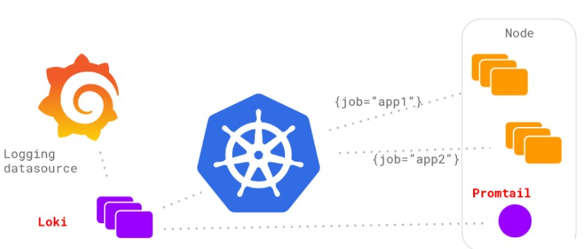
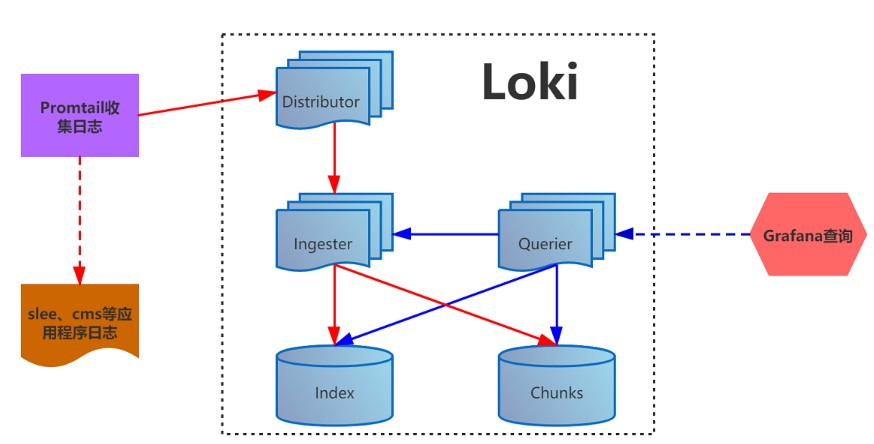
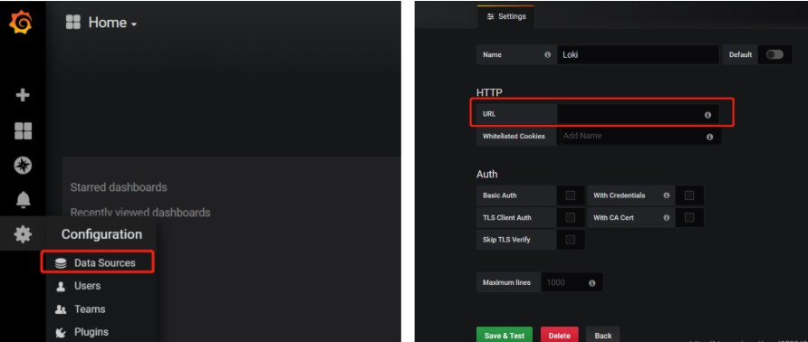

# [97）loki日志监控系统介绍](https://www.cnblogs.com/lemanlai/p/13635799.html)


目录

- 1- 简介
  - [1.1- 概述](https://www.cnblogs.com/lemanlai/p/13635799.html#11--概述)
  - [1.2- 特点](https://www.cnblogs.com/lemanlai/p/13635799.html#12--特点)
  - [1.3- 优势](https://www.cnblogs.com/lemanlai/p/13635799.html#13--优势)
- 2- 组成
  - [2.1- 组成](https://www.cnblogs.com/lemanlai/p/13635799.html#21--组成)
  - [2.2- 架构](https://www.cnblogs.com/lemanlai/p/13635799.html#22--架构)
- 3- 安装
  - [3.1- 使用 Helm 安装 Loki](https://www.cnblogs.com/lemanlai/p/13635799.html#31---使用-helm-安装-loki)
  - [3.2- helm安装grafana](https://www.cnblogs.com/lemanlai/p/13635799.html#32--helm安装grafana)
  - [3.3- 本地安装 Loki](https://www.cnblogs.com/lemanlai/p/13635799.html#33--本地安装-loki)
  - [3.4- grafana添加数据源](https://www.cnblogs.com/lemanlai/p/13635799.html#34--grafana添加数据源)
- 4- logcli
  - [4.1- 安装](https://www.cnblogs.com/lemanlai/p/13635799.html#41--安装)
  - [4.2- 使用](https://www.cnblogs.com/lemanlai/p/13635799.html#42--使用)
  - [4.3- 命令](https://www.cnblogs.com/lemanlai/p/13635799.html#43--命令)
  - [4.4- Label 标签](https://www.cnblogs.com/lemanlai/p/13635799.html#44--label-标签)
  - [4.5- Cardinality（势）](https://www.cnblogs.com/lemanlai/p/13635799.html#45--cardinality（势）)
- [5- 查询语法](https://www.cnblogs.com/lemanlai/p/13635799.html#5--查询语法)
- [6- Loki 性能优化](https://www.cnblogs.com/lemanlai/p/13635799.html#6--loki-性能优化)


# 1- 简介

Loki 是 Grafana Labs 团队最新的开源项目，是一个水平可扩展，高可用性，多租户的日志聚合系统。它的设计非常经济高效且易于操作，因为它不会为日志内容编制索引，而是为每个日志流配置一组标签。项目受 Prometheus 启发，官方的介绍就是：`Like Prometheus, but for logs`，类似于 Prometheus 的日志系统。

由Grafana Labs团队开源的水平可扩展，高度可用的多租户日志聚合系统。 开发语言: Google Go。它的设计具有很高的成本效益，并且易于操作。使用标签来作为索引，而不是对全文进行检索，也就是说，你通过这些标签既可以查询日志的内容也可以查询到监控的数据签，极大地降低了日志索引的存储

## 1.1- 概述

Loki 只会对你的日志元数据标签（就像 Prometheus 的标签一样）进行索引，而不会对原始的日志数据进行全文索引。然后日志数据本身会被压缩，并以 chunks（块）的形式存储在[对象存储](https://cloud.tencent.com/product/cos?from=10680)（比如 S3 或者 GCS）甚至本地文件系统。一个小的索引和高度压缩的 chunks 可以大大简化操作和降低 Loki 的使用成本

## 1.2- 特点

**多租户**：

支持多租户模式，租户之间的数据是完全分开的。多租户是通过一个租户 ID（用数字字母生成的字符串）实现的。当多租户模式被禁用后，所有请求都会在内部生成一个**假的**租户 ID

**操作模式**：

可以在本地小规模运行也可以横向扩展。Loki 自带单进程模式，可以在一个进程中运行所有需要的微服务。单进程模式非常适合于测试 Loki 或者小规模运行。对于横向扩展来说，Loki 的微服务是可以被分解成单独的进程的，使其能够独立扩展。

**组件**：

- Distributor（分配器）

负责处理客户端写入的日志。本质上它是日志数据写入路径中的`第一站`。一旦分配器接收到日志数据，它就会把它们分成若干批次，并将它们并行地发送到多个采集器去。

分配器通过 gPRC 和采集器进行通信。它们是无状态的，所以我们可以根据实际需要对他们进行扩缩容。

- Hashing

分配器采用一致性哈希和可配置的复制因子结合使用，来确定哪些采集器服务应该接收日志数据。该哈希是基于日志标签和租户 ID 生成的。

存储在 Consul 中的哈希环被用来实现一致性哈希；所有的采集器将他们自己的一组 Token 注册到哈希环中去。然后分配器找到和日志的哈希值最匹配的 Token，并将数据发送给该 Token 的持有者。

- 一致性

由于所有的分配器都共享同一个哈希环，所以可以向任何分配器发送写请求。

为了确保查询结果的一致性，Loki 在读和写上使用了 Dynamo 方式的法定人数一致性。这意味着分配器将等待至少有一半以上的采集器响应，再向用户发送样本，然后再响应给用户。

- Ingester（采集器）

采集器服务负责将日志数据写入长期存储的后端（DynamoDB、S3、Cassandra 等等）。

采集器会校验采集的日志是否乱序。当采集器接收到的日志行与预期的顺序不一致时，该行日志将被拒绝，并向用户返回一个错误。有关更多相关信息，可以查看时间戳排序部分内容。

采集器验证接收到的日志行是按照时间戳递增的顺序接收的（即每条日志的时间戳都比之前的日志晚）。当采集器接收到的日志不按照这个顺序，日志行将被拒绝并返回错误。

每一个唯一的标签集数据都会在内存中构建成`chunks`，然后将它们存储到后端存储中去。

如果一个采集器进程崩溃或者突然挂掉了，所有还没有被刷新到存储的数据就会丢失。Loki 通常配置成多个副本（通常为3个）来降低这种风险

- 时间戳排序

一般来说推送到 Loki 的所有日志行必须比之前收到的行有一个更新的时间戳。然而有些情况可能是多行日志具有相同的纳秒级别的时间戳，可以按照下面两种情况进行处理：

1. 如果传入的行和之前接收到的行完全匹配（时间戳和日志文本都匹配），则传入的行会被视为完全重复并会被忽略。
2. 如果传入行的时间戳和前面一行的时间戳相同，但是日志内容不相同，则会接收该行日志。这就意味着，对于相同的时间戳，有可能有两个不同的日志行。

- Handoff（交接）

默认情况下，当一个采集器关闭并视图离开哈希环时，它将等待查看是否有新的采集器视图进入，然后再进行 flush，并尝试启动交接。交接将把离开的采集器拥有的所有 Token 和内存中的 chunks 都转移到新的采集器中来。

这个过程是为了避免在关闭时 flush 所有的 chunks，因为这是一个比较缓慢的过程，比较耗时

- 文件系统支持

采集器支持通过 BoltDB 写入到文件系统，但这只在单进程模式下工作，因为查询器需要访问相同的后端存储，而且 BoltDB 只允许一个进程在给定时间内对 DB 进行锁定

- Querier（查询器）

查询器服务负责处理 LogQL 查询语句来评估存储在长期存储中的日志数据。

它首先会尝试查询所有采集器的内存数据，然后再返回到后端存储中加载数据。

- 前端查询

该服务是一个可选组件，在一组查询器前面，来负责在它们之间公平地调度请求，尽可能地并行化它们并缓存请求。

- Chunk（块）存储

块存储是 Loki 的长期数据存储，旨在支持交互式查询和持续写入，无需后台维护任务。它由以下几部分组成：

1. **块索引**，该索引可以由 DynamoDB、Bigtable 或者 Cassandra 来支持。
2. 块数据本身的 **KV 存储**，可以是 DynamoDB、Bigtable、Cassandra，也可以上是对象存储

> 与 Loki 的其他核心组件不同，块存储不是一个独立的服务、任务或者进程，而是嵌入到需要访问 Loki 数据的采集器和查询器中的库。

块存储依赖统一的 ”NoSQL“ 存储（DynamoDB、Bigtable 和 Cassandra）接口，该接口可以用来支持块存储索引。该接口假设索引是由以下几个 key 构成的集合：

1. **哈希 KEY** - 这是所有的读和写都需要的。
2. **范围 KEY** - 这是写的时候需要的，读的时候可以省略，可以通过前缀或者范围来查询。

上面支持的这些数据库中接口的工作原理有些不同：

1. DynamoDB 支持范围和哈希 KEY。所以索引条目直接建模为 DynamoDB 的数据，哈希 KEY 为分布式 KEY，范围为范围 KEY。
2. 对于 Bigtable 和 Cassandra，索引项被建模为单个的列值。哈希 KEY 成为行 KEY，范围 KEY 成为列 KEY。

一些模式被用于对块存储的读取和写入时使用的匹配器和标签集合映射到索引的适当操作中来。随着 Loki 的发展也会增加一些新的模式，主要是为了更好地平衡些和提高查询性能。

## 1.3- 优势

- 单二进制模式下的 Loki 可以将数据存储在磁盘上，但在水平可扩展模式下，数据存储需要在[云存储](https://cloud.tencent.com/product/cos?from=10680)系统中，如 S3、GCS 或 Cassandra。日志以纯文本的形式存储，并标记了一组标签的名称和值，其中只有标签会被索引。这种权衡使其操作起来比完全索引更便宜。Loki 中的日志使用 LogQL 进行查询。由于这种设计上的权衡，根据内容（即日志行内的文本）进行过滤的 LogQL 查询需要加载搜索窗口内所有与查询中定义的标签相匹配的块。
- Promtail 是为 Loki 量身定做的。它的主要工作模式是发现存储在磁盘上的日志文件，并将其与一组标签关联的日志文件转发到 Loki。Promtail 可以为在同一节点上运行的 Kubernetes Pods 做服务发现，作为 Docker 日志驱动，从指定的文件夹中读取日志，并对 systemd 日志不断获取。
- Loki 通过一组标签表示日志的方式与 Prometheus 表示指标的方式类似。当与Prometheus 一起部署在环境中时，由于使用了相同的服务发现机制，来自Promtail 的日志通常与你的应用指标具有相同的标签。拥有相同级别的日志和指标，用户可以在指标和日志之间无缝切换，帮助进行根本性原因分析。

# 2- 组成

## 2.1- 组成

- Loki 是主服务器，负责存储日志和处理查询 。
- promtail 是代理，负责收集日志并将其发送给 loki 。
- Grafana 用于 UI 展示。

只要在应用程序服务器上安装promtail来收集日志然后发送给Loki存储，就可以在Grafana UI界面通过添加Loki为数据源进行日志查询（如果Loki服务器性能不够，可以部署多个Loki进行存储及查询）。作为一个日志系统不关只有查询分析日志的能力，还能对日志进行监控和报警

## 2.2- 架构





1. promtail收集并将日志发送给loki的 Distributor 组件

2. Distributor会对接收到的日志流进行正确性校验，并将验证后的日志分批并行发送到Ingester

3. Ingester 接受日志流并构建数据块，压缩后存放到所连接的存储后端

4. Querier 收到HTTP查询请求，并将请求发送至Ingester 用以获取内存数据 ，Ingester 收到请求后返回符合条件的数据 ；

   如果 Ingester 没有返回数据，Querier 会从后端存储加载数据并遍历去重执行查询 ，通过HTTP返回查询结果

# 3- 安装

## 3.1- 使用 Helm 安装 Loki

- 添加 Loki 的 chart 仓库

```bash
helm repo add loki https://grafana.github.io/loki/charts
```

- 更新 chart 仓库

```bash
helm repo update
```

- 部署 Loki

```bash
helm upgrade --install loki loki/loki-stack

##指定命名空间
helm upgrade --install loki --namespace=loki loki/loki
##指定配置
helm upgrade --install loki loki/loki --set "key1=val1,key2=val2,..."
##部署 Loki 工具栈（Loki, Promtail, Grafana, Prometheus
helm upgrade --install loki loki/loki-stack --set grafana.enabled=true,prometheus.enabled=true,prometheus.alertmanager.persistentVolume.enabled=false,prometheus.server.persistentVolume.enabled=false
```

## 3.2- helm安装grafana

- 使用 Helm 安装 Grafana 到 Kubernetes 集群

```bash
helm install stable/grafana -n loki-grafana
```

- 获取 Grafana 管理员密码

```bash
kubectl get secret --namespace <YOUR-NAMESPACE> loki-grafana -o jsonpath="{.data.admin-password}" | base64 --decode ; echo
```

- 访问 Grafana UI 页面

```bash
kubectl port-forward --namespace <YOUR-NAMESPACE> service/loki-grafana 3000:80
```

## 3.3- 本地安装 Loki

二进制包下载地址：

https://github.com/grafana/loki/releases

- 下载安装包

```bash
curl -O -L "https://github.com/grafana/loki/releases/download/v1.5.0/loki-linux-amd64.zip" 
curl -O -L "https://github.com/grafana/loki/releases/download/v1.5.0/promtail-linux-amd64.zip"
wget https://dl.grafana.com/oss/release/grafana-6.7.4-1.x86_64.rpm
```

- 自定义配置文件（loki.yaml和promtail.yaml）

```bash
#loki.yaml

auth_enabled: false

server:
  http_listen_port: 3100

ingester:
  lifecycler:
    address: 127.0.0.1
    ring:
      kvstore:
        store: inmemory
      replication_factor: 1
    final_sleep: 0s
  chunk_idle_period: 5m
  chunk_retain_period: 30s

schema_config:
  configs:
    - from: 2020-07-09
      store: boltdb
      object_store: filesystem
      schema: v9
      index:
        prefix: index_
        period: 168h

storage_config:
#标签索引存储地址
  boltdb:
    directory: /home/iocshare/loki/index
#块文件存储地址
  filesystem:
    directory: /home/iocshare/loki/chunks

limits_config:
  enforce_metric_name: false
  reject_old_samples: true
  reject_old_samples_max_age: 168h
  
  
#promtail.yaml
# Promtail服务配置
server:
  http_listen_port: 9080
  grpc_listen_port: 0

# 记录读取日志的位置信息文件,Promtail重新启动时需要它
positions:
  filename: /tmp/positions.ymal

# Loki的api服务的地址
clients:
  - url: http://127.0.0.1:3100/loki/api/v1/push

scrape_configs:
# CMS日志收集并打标签
  - job_name: CMS
    static_configs:
      - targets:
          - localhost
        labels:
          job: cms-45
          host: localhost
          __path__: /home/ccodrunner/Platform/log/cms2/cms2.log
# UMG日志收集并打标签
  - job_name: UMG
    static_configs:
      - targets:
          - localhost
        labels:
          job: UMG-log
          host: localhost
          __path__: /home/umg/ATS4_setup/ChannelSoft/ATS4/runlog/UMG*.log
```

- 启动服务(先启loki)

```bash
nohup ./loki-linux-amd64 -config.file=/etc/loki/loki.yaml &
nohup ./promtail-linux-amd64 -config.file=/etc/loki/promtail.yaml &
```

## 3.4- grafana添加数据源



然后进入Explore就可以搜索查询日志了，日志查询由两部分组成：**日志流选择器**和**搜索表达式**。出于性能原因，需要先通过选择日志标签来选择日志流。查询字段`Log labels`旁边的按钮显示了可用日志流的标签列表

# 4- logcli

## 4.1- 安装

```bash
wget https://github.com/grafana/loki/releases/download/v1.6.1/logcli-linux-amd64.zip
unzip logcli-linux-amd64.zip 
chmod +x logcli-linux-amd64/logcli-linux-amd64
mv logcli-linux-amd64/logcli-linux-amd64  /usr/sbin/logcli
```

## 4.2- 使用

- 配置环境变量

```bash
export LOKI_ADDR=http://localhost:3100
```

- 使用

```bash
logcli labels job
logcli query '{job="varlogs"}'
```

- **批量查询**

从 Loki 1.6.0 开始，logcli 会分批向 Loki 发送日志查询。

如果你将查询的`--limit` 参数（默认为30）设置为一个较大的数，比如 10000，那么 logcli 会自动将此请求分批发送到 Loki，默认的批次大小是 1000。

Loki 对查询中返回的最大行数有一个服务端的限制（默认为5000）。批量发送允许你发出比服务端限制更大的请求，只要 `--batch` 大小小于服务器限制。

请注意，每个批次的查询元数据都会被打印在 stderr 上，可以通过设置`--quiet` 参数来停止这个动作。

> 对于配置的值会根据环境变量和命令行标志从低到高生效。

## 4.3- 命令

```bash
logcli help
usage: logcli [<flags>] <command> [<args> ...]

A command-line for loki.

Flags:
      --help             Show context-sensitive help (also try --help-long and --help-man).
      --version          Show application version.
  -q, --quiet            Suppress query metadata.
      --stats            Show query statistics.
  -o, --output=default   Specify output mode [default, raw, jsonl]. raw suppresses log labels and timestamp.
  -z, --timezone=Local   Specify the timezone to use when formatting output timestamps [Local, UTC].
      --cpuprofile=""    Specify the location for writing a CPU profile.
      --memprofile=""    Specify the location for writing a memory profile.
      --addr="http://localhost:3100"
                         Server address. Can also be set using LOKI_ADDR env var.
      --username=""      Username for HTTP basic auth. Can also be set using LOKI_USERNAME env var.
      --password=""      Password for HTTP basic auth. Can also be set using LOKI_PASSWORD env var.
      --ca-cert=""       Path to the server Certificate Authority. Can also be set using LOKI_CA_CERT_PATH env var.
      --tls-skip-verify  Server certificate TLS skip verify.
      --cert=""          Path to the client certificate. Can also be set using LOKI_CLIENT_CERT_PATH env var.
      --key=""           Path to the client certificate key. Can also be set using LOKI_CLIENT_KEY_PATH env var.
      --org-id=""        adds X-Scope-OrgID to API requests for representing tenant ID. Useful for requesting tenant data when
                         bypassing an auth gateway.

Commands:
  help [<command>...]
    Show help.

  query [<flags>] <query>
    Run a LogQL query.

    The "query" command is useful for querying for logs. Logs can be returned in a few output modes:

      raw: log line
      default: log timestamp + log labels + log line
      jsonl: JSON response from Loki API of log line

    The output of the log can be specified with the "-o" flag, for example, "-o raw" for the raw output format.

    The "query" command will output extra information about the query and its results, such as the API URL, set of common labels,
    and set of excluded labels. This extra information can be suppressed with the --quiet flag.

    While "query" does support metrics queries, its output contains multiple data points between the start and end query time.
    This output is used to build graphs, like what is seen in the Grafana Explore graph view. If you are querying metrics and just
    want the most recent data point (like what is seen in the Grafana Explore table view), then you should use the "instant-query"
    command instead.

  instant-query [<flags>] <query>
    Run an instant LogQL query.

    The "instant-query" command is useful for evaluating a metric query for a single point in time. This is equivalent to the
    Grafana Explore table view; if you want a metrics query that is used to build a Grafana graph, you should use the "query"
    command instead.

    This command does not produce useful output when querying for log lines; you should always use the "query" command when you
    are running log queries.

    For more information about log queries and metric queries, refer to the LogQL documentation:

    https://grafana.com/docs/loki/latest/logql/

  labels [<flags>] [<label>]
    Find values for a given label.

  series [<flags>] <matcher>
    Run series query.

$ logcli help query
usage: logcli query [<flags>] <query>

Run a LogQL query.

The "query" command is useful for querying for logs. Logs can be returned in a few output modes:

  raw: log line
  default: log timestamp + log labels + log line
  jsonl: JSON response from Loki API of log line

The output of the log can be specified with the "-o" flag, for example, "-o raw" for the raw output format.

The "query" command will output extra information about the query and its results, such as the API URL, set of common labels, and
set of excluded labels. This extra information can be suppressed with the --quiet flag.

While "query" does support metrics queries, its output contains multiple data points between the start and end query time. This
output is used to build graphs, like what is seen in the Grafana Explore graph view. If you are querying metrics and just want the
most recent data point (like what is seen in the Grafana Explore table view), then you should use the "instant-query" command
instead.

Flags:
      --help               Show context-sensitive help (also try --help-long and --help-man).
      --version            Show application version.
  -q, --quiet              Suppress query metadata.
      --stats              Show query statistics.
  -o, --output=default     Specify output mode [default, raw, jsonl]. raw suppresses log labels and timestamp.
  -z, --timezone=Local     Specify the timezone to use when formatting output timestamps [Local, UTC].
      --cpuprofile=""      Specify the location for writing a CPU profile.
      --memprofile=""      Specify the location for writing a memory profile.
      --addr="http://localhost:3100"
                           Server address. Can also be set using LOKI_ADDR env var.
      --username=""        Username for HTTP basic auth. Can also be set using LOKI_USERNAME env var.
      --password=""        Password for HTTP basic auth. Can also be set using LOKI_PASSWORD env var.
      --ca-cert=""         Path to the server Certificate Authority. Can also be set using LOKI_CA_CERT_PATH env var.
      --tls-skip-verify    Server certificate TLS skip verify.
      --cert=""            Path to the client certificate. Can also be set using LOKI_CLIENT_CERT_PATH env var.
      --key=""             Path to the client certificate key. Can also be set using LOKI_CLIENT_KEY_PATH env var.
      --org-id=""          adds X-Scope-OrgID to API requests for representing tenant ID. Useful for requesting tenant data when
                           bypassing an auth gateway.
      --limit=30           Limit on number of entries to print.
      --since=1h           Lookback window.
      --from=FROM          Start looking for logs at this absolute time (inclusive).
      --to=TO              Stop looking for logs at this absolute time (exclusive).
      --step=STEP          Query resolution step width, for metric queries. Evaluate the query at the specified step over the time
                           range.
      --interval=INTERVAL  Query interval, for log queries. Return entries at the specified interval, ignoring those between.
                           **This parameter is experimental, please see Issue 1779**.
      --batch=1000         Query batch size to use until 'limit' is reached.
      --forward            Scan forwards through logs.
      --no-labels          Do not print any labels.
      --exclude-label=EXCLUDE-LABEL ...
                           Exclude labels given the provided key during output.
      --include-label=INCLUDE-LABEL ...
                           Include labels given the provided key during output.
      --labels-length=0    Set a fixed padding to labels.
      --store-config=""    Execute the current query using a configured storage from a given Loki configuration file.
  -t, --tail               Tail the logs.
      --delay-for=0        Delay in tailing by number of seconds to accumulate logs for re-ordering.
      --colored-output     Show ouput with colored labels.

Args:
  <query>  eg '{foo="bar",baz=~".*blip"} |~ ".*error.*"'

$ logcli help labels
usage: logcli labels [<flags>] [<label>]

Find values for a given label.

Flags:
      --help             Show context-sensitive help (also try --help-long and --help-man).
      --version          Show application version.
  -q, --quiet            Suppress query metadata.
      --stats            Show query statistics.
  -o, --output=default   Specify output mode [default, raw, jsonl]. raw suppresses log labels and timestamp.
  -z, --timezone=Local   Specify the timezone to use when formatting output timestamps [Local, UTC].
      --cpuprofile=""    Specify the location for writing a CPU profile.
      --memprofile=""    Specify the location for writing a memory profile.
      --addr="http://localhost:3100"
                         Server address. Can also be set using LOKI_ADDR env var.
      --username=""      Username for HTTP basic auth. Can also be set using LOKI_USERNAME env var.
      --password=""      Password for HTTP basic auth. Can also be set using LOKI_PASSWORD env var.
      --ca-cert=""       Path to the server Certificate Authority. Can also be set using LOKI_CA_CERT_PATH env var.
      --tls-skip-verify  Server certificate TLS skip verify.
      --cert=""          Path to the client certificate. Can also be set using LOKI_CLIENT_CERT_PATH env var.
      --key=""           Path to the client certificate key. Can also be set using LOKI_CLIENT_KEY_PATH env var.
      --org-id=""        adds X-Scope-OrgID to API requests for representing tenant ID. Useful for requesting tenant data when
                         bypassing an auth gateway.
      --since=1h         Lookback window.
      --from=FROM        Start looking for labels at this absolute time (inclusive).
      --to=TO            Stop looking for labels at this absolute time (exclusive).

Args:
  [<label>]  The name of the label.

$ logcli help series
usage: logcli series --match=MATCH [<flags>]

Run series query.

Flags:
      --help             Show context-sensitive help (also try --help-long and --help-man).
      --version          Show application version.
  -q, --quiet            Suppress query metadata.
      --stats            Show query statistics.
  -o, --output=default   Specify output mode [default, raw, jsonl]. raw suppresses log labels and timestamp.
  -z, --timezone=Local   Specify the timezone to use when formatting output timestamps [Local, UTC].
      --cpuprofile=""    Specify the location for writing a CPU profile.
      --memprofile=""    Specify the location for writing a memory profile.
      --addr="http://localhost:3100"
                         Server address. Can also be set using LOKI_ADDR env var.
      --username=""      Username for HTTP basic auth. Can also be set using LOKI_USERNAME env var.
      --password=""      Password for HTTP basic auth. Can also be set using LOKI_PASSWORD env var.
      --ca-cert=""       Path to the server Certificate Authority. Can also be set using LOKI_CA_CERT_PATH env var.
      --tls-skip-verify  Server certificate TLS skip verify.
      --cert=""          Path to the client certificate. Can also be set using LOKI_CLIENT_CERT_PATH env var.
      --key=""           Path to the client certificate key. Can also be set using LOKI_CLIENT_KEY_PATH env var.
      --org-id=""        adds X-Scope-OrgID to API requests for representing tenant ID. Useful for requesting tenant data when
                         bypassing an auth gateway.
      --since=1h         Lookback window.
      --from=FROM        Start looking for logs at this absolute time (inclusive).
      --to=TO            Stop looking for logs at this absolute time (exclusive).
      --match=MATCH ...  eg '{foo="bar",baz=~".*blip"}'
```

## 4.4- Label 标签

Label 标签是一个键值对，可以定义任何东西，我们喜欢称它们为描述日志流的元数据。如果你熟悉 Prometheus，那么一定对 Label 标签有一定的了解，在 Loki 的 scrape 配置中也定义了这些标签，和 Prometheus 拥有一致的功能，这些标签非常容易将应用程序指标和日志数据关联起来。

Loki 中的标签执行一个非常重要的任务：它们定义了一个流。更具体地说，每个标签键和值的组合定义了流。如果只是一个标签值变化，这将创建一个新的流。

类似 Prometheus的序列，而且 Prometheus 中还有一个额外的维度：指标名称。Loki 中简化了这一点，因为没有指标名，只有标签，所以最后决定使用流而不是序列。

**标签示例**

loki配置文件中labels:

```bash
scrape_configs:
 - job_name: system
   pipeline_stages:
   static_configs:
   - targets:
      - localhost
     labels:
      job: syslog
      env: dev
      __path__: /var/log/syslog
 - job_name: system
   pipeline_stages:
   static_configs:
   - targets:
      - localhost
     labels:
      job: apache
      env: dev
      __path__: /var/log/apache.log
```

查询labels的日志:

```bash
{job="apache"} <- 显示 job 标签为 apache 的日志
{job="syslog"} <- 显示 job 标签为 syslog 的日志
{job=~"apache|syslog"} <- 显示 job 标签为 apache 或者 syslog 的日志
```

两个任务的日志可以用下面的方式来代替 regex 的方式：

```bash
{env="dev"} <- 将返回所有带有 env=dev 标签的日志
```

Label 标签是 Loki 日志数据的索引，它们用于查找压缩后的日志内容，这些内容被单独存储为`块`。标签和值的每一个唯一组合都定义了一个`流` ，一个流的日志被分批，压缩，并作为块进行存储。

## 4.5- Cardinality（势）

**定义动态标签：**

比如我们有下面这样的日志数据：

```bash
11.11.11.11 - frank [25/Jan/2000:14:00:01 -0500] "GET /1986.js HTTP/1.1" 200 932 "-" "Mozilla/5.0 (Windows; U; Windows NT 5.1; de; rv:1.9.1.7) Gecko/20091221 Firefox/3.5.7 GTB6"
```

使用下面的方式来解析这条日志数据：

```bash
- job_name: system
   pipeline_stages:
      - regex:
        expression: "^(?P<ip>\\S+) (?P<identd>\\S+) (?P<user>\\S+) \\[(?P<timestamp>[\\w:/]+\\s[+\\-]\\d{4})\\] \"(?P<action>\\S+)\\s?(?P<path>\\S+)?\\s?(?P<protocol>\\S+)?\" (?P<status_code>\\d{3}|-) (?P<size>\\d+|-)\\s?\"?(?P<referer>[^\"]*)\"?\\s?\"?(?P<useragent>[^\"]*)?\"?$"
    - labels:
        action:
        status_code:
   static_configs:
   - targets:
      - localhost
     labels:
      job: apache
      env: dev
      __path__: /var/log/apache.log
```

这个 regex 匹配日志行的每个组件，并将每个组件的值提取到一个 capture 组里面。在 pipeline 代码内部，这些数据被放置到一个临时的数据结构中，允许在处理该日志行时将其用于其他处理（此时，临时数据将被丢弃）。

从该 regex 中，我们就使用其中的两个 capture 组，根据日志行本身的内容动态地设置两个标签：

```javascript
action (例如 action="GET", action="POST") status_code (例如 status_code="200", status_code="400")
```

假设我们有下面几行日志数据：

```javascript
11.11.11.11 - frank [25/Jan/2000:14:00:01 -0500] "GET /1986.js HTTP/1.1" 200 932 "-" "Mozilla/5.0 (Windows; U; Windows NT 5.1; de; rv:1.9.1.7) Gecko/20091221 Firefox/3.5.7 GTB6"
11.11.11.12 - frank [25/Jan/2000:14:00:02 -0500] "POST /1986.js HTTP/1.1" 200 932 "-" "Mozilla/5.0 (Windows; U; Windows NT 5.1; de; rv:1.9.1.7) Gecko/20091221 Firefox/3.5.7 GTB6"
11.11.11.13 - frank [25/Jan/2000:14:00:03 -0500] "GET /1986.js HTTP/1.1" 400 932 "-" "Mozilla/5.0 (Windows; U; Windows NT 5.1; de; rv:1.9.1.7) Gecko/20091221 Firefox/3.5.7 GTB6"
11.11.11.14 - frank [25/Jan/2000:14:00:04 -0500] "POST /1986.js HTTP/1.1" 400 932 "-" "Mozilla/5.0 (Windows; U; Windows NT 5.1; de; rv:1.9.1.7) Gecko/20091221 Firefox/3.5.7 GTB6"
```

则在 Loki 中收集日志后，会创建为如下所示的流：

```javascript
{job="apache",env="dev",action="GET",status_code="200"} 11.11.11.11 - frank [25/Jan/2000:14:00:01 -0500] "GET /1986.js HTTP/1.1" 200 932 "-" "Mozilla/5.0 (Windows; U; Windows NT 5.1; de; rv:1.9.1.7) Gecko/20091221 Firefox/3.5.7 GTB6"
{job="apache",env="dev",action="POST",status_code="200"} 11.11.11.12 - frank [25/Jan/2000:14:00:02 -0500] "POST /1986.js HTTP/1.1" 200 932 "-" "Mozilla/5.0 (Windows; U; Windows NT 5.1; de; rv:1.9.1.7) Gecko/20091221 Firefox/3.5.7 GTB6"
{job="apache",env="dev",action="GET",status_code="400"} 11.11.11.13 - frank [25/Jan/2000:14:00:03 -0500] "GET /1986.js HTTP/1.1" 400 932 "-" "Mozilla/5.0 (Windows; U; Windows NT 5.1; de; rv:1.9.1.7) Gecko/20091221 Firefox/3.5.7 GTB6"
{job="apache",env="dev",action="POST",status_code="400"} 11.11.11.14 - frank [25/Jan/2000:14:00:04 -0500] "POST /1986.js HTTP/1.1" 400 932 "-" "Mozilla/5.0 (Windows; U; Windows NT 5.1; de; rv:1.9.1.7) Gecko/20091221 Firefox/3.5.7 GTB6"
```

这4行日志将成为4个独立的流，并开始填充4个独立的块。任何与这些 `标签/值` 组合相匹配的额外日志行将被添加到现有的流中。如果有另一个独特的标签组合进来（比如 status_code="500"）就会创建另一个新的流。

比如我们为 IP 设置一个 Label 标签，不仅用户的每一个请求都会变成一个唯一的流，每一个来自同一用户的不同 action 或 status_code 的请求都会得到自己的流。

如果有4个共同的操作（GET、PUT、POST、DELETE）和4个共同的状态码（可能不止4个！），这将会是16个流和16个独立的块。然后现在乘以每个用户，如果我们使用 IP 的标签，你将很快就会有数千或数万个流了。

这个 Cardinality 太高了，这足以让 Loki 挂掉。

当我们谈论 Cardinality 的时候，我们指的是标签和值的组合，以及他们创建的流的数量，高 Cardinality 是指使用具有较大范围的可能值的标签，如 IP，或结合需要其他标签，即使它们有一个小而有限的集合，比如 status_code 和 action。

高 Cardinality 会导致 Loki 建立一个巨大的索引（????），并将成千上万的微小块存入对象存储中（慢），Loki 目前在这种配置下的性能非常差，运行和使用起来非常不划算的。

# 5- 查询语法

标签匹配符：

- `=` 完全相等。
- `!=` 不相等。
- `=~` 正则表达式匹配。
- `!~` 不进行正则表达式匹配。

**例：** {job=“varlogs”,filename="/var/log/auth.log"}

搜索表达式：

- `|=` 行包含字符串。
- `!=` 行不包含字符串。
- `|~` 行匹配正则表达式。
- `!~` 行与正则表达式不匹配。

**例：** {job=“/var/log/auth.log”} |= “07.18” |= “[-973]” != “0xffffffff”

# 6- Loki 性能优化

如果使用大量的标签或有大量值的标签是不好的，那我应该如何查询我的日志呢？如果没有一个数据是有索引的，那么查询不会真的很慢吗？

我们看到使用 Loki 的人习惯了其他重索引的解决方案，他们就觉得需要定义很多标签，才可以有效地查询日志，毕竟很多其他的日志解决方案都是为了索引，这是之前的惯性思维方式。

在使用 Loki 的时候，你可能需要忘记你所知道的东西，看看如何用`并行化`的方式来解决这个问题。Loki 的超强之处在于将查询拆成小块，并行调度，这样你就可以在少量时间内查询大量的日志数据了。

大型索引是非常复杂而昂贵的，通常情况下，你的日志数据的全文索引与日志数据本身的大小相当或更大。要查询你的日志数据，需要加载这个索引，为了性能，可能在内存中，这就非常难扩展了，当你采集了大量的日志时，你的索引就会变得很大。

现在我们来谈谈 Loki，索引通常比你采集的日志量小一个数量级。所以，如果你很好地将你的流保持在最低限度，那么指数的增长和采集的日志相比就非常缓慢了。

Loki 将有效地使你的静态成本尽可能低（索引大小和内存需求以及静态日志存储），并使查询性能可以在运行时通过水平伸缩进行控制。

为了了解是如何工作的，让我们回过头来看看上面我们查询访问日志数据的特定 IP 地址的例子，我们不使用标签来存储 IP，相反，我们使用一个过滤器表达式来查询它。

```javascript
{job="apache"} |= "11.11.11.11"
```

在背后 Loki 会将该查询分解成更小的碎片（shards），并为标签匹配的流打开每个块（chunk），并开始查找这个 IP 地址。

这些碎片的大小和并行化的数量是可配置的，并基于你提供的资源。如果你愿意，可以将 shard 间隔配置到 5m，部署20个查询器，并在几秒内处理千兆字节的日志。或者你可以更加疯狂地配置200个查询器，处理 TB 级别的日志！

这种较小的索引和并行查询与较大/较快的全文索引之间的权衡，是让 Loki 相对于其他系统节省成本的原因。操作大型索引的成本和复杂度很高，而且通常是固定的，无论是是否在查询它，你都要一天24小时为它付费。

这种设计的好处是，你可以决定你想拥有多大的查询能力，而且你可以按需变更。查询性能成为你想花多少钱的函数。同时数据被大量压缩并存储在低成本的对象存储中，比如 S3 和 GCS。这就将固定的运营成本降到了最低，同时还能提供难以置信的快速查询能力。


------

专注运维开发和开源技术！！

分类: [kubernetes](https://www.cnblogs.com/lemanlai/category/1633967.html), [linux](https://www.cnblogs.com/lemanlai/category/1633960.html)