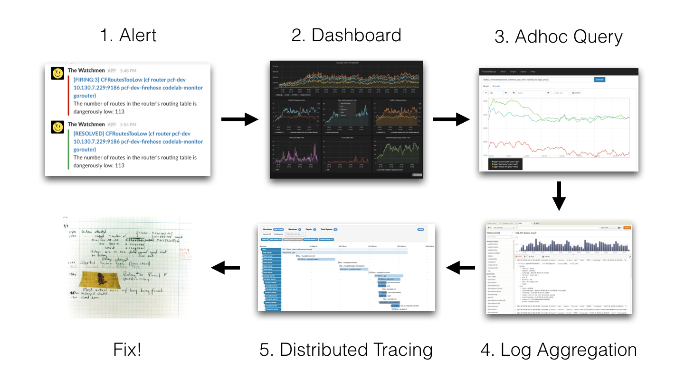

最近，在对公司容器云的日志方案进行设计的时候，发现主流的 ELK 或者 EFK 比较重，再加上现阶段对于 ES 复杂的搜索功能很多都用不上，最终选择了 Grafana 开源的 Loki 日志系统。下面我们来介绍下 Loki 的一些基本概念和架构。

> Loki 是 Grafana Labs 团队最新的开源项目，是一个水平可扩展，高可用性，多租户的日志聚合系统。它的设计非常经济高效且易于操作，因为它不会为日志内容编制索引，而是为每个日志流编制一组标签，专门为 Prometheus 和 Kubernetes 用户做了相关优化。该项目受 Prometheus 启发，官方的介绍就是： `Like Prometheus,But For Logs.`，类似于 Prometheus 的日志系统。
>
> 项目地址：https://github.com/grafana/loki/

与其他日志聚合系统相比， Loki 具有下面的一些特性：

- 不对日志进行全文索引。通过存储压缩非结构化日志和仅索引元数据，Loki 操作起来会更简单，更省成本。
- 通过使用与 Prometheus 相同的标签记录流对日志进行索引和分组，这使得日志的扩展和操作效率更高。
- 特别适合储存 Kubernetes Pod 日志; 诸如 Pod 标签之类的元数据会被自动删除和编入索引。
- 受 Grafana 原生支持。

## 背景和动机

当我们的容器云运行的应用或者某个节点出现问题了，解决思路应该如下：

我们的监控使用的是基于 Prometheus 体系进行改造的，Prometheus 中比较重要的是 Metric 和 Alert，Metric 是来说明当前或者历史达到了某个值，Alert 设置 Metric 达到某个特定的基数触发了告警，但是这些信息明显是不够的。

我们都知道，Kubernetes 的基本单位是 Pod，Pod 把日志输出到 Stdout 和 Stderr，平时有什么问题我们通常在界面或者通过命令查看相关的日志。

举个例子：当我们的某个 Pod 的内存变得很大，触发了我们的 Alert。这时管理员，去页面查询确认是哪个 Pod 有问题，然后要确认 Pod 内存变大的原因，我们还需要去查询 Pod 的日志，如果没有日志系统，那么我们就需要到页面或者使用命令进行查询：

如果，这个时候应用突然挂了，这个时候我们就无法查到相关的日志了。所以需要引入日志系统，统一收集日志。而使用 ELK 的话，就需要在 Kibana 和 Grafana 之间切换，影响用户体验。所以 ，Loki 的第一目的就是最小化度量和日志的切换成本，有助于减少异常事件的响应时间和提高用户的体验。

## ELK 存在的问题

现有的很多日志采集的方案都是采用全文检索对日志进行索引（如 ELK 方案），优点是功能丰富，允许复杂的操作。但是，这些方案往往规模复杂，资源占用高，操作苦难。很多功能往往用不上，大多数查询只关注一定时间范围和一些简单的参数（如：host、service 等），使用这些解决方案就有点杀鸡用牛刀的感觉了。

因此，Loki 的第二个目的是，在查询语言的易操作性和复杂性之间可以达到一个权衡。

## 成本考量

全文检索的方案也带来成本问题，简单的说就是全文搜索（如：ES）的倒排索引的切分和共享的成本较高。后来出现了其他不同的设计方案，如：

- OKlog

项目地址：https://github.com/oklog/oklog

采用最终一致的、基于网格的分布策略。这两个设计决策提供了大量的成本降低和非常简单的操作，但是查询不够方便。因此，Loki 的第三个目的是，提供一个更具成本效益的解决方案。

## 整体架构

Loki 的架构如下：

不难看出，Loki 的架构非常简单，主要由以下 3 个部分组成：

- Loki 是主服务器，负责存储日志和处理查询。
- Promtail是代理，负责收集日志并将其发送给 Loki 。
- Grafana 用于 UI 展示。

Loki 使用了和 Prometheus 一样的标签来作为索引。也就是说，你通过这些标签既可以查询日志的内容也可以查询到监控的数据，不但减少了两种查询之间的切换成本，也极大地降低了日志索引的存储。

Loki 使用与 Prometheus 相同的服务发现和标签重新标记库，编写了 Pormtail。在 Kubernetes 中 Promtail 以 DaemonSet 方式运行在每个节点中，通过 Kubernetes API 得到日志的正确元数据，并将它们发送到 Loki。下面是日志的存储架构：

### 读写

日志数据的写主要依托的是 Distributor 和 Ingester 两个组件，整体的流程如下：

### Distributor

一旦 Promtail 收集日志并将其发送给 Loki，Distributor 就是第一个接收日志的组件。由于日志的写入量可能很大，所以不能在它们传入时将它们写入数据库。这会毁掉数据库。我们需要批处理和压缩数据。

Loki 通过构建压缩数据块来实现这一点，方法是在日志进入时对其进行 Gzip 操作。组件 Ingester 是一个有状态的组件，负责构建和刷新 Chunck，当 Chunk 达到一定的数量或者时间后，刷新到存储中去。每个流的日志对应一个 Ingester，当日志到达 Distributor 后，根据元数据和 Hash 算法计算出应该到哪个 Ingester 上面。

此外，为了冗余和弹性，我们将其复制 n（默认情况下为 3）次。

### Ingester

Ingester 接收到日志并开始构建 Chunk：

基本上就是将日志进行压缩并附加到 Chunk 上面。一旦 Chunk 填满（数据达到一定数量或者过了一定期限），Ingester 将其刷新到数据库。我们对块和索引使用单独的数据库，因为它们存储的数据类型不同。

刷新一个 Chunk 之后，Ingester 然后创建一个新的空 Chunk 并将新条目添加到该 Chunk 中。

### Querier

读取就非常简单了，由 Querier 负责给定一个时间范围和标签选择器，Querier 查看索引以确定哪些块匹配，并通过 Greps 将结果显示出来。它还从 Ingester 获取尚未刷新的最新数据。

对于每个查询，一个查询器将为您显示所有相关日志。实现了查询并行化，提供分布式 Grep，使即使是大型查询也是足够的。

### 可扩展性

Loki 的索引存储可以是 Cassandra/Bigtable/Dynamodb，而 Chuncks 可以是各种对象存储，Querier 和 Distributor 都是无状态的组件。

对于 Ingester，它虽然是有状态的。但是，当新的节点加入或者减少，整节点间的 Chunk 会重新分配，已适应新的散列环。而 Loki 底层存储的实现 Cortex 已经在实际的生产中投入使用多年了。

## 参考链接

1. https://blog.csdn.net/Linkthaha/article/details/100575278
2. http://blog.csdn.net/Linkthaha/article/details/100575651
3. https://www.qikqiak.com/post/grafana-log-tool-loki/