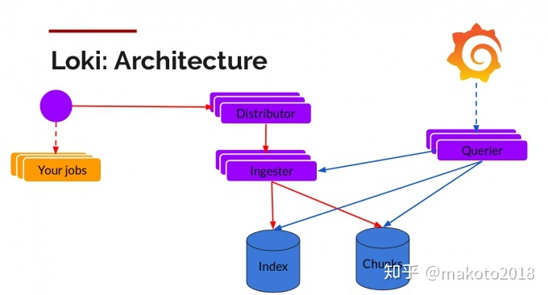
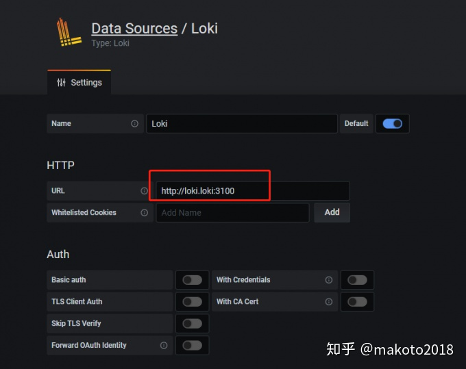
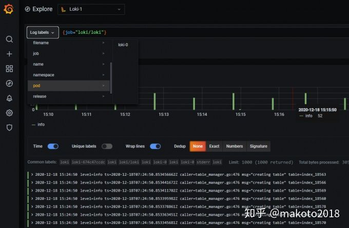
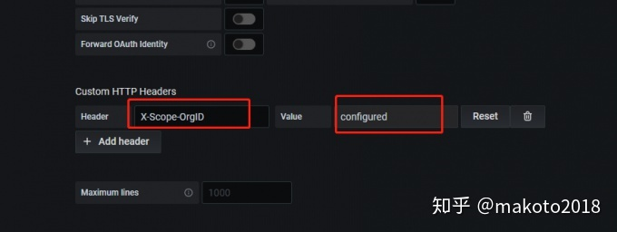
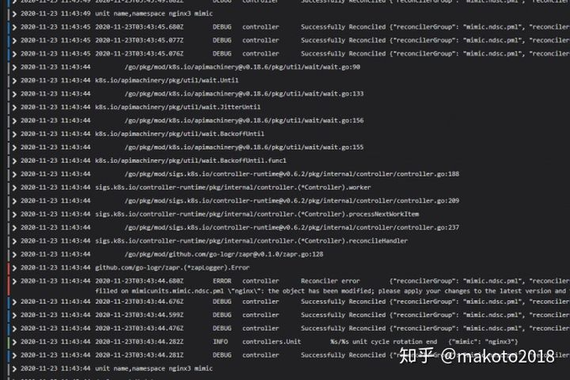

# 日志采集方案Loki的介绍与实践

[](https://www.zhihu.com/people/makoto2018)

[makoto2018](https://www.zhihu.com/people/makoto2018)

关注他

## 一、介绍

### 为什么需要日志采集

日志采集主要解决日志的统一存储和查询的问题： 1. 避免非持久化日志的丢失 2. 避免频繁定位并登录宿主机查看

### 为什么需要Loki

Loki和常用的EFK（Elasticsearch + Filebeat + Kibana）日志采集方案类似，基本架构都是在应用节点有代理进程（Promtail）收集日志，传输到集中化的服务（Loki）存储和索引，最后通过图形化界面（Grafana）统一查询。

Loki与EFK的主要区别在于： 1. Loki不会对原始的日志数据进行全文索引，而是采用了Prometheus的标签思想，只对标签索引 2. 日志数据本身也会被压缩，并以chunks（块）的形式存储在对象存储或者本地文件系统 3. Loki能够以微服务模式运行，也就是把自身的各个模块分解出单个进程运行。比如，通过横向扩展多个查询器（Querier）模块可提高查询性能。

这几点区别使Loki更加轻量和灵活，特别适合云原生环境。





## 二、实践

### 部署Loki

通过Helm可以快速在K8S中部署Loki，并有多种参数配置提供选择：

```bash
# 部署Loki和Promtail
helm upgrade --install loki --namespace=loki loki/loki

# 部署Loki，Promtail和Grafana
helm upgrade --install loki loki/loki-stack --set grafana.enabled=true

# 部署Loki，Promtail和Grafana 并配置持久化存储
helm upgrade --install loki loki/loki-stack  --set grafana.enabled=true,loki.persistence.enabled=true,loki.persistence.storageClassName=nfs-client,loki.persistence.size=5Gi
```

这种方式部署Loki由StatefulSet控制，Promtail则由DaemonSet控制。另外，Promtail也可以以K8S常用的sidecar模式运行，为每个业务Pod单独配置。

部署完成后可修改Grafana的Service类型为NodePort，方便在本地浏览器访问：

```bash
kubectl edit service/loki-grafana -n loki
```

### 使用Loki

浏览器访问Grafana，以admin登录，密码可从以下命令行获取：

```bash
kubectl get secret --namespace loki loki-grafana -o jsonpath="{.data.admin-password}" | base64 --decode ; echo
```

在Grafana的侧边栏选择Configuration > Data Sources，点击Add data source按钮，选择Loki数据源，在URL中填写Loki的地址。因为是部署在K8S中，所以填写的是K8S内部域名形式。





配置好数据源之后，侧边栏选择Explore并且选择label就可以查看日志。




也可以自己输入Loki自己定义的日志查询语言[LogQL](https://link.zhihu.com/?target=https%3A//grafana.com/docs/loki/latest/logql/)查询。

```bash
# 查询所有包含cleaning的loki日志
{job="loki/loki"} |= "cleaning"
```

LogQL支持三种Parser（json，[logfmt](https://link.zhihu.com/?target=https%3A//brandur.org/logfmt)和regexp）。使用json格式的日志比较少见，而regexp又需要写正则表达式不太方便，所以推荐日志都统一使用logfmt的格式。Prometheus，Grafana，包括Loki自身都是使用logfmt格式的日志。

```bash
# 查询日志级别为info的loki日志
{job="loki/loki"} | logfmt | level="info"
```

### 配置Loki

### Loki配置

Loki配置主要就是配置多租户模式，在配置文件中添加auth_enabled: true即可开启。开启后所有的请求（推送和查询）都必须带上一个租户的HTTP Header（X-Scope-OrgID）。租户之间的日志相互隔离，并且可以配置每个租户推送日志的速率，防止一个租户下的日志狂打从而拖慢其他租户的正常日志采集。

```bash
# Per-user ingestion rate limit in sample size per second. Units in MB.
# CLI flag: -distributor.ingestion-rate-limit-mb
[ingestion_rate_mb: <float> | default = 4]

# Per-user allowed ingestion burst size (in sample size). Units in MB.
# The burst size refers to the per-distributor local rate limiter even in the
# case of the "global" strategy, and should be set at least to the maximum logs
# size expected in a single push request.
# CLI flag: -distributor.ingestion-burst-size-mb
[ingestion_burst_size_mb: <int> | default = 6]
```

开启多租户模式后，Grafana的数据源也需要作相应配置，否则无法正常使用。




### Promtail配置

Promtail配置主要就是配置抓取目标，Helm部署后默认抓取配置如下（取其中一个job）：

```yaml
scrape_configs:
    - job_name: kubernetes-pods-name
      pipeline_stages:
        - docker: {}
      kubernetes_sd_configs:
      - role: pod
      relabel_configs:
      - source_labels:
        - __meta_kubernetes_pod_label_name
        target_label: __service__
      - source_labels:
        - __meta_kubernetes_pod_node_name
        target_label: __host__
      - action: drop
        regex: ''
        source_labels:
        - __service__
      - action: labelmap
        regex: __meta_kubernetes_pod_label_(.+)
      - action: replace
        replacement: $1
        separator: /
        source_labels:
        - __meta_kubernetes_namespace
        - __service__
        target_label: job
      - action: replace
        source_labels:
        - __meta_kubernetes_namespace
        target_label: namespace
      - action: replace
        source_labels:
        - __meta_kubernetes_pod_name
        target_label: pod
      - action: replace
        source_labels:
        - __meta_kubernetes_pod_container_name
        target_label: container
      - replacement: /var/log/pods/*$1/*.log
        separator: /
        source_labels:
        - __meta_kubernetes_pod_uid
        - __meta_kubernetes_pod_container_name
        target_label: __path__
```

------

```yaml
kubernetes_sd_configs:
      - role: pod
```

K8S服务发现配置，角色为pod时可发现所有的pod，并将k8s的一些元数据保存在原标签里，供relabel阶段使用。

```bash
# pod名
__meta_kubernetes_pod_name
# pod中某个label的值
__meta_kubernetes_pod_label_<labelname>
# pod所在宿主机名
__meta_kubernetes_pod_node_name:
...
```

------

```yaml
pipeline_stages:
        - docker: {}
```

pipeline是预置一些处理的集合，在K8S的环境下都会启用docker阶段，处理docker下的json-file日志。pipeline有个tenant阶段，在这里可配置租户ID，如：

```yaml
# 静态租户ID
      pipeline_stages:
        - docker: {}
        - tenant:
            value: kubernetes-pods-name

      # 动态租户ID
      pipeline_stages:
        - docker: {}
        - tenant:
            source: __meta_kubernetes_pod_name
```

*在抓取配置之外还可以配置一个租户ID，作为这个Promtail进程的全局租户ID。*

------

```yaml
relabel_configs:
      - source_labels:
        - __meta_kubernetes_pod_label_name
        target_label: __service__
```

relabel的配置和Prometheus的是一模一样的，可以基于已经发现的元标签，动态的添加或者覆盖新标签。详情可参考[Prometheus文档](https://link.zhihu.com/?target=https%3A//prometheus.io/docs/prometheus/latest/configuration/configuration/%23relabel_config)。

------

Promtail也可以直接部署在物理机上，监听非容器进程的日志。配置里去掉了pipeline和K8S源标签的处理，并使用了一个静态标签（job=varlogs）。

```yaml
server:
  http_listen_port: 9080
  grpc_listen_port: 0

positions:
  filename: /tmp/positions.yaml

clients:
  - url: http://localhost:3100/loki/api/v1/push

scrape_configs:
- job_name: system
  static_configs:
  - targets:
      - localhost
    labels:
      job: varlogs
      __path__: /var/log/*log
```

### 多行日志的问题

经实践发现，Loki目前没有支持多行日志的处理，导致错误栈的每一行都被识别为一行日志，对错误日志的查询定位非常不友好。



这个问题暂时没有太好的解决方法，但[Github Issues](https://link.zhihu.com/?target=https%3A//github.com/grafana/loki/issues/74)上官方已经跟进，并且进入了2.2的Milestone。

### 应该避免的问题

避免使用动态标签去匹配具有较大范围的可能值，比如ip值。这样会导致Loki建立一个巨大的索引，性能非常差。

发布于 2020-12-21

[Kubernetes](https://www.zhihu.com/topic/20018384)

[日志](https://www.zhihu.com/topic/19718384)

[Grafana](https://www.zhihu.com/topic/20089594)