[](https://juejin.cn/user/2840793779016653)

[平凡人笔记 ](https://juejin.cn/user/2840793779016653)[](https://juejin.cn/book/5c90640c5188252d7941f5bb/section/5c9065385188252da6320022)

2020年07月26日 阅读 2203

关注

# 轻量级日志系统Loki原理简介和使用

## 前言

这篇文章应朋友的要求，让写一篇loki日志系统，咱定义不容辞 一定要好好写 开干！

## 现实中的需求

公司的容器云运行的应用或某一个节点出现了问题，解决的思路

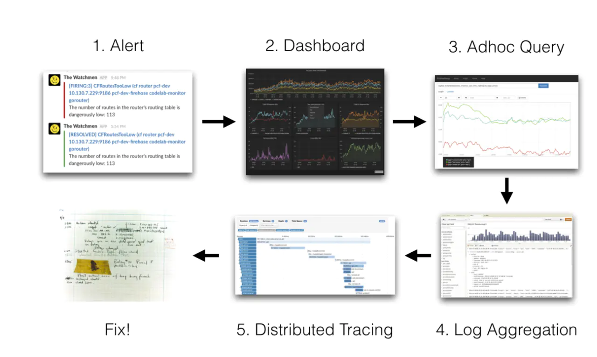

问题首先被prometheus监控

1、metric是来说明当前或者历史达到了某个值

2、alert设置metric达到某个特定的基数触发了告警

仅仅这些日志是不能够解决问题的 还需要看下应用的日志

k8s的基本单位是pod

pod把日志输出到stdout和stderr

当某个pod的内存变得很大

触发了我们的alert

这个时候管理员

去页面查询确认是哪个pod有问题

然后要确认pod内存变大的原因

我们还需要去查询pod的日志

如果没有日志系统

那么我们就需要到页面或者使用命令进行查询了


如果这个时候应用挂掉了 那么就没有办法再查询到相关日志了

## 解决该需求可供选择的方案

### ELK

优势：

1、功能丰富，允许复杂的操作

劣势：

1、主流的ELK（全文检索）或者EFK比较重

2、ES复杂的搜索功能很多都用不上 规模复杂，资源占用高，操作苦难

大多数查询只关注一定时间范围和一些简单的参数（如host、service等）

3、Kibana和Grafana之间切换，影响用户体验

4、倒排索引的切分和共享的成本较高

### Loki

1、最小化度量和日志的切换成本

有助于减少异常事件的响应时间和提高用户的体验

2、在查询语言的易操作性和复杂性之间可以达到一个权衡

3、更具成本效益

## loki组件介绍

### Promtail

- 用来将容器日志发送到 Loki 或者 Grafana 服务上的日志收集工具
- 该工具主要包括发现采集目标以及给日志流添加上 Label 标签 然后发送给 Loki
- Promtail 的服务发现是基于 Prometheus 的服务发现机制实现的

### Loki

- 受 Prometheus 启发的可以水平扩展、高可用以及支持多租户的日志聚合系统
- 使用了和 Prometheus 相同的服务发现机制，将标签添加到日志流中而不是构建全文索引
- 从 Promtail 接收到的日志和应用的 metrics 指标就具有相同的标签集
- 不仅提供了更好的日志和指标之间的上下文切换，还避免了对日志进行全文索引

### Grafana

- 一个用于监控和可视化观测的开源平台
- 支持非常丰富的数据源
- 在 Loki 技术栈中它专门用来展示来自 Prometheus 和 Loki 等数据源的时间序列数据
- 可进行查询、可视化、报警等操作
- 可以用于创建、探索和共享数据 Dashboard
- 鼓励数据驱动

## Loki架构

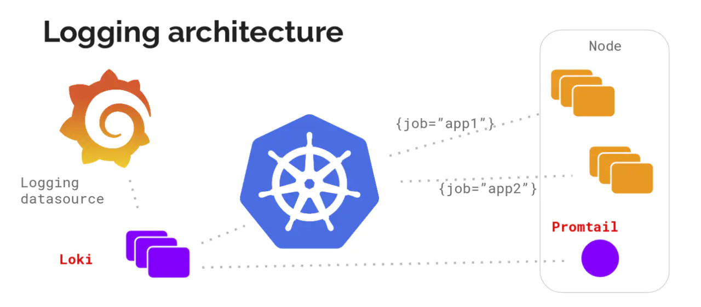

1、

Loki使用了和prometheus一样的标签来作为索引

通过标签既可以查询日志的内容也可以查询到监控的数据

不但减少了两种查询之间的切换成本

也极大地降低了日志索引的存储

2、

Loki将使用与prometheus相同的服务发现和标签重新标记库编写了pormtail

在k8s中promtail以daemonset方式运行在每个节点中

通过kubernetes api等到日志的正确元数据

并将它们发送到Loki

## 日志的存储架构

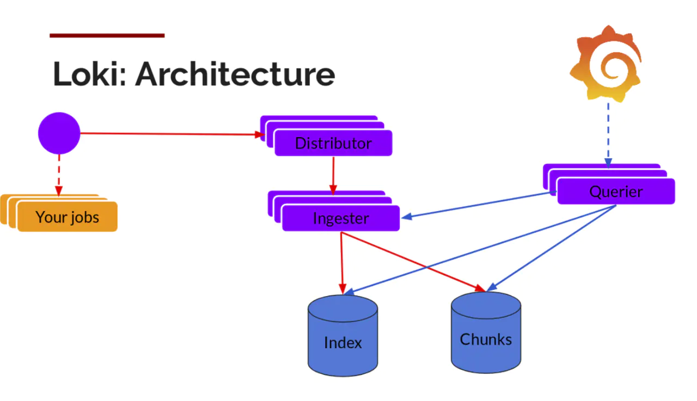

### Distributor

1、

promtail收集日志并将其发送给loki

Distributor就是第一个接收日志的组件

Loki通过构建压缩数据块来实现批处理和压缩数据

2、

组件ingester是一个有状态的组件

负责构建和刷新chunck

当chunk达到一定的数量或者时间后

刷新到存储中去

3、

每个流的日志对应一个ingester

当日志到达Distributor后

根据元数据和hash算法计算出应该到哪个ingester上面

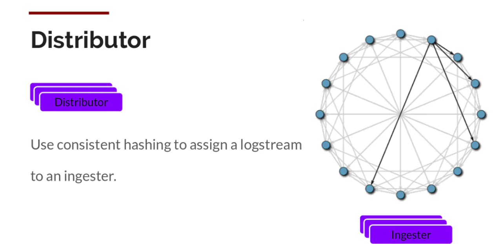

4、为了冗余和弹性，我们将其复制n（默认情况下为3）次

### Ingester

ingester接收到日志并开始构建chunk

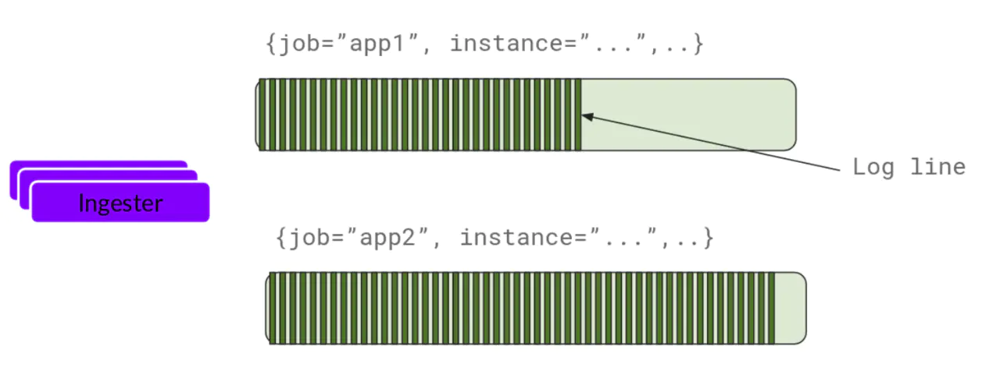

将日志进行压缩并附加到chunk上面

一旦chunk“填满”（数据达到一定数量或者过了一定期限）

ingester将其刷新到数据库

我们对块和索引使用单独的数据库

因为它们存储的数据类型不同

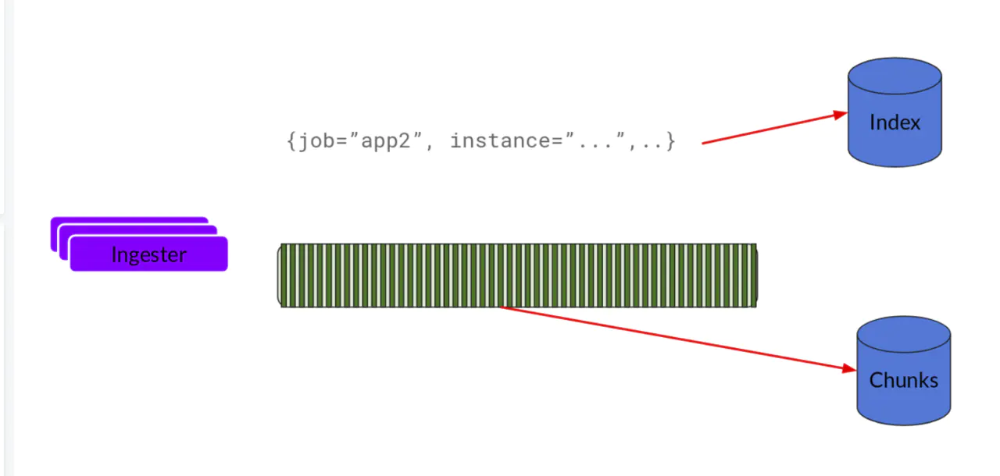

刷新一个chunk之后

ingester然后创建一个新的空chunk并将新条目添加到该chunk中

### Querier

1、 由Querier负责给定一个时间范围和标签选择器

Querier查看索引以确定哪些块匹配

并通过greps将结果显示出来

它还从Ingester获取尚未刷新的最新数据

2、

对于每个查询

一个查询器将为您显示所有相关日志

实现了查询并行化

提供分布式grep

即使是大型查询也是足够的

### 拓展性

- Loki的索引存储可以是cassandra/bigtable/dynamodb
- chuncks可以是各种对象存储
- Querier和Distributor都是无状态的组件
- 对于ingester他虽然是有状态的 但当新的节点加入或者减少整节点间的chunk会重新分配，以适应新的散列环

## 环境搭建(使用docker编排来实现)

安装loki、promtail、grafana

- 编写docker编排配置文件

```
vim docker-compose.yaml

version: "3"

networks:
  loki:

services:
  loki:
    image: grafana/loki:1.5.0
    ports:
      - "3100:3100"
    command: -config.file=/etc/loki/local-config.yaml
    networks:
      - loki

  promtail:
    image: grafana/promtail:1.5.0
    volumes:
      - /var/log:/var/log
    command: -config.file=/etc/promtail/docker-config.yaml
    networks:
      - loki

  grafana:
    image: grafana/grafana:latest
    ports:
      - "3000:3000"
    networks:
      - loki
复制代码
```

- 启动安装

```
docker-compose up -d

复制代码
```

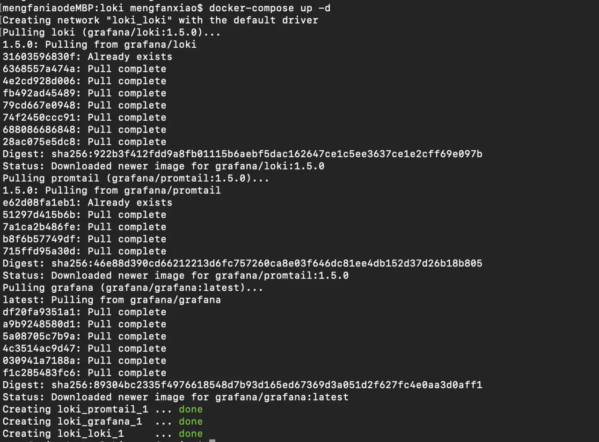

```
docker-compose ps
复制代码
```

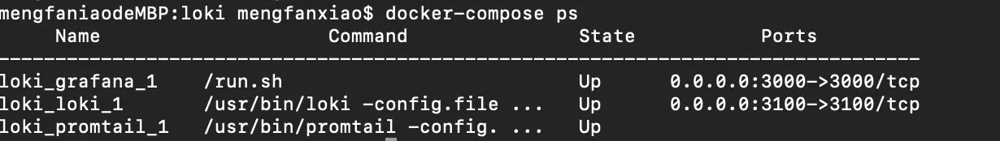

- 访问 grafana界面

```
http://localhost:3000
复制代码
```

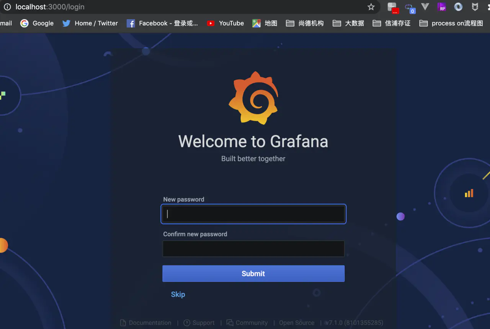

默认的登陆账号admin/admin

然后添加loki数据源

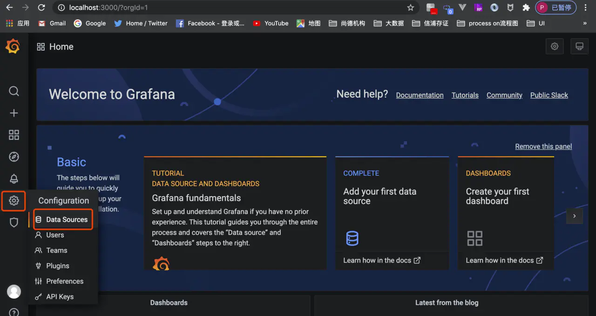

url添加http://loki:3100/

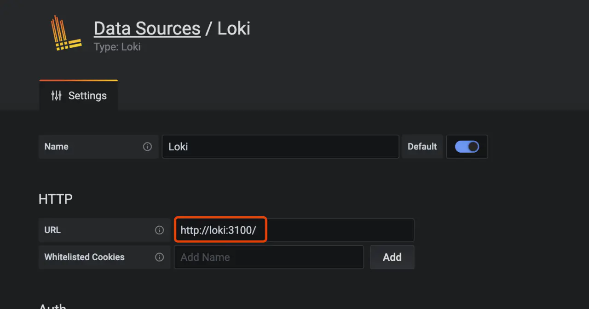

点击Explore 选择Loki 选择相应的Label

也可以通过正则表达式来查询日志

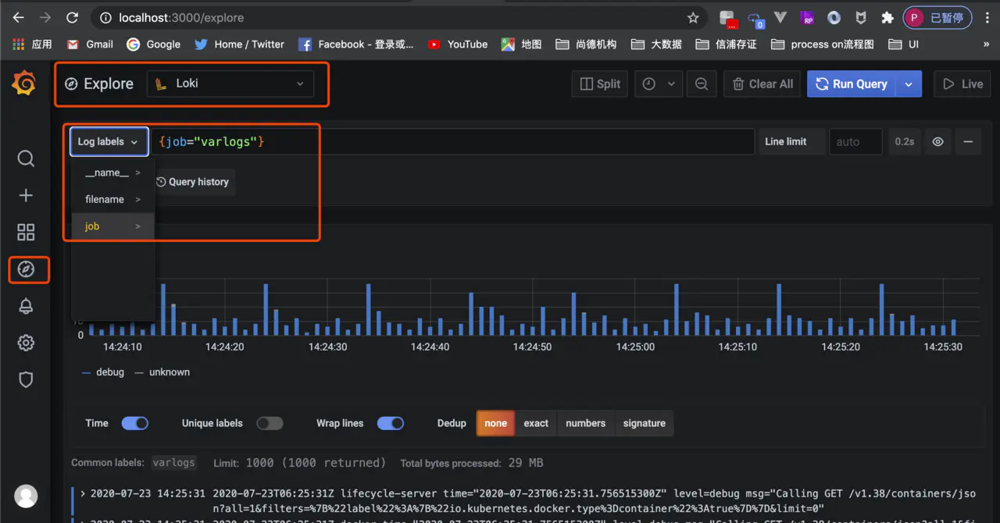

------

上面咱说完了 liki架构、实现原理及环境搭建过程

现在就结束了吗? No 那多显得那么出类拔萃呀 哈哈

咱再结合一个具体的案例：

使用loki对接下k8s下面的pod日志

let's go !

具体过程如下：

1、nacos为注册中心

2、user和order为2个springboot项目

3、将user和order使用k8s部署

4、访问user接口 ，user访问order 打印出日志

5、该日志通过loki显示出来

1-4过程 咱们之前的文章介绍过

[【实战】K8S部署Nacos微服务](https://mp.weixin.qq.com/s/D297GNcGHS7rVPJDhX1-6Q)

朋友们如果自己想实际操练一遍的话可以先看下这篇文章 使用k8s把项目部署起来

部署的效果是

nacos界面

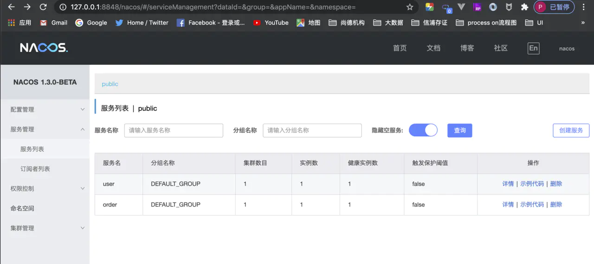

user和order服务都是k8s部署的

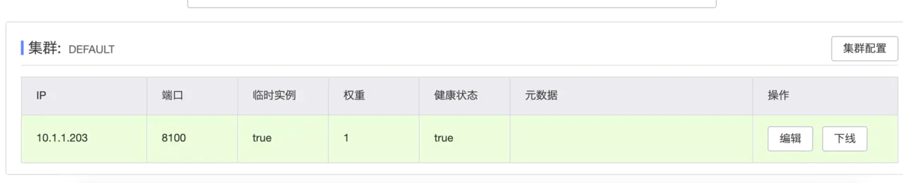

这里显示的ip是k8s集群下面的ip

- 查看pod

```
kubectl get pod
复制代码
```

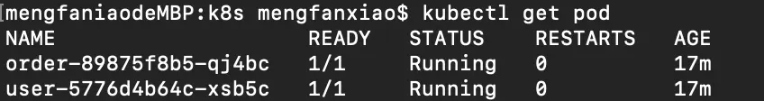

- 查看service服务

```
kubectl get svc
复制代码
```

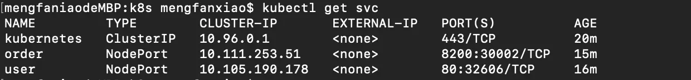

2个都是nodePort类型的

所以直接可以访问user服务的接口

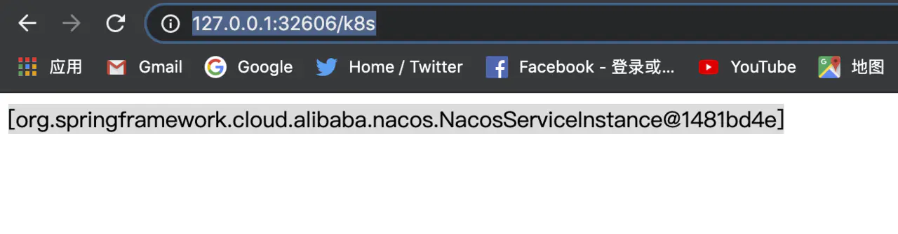

- 查看user 这个pod的日志

```
kubectl logs -f user-5776d4b64c-xsb5c
复制代码
```

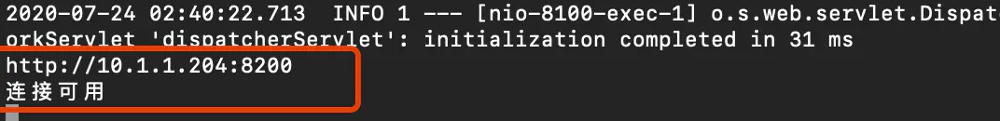

**现在loki有了,k8s pod 日志也有了 下面咱看看loki和k8s如何关联起来 达到通过loki查询k8s的效果**

这里只需要实现 promtail访问到k8s日志就可以了

promtail可以直接访问到k8s集群内部的日志

也可以将k8s集群内部的日志挂载到宿主机器上 然后再通过promtail访问宿主机上的日志

这里介绍4种实现方式

咱们分别实现下看看

**备注：这篇文章先简单介绍下4种方式的思路，下篇文章咱们针对这4种方式实现相应的效果**

### 方式1:将默认路径 var/logs/*log 修改成/var/log/container

promtail可以直接访问到k8s集群内部的日志

首先需要知道 k8s集群下面的pod生成的日志 默认目录为/var/log/containers

1、咱先看看上面的promtail的docker-compose的配置命令

```
promtail:
    image: grafana/promtail:1.5.0
    volumes:
      - /var/log/container:/var/log/container
    command: -config.file=/etc/promtail/docker-config.yaml
    networks:
      - loki
复制代码
```

其中 /etc/promtail/docker-config.yaml

是访问的docker内部的配置文件

咱进去docker内部看下

a、查看容器id

```
docker ps |grep promtail
复制代码
```

b、进入容器

```
docker exec -it 71cb21c2d0a3 sh
复制代码
```

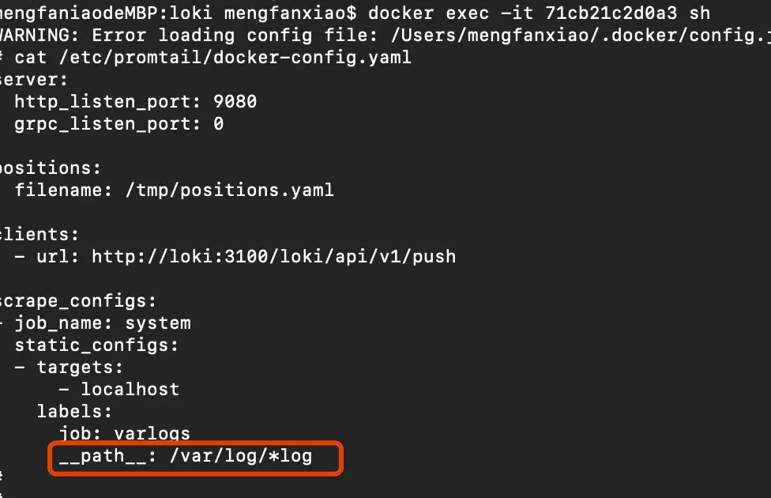

看到了

job=varlogs

对应的日志文件路径是 /var/log/*log

是不是有似曾相识的感觉

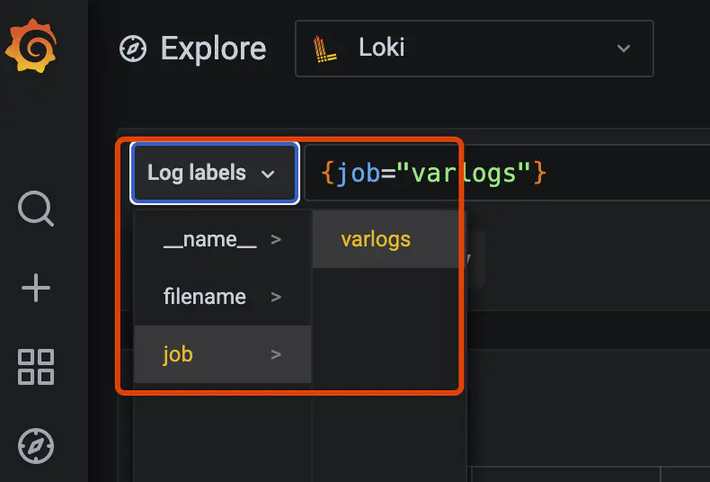

job对应varlogs

filenames是对应的日志路径 /var/log/*log下面的日志文件

当然只是在promtail容器内部的

在这里只需要将/var/log/*log路径修改成 /var/log/container/*log 这个路径就可以了

那如何修改呢

我们知道 这个配置文件是在容器内部的

要想修改这个配置文件 需要在宿主机也弄一份 然后修改宿主机上的这份文件 然后替换掉docker种的这个配置即可

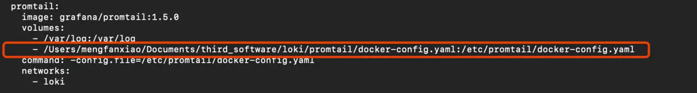

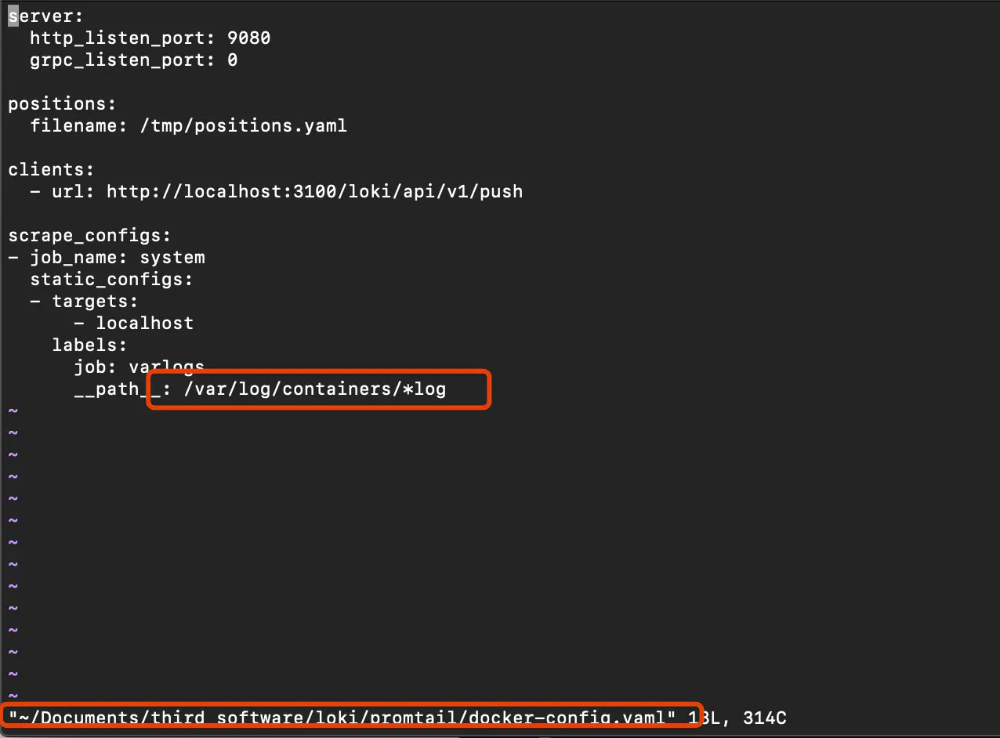

重启部署下docker-compose

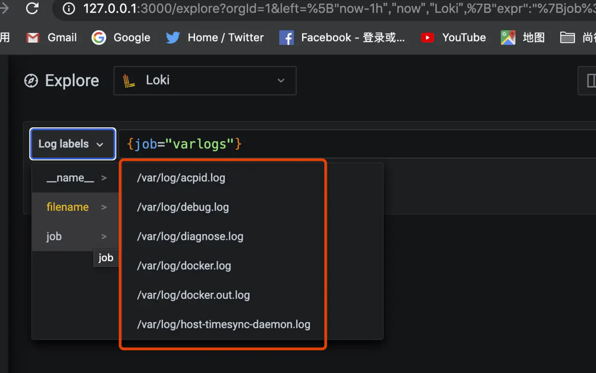

看到界面效果 发现问题了没？

1、路径不是修改成 /var/log/container/*log 这个了吗 怎么还是 /var/log下面的日志？

2、选中一个日志文件怎么显示不出来该文件的内容

这2个问题放到下篇文章解答下吧 （先埋个坑 哈哈 我这么这么坏）

### 方式2

```
- replacement: /var/log/container/*.log
复制代码
```

这种方式也放到下篇文章再说吧

### 方式3：将k8s集群内部的日志挂载到宿主机器上 然后再通过promtail访问宿主机上的日志

这种方式 我试过了 也是达到期望效果的

1、

首先给springboot项目添加日志文件输出 咱们这个示例中 以user项目为例说下

- 增加日志文件

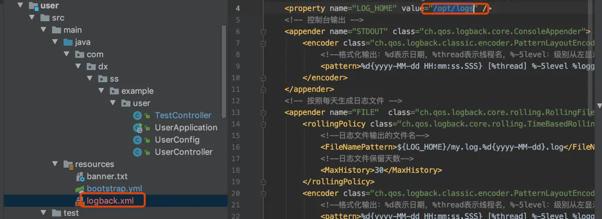

- 日志文件的输出目录是 /opt/logs

2、将springboot项目生成docker镜像 然后上传到阿里的镜像库 然后在k8s user 配置文件中引用这个镜像库

这些都在之前那篇文章中详细说过了 这里就不再附述了

这里只需要不同点

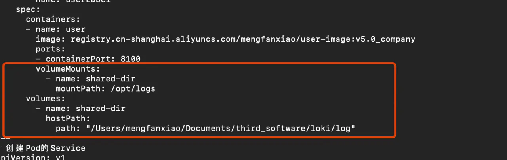

圈红的地方是添加的映射

volumeMounts 这个是将docker内部的/opt/logs目录作为挂载目录

volumes 这个是将宿主机中的

/Users/mengfanxiao/Documents/third_software/loki/log

目录作为映射目录 即docker中的/opt/logs下面的日志会映射到该目录下

需要注意：

我一开始用的目录是 /opt/logs 但是在我的mac环境中一直不能将docker中的日志目录映射到宿主机上 但 centos就可以 这个原因也放到下篇文章说下吧

3、最后 只需要让promtail访问/Users/mengfanxiao/Documents/third_software/loki/log 这个目录下面的日志就行了

至于怎么让promtail访问 下篇再说吧

### 方式4：promtail不是从/var/log目录下读取的日志嘛 那么我将user日志输出到/var/log 下面不就行了

## 可能遇到的问题

- 如果k8s状态是start fail状态 则service暴露NodePort的端口也访问不了的情况下 需要重新启动下k8s

启动方式 可以参考下我之前的那篇文章 [K8S原理简介及环境搭建](https://mp.weixin.qq.com/s/UA93vBi9J-iQzj4HTKNG3A)

本文使用 [mdnice](https://mdnice.com/?from=juejin) 排版

关注下面的标签，发现更多相似文章

[Docker](https://juejin.cn/tag/Docker)