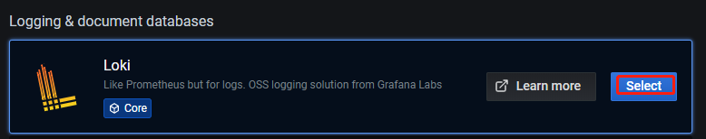
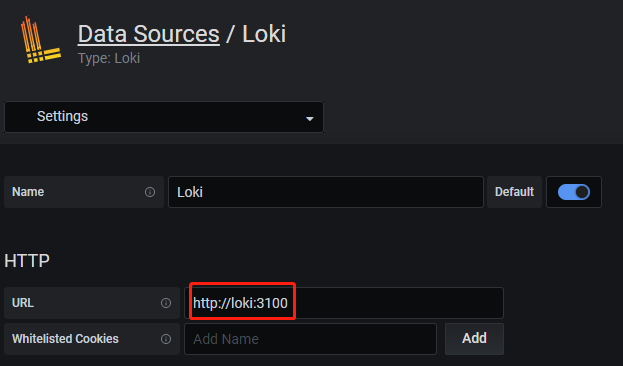
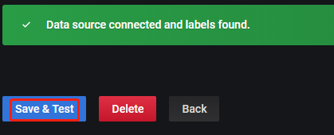
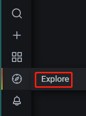
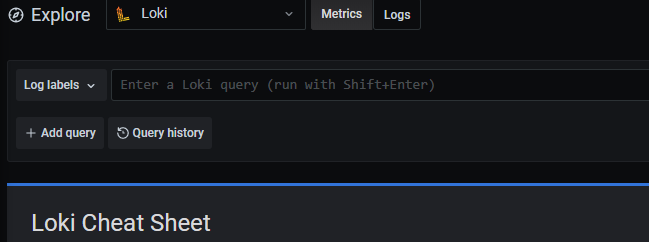
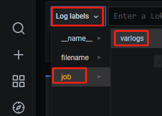
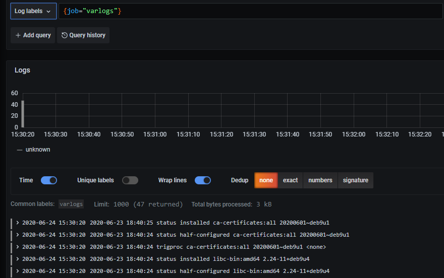
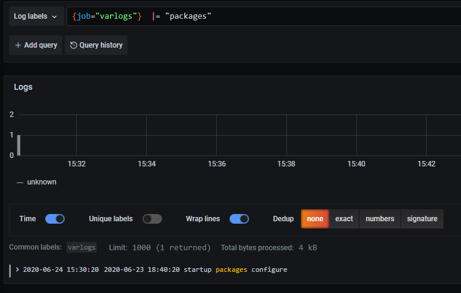

# [Loki日志系统](https://www.cnblogs.com/xiao987334176/p/13187473.html)

# 一、概述


# 背景

Loki的第一个稳定版本于2019年11月19日发布，是 Grafana Labs 团队最新的开源项目，是一个水平可扩展，高可用性，多租户的日志聚合系统。 Grafana 对 Loki 的描述如下：

```
Loki: like Prometheus, but for logs. Loki is a horizontally-scalable, highly-available, multi-tenant log aggregation system inspired by Prometheus. It is designed to be very cost effective and easy to operate. It does not index the contents of the logs, but rather a set of labels for each log stream.
```

 

简单说，Loki 是专门用于聚集日志数据，重点是高可用性和可伸缩性。与竞争对手不同的是，它确实易于安装且资源效率极高。

血衫目前运维大概上百个节点，虽然系统是统一的基线版本且使用docker运行应用，平时相安无事，但变更后的问题排查仍有点心有余悸。对一个火热的日志系统elk也有浅尝辄止，奈何对于非核心应用，多耗散一份算力意味着成本增加和利润的减少，elk对于小团队来说，还是过于笨重。趁着近日的疫情无法外出，调研后将 Loki 上线了生产，可以说是完美契合了中小团队对日志平台的需求。

# 介绍

与其他日志聚合系统相比，`Loki`具有下面的一些特性：

- 不对日志进行全文索引（vs ELK技）。通过存储压缩非结构化日志和仅索引元数据，Loki 操作起来会更简单，更省成本。
- 通过使用与 Prometheus 相同的标签记录流对日志进行索引和分组，这使得日志的扩展和操作效率更高。
- 特别适合储存 Kubernetes Pod 日志; 诸如 Pod 标签之类的元数据会被自动删除和编入索引。
- 受 Grafana 原生支持。

Loki 由以下3个部分组成：

- `loki`是主服务器，负责存储日志和处理查询。
- `promtail`是代理，负责收集日志并将其发送给 loki 。
- `Grafana`用于 UI 展示。

 

# 二、安装

本文以一台centos 7.6主机来演示一下loki，ip地址为：192.168.31.229 

 

Docker-compose.yml 可以参考`Loki`的[文档介绍](https://github.com/grafana/loki/tree/master/production)，开箱即用。

创建目录/opt/loki，文件结构如下：

```
./
└── docker-compose.yaml
```

 

docker-compose.yaml

[](javascript:void(0);)

```
version: "3"

networks:
  loki:

services:
  loki:
    image: grafana/loki:latest
    ports:
      - "3100:3100"
    networks:
      - loki

  promtail:
    image: grafana/promtail:latest
    networks:
      - loki

  grafana:
    image: grafana/grafana:master
    ports:
      - "3000:3000"
    networks:
      - loki
```

[](javascript:void(0);)

说明：这里启动了3个容器，都是运行在网桥loki上，方便相互通讯。

 

然后直接使用 docker-compose 启动即可：

```
docker-compose up -d
```

 

查看服务状态

[](javascript:void(0);)

```
# docker-compose ps
     Name                    Command               State           Ports         
---------------------------------------------------------------------------------
loki_grafana_1    /run.sh                          Up      0.0.0.0:3000->3000/tcp
loki_loki_1       /usr/bin/loki -config.file ...   Up      0.0.0.0:3100->3100/tcp
loki_promtail_1   /usr/bin/promtail -config. ...   Up 
```

[](javascript:void(0);)

 

# 二、使用

安装完成后，访问节点的 3000 端口访问 grafana，默认用户名和密码都是admin

```
http://192.168.31.229:3000/
```

 

选择添加数据源：


 

 选择loki



 

 

源地址配置`http://loki:3100`即可



 

**注意：这里的 http://loki:3100，表示访问容器名为loki的3100端口。**

 

点击保存



 

 

保存完成后，切换到 grafana 左侧区域的`Explore`



 

 

即可进入到`Loki`的页面



 

 

点击`Log labels`就可以把当前系统采集的日志标签给显示出来，可以根据这些标签进行日志的过滤查询：

选择job-->varlogs



 

 点击右上角的Run Query，效果如下：



 

 这里展示的是promtail容器里面/var/log目录中的日志

promtail容器/etc/promtail/config.yml 

[](javascript:void(0);)

```
server:
  http_listen_port: 9080
  grpc_listen_port: 0

positions:
  filename: /tmp/positions.yaml

clients:
  - url: http://loki:3100/loki/api/v1/push

scrape_configs:
- job_name: system
  static_configs:
  - targets:
      - localhost
    labels:
      job: varlogs
      __path__: /var/log/*log
```

[](javascript:void(0);)

这里的job就是varlog，文件路径就是/var/log/*log

 

# 四、配置

从上面的步骤已经可以一窥使用方法了，如果要使用起来，我们还需要了解如下信息：

### Loki 的配置

Loki的详细配置，可查看官方文档：https://github.com/grafana/loki/blob/master/docs/README.md

配置相关文档： https://github.com/grafana/loki/blob/v1.3.0/docs/configuration/README.md

我目前均保留了保留默认配置。

### promtail的配置

promtail 是 Loki 的官方支持的日志采集端，在需要采集日志的节点上运行采集日志，再统一发送到 Loki 进行处理。我们编写的大多是这一部分。

官方配置说明： https://github.com/grafana/loki/blob/v1.3.0/docs/clients/promtail/configuration.md

除了使用Promtail，社区还有很多采集日志的组件，比如fluentd、fluent bit等，都是比较优秀的。

 

# 五、选择器

对于查询表达式的标签部分，将其包装在花括号中`{}`，然后使用键值对的语法来选择标签，多个标签表达式用逗号分隔，比如：

```
{app="mysql",name="mysql-backup"}
```

目前支持以下标签匹配运算符：

- `=`等于
- `!=`不相等
- `=~`正则表达式匹配
- `!~`不匹配正则表达式

比如：

```
{name=~"mysql.+"}
{name!~"mysql.+"}
```

适用于`Prometheus`标签选择器规则同样也适用于`Loki`日志流选择器。

 

# 六、过滤器

编写日志流选择器后，您可以通过编写搜索表达式来进一步过滤结果。搜索表达式可以只是文本或正则表达式。
查询示例：

```
{job="mysql"} |= "error"
{name="kafka"} |~ "tsdb-ops.*io:2003"
{instance=~"kafka-[23]",name="kafka"} != kafka.server:type=ReplicaManager
```

 

过滤器运算符可以被链接，并将顺序过滤表达式-结果日志行将满足每个过滤器。例如：

```
{job="mysql"} |= "error" != "timeout"
```

已实现以下过滤器类型：

- |= 行包含字符串。
- != 行不包含字符串。
- |~ 行匹配正则表达式。
- !~ 行与正则表达式不匹配。
  regex表达式接受RE2语法。默认情况下，匹配项区分大小写，并且可以将regex切换为不区分大小写的前缀(?i)。

更多内容可参考[官方说明](https://github.com/grafana/loki/blob/master/docs/querying.md#grafana)

 

举例，我需要查询包含关键字packages

```
{job="varlogs"}  |= "packages"
```

效果如下：



 

 

# 参考资料

- [Loki 设计初心](https://docs.google.com/document/d/11tjK_lvp1-SVsFZjgOTr1vV3-q6vBAsZYIQ5ZeYBkyM/view#)
- [Grafana 6.0 正式发布！新增查询工作流，全新独立 Gauge 面板](https://www.mayi888.com/archives/59170)

 

本文参考链接：

https://blog.kelu.org/tech/2020/01/31/grafana-loki-for-logging-aggregation.html

https://www.cnblogs.com/ssgeek/p/11584870.html

 

分类: [python 运维开发](https://www.cnblogs.com/xiao987334176/category/1339030.html)

标签: [docker](https://www.cnblogs.com/xiao987334176/tag/docker/)