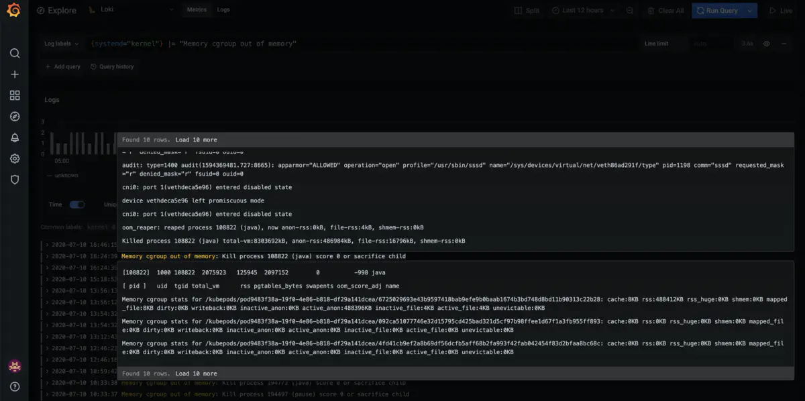
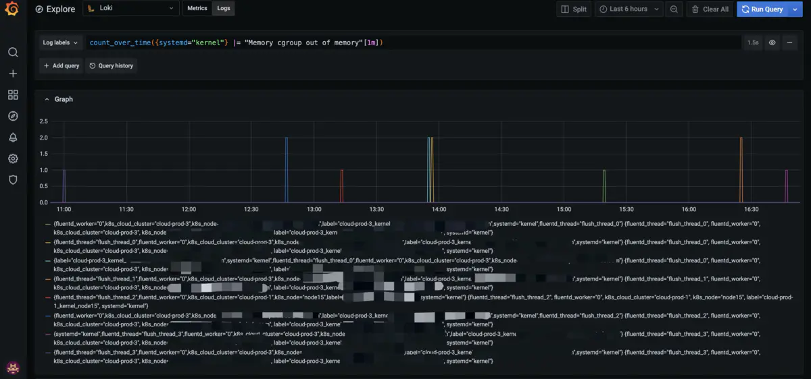
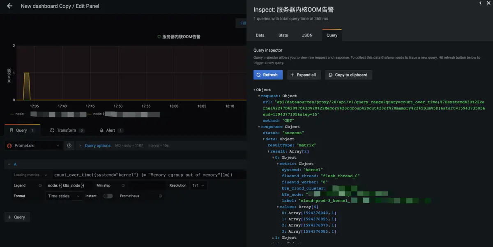
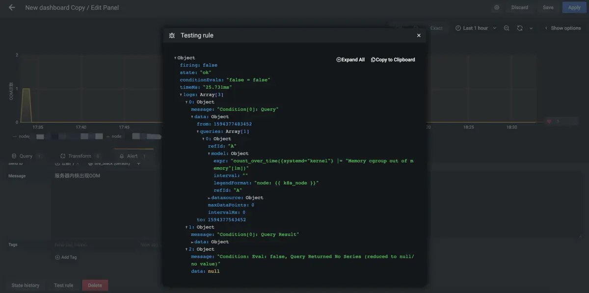
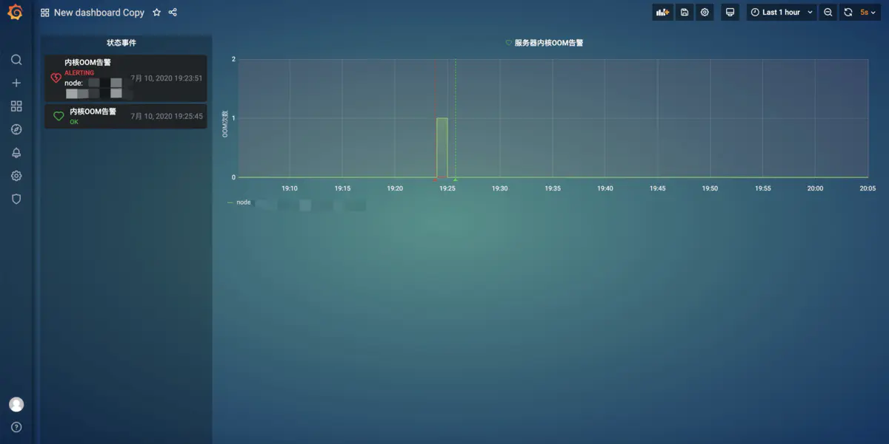

# 利用Grafna给你的Loki添加日志告警

[](https://www.jianshu.com/u/732d97337566)

[云原生小白](https://www.jianshu.com/u/732d97337566)关注

0.0862020.07.12 14:11:26字数 1,218阅读 801

> 正文共： 2085字
> 预计阅读时间： 6分钟

做过运维的同学都知道，服务的可观测性是一个非常重要的渠道，能够让我们掌控线上服务运行时的状态。一个好的监控系统，其价值在于一旦出现故障能够让我们运维的同学能够快速收到服务异常的通知以及定位问题。也就是我们常说的告警的两大衡量指标，即实时性和有效性。

那么，今天小白请出第一个云原生里负责日志存储的便是Loki。这里可能有同学就说了:"我的日志存储和分析一直用elasticsearch也可以啊，为什么要用Loki"。
别急，等小白慢慢说道说道

- 首先Loki采用Golang开发，相比ES，Loki它更加轻量也更容易部署；
- 其次Loki仅索引日志的元数据部分，日志部分全部压缩存储，这样在方便操作的同时又节省我们存储空间
- Loki采用和Prometheus一样的标签建立索引，这意味我们可以通过标签将metrics和logging监控数据联动起来

Loki也是由三部分构成，分别是负责采集的Promtail、负责存储的Loki和负责展示的Grafana。这里又有同学问了："我自己有了日志采集客户端了，难道还要再加一个Promtail吗？"。其实不然，Loki的日志收集有四种方法，除了Promtail外，还可以使用`Fluentd`、`Fluent Bit`和`Docker Driver`方式。

今天，小白的实践就是利用Grafana给Loki日志添加告警功能

假设小白认为大家已经使用上Loki并在Grafana上查询日志了。那么小白就在自己的环境内操作一次通过将内核OOM的故障告警出来的实践来向大家展示。

**1.**通过标签定位到需要查看的服务,并通过关键字过滤出想要查看的日志内容



image.png

**2.**小白想看下过去一段时间内，服务器上出现OOM的趋势



image.png

可以看到，这里小白的服务器每过段时间都会出现零零散散的OOM实践，那么运维的同学就要问了:"这么多OOM怎么办，Grafana好像没地方可以配置Loki告警啊"，小白先按下不表，让我们先来看看Prometheus和Loki的查询接口：

**Prometheus的查询接口**


```ruby
# 及时查询
$ curl 'http://localhost:9090/api/v1/query?query=up&time=2015-07-01T20:10:51.781Z'
# 范围查询
$ curl 'http://localhost:9090/api/v1/query_range?query=up&start=2015-07-01T20:10:30.781Z&end=2015-07-01T20:11:00.781Z&step=15s'
```

**Loli的查询接口**


```ruby
# 及时查询
$ curl -G -s  "http://localhost:3100/loki/api/v1/query" --data-urlencode 'query=sum(rate({job="varlogs"}[10m])) by (level)'
# 范围查询
$ curl -G -s  "http://localhost:3100/loki/api/v1/query_range" --data-urlencode 'query=sum(rate({job="varlogs"}[10m])) by (level)' --data-urlencode 'step=300'
```

小白先问大家有没有发现点奇怪的东西呢，没错眼尖的同学可能看出来Prometheus和Loki在查询的URL上几乎一样，并且参数基本是兼容的。那么我们可不可以将Grafana的上Loki数据源改成类Prometheus的格式呢？

答案是当然可以，事实上在Github上我们也可以找到相关的问题[#1422](https://links.jianshu.com/go?to=https%3A%2F%2Fgithub.com%2Fgrafana%2Floki%2Fissues%2F1422)和[#1222](https://links.jianshu.com/go?to=https%3A%2F%2Fgithub.com%2Fgrafana%2Floki%2Fissues%2F1222)

得益于prometheus和loki是一个开发团队出品，我们只需简单的配置一步，在数据源中添加一个Prometheus类型，并在地址栏中填写上`http://loki:3100/loki` ,这样我们就能通过像查询prometheus一样查询日志的走势了


image.png


这时候小白再创建一个pannel来查询内核的OOM趋势就可以得到如下结果：



image.png


接下来的工作，小白就是在Grafana上添加一个Alert小铃铛，让它每分钟去Loki里面查询有没有出现OOM的日志出现，如果计算出来的结果大于0，小白就让Grafana通过邮件告警出来。


image.png


配置完成后不急保存，我们先`Test rule`看看rule是否能生效。



image.png


看到`state:"ok"`,小白长舒一口，终于可以设置告警了🎉，接下来小白就等着告警事件触发后再继续。
~~2000 years later...~~



image.png


当告警事件发生后，在小白的Grafana页面和邮箱都收到了事件的推送，这样就能够及时知道线上服务器发生了OOM事件了。


到这里小白就完成对于Loki的日志告警啦，大家是不是觉得很简单？是的话那就对了，正如它的开发者所说`Like Prometheus, but for logs`.

--- end ---

### 关于云原生小白

云原生小白的创号目的是将平日里离大家较远云原生应用以实用的角度展现出来，站在小白的角度来看待和使用云原生，并以每篇文章解决一个实际问题的出发点带领大家走进云原生。