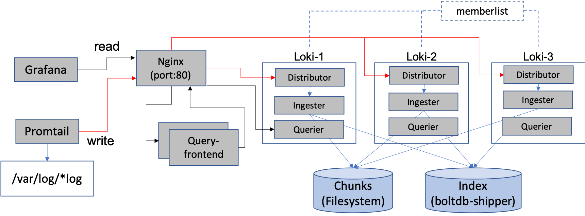

# loki



docker-compose-ha-memberlist.yaml

```
version: "3.8"

networks:
  loki:

services:

  loki-1:
    image: grafana/loki:2.1.0
    volumes:
      - /etc/localtime:/etc/localtime:ro
      - ./config:/etc/loki/
      - ./chunks:/loki/chunks/
    ports:
      - "3100"
      - "7946"
    command: "-config.file=/etc/loki/loki-docker-memberlist-boltdb-shipper.yaml -target=all"
    networks:
      - loki
    restart: always

  loki-2:
    image: grafana/loki:2.1.0
    volumes:
      - /etc/localtime:/etc/localtime:ro
      - ./config:/etc/loki/
      - ./chunks:/loki/chunks/
    ports:
      - "3100"
      - "7946"
    command: "-config.file=/etc/loki/loki-docker-memberlist-boltdb-shipper.yaml -target=all"
    networks:
      - loki
    restart: always

  loki-3:
    image: grafana/loki:2.1.0
    volumes:
      - /etc/localtime:/etc/localtime:ro
      - ./config:/etc/loki/
      - ./chunks:/loki/chunks/
    ports:
      - "3100"
      - "7946"
    command: "-config.file=/etc/loki/loki-docker-memberlist-boltdb-shipper.yaml -target=all"
    networks:
      - loki
    restart: always

  loki-frontend:
    image: grafana/loki:2.1.0
    volumes:
        - /etc/localtime:/etc/localtime:ro
        - ./config:/etc/loki/
    ports:
        - "3100"
    command: "-config.file=/etc/loki/loki-docker-memberlist-boltdb-shipper.yaml -target=query-frontend"
    networks:
      - loki
    deploy:
      mode: replicated
      replicas: 2
    restart: always

  loki-gateway:
    image: nginx:1.19
    volumes:
      - /etc/localtime:/etc/localtime:ro
      - ./config/nginx-loki-gateway.conf:/etc/nginx/nginx.conf
    ports:
      - "81:80"
      - "3100:3100"
    networks:
      - loki
    restart: always
    depends_on:
      - loki-1
      - loki-2
      - loki-3

  promtail:
    image: grafana/promtail:2.1.0
    volumes:
      - /etc/localtime:/etc/localtime:ro
      - /var/log:/var/log
      - ./config:/etc/promtail/
    ports:
      - "9080:9080"
    command: -config.file=/etc/promtail/promtail-gateway.yaml -config.expand-env=true
    networks:
      - loki
    restart: always
    depends_on:
      - loki-gateway
```

loki-docker-memberlist-boltdb-shipper.yaml

```
auth_enabled: false

http_prefix:

server:
  http_listen_address: 0.0.0.0
  grpc_listen_address: 0.0.0.0
  http_listen_port: 3100
  grpc_listen_port: 9095
  log_level: debug

memberlist:
  join_members: ["loki-1", "loki-2", "loki-3"]
  dead_node_reclaim_time: 30s
  gossip_to_dead_nodes_time: 15s
  left_ingesters_timeout: 30s
  bind_addr: ['0.0.0.0']
  bind_port: 7946

ingester:
  lifecycler:
    join_after: 60s
    observe_period: 5s
    ring:
      replication_factor: 2
      kvstore:
        store: memberlist
    final_sleep: 0s
  chunk_idle_period: 1h
  max_chunk_age: 1h
  chunk_retain_period: 30s
  chunk_encoding: snappy
  chunk_target_size: 0
  chunk_block_size: 262144

schema_config:
  configs:
  - from: 2020-08-01
    store: boltdb-shipper
    object_store: filesystem
    schema: v11
    index:
      prefix: index_
      period: 24h

storage_config:
  boltdb_shipper:
    shared_store: filesystem
    active_index_directory: /tmp/loki/index
    cache_location: /tmp/loki/boltdb-cache

  filesystem:
    directory: /loki/chunks


limits_config:
  max_cache_freshness_per_query: '10m'
  enforce_metric_name: false
  reject_old_samples: true
  reject_old_samples_max_age: 30m
  ingestion_rate_mb: 10
  ingestion_burst_size_mb: 20

chunk_store_config:
  max_look_back_period: 336h

table_manager:
  retention_deletes_enabled: true
  retention_period: 336h

query_range:
  align_queries_with_step: true
  max_retries: 5
  split_queries_by_interval: 15m
  parallelise_shardable_queries: true
  cache_results: true

  results_cache:
    cache:
      enable_fifocache: true
      fifocache:
        size: 1024
        validity: 24h

frontend:
  log_queries_longer_than: 5s
  downstream_url: http://loki-gateway:3100
  compress_responses: true

querier:
  query_ingesters_within: 2h

```

nginx-loki-gateway.conf

```
error_log  /dev/stderr;
pid        /tmp/nginx.pid;
worker_rlimit_nofile 8192;

events {
    worker_connections  4096;  ## Default: 1024
}

http {

  default_type application/octet-stream;
  log_format   main '$remote_addr - $remote_user [$time_local]  $status '
    '"$request" $body_bytes_sent "$http_referer" '
    '"$http_user_agent" "$http_x_forwarded_for"';
  access_log   /dev/stderr  main;
  sendfile     on;
  tcp_nopush   on;

  upstream distributor {
    server loki-1:3100;
    server loki-2:3100;
    server loki-3:3100;
  }

  upstream querier {
    server loki-1:3100;
    server loki-2:3100;
    server loki-3:3100;
  }

  upstream query-frontend {
    server loki-frontend:3100;
  }

  server {
    listen 80;
    proxy_set_header     X-Scope-OrgID docker-ha;

    location = /loki/api/v1/push {
        proxy_pass       http://distributor$request_uri;
    }
    
    location = /ring {
        proxy_pass       http://distributor$request_uri;
    }

    location = /loki/api/v1/tail {
        proxy_pass       http://querier$request_uri;
        proxy_set_header Upgrade $http_upgrade;
        proxy_set_header Connection "upgrade";
    }

    location ~ /loki/api/.* {
        proxy_pass       http://query-frontend$request_uri;
    }
  }

  server {
    listen 3100;
    proxy_set_header     X-Scope-OrgID docker-ha;

    location = /loki/api/v1/tail {
        proxy_pass       http://querier$request_uri;
        proxy_set_header Upgrade $http_upgrade;
        proxy_set_header Connection "upgrade";
    }

    location ~ /loki/api/.* {
        proxy_pass       http://querier$request_uri;
    }
    
  }
}

```

promtail-gateway.yaml

```
server:
    disable: true
positions:
    filename: /tmp/positions.yaml
clients:
    - url: http://test.grafana.wangjiahuan.com:81/loki/api/v1/push
scrape_configs:
  - job_name: system
    static_configs:
    - targets:
        - localhost
      labels:
        job: service_log
        __path__: /mnt/*/*/*.log
        namespace: ${NAMESPACE}
        service: ${SERVICE_NAME}
        hostname: ${HOSTNAME}
```

下载安装包安装或者是上传安装包安装

下载安装包安装(适用于服务器网速极好的情况):

```
echo "安装docker-compose"
curl -L "https://github.com/docker/compose/releases/download/1.27.4/docker-compose-$(uname -s)-$(uname -m)" -o /usr/local/bin/docker-compose
sudo chmod +x /usr/local/bin/docker-compose
ln -s /usr/local/bin/docker-compose /usr/bin/docker-compose
docker-compose --version
```

上传安装包安装方式(适用于服务器网速不好的情况):

```
mv -f docker-compose-Linux-x86_64 /usr/local/bin/docker-compose
sudo chmod +x /usr/local/bin/docker-compose
ln -s /usr/local/bin/docker-compose /usr/bin/docker-compose
docker-compose --version
```

准备镜像

```
docker rmi grafana/promtail:2.0.0
docker rmi grafana/loki:2.0.0
docker rmi grafana/promtail:2.1.0
docker rmi grafana/loki:2.1.0

docker pull grafana/promtail:2.1.0
docker pull nginx:1.19
docker pull grafana/loki:2.1.0
```

上传安装包

```
rm -rf /home/data/tristan/loki
mkdir -p /home/data/tristan/loki && chmod 777 /home/data/tristan/loki
mv loki-docker.zip /home/data/tristan/loki
cd /home/data/tristan/loki

yum install -y unzip
unzip loki-docker.zip
chmod 777 /home/data/tristan/loki/chunks
chmod 777 /home/data/tristan/loki/config

echo "拉起镜像"
docker-compose pull


echo "运行"
docker-compose -f ./docker-compose-ha-memberlist.yaml up -d

docker stats

docker logs -f --tail 100 loki_promtail_1
docker logs -f --tail 100 loki_loki-frontend_2
docker logs -f --tail 100 loki_loki-2_1
docker logs -f --tail 100 loki_loki-3_1
docker logs -f --tail 100 loki_loki-1_1
docker logs -f --tail 100 loki_loki-frontend_1
docker logs -f --tail 100 loki_loki-gateway_1


echo "关闭并销毁"
docker-compose -f ./docker-compose-ha-memberlist.yaml down
rm -rf /home/data/tristan/loki/chunks/*
```

添加数据源

```
http://172.30.1.153:3100
```

# 集成promtail

创建promtail配置文件

注意: 给promtail启动时注入两个环境变量: 命名空间、项目名称

创建配置文件

```
sudo tee promtail-config.yaml <<-'EOF'
---
apiVersion: v1
kind: ConfigMap
metadata:
  name: promtail-config
data:
  promtail-config.yaml: |-
    server:
        disable: true
    positions:
        filename: /tmp/positions.yaml
    clients:
        - url: http://test.grafana.wangjiahuan.com:81/loki/api/v1/push
    scrape_configs:
      - job_name: system
        static_configs:
        - targets:
            - localhost
          labels:
            job: service_log
            __path__: /mnt/*/*/*.log
            namespace: ${NAMESPACE}
            service: ${SERVICE_NAME}
            hostname: ${HOSTNAME}
EOF
```

创建

```
kubectl -n dev apply -f promtail-config.yaml
kubectl -n dev get configmap promtail-config -o yaml
```

添加伴生容器

```
      - args:
        - -config.file=/etc/promtail/promtail-config.yaml
        - -config.expand-env=true
        image: grafana/promtail:2.1.0
        imagePullPolicy: Always
        name: promtail
        env:
        - name: SERVICE_NAME
          valueFrom:
            fieldRef:
              fieldPath: metadata.name
        - name: NAMESPACE
          valueFrom:
            fieldRef:
              fieldPath: metadata.namespace
        resources:
          limits:
            cpu: 1
            memory: 100M
          requests:
            cpu: 250m
            memory: 100M
        terminationMessagePath: /dev/termination-log
        terminationMessagePolicy: File
        volumeMounts:
        - mountPath: /etc/localtime
          name: date-config
        - mountPath: /mnt
          name: logs-dir
        - mountPath: /etc/promtail/promtail-config.yaml
          name: promtail-config
          readOnly: true
          subPath: promtail-config.yaml
```

添加全局数据卷

```
      volumes:
      - name: promtail-config
        configMap:
          name: promtail-config
```


# 参考文档

https://github.com/grafana/loki

https://grafana.com/docs/loki/latest/

https://hub.docker.com/r/grafana/loki

https://grafana.com/docs/loki/latest/installation/docker/

https://www.digitalocean.com/community/tutorials/how-to-install-and-use-docker-compose-on-centos-7

https://github.com/docker/compose/releases/tag/1.27.4

https://docs.docker.com/config/containers/start-containers-automatically/

