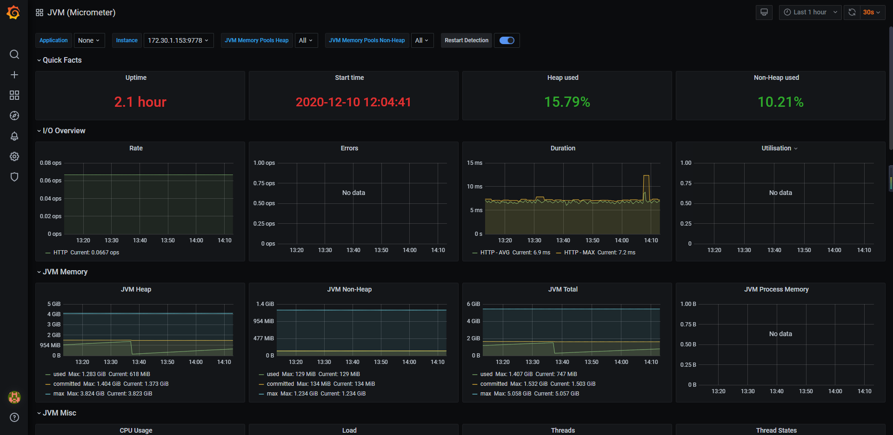

# 数据源

## 使用jmx方式(暂未使用)

```
curl -O https://repo1.maven.org/maven2/io/prometheus/jmx/jmx_prometheus_javaagent/0.14.0/jmx_prometheus_javaagent-0.14.0.jar

java -javaagent:./jmx_prometheus_javaagent-0.14.0.jar=8080:config.yaml -jar wms-dal.jar
```

## springboot项目集成监控依赖(推荐使用)

### 调整项目依赖

如果有顶级父pom或者公共pom, 建议在上层pom中加上以下依赖

```
        <dependency>
            <groupId>org.springframework.boot</groupId>
            <artifactId>spring-boot-starter-actuator</artifactId>
        </dependency>
        <!-- Micrometer Prometheus registry  -->
        <dependency>
            <groupId>io.micrometer</groupId>
            <artifactId>micrometer-registry-prometheus</artifactId>
        </dependency>
```

### 调整配置

```
management:
  endpoints:
    web:
      exposure:
        include: prometheus,info
```


# 数据抓取点

## 简单网络

配置抓取点

```
  - job_name: 'springboot_exporter_test'
    metrics_path: '/xxx.stage/prometheus'
    static_configs:
    - targets: ['<prometheus_ip>:80']
```

## 复杂网络情况下的调整

### 使用kubernetes api server进行转发代理


### 方式1: 使用nginx嵌入目标环境中进行代理网络

如果监控体系在外部, 而服务在k8s内部

网络依然是从prometheus发起请求到服务端点

打通网络:  nginx, 通过nginx去访问k8s中的svc, 外部访问nginx即可

```
deployment:
	name: nginx
	port: 80
```

在prometheus抓取点上全部加上前缀: /<project_name>.<namespace_name>, 例如: portal-admin.stage

targets上指向nginx

```
  - job_name: 'springboot_exporter_test'
    metrics_path: '/xxx.stage/prometheus'
    static_configs:
    - targets: ['<prometheus_ip>:80']
```

这种问题在于会导致抓取instance都是一样的, 需要通过判断路径实现区分

### 方式2: 使用prometheus联邦机制部署子prometheus嵌入到目标环境中代理网络

k8s中直接使用prometheus operator


创建 prometheus namespace

创建 prometheus.yml文件的configmap

创建 prometheus deployment

创建 prometheus svc

创建 nginx 代理

#### 配置prometheus scrape抓取点

```
  - job_name: 'springboot_exporter_test'
    metrics_path: '/wms/dal/prometheus'
    static_configs:
    - targets: ['172.30.1.153:9778']
```

# 展示效果

监控线程数量, 可用, 已用, 是否有阻塞, 等待队列大小, 忙碌线程情况

当有阻塞线程时进行报警

grafana id: 4701

效果如下

