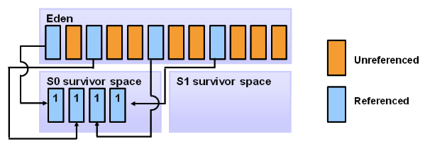

# JVM GC

[jvm](https://zqhxuyuan.github.io/categories/jvm/)

- [jvm](https://zqhxuyuan.github.io/tags/jvm/)

JVM GC

## JVM架构

当一个程序启动之前，它的`class`会被**类装载器**装入**方法区**(Permanent区)，**执行引擎**读取方法区的`字节码`自适应解析，边解析边运行，然后**pc寄存器**指向了main函数所在位置，虚拟机开始为main函数在**Java栈**中预留一个栈帧（每个方法都对应一个栈帧），然后开始跑main函数，main函数里的代码被执行引擎映射成本地操作系统里相应的实现，然后调用**本地方法接口**，本地方法运行的时候，操纵系统会为本地方法分配本地方法栈，用来储存一些临时变量，然后运行本地方法，调用操作系统API。



执行引擎中的GC（垃圾收集器）主要作用域运行时数据区的方法区和堆。

## 一些概念

### 通用GC概念

**`垃圾`**：Garbage（名词），在系统运行过程当中所产生的一些无用的对象，这些对象占据着一定的内存空间，如果长期不被释放，可能导致OOM。

**`垃圾收集器`**：Garbage Collector（名词），负责回收垃圾对象的垃圾收集器

**`垃圾回收`**：Garbage Collect（动词），垃圾收集器工作时，对垃圾进行回收

.png)

**`垃圾回收算法/GC算法`**：不同的GC算法，它们的垃圾回收工作模式不同（比如串行、并行等）

1. 引用计数算法（Reference Counting）
2. 标记-清除算法（Mark-Sweep）
3. 复制算法（Copy）
4. 标记-整理算法（Mark-Compact）
5. 标记-清除-整理算法（Mark-Sweep-Compact）

|  GC算法  |      优点      |        缺点        | 存活对象移动 | 内存碎片 | 适用场景 |
| :------: | :------------: | :----------------: | :----------: | :------: | :------: |
| 引用计数 |    实现简单    |  不能处理循环引用  |              |          |          |
| 标记清除 | 不需要额外空间 | 两次扫描，耗时严重 |     `N`      |    Y     |  旧生代  |
|   复制   | 没有标记和清除 |    需要额外空间    |      Y       |    N     |  新生代  |
| 标记整理 |  没有内存碎片  | 需要移动对象的成本 |      Y       |    N     |  旧生代  |

> 这几种算法中存活对象没有移动的算法只有：标记-清除算法。复制算法会将存活对象移动到另一块内存区，标记整理算法会将存活对象移动到边界位置

**`垃圾回收线程/GC线程`**：垃圾收集器工作时的线程。

应用程序和GC都是一种线程，以Java的main方法为例：应用程序的线程指的是main方法的主线程，GC线程是JVM的内部线程。

在GC过程中，如果GC线程必须暂停应用程序线程（用户线程），则发生Stop the World。当然也可以允许GC线程和应用程序线程一起运行，即GC并不会暂停应用程序的线程。

**`串行、并行、并发`**：串行和并行指的是垃圾收集器工作时暂停应用程序（发生Stop the World），使用单核CPU（串行）还是多核CPU（并行）。

1. 串行（Serial）：使用单核CPU串行地进行垃圾收集
2. 并行（Parallel）：使用多CPU并行地进行垃圾收集，并行是GC线程有多个，但在运行GC线程时，用户线程是阻塞的
3. 并发（Concurrent）：垃圾收集时不会暂停应用程序线程，大部分阶段用户线程和GC线程都在运行，我们称垃圾收集器和应用程序是并发运行的。

| 概念 | Stop the World |        单线程/多线程         |
| :--: | :------------: | :--------------------------: |
| 串行 |       Y        |        GC线程是单线程        |
| 并行 |       Y        |        GC线程是多线程        |
| 并发 |       N        | GC线程和应用程序线程是多线程 |

.png)

> 在Java中有并发编程的概念，并发编程中有多线程的概念。通常并发指的是不同类型的线程可以同时运行（比如GC线程和用户线程并发地运行），而并行指的是相同类型的线程采用多线程模式运行（比如GC线程使用多个CPU并行地运行）。

**`GC暂停/Stop The World/STW`**：不管选择哪种GC算法，Stop-the-world都是不可避免的。Stop-the-world意味着从应用中停下来并进入到GC执行过程中去。**一旦Stop-the-world发生，除了GC所需的线程外，其他线程都将停止工作，中断了的线程直到GC任务结束才继续它们的任务。**GC调优通常就是为了改善stop-the-world的时间（尽量减少STW对应用程序造成的暂停时间）。

.png)

**`垃圾对象`**：对象如果没有在使用，认为是垃圾对象，那么怎么判定有没有在使用？

1. 一个在使用的对象（被引用的对象）：程序的某个部分依然维系者一个指向该对象的指针
2. 一个没有使用的对象（未被引用的对象）：该对象不再被你程序的任何部分引用，所以被这些不再使用的对象占用的内存可以（被垃圾收集器）得到回收

.png)

具体的实现方式：

1. 引用计数算法：对象的引用计数=0，表示没有对象引用它，可以作为垃圾对象（该方法无法处理循环引用）
2. 根搜索算法：当前对象到根对象没有一条可达的路径，可以作为垃圾对象（JVM采用此方法）

### 引用计数算法和根搜索算法

.png)
.png)
.png)


#### 引用计数

**`引用计数算法`**：每个对象都有一个引用计数器，当有对象引用它时，计数器+1；当引用失效时，计数器-1；任何时刻计数器为0时就是不可能再被使用的。

下图中左图是对象的引用关系，中图有一个引用失效，右图是清理引用计数器=0的对象后。

.png)

但是这种方式的缺点是：

1. 引用和去引用伴随加法和减法，影响性能
2. 对于循环引用的对象无法进行回收

下面的3个图中，最右图三个对象的循环引用的计数器都不为0，但是他们对于根对象都已经不可达了，但是无法释放。


#### 根搜索

解决循环引用的办法是：使用**`根搜索算法`**来判定对象是否需要被回收，只要对象没有一条到根对象的可达路径，就可以被回收。

.png)

所以问题转换为：怎么定义根对象？在Java中可以作为GC Roots的对象：

1. 虚拟机栈（左上）的栈帧的局部变量表所引用的对象
2. 本地方法栈（右中）的JNI所引用的对象
3. 方法区（右下）的静态变量和常量所引用的对象

#### 示例

循环引用的程序实例，如果采用引用计数，无法被垃圾收集器回收

.png)

使用根搜索算法，则可以正常回收

.png)

### Tracing GC算法

Tracing GC算法主要包括：

1. 标记清理/标记清除：标记垃圾对象，然后清理垃圾对象
2. 复制算法：标记垃圾对象和非垃圾对象，将非垃圾对象移动到某个空闲的内存块
3. 标记压缩/标记整理：标记垃圾对象和非垃圾对象，将非垃圾对象移动在一起

> 通常还会存在标记清理和标记压缩结合起来的：标记-清理-压缩算法

.png)

结合根搜索算法定义的对象可达性，对应的垃圾收集算法如下（左图是垃圾收集前，右图是垃圾收集后）：

.png)

#### A.标记-清理算法（Mark-Sweep Collector）

.png)

`步骤`：

1. 标记阶段：根据可达性分析对不可达对象进行标记，即标记出所有需要被回收的对象
2. 清理阶段：标记完成后统一清理这些对象，即回收被标记的对象所占用的空间

`缺点`：

1. 标记和清理的效率都不算高（因为垃圾对象比较少，大部分对象都不是垃圾）
2. 会产生大量的内存碎片，碎片太多可能会导致后续过程中需要为大对象分配空间时无法找到足够的空间而提前触发新的一次垃圾收集动作

`适用场景`：基于Mark-Sweep的GC多用于老年代。

#### B.复制算法（Copy Collector）

.png)

`适用场景`：新生代GC

#### C.标记-压缩算法（Mark-Compact Collector）

.png)

`步骤`：在完成标记之后，它不是直接清理可回收对象，而是将存活对象都向一端移动，然后清理掉端边界以外的内存

1. 在标记好待回收对象后，将存活的对象移至一端
2. 然后对剩余的部分进行回收

`优点`：

1. 可以解决内存碎片的问题

`适用场景`：基于Mark-Compact的GC多用于老年代

#### D.标记-清理-压缩算法（Mark-Sweep-Compact Collector）

1. 结合使用标记清理算法（Mark-Sweep）和标记压缩算法（Mark-Compact）
2. 并不是每次标记清理都会执行压缩，而是多次执行GC后，才会执行一次Compact

优点：

1. 相对于标记清理和标记压缩算法，可以减少移动对象的成本（并不是说不会移动对象，只要有压缩就一定会移动对象，只不过压缩不是很频繁）

## JVM GC

前面我们分析了垃圾收集器的几种算法，在Java中，因为对象创建在堆中，垃圾收集时，垃圾收集器就应该扫描堆中的对象，执行垃圾收集工作。

### 基于分代理论的垃圾回收

JVM的垃圾回收器基于以下两个假设：

- **大多数对象很快就会变得不可达**，即很多对象的生存时间都很短
- 只有极少数情况会出现旧对象(老年代对象)持有新对象(新生代)的引用，即新生对象很少引用生存时间长的对象

> 问题1：到底是老年代对象引用新生代对象，还是新生代对象引用老年代对象？
> 问题2：引用和持有引用有什么关系，比如A引用了B，和A持有B的引用。

这两条假设被称为”弱分代假设”。为了证明此假设，在HotSpot VM中物理内存空间被划分为两部分：新生代(Young generation)和老年代(Old generation)。

**新生代**：大部分新创建的对象分配在新生代。因为大部分对象很快就会变得不可达，所以它们被分配在新生代，然后消失不再。当对象从新生代移除时，我们称之为”Minor GC”。

**老年代**：在新生代中存活的对象达到一定年龄阈值时会被复制到老年代。一般来说老年代的内存空间比新生代大，所以在老年代GC发生的频率较新生代低一些。当对象从老年代被移除时，我们称之为”Major GC”(或者Full GC)。

### 概念

**`分代`**：将JVM的堆内存`分`成多个`代`（generation）。

.png)

**`新生代/年轻代`**：Java对象存活周期短命的对象放在新生代

1. 由Eden、两块相同大小的Survivor区构成，to总为空
2. 一般在Eden分配对象，优化：`T`hread `L`ocal `A`llocation `B`uffer
3. 保存80%-90%生命周期较短的对象，GC频率高，采用效率较高的复制算法

.png)

**`旧生代/老年代/年老代`**：Java对象存活周期长命的对象放在老年代

1. 存放新生代中经历多次GC仍然存活的对象
2. 新建的对象也有可能直接在旧生代分配，取决于具体GC的实现
3. GC频率相对降低，标记(mark)、清理(sweep)、压缩(compaction)算法的各种结合和优化

.png)

**`Minor GC/Majar GC/Full GC`**

1. Minor GC 清理的是新生代空间，因此也叫做新生代GC
2. Major GC 清理的是老年代的空间，因此也叫做老年代GC
3. Full GC 清理的是整个堆：包括新生代、老年代空间

.png)

**`JVM的分代回收算法`**：根据不同代的特点采取最适合的收集算法，老年代的特点是每次垃圾收集时只有少量对象需要被回收，新生代的特点是每次垃圾回收时都有大量的对象需要被回收。

1. 新生代：由于新生代产生很多临时对象，大量对象需要进行回收，所以采用复制算法是最高效的：**存活对象少，回收对象多**
2. 老年代：回收的对象很少，都是经过几次标记后都不是可回收的状态转移到老年代的，所以仅有少量对象需要回收，故采用标记清除或者标记整理算法：**存活对象多，回收对象少**

**`不同代的GC算法选择`**：把Java堆分为新生代和老年代：短命对象归为新生代，长命对象归为老年代。

1. 少量对象存活，适合复制算法：在新生代中，每次GC时都发现有大批对象死去，只有少量存活，那就选用复制算法，只需要付出少量存活对象的复制成本就可以完成GC。
2. 大量对象存活，适合用标记-清理/标记-整理：在老年代中，因为对象存活率高、没有额外空间对他进行分配担保，就必须使用“标记-清理”/“标记-整理”算法进行GC。

> 新生代和老年代使用不同的GC算法（不同区中对象的存活特性不同），基于大多数新生对象都会在GC中被收回，新生代的GC使用复制算法
> 对象一般出生在Eden区，年轻代GC过程中，对象在2个幸存区之间移动，如果幸存区中的对象存活到适当的年龄，会被移动（提升）到老年代。
> 当对象在老年代死亡时，就需要更高级别的GC，更重量级的GC算法，复制算法不适用于老年代，因为没有多余的空间用于复制

### Q&A

**GC需要完成的事情**：

1. 哪些内存需要回收？
2. 什么时候回收？
3. 如何回收？

JVM内存区域中的程序计数器、虚拟机栈、本地方法栈这3个区域随着线程而生，线程而灭；栈中的栈帧随着方法的进入和退出而有条不紊地执行着出栈和入栈的操作，每个栈帧中分配多少内存基本是在类结构确定下来时就已知的。在这几个区域不需要过多考虑回收的问题，因为方法结束或者线程结束时，内存自然就跟着回收了。

而Java堆和方法区则不同，一个接口中的多个实现类需要的内存可能不同，一个方法中的多个分支需要的内存也可能不一样，我们只有在程序处于运行期间时才能知道会创建哪些对象，这部分内存的分配和回收都是动态的，GC关注的也是这部分内存。

**Java的内存管理**：Java的内存管理实际上就是对象的管理，其中包括对象的分配和释放。分配对象使用new关键字；释放对象时，只要将对象所有引用赋值为null，让程序不能够再访问到这个对象，我们称该对象为”不可达的”，GC将负责回收所有”不可达”对象的内存空间。

对于GC来说，当程序员创建对象时，GC就开始监控这个对象的地址、大小以及使用情况。通常，GC采用有向图的方式记录和管理堆中的所有对象。通过这种方式确定哪些对象是”可达的”，哪些对象是”不可达的”。当GC确定一些对象为”不可达”时，GC就有责任回收这些内存空间。

**为什么需要GC？**：忘记或者错误的内存回收会导致程序或系统的不稳定甚至崩溃，Java语言没有提供释放已分配内存的显示操作方法，但是Java提供的GC功能可以自动监测对象是否超过作用域从而达到自动回收内存的目的。在使用Java时，不需要在程序代码中显式地释放内存空间，垃圾回收器会帮你找到不再需要的(垃圾)对象并把他们移出。

**为什么GC时需要暂停应用程序？**：垃圾回收的时候，需要整个堆的引用状态保持不变，否则判定是垃圾，等稍后回收的时候它又被引用了，这就全乱套了。所以GC的时候，其他所有的程序执行处于暂停状态，卡住了。幸运的是，这个卡顿是非常短（尤其是新生代），对程序的影响微乎其微，所以GC的卡顿问题由此而来，也是情有可原，暂时无可避免。

以引用计数的方式回收垃圾对象为例，应用程序的线程需要被暂停才能完成回收，因为如果引用状态一直在变的话，垃圾收集器就无法准确地计数（统计对象的引用次数）。垃圾回收时要保证内存中所有对象的引用状态不变，所以GC时其他所有的程序处于暂停状态。

**增量式GC和普通GC的区别**：GC在JVM中通常是由一个或一组进程来实现的，它本身也和用户程序一样占用heap空间，运行时也占用CPU。当GC进程运行时，应用程序停止运行。如果GC运行时间较长时，用户能够感到Java程序的停顿（超时）；如果GC运行时间太短，则可能对象回收率太低，这意味着还有很多应该回收的对象没有被回收，仍然占用大量内存。因此在设计GC的时候，就必须在停顿时间和回收率之间进行权衡。

增量式GC：通过一定的回收算法，把一个长时间的中断，划分为很多个小的中断，通过这种方式减少GC对用户程序的影响。虽然增量式GC在整体性能上可能不如普通GC的效率高，但是它能够减少程序的最长停顿时间。增量式GC的实现采用TrainGC算法，它的基本想法是：将堆中的所有对象按照创建和使用情况进行分组（分层），将使用频繁高和具有相关性的对象放在一队中，随着程序的运行，不断对组进行调整。当GC运行时，它总是先回收最老的（最近很少访问的）的对象，如果整组都为可回收对象，GC将整组回收。这样，每次GC运行只回收一定比例的不可达对象，保证程序的顺畅运行。

**为什么要分代**：分代的垃圾回收策略，是基于这样一个事实：不同对象的生命周期是不一样的。因此，不同生命周期的对象可以采取不同的收集方式，以便提高回收效率。在Java程序运行的过程中，会产生大量的对象，其中有些对象是与业务信息相关，比如Http请求中的Session对象、线程、Socket连接，这类对象跟业务直接挂钩，因此生命周期比较长。还有一些对象主要是程序运行过程中生成的临时变量，这些对象生命周期会比较短，比如String对象，由于其不变类的特性，系统会产生大量的这些对象，有些对象甚至只用一次即可回收。

试想，在不进行对象存活时间区分的情况下，每次垃圾回收都是对整个堆空间进行回收，花费时间相对会长，同时，因为每次回收都需要遍历所有存活对象，但实际上，对于生命周期长的对象而言，这种遍历是没有效果的，因为可能进行了很多次遍历，但是他们依旧存在。因此，分代垃圾回收采用分治的思想，进行代的划分，把不同生命周期的对象放在不同代上，不同代上采用最适合它的垃圾回收方式进行回收。

**分代的好处**：如果单纯从JVM的功能考虑（用简单粗暴的标记-清理删除垃圾对象），并不需要新生代，完全可以针对整个堆进行操作，但是每次GC都针对整个堆标记清理回收对象太慢了。把堆划分为新生代和老年代有2个好处：

1. 简化了新对象的分配（只在新生代分配内存），可以更有效的清除不再需要的对象（死对象）。
2. 在新生代中，GC可以快速标记回收“死对象”，而不需要扫描整个堆中的存活一段时间的“老对象”。

**什么情况下触发垃圾回收**：由于对象进行了分代处理，因此垃圾回收区域、时间也不一样。GC有两种类型：Scavenge GC和Full GC。Scavenge GC：当新对象生成，并且在Eden申请空间失败时，就会触发Scavenge GC，对Eden区域进行GC，清除非存活对象，并且把尚且存活的对象移动到Survivor区。这种方式的GC是对年轻代的Eden区进行，不会影响到年老代。因为大部分对象都是从Eden区开始的，同时Eden区不会分配的很大，所以Eden区的GC会频繁进行。一般在这里需要使用速度快、效率高的算法，使Eden区能尽快空闲出来。

Full GC：对整个堆进行整理，包括Young、Tenured和Perm。Full GC因为需要对整个堆进行回收，所以比Scavenge GC要慢，因此应该尽可能减少Full GC的次数。在对JVM调优的过程中，很大一部分工作就是对于FullGC的调节。有如下原因可能导致Full GC：

1. 旧生代空间不足
2. 持久代空间不足
3. CMS GC时出现了promotion failed和concurrent mode failure
4. 统计得到新生代minor gc时晋升到旧生代的平均大小小于旧生代剩余空间
5. 直接调用System.gc，可以DisableExplicitGC来禁止

**分配担保**：老年代的对象中，有一小部分是因为在新生代回收时，老年代做担保，进来的对象；绝大部分对象是因为很多次GC都没有被回收掉而进入老年代。

## 新生代GC

.png)

一句话总结：对象开始是创建在Eden区，然后经过在Survivor区域上的数次转移而存活下来的长寿对象最后会被移到老年代。

**Eden区**：

当进行Eden区的回收时，垃圾回收器会从根对象开始遍历所有的可达对象，并将它们标记为存活状态。
标记完成后，所有存活对象会被复制到其中一个Survivor区。
于是整个Eden区便可认为是清空了，又可以重新用来分配对象了。
这个过程叫做标记复制（Mark and Copy）：存活对象先被标记，随后被复制到Survivor区中。

**Survivor区**：

紧挨着Eden的两个Survivor区其中一个Survivor区始终都是空的。
空的Survivor区会在下一次新生代GC的时候迎来它的居民。
整个新生代中的所有存活对象（Eden和from区）都会被复制到to区中。
一旦完成之后，对象便都跑到to区中，而Eden和from区则被清空了。
这时from区和to区两者的角色便会发生调转（下次GC时仍然从from到to）。

**对象提升到老年代**：

存活对象会不断地在两个存活区之间来回地复制，直到其中的一些对象被认为是已经成熟，足够老了。
在一轮GC完成后，每个分区中存活下来的对象的计数便会增加（如果刚刚从Eden存活下来其年龄=1），
当一个对象的年龄超过了一个特定的年老阈值之后，它便会被提升到老年代中。
出现对象提升的时候，这些对象则不会再被复制到另一个存活区，而是直接复制到老年代中。
如果存活区的大小不足以存放所有的新生代存活对象，则会出现过早提升。

### 步骤

1.对象分配

.png)

2.填充到Eden区


3.将Eden区中存活的对象（引用对象）拷贝到其中一个存活区


4.年龄计数器：在Eden中存活的对象其年龄初始=1，从其他存活区存活下来年龄+1


5.增加年龄计数器，图中To存活区有三个对象来自于From存活区，一个对象来自Eden


6.对象提升，这里假设年龄阈值=8，发生GC时，From存活区中=8的对象提升到老年代，其他存活对象移动到To存活区


7.总结下对象提升的过程：对象在新生代分配，每当熬过一次YGC，对象的年龄计数器+1，当达到阈值时仍然存活，提升到老年代


8.总结下GC过程：对象在新生代分配并填充，当新生代满时发生YGC，当对象在存活区熬过一定年龄，提升到老年代

.png)

### 新生代GC的特点：

1. 只要JVM无法为新创建的对象分配空间，就肯定会触发新生代GC，比如Eden区满了。因此对象创建得越频繁，新生代GC肯定也更频繁
2. 一旦内存池满了，它的所有内容就会被拷贝走，指针又将重新归零。因此和经典的标记、清除、整理的过程不同的是
   Eden区和Survivor区的清理只涉及到标记和拷贝。在它们中是不会出现碎片的。写指针始终在当前使用区的顶部
3. 在一次新生代GC事件中，通常不涉及到年老代。年老代到年轻代的引用被认为是GC的根对象。而在标记阶段中，从年轻代到年老代的引用则会被忽略掉
4. 所有的新生代GC都会触发stop-the-world暂停，这会中断应用程序的线程。对绝大多数应用而言，暂停的时间是可以忽略不计的

### 合理设置新生代大小

1. 新生代过小，会导致新生对象很快就晋升，到老年代中，在老年代中对象很难被回收
2. 新生代过大，会发生过多的复制过程
3. 我们的目标是：最小化短命对象晋升到老年代的数量，最小化新生代GC的次数和持续时间


### JVM的新生代GC算法

1. Serial Copying：单CPU、新生代小、对暂停时间要求丌高的应用
2. Parallel Scavenge：多CPU、对暂停时间要求较短的应用
3. ParNew：Serial Copying的多线程版本

均使用复制算法，在分配对象时，如果Eden空间不足触发新生代GC

### JVM的新生代GC优化

**指针碰撞（bump-the-pointer）**：Bump-the-pointer技术会跟踪在Eden上新创建的对象。由于新对象被分配在Eden空间的最上面，所以后续如果有新对象创建，只需要判断新创建对象的大小是否满足剩余的Eden空间。如果新对象满足要求，则其会被分配到Eden空间，同样位于Eden的最上面。所以当有新对象创建时，只需要判断此新对象的大小即可，因此具有更快的内存分配速度。

然而，在多线程环境下，将会有别样的状况。为了满足多个线程在Eden空间上创建对象时的线程安全，不可避免的会引入锁，因此随着锁竞争的开销，创建对象的性能也大打折扣。

**线程局部分配缓冲区（Thread-Local Allocation Buffers）**：

在HotSpot中正是通过TLABs解决了多线程问题。TLABs允许每个线程在Eden上有自己的小片空间，线程只能访问其自己的TLAB区域，因此bump-the-pointer能通过TLAB在不加锁的情况下完成快速的内存分配。

.png)

## 老年代GC

老年代GC算法：

1. Serial MSC/**Serial Old**/Serial Mark Sweep Compact
2. Parallel Compacting/**Parallel Old**
3. CMS

下图是新生代GC和老年代GC的几种组合方式：

1. 新生代Serial+老年代Serial（Serial Old）
2. 新生代ParNew+老年代Serial（Serial Old）
3. 新生代Parallel Scavenge+老年代Parallel（Parallel Old）


CMS收集器：


### CMS GC工作流程

CMS GC是针对老年代的GC算法，CMS采用标记清理算法，只不过并不是严格意义的标记清理

1.年轻代被分割成一个Eden区和两个survivor区，老年代是一片连续空间


2.你的JAVA程序运行一段时间后，对象分散地分布在老年代中，
使用CMS，老年代是对象消亡的地方，它们不会被移动，也不会被压缩，除非遇到一个Full GC

.png)

3.年轻代GC工作过程：
① 存活的对象从Eden区或一个Survivor区，移动到另外一个Survivor区
② 一些老的对象如果达到了晋升阈值，就会被提升到老年代中


4.年轻代GC后，Eden区和其中一个Survivor区会被清理，Survivor中存活对象如果超过晋升阈值，晋升到老年代

.png)

5.老年代GC采用标记清理算法


6.老年代GC经过清理阶段后，很多内存会被释放，但是仍然没有压缩


### CMS（Concurrent Mark Sweep）

CMS收集器是一种以获取最短回收停顿时间为目标的收集器（尽可能降低停顿），它是基于“标记-清除”算法实现的，它的目标是尽量减少应用的暂停时间，减少Full GC发生的几率，利用和应用程序线程**并发**（允许垃圾回收线程和应用线程共享处理器资源，比如下面的步骤2、3并发两个阶段）的垃圾回收线程来**标记清除**年老代。整个收集过程大致分为4个步骤：

1. 初始标记(CMS-initial-mark)：从根对象开始标记直接关联的对象，会产生全局停顿
2. 并发标记(CMS-concurrent-mark)：进行GC Root根搜索算法阶段，会判定对象是否存活
3. 重新标记(CMS-remark)：由于并发标记时，用户线程依然运行，因此在正式清理前，再做修正。
   这个阶段的停顿时间会被初始标记阶段稍长，但比并发标记阶段要短
4. 并发清除(CMS-concurrent-sweep)：基于标记结果，直接清理对象（清理的是没有标记的对象）

.png)

下图结合了其他类型的收集器，对比CMS。可以看到CMS只不过是把一段较长的Stop the World暂停所有应用程序，分成了两个较短的暂停。第一次暂停（初始标记）从GC Roots对象开始标记存活的对象；第二次暂停（重新标记）是在并发标记之后，重新标记并发标记阶段遗漏的对象（在并发标记阶段结束后对象状态的更新导致）。第一次暂停会比较短，第二次暂停通常会比较长，并且重新标记这个阶段可以并行标记（初始标记使用一个线程，重新标记使用多线程）。

.png)

**CMS收集器的优点**：由于整个过程中耗时最长的并发标记和并发清除过程中，收集器线程都可以与用户线程一起工作，所以整体来说，CMS收集器的内存回收过程是与用户线程一起并发执行的。

**CMS收集器的缺点**：

`1.与其他GC相比，CMS GC要求更多的内存空间和CPU资源`。在并发阶段，虽然不会导致用户线程停顿，但是会占用CPU资源而导致引用程序变慢，总吞吐量下降。CMS默认启动的回收线程数是：(CPU数量+3)/4，可以通过`-XX:ParallelCMSThreads`设定CMS的线程数量。由于GC线程与应用抢占CPU，会影响系统整体吞吐量和性能：在用户线程运行过程中，分一半CPU去做GC，系统性能在GC阶段就下降一半。

.png)

`2.清理不彻底，会产生浮动垃圾`：因为在并发清理阶段（步骤4），伴随程序的运行自然会有新的垃圾不断产生，这一部分垃圾出现在标记过程之后，CMS无法在本次收集中处理它们，只好留待下一次GC时将其清理掉。

.png)

`3.因为GC的同时应用也在运行，不能在老年代空间快满时再清理`，Old区需要预留足够的内存空间给用户线程使用：否则如果在并发GC期间（步骤4），用户线程又申请了大量内存（即使产生的是垃圾对象，也没办法在本次清理），导致内存不够。如果预留的空间不够，就会出现Concurrent Mode Failure的错误。这时候虚拟机将启动后备预案：临时启用Serial Old收集器来重新进行老年代的垃圾收集，这样停顿时间就很长了（因为Serial Old是单线程Stop-the-World的）。

因此CMS收集器不能像其他收集器（比如单线程的Serial Old GC或者多线程的Parallel Old GC都是等到Old满了才开始对Old老年代执行垃圾回收）那样等到老年代几乎完全被填满了再进行收集，需要预留一部分内存空间提供给**并发收集时的程序运作**使用，这个参数是`-XX:CMSInitiatingOccupancyFraction`，在较早的Java版本，默认设置下，CMS收集器在老年代使用了68%的空间时就会被激活；在较新的Java版本，这个阈值为75%。设置的过高将会很容易导致”Concurrent Mode Failure”失败，性能反而降低：因为阈值越高，越往后执行Old GC，而越往后，老年代占用的空间就会越大，当执行Old GC时，很可能老年代的空间不够，这时如果Survivor转移到Old，非常容易出现晋升失败，一旦失败，只好执行Full GC，性能就越差劲。

.png)

假设Old GC时，老年代总内存=10G，占用了9G（由于碎片存在，不足分配新对象，发生Old GC）
在并行清理阶段，即使把垃圾都清理完，释放了3G，现在占用9-3=6G，但是如果在并发清理阶段
新产生的对象占用了4G，本次垃圾无法清理，导致内存占用=6+4=10G，老年代空间又满了！

所以对于老年代的GC应该预留一定的内存空间给并发清理阶段产生的对象，默认值是68%。
假设老年代总内存=10G，当使用了6.8G时，就会触发老年代GC，而不是等到差不多占满才触发。
举例使用6.8G后，释放了3G，现在占用6.8-3=3.8G，即使新产生了4G不会在本次垃圾收集被清理
总的内存占用也只有3.8+4=7.8G，虽然又会触发一次老年代GC，但是不至于把老年代的内存用光。

为了保证在CMS回收完堆之前还有空间分配给正在运行的应用程序，必须预留一部分空间。也就是说，CMS不会在老年代满的时候才开始收集，相反，它会尝试更早的开始收集，以避免在回收完成之前，堆没有足够空间分配！默认当老年代使用68%的时候，CMS就开始行动了。

`4.CMS GC默认不提供内存压缩`，为了避免过多的内存碎片而需要执行压缩任务时，CMS GC会比任何其他GC带来更多的stop-the-world时间：因为整理过程是独占的，会引起停顿时间变长。不过CMS允许设置进行几次Full GC后，进行一次碎片整理。

CMS是基于“标记-清除”算法实现的收集器，使用“标记-清除”算法收集后，会产生大量碎片。空间碎片太多时，将会给对象分配带来很多麻烦，比如说大对象，内存空间找不到连续的空间来分配不得不提前触发一次Full GC。为了解决这个问题，CMS收集器提供了一个-XX:UseCMSCompactAtFullCollection开关参数，用于在Full GC之后增加一个碎片整理过程，还可通过-XX:CMSFullGCBeforeCompaction参数设置执行多少次不压缩的Full GC之后，跟着来一次碎片整理过程。

### Q&A

**`为什么CMS要使用标记清除而不是标记压缩？`**：如果使用标记压缩，需要对（存活）对象的内存位置进行改变，这样程序就很难继续执行

**`CMS采用标记清除有什么缺点？`**：标记清除会产生大量内存碎片，不利于内存分配

**`CMS有没有暂停？`**：CMS并非没有暂停，而是用两次短暂停来替代串行标记整理算法的长暂停

**`CMS中的C（Concurrent）并发什么意思`**：并发标记、并发清除、并发重设阶段的所谓并发，是指一个或者多个垃圾回收线程和应用程序线程并发地运行，垃圾回收线程不会暂停应用程序的执行，如果你有多于一个处理器，那么并发收集线程将与应用线程在不同的处理器上运行，显然，这样的开销就是会降低应用的吞吐量。Remark阶段的并行，是指暂停了所有应用程序后，启动一定数目的垃圾回收进程进行并行标记，此时的应用线程是暂停的。

### CMS参数

|                  参数                  |                含义                |                       默认值                        |                             说明                             |
| :------------------------------------: | :--------------------------------: | :-------------------------------------------------: | :----------------------------------------------------------: |
|        -XX:+UseConcMarkSweepGC         |          使用CMS内存收集           |                  默认是并行收集器                   |                                                              |
|     -XX:CMSFullGCsBeforeCompaction     |        多少次后进行内存压缩        |                                                     | 由于并发收集器不对内存空间进行压缩、整理，所以运行一段时间以后会产生”碎片”，使得运行效率降低。此值设置运行多少次GC以后对内存空间进行压缩、整理 |
|     -XX:+CMSParallelRemarkEnabled      |            降低标记停顿            |                                                     |                                                              |
|   -XX+UseCMSCompactAtFullCollection    |  在Full GC的时候，对年老代的压缩   |                                                     | CMS是不会移动内存的，因此非常容易产生碎片，导致内存不够用。开启该参数，在Full GC时会进行内存压缩。增加这个参数是个好习惯，可能会影响性能，但是可以消除碎片 |
|   -XX:+UseCMSInitiatingOccupancyOnly   | 使用手动定义初始化定义开始CMS收集  |                                                     |                  禁止hostspot自行触发CMS GC                  |
| -XX:CMSInitiatingOccupancyFraction=70  |  老年代内置使用70％后开始CMS收集   | 低版本的JDK缺省值为68%，JDK6及以上版本缺省值则为92% |    减少出现promotion failed错误的解决办法是提前出发CMS GC    |
| -XX:CMSInitiatingPermOccupancyFraction | 设置Perm Gen使用到达多少比率时触发 |                                                     |                                                              |
|        -XX:+CMSIncrementalMode         |           设置为增量模式           |                                                     |                        用于单CPU情况                         |
|           -XX:ConcGCThreads            |     并发CMS过程运行时的线程数      |        ConcGCThreads=(ParallelGCThreads+3)/4        |       value=4意味着CMS周期的所有阶段都以4个线程来执行        |

当堆满之后，并行收集器便开始进行垃圾收集，例如，当没有足够的空间来容纳新分配或提升的对象。对于CMS收集器，长时间等待是不可取的，因为在并发垃圾收集期间应用持续在运行(并且分配对象)。因此，为了在应用程序使用完内存之前完成垃圾收集周期，CMS收集器要比并行收集器更先启动。

因为不同的应用会有不同对象分配模式，JVM会收集实际的对象分配(和释放)的运行时数据，并且分析这些数据，来决定什么时候启动一次CMS垃圾收集周期。为了引导这一过程， JVM会在一开始执行CMS周期前作一些线索查找。该线索由`-XX:CMSInitiatingOccupancyFraction=<value>`来设置，该值代表老年代堆空间的使用率。比如，value=75意味着第一次CMS垃圾收集会在老年代被占用75%时被触发。通常CMSInitiatingOccupancyFraction的默认值为68。

### CMS Failed

Promotion Failed：在进行Minor GC时，survivor space放不下、对象只能放入老年代，而此时老年代也放不下造成的

> 这个问题的产生是由于救助空间不够，从而向年老代转移对象，年老代没有足够的空间来容纳这些对象，导致一次full gc的产生。解决这个问题的办法有两种完全相反的倾向：增大救助空间、增大年老代或者去掉救助空间。 增大救助空间就是调整-XX:SurvivorRatio参数，这个参数是Eden区和Survivor区的大小比值，默认是32，也就是说Eden区是 Survivor区的32倍大小，要注意Survivo是有两个区的，因此Surivivor其实占整个young genertation的1/34。调小这个参数将增大survivor区，让对象尽量在survitor区呆长一点，减少进入年老代的对象。去掉救助空 间的想法是让大部分不能马上回收的数据尽快进入年老代，加快年老代的回收频率，减少年老代暴涨的可能性，这个是通过将-XX:SurvivorRatio 设置成比较大的值（比如65536)来做到。

Concurrent Mode Failure：在执行CMS GC的过程中同时有对象要放入老年代，而此时老年代空间不足造成的，比如CMS GC时浮动垃圾过多导致暂时性的空间不足触发Full GC

> Concurrent mode failed的产生是由于CMS回收年老代的速度太慢，导致年老代在CMS完成前就被沾满，引起full gc，避免这个现象的产生就是调小-XX:CMSInitiatingOccupancyFraction参数的值，让CMS更早更频繁的触发，降低年老代被沾满的可能。

### CMS GC日志

```
1.662: [GC [1 CMS-initial-mark: 28122K(49152K)] 29959K(63936K), 0.0046877 secs] [Times: user=0.00 sys=0.00, real=0.00 secs] 
1.666: [CMS-concurrent-mark-start]
1.699: [CMS-concurrent-mark: 0.033/0.033 secs] [Times: user=0.25 sys=0.00, real=0.03 secs] 
1.699: [CMS-concurrent-preclean-start]
1.700: [CMS-concurrent-preclean: 0.000/0.000 secs] [Times: user=0.00 sys=0.00, real=0.00 secs] 
1.700: [GC[YG occupancy: 1837 K (14784 K)]
   1.700: [Rescan (parallel) , 0.0009330 secs]
   1.701: [weak refs processing, 0.0000180 secs] 
          [1 CMS-remark: 28122K(49152K)] 29959K(63936K), 0.0010248 secs] 
          [Times: user=0.00 sys=0.00, real=0.00 secs] 
1.702: [CMS-concurrent-sweep-start]
1.739: [CMS-concurrent-sweep: 0.035/0.037 secs] [Times: user=0.11 sys=0.02, real=0.05 secs] 
1.739: [CMS-concurrent-reset-start]
1.741: [CMS-concurrent-reset: 0.001/0.001 secs] [Times: user=0.00 sys=0.00, real=0.00 secs]
```

日志解释：

```
39.910: [GC 39.910: [ParNew: 261760K->0K(261952K), 0.2314667 secs] 262017K->26386K(1048384K), 0.2318679 secs] 
新生代的GC执行。 新生代的占用量经过GC之后，从 261760K 下降到了 0K . 花费的时间 0.2314667秒.

40.146: [GC [1 CMS-initial-mark: 26386K(786432K)] 26404K(1048384K), 0.0074495 secs]
老年代的GC. CMS会在这里进行打上初始标记.会有一次StopWholeWorld的暂停. 内存占用量从786432K 下降到26386K。

40.154: [CMS-concurrent-mark-start]
开始并发标记阶段。

40.683: [CMS-concurrent-mark: 0.521/0.529 secs]
Concurrent marking 花费 0.521秒 0.529秒中包含有yield其他线程的时间

40.683: [CMS-concurrent-preclean-start]
开始PreClean 阶段. PreClean 也是并行发生的. 这个阶段进行的一些工作，可以为下一次的stop-the-world(remark阶段)减少一些工作

40.701: [CMS-concurrent-preclean: 0.017/0.018 secs] 开始进行一些pre-clean的工作。 这行日志表示其耗费了 0.017秒

40.704: [GC40.704: [Rescan (parallel) , 0.1790103 secs]40.883: [weak refs processing, 0.0100966 secs] [1 CMS-remark: 26386K(786432K)] 52644K(1048384K), 0.1897792 secs]
Stop-the-world阶段，这个阶段重新扫描CMS堆里面剩余的对象。重新从root开始扫描并处理引用的对象。重新扫描花费了0.1790103秒,处理软引用耗费了0.0100966秒，而这整个阶段总归耗费了0.1897792秒.

40.894: [CMS-concurrent-sweep-start]
开始对以及消亡和未标记的对象进行sweeep。sweeping这个阶段与其他线程是并行运行的。

41.020: [CMS-concurrent-sweep: 0.126/0.126 secs]
sweep阶段耗费了0.126秒.

41.020: [CMS-concurrent-reset-start]
开始重置

41.147: [CMS-concurrent-reset: 0.127/0.127 secs]
CMS数据结构开始重新初始化，下次则会重新开始一个新的周期。这个阶段耗费了 0.127秒
```

## G1 GC

Java Performance The Definitive Guide P150: http://ifeve.com/深入理解g1垃圾收集器/

不同于其他的分代回收算法，G1将堆空间划分成了互相独立的区块。每块区域既有可能属于Old区、也有可能是Young区，且每类区域空间可以是不连续的（对比CMS的O区和Y区都必须是连续的）。这种将O区划分成多块的理念源于：当**并发后台线程**寻找可回收的对象时、有些区块包含可回收的对象要比其他区块多很多。虽然在清理这些区块时G1仍然需要暂停应用线程、但可以用相对较少的时间优先回收包含垃圾最多区块（并不需要回收整个堆空间，而是一次选择一部分，所以G1可以看做是一种增量式的GC）。这也是为什么G1命名为Garbage First的原因：**第一时间处理垃圾最多的区块**。

G1相对于CMS的区别在：

1. G1在压缩空间方面有优势，CMS存在内存碎片不会主动压缩
2. G1通过将内存空间分成区域（Region）的方式避免内存碎片问题
3. Eden, Survivor, Old区不再固定、在内存使用效率上来说更灵活
4. G1可以通过设置预期停顿时间（Pause Time）来控制垃圾收集时间避免应用雪崩现象
5. G1在回收内存后会马上同时做合并空闲内存的工作、而CMS默认是在STW的时候做
6. G1会在Young GC中使用、而CMS只能在O区使用

下图是各种GC算法针对老年代的比较（当然G1也可以针对YGC）：

| 垃圾收集算法 |       是否压缩内存       | 是否有较长Stop the world |
| :----------: | :----------------------: | :----------------------: |
| Parallel Old |       对整个堆压缩       |            Y             |
|     CMS      |          不压缩          |            N             |
|      G1      | 只对回收的部分Region压缩 |            N             |

G1在运行过程中主要包含如下4种操作方式：

- YGC（young GC，不同于CMS）
- 并发阶段（Concurrent Mark Cycle）
- 混合模式（mixed GC）
- Full GC （一般是G1出现问题时发生）

### YGC

YGC的时机：分配的所有Eden Region都被填充满了

### 并发标记

**并发标记的时机**：

Initiating Heap Occupancy Percent

- Threshold to start the concurrent marking cycle to identify candidate old regions.
- When old generation occupancy crosses this adpative threshold.
- Based on the total heap size.

**并发标记过程**：

Concurrent Marking并发标记包括多个阶段：

1.`Initial Mark(STW)`:young gc时执行，标记survivor 区块(root regions)中准备移动到old区块的对象

- stop the world, piggy-backed on a young pause
- marks all root objects

初始标记阶段：会暂停所有应用线程（部分原因是这个过程会执行一次YGC），出现initial-mark表明后台的并发GC阶段开始了，因为初始标记阶段本身也是要暂停应用线程的，G1正好在YGC的过程中把这个事情也一起干了。

2.`Root Region Scanning`: Scan survivor regions for references into the old generation.
This happens while the application continues to run.
The phase must be completed before a young GC can occur.

- works concurrently with the mutators
- survivor regions are root regions
- must complete before the next GC pause

扫描根区域：这个阶段不能被YGC所打断、因此后台线程有足够的CPU时间很关键。正常的扫描根区域日志：

```
50.819: [GC concurrent-root-region-scan-start]
51.408: [GC concurrent-root-region-scan-end, 0.5890230]
```

> 不可能在GC concurrent-root-region-scan中出现YGC，如果有YGC，也只能等到GC concurrent-root-region-scan-end后才开始YGC

如果Young区空间恰好在Root扫描的时候满了、YGC必须等待root扫描之后才能进行，带来的影响是YGC暂停时间会相应的增加，这时的GC日志是这样的：

```
350.994: [GC pause (young)
351.093: [GC concurrent-root-region-scan-end, 0.6100090]
351.093: [GC concurrent-mark-start],0.37559600 secs]
```

> 注：这种情况非常少见。通常我们看到的GC pause原因是：[GC pause (G1 Evacuation Pause) (young)和[GC pause (G1 Evacuation Pause) (young)、[GC pause (G1 Evacuation Pause) (young) (initial-mark)，很少有[GC pause (young)。

3.`Concurrent Marking`:Find live objects over the entire heap.
This happens while the application is running.
This phase can be interrupted by young generation garbage collections.

- works concurrently with the mutators（-XX:ConcGCThreads）
- pre-write barrier needed
- live data accounting

并发标记是可以被中断的，比如这个过程中发生了YGC就会被中断（中断的意思是start和end相隔在很远，这中间可以插入其他阶段，不能中断表示的是不允许其他阶段在此过程中运行），日志如下：

```
111.382: [GC concurrent-mark-start]
....
120.905: [GC concurrent-mark-end, 9.5225160 sec]
```

这个阶段之后会有一个二次标记阶段（Remark，STW）、清理阶段（Cleanup，STW），还有额外的一次并发清理阶段（Concurrent Cleanup）：

```
120.910: [GC remark 120.959: [GC ref-PRC, 0.0000890 secs], 0.0718990 secs]
 [Times: user=0.23 sys=0.01, real=0.08 secs]
120.985: [GC cleanup 3510M->3434M(4096M), 0.0111040 secs]
 [Times: user=0.04 sys=0.00, real=0.01 secs]

120.996: [GC concurrent-cleanup-start]
120.996: [GC concurrent-cleanup-end, 0.0004520]
```

到此为止，正常的一个G1周期（并发标记周期）已完成–这个周期主要做的是发现哪些区域包含可回收的垃圾最多（标记为X），实际空间释放较少。

> cleanup清理的是哪部分数据？

### 混合GC（Incremental Compaction aka Mixed Collection）

```
79.826: [GC pause (mixed), 0.26161600 secs]
....
[Eden: 1222M(1222M)->0B(1220M) Survivors: 142M->144M Heap: 3200M(4096M)->1964M(4096M)]
[Times: user=1.01 sys=0.00, real=0.26 secs]
```

上面的日志可以注意到Eden释放了1222MB、但整个堆的空间释放内存要大于这个数目=1236M。数量相差看起来比较少、只有16MB，但是要考虑同时有survivor区的对象晋升到O区；另外，**每次混合GC只是清理一部分的O区内存**，整个GC会一直持续到几乎所有的标记区域垃圾对象都被回收，这个阶段完了之后G1会重新回到正常的YGC阶段。周期性的，**当O区内存占用达到一定数量之后G1又会开启一次新的并行GC阶段**。并发标记决定因素：Initiating Heap Occupancy Percent。

### 提升失败/转移失败

Evacuation Failures

- When there are no more regions available for survivors or tenured objects, G1 GC encounters an evacuation failure.
- An evacuation failure is expensive and the usual pattern is that if you see a couple of evacuation failures; full GC could* soon follow.

### 理解G1

http://hllvm.group.iteye.com/group/topic/44381

分代式G1模式下有两种选定CSet的子模式，分别对应young GC与mixed GC：

- Young GC：选定所有young gen里的region。通过控制young gen的region个数来控制young GC的开销。
- Mixed GC：选定所有young gen里的region，外加根据global concurrent marking统计得出收集收益高的若干old gen region。在用户指定的开销目标范围内尽可能选择收益高的old gen region。

可以看到young gen region总是在CSet内。因此分代式G1不维护从young gen region出发的引用涉及的RSet更新。

分代式G1的正常工作流程就是在young GC与mixed GC之间视情况切换，背后定期做做全局并发标记。Initial marking默认搭在young GC上执行；当全局并发标记正在工作时，G1不会选择做mixed GC，反之如果有mixed GC正在进行中G1也不会启动initial marking。
在正常工作流程中没有full GC的概念，old gen的收集全靠mixed GC来完成。

如果mixed GC实在无法跟上程序分配内存的速度，导致old gen填满无法继续进行mixed GC，就会切换到G1之外的serial old GC来收集整个GC heap（注意，包括young、old、perm）。这才是真正的full GC。Full GC之所以叫full就是要收集整个堆，只选择old gen的部分region算不上full GC。进入这种状态的G1就跟-XX:+UseSerialGC的full GC一样

## JVM Tools

### JMC

http://coderbee.net/index.php/jvm/20150406/1188 https://docs.oracle.com/javase/8/docs/technotes/guides/troubleshoot/tooldescr004.html

```
java -XX:+UnlockCommercialFeatures -XX:+FlightRecorder -XX:StartFlightRecording=delay=60s,duration=300s,name=myrecording,filename=/tmp/myrecording.jfr,settings=profile MyApp
java -XX:+UnlockCommercialFeatures -XX:+FlightRecorder -XX:FlightRecorderOptions=defaultrecording=true,disk=true,repository=/tmp,maxage=6h,settings=default MyApp

JVM_OPTS="$JVM_OPTS -XX:+UnlockCommercialFeatures -XX:+FlightRecorder -XX:StartFlightRecording=delay=60s,duration=40m,name=myrecording,filename=/tmp/52_cassandra.jfr,settings=profile"
```

### MAT

|               Name               |         Parameters          |                   function                    |
| :------------------------------: | :-------------------------: | :-------------------------------------------: |
|        ParallelGC Thread         |    -XX:ParallelGCThreads    |            parallel work during gc            |
|     Parallel Marking Threads     |      -XX:ConcGCThreads      |    parallel threads for concurrent marking    |
| G1 concurrent refinement Threads | -XX:G1ConcRefinementThreads | update RSet concurrently with the application |

```
#远程API机器建立到Cassandra的连接，并读取文件
"RMI TCP Connection(244)-192.168.47.26" #499 daemon prio=5 os_prio=0 tid=0x00007f2f36eef700 nid=0x8d93 runnable [0x00007f294e832000]
   java.lang.Thread.State: RUNNABLE
    at java.net.SocketInputStream.socketRead0(Native Method)
    at java.net.SocketInputStream.socketRead(SocketInputStream.java:116)
    at java.net.SocketInputStream.read(SocketInputStream.java:170)
    at java.net.SocketInputStream.read(SocketInputStream.java:141)
    at java.io.BufferedInputStream.fill(BufferedInputStream.java:246)
    at java.io.BufferedInputStream.read(BufferedInputStream.java:265)
    - locked <0x0000000562402aa8> (a java.io.BufferedInputStream)
    at java.io.FilterInputStream.read(FilterInputStream.java:83)
    at sun.rmi.transport.tcp.TCPTransport.handleMessages(TCPTransport.java:550)
    at sun.rmi.transport.tcp.TCPTransport$ConnectionHandler.run0(TCPTransport.java:826)
    at sun.rmi.transport.tcp.TCPTransport$ConnectionHandler.lambda$run$79(TCPTransport.java:683)
    at sun.rmi.transport.tcp.TCPTransport$ConnectionHandler$$Lambda$1/1100329915.run(Unknown Source)
    at java.security.AccessController.doPrivileged(Native Method)
    at sun.rmi.transport.tcp.TCPTransport$ConnectionHandler.run(TCPTransport.java:682)
    at java.util.concurrent.ThreadPoolExecutor.runWorker(ThreadPoolExecutor.java:1142)
    at java.util.concurrent.ThreadPoolExecutor$Worker.run(ThreadPoolExecutor.java:617)
    at java.lang.Thread.run(Thread.java:745)

#Compaction最后会将几个SSTable文件合并为一个大文件，使用SSTableWriter写文件，Compaction策略为Leveled
"CompactionExecutor:11" #442 daemon prio=1 os_prio=4 tid=0x00007f2974d591f0 nid=0x8781 runnable [0x00007f294c584000]
   java.lang.Thread.State: RUNNABLE
    at java.io.RandomAccessFile.getFilePointer(Native Method)
    at org.apache.cassandra.io.compress.CompressedSequentialWriter.getOnDiskFilePointer(CompressedSequentialWriter.java:85)
    at org.apache.cassandra.io.sstable.SSTableWriter.getOnDiskFilePointer(SSTableWriter.java:573)
    at org.apache.cassandra.db.compaction.LeveledCompactionTask.newSSTableSegmentThresholdReached(LeveledCompactionTask.java:41)
    at org.apache.cassandra.db.compaction.CompactionTask.runMayThrow(CompactionTask.java:200)
    at org.apache.cassandra.utils.WrappedRunnable.run(WrappedRunnable.java:28)
    at org.apache.cassandra.db.compaction.CompactionTask.executeInternal(CompactionTask.java:73)
    at org.apache.cassandra.db.compaction.AbstractCompactionTask.execute(AbstractCompactionTask.java:59)
    at org.apache.cassandra.db.compaction.CompactionManager$BackgroundCompactionCandidate.run(CompactionManager.java:263)
    at java.util.concurrent.Executors$RunnableAdapter.call(Executors.java:511)
    at java.util.concurrent.FutureTask.run(FutureTask.java:266)
    at java.util.concurrent.ThreadPoolExecutor.runWorker(ThreadPoolExecutor.java:1142)
    at java.util.concurrent.ThreadPoolExecutor$Worker.run(ThreadPoolExecutor.java:617)
    at java.lang.Thread.run(Thread.java:745)

#Compaction操作会删除一些数据，比如tombstone，对相同key写在一起，由于文件内容变化，文件索引需要重建
"CompactionExecutor:10" #439 daemon prio=1 os_prio=4 tid=0x00007f54501de560 nid=0x877e runnable [0x00007f294e7b0000]
   java.lang.Thread.State: RUNNABLE
    at org.apache.cassandra.db.ArrayBackedSortedColumns$2.<init>(ArrayBackedSortedColumns.java:119)
    at org.apache.cassandra.db.ArrayBackedSortedColumns.batchRemoveIterator(ArrayBackedSortedColumns.java:117)
    at org.apache.cassandra.db.ColumnFamilyStore.removeDeletedColumnsOnly(ColumnFamilyStore.java:1284)
    at org.apache.cassandra.db.compaction.LazilyCompactedRow.removeDeleted(LazilyCompactedRow.java:110)
    at org.apache.cassandra.db.compaction.LazilyCompactedRow.access$600(LazilyCompactedRow.java:49)
    at org.apache.cassandra.db.compaction.LazilyCompactedRow$Reducer.getReduced(LazilyCompactedRow.java:297)
    at org.apache.cassandra.db.compaction.LazilyCompactedRow$Reducer.getReduced(LazilyCompactedRow.java:206)
    at org.apache.cassandra.utils.MergeIterator$OneToOne.computeNext(MergeIterator.java:206)
    at com.google.common.collect.AbstractIterator.tryToComputeNext(AbstractIterator.java:143)
    at com.google.common.collect.AbstractIterator.hasNext(AbstractIterator.java:138)
    at com.google.common.collect.Iterators$7.computeNext(Iterators.java:645)
    at com.google.common.collect.AbstractIterator.tryToComputeNext(AbstractIterator.java:143)
    at com.google.common.collect.AbstractIterator.hasNext(AbstractIterator.java:138)
    at org.apache.cassandra.db.ColumnIndex$Builder.buildForCompaction(ColumnIndex.java:166)
    at org.apache.cassandra.db.compaction.LazilyCompactedRow.write(LazilyCompactedRow.java:121)
    at org.apache.cassandra.io.sstable.SSTableWriter.append(SSTableWriter.java:193)
    at org.apache.cassandra.io.sstable.SSTableRewriter.append(SSTableRewriter.java:126)
    at org.apache.cassandra.db.compaction.CompactionTask.runMayThrow(CompactionTask.java:197)
    at org.apache.cassandra.utils.WrappedRunnable.run(WrappedRunnable.java:28)
    at org.apache.cassandra.db.compaction.CompactionTask.executeInternal(CompactionTask.java:73)
    at org.apache.cassandra.db.compaction.AbstractCompactionTask.execute(AbstractCompactionTask.java:59)
    at org.apache.cassandra.db.compaction.CompactionManager$BackgroundCompactionCandidate.run(CompactionManager.java:263)
    at java.util.concurrent.Executors$RunnableAdapter.call(Executors.java:511)
    at java.util.concurrent.FutureTask.run(FutureTask.java:266)
    at java.util.concurrent.ThreadPoolExecutor.runWorker(ThreadPoolExecutor.java:1142)
    at java.util.concurrent.ThreadPoolExecutor$Worker.run(ThreadPoolExecutor.java:617)
    at java.lang.Thread.run(Thread.java:745)

#每个Cassandra节点要和集群中的其他节点通信
"MessagingService-Incoming-/192.168.48.171" #400 prio=5 os_prio=0 tid=0x00007f29f32f0e50 nid=0x8377 runnable [0x00007f293c9a2000]
   java.lang.Thread.State: RUNNABLE
    at sun.nio.ch.FileDispatcherImpl.read0(Native Method)
    at sun.nio.ch.SocketDispatcher.read(SocketDispatcher.java:39)
    at sun.nio.ch.IOUtil.readIntoNativeBuffer(IOUtil.java:223)
    at sun.nio.ch.IOUtil.read(IOUtil.java:197)
    at sun.nio.ch.SocketChannelImpl.read(SocketChannelImpl.java:380)
    - locked <0x0000000330000388> (a java.lang.Object)
    at sun.nio.ch.SocketAdaptor$SocketInputStream.read(SocketAdaptor.java:192)
    - locked <0x0000000330000398> (a java.lang.Object)
    at sun.nio.ch.ChannelInputStream.read(ChannelInputStream.java:103)
    - locked <0x00000003300003d8> (a sun.nio.ch.SocketAdaptor$SocketInputStream)
    at net.jpountz.lz4.LZ4BlockInputStream.readFully(LZ4BlockInputStream.java:215)
    at net.jpountz.lz4.LZ4BlockInputStream.refill(LZ4BlockInputStream.java:149)
    at net.jpountz.lz4.LZ4BlockInputStream.read(LZ4BlockInputStream.java:101)
    at java.io.DataInputStream.readInt(DataInputStream.java:387)
    at org.apache.cassandra.net.IncomingTcpConnection.receiveMessages(IncomingTcpConnection.java:171)
    at org.apache.cassandra.net.IncomingTcpConnection.run(IncomingTcpConnection.java:88)

#除了Incoming也有Outgoing
"MessagingService-Outgoing-/192.168.48.171" #397 daemon prio=5 os_prio=0 tid=0x00007f2f374f6ff0 nid=0x8374 waiting on condition [0x00007f293c9e3000]
   java.lang.Thread.State: WAITING (parking)
    at sun.misc.Unsafe.park(Native Method)
    - parking to wait for  <0x0000000330444b38> (a java.util.concurrent.locks.AbstractQueuedSynchronizer$ConditionObject)
    at java.util.concurrent.locks.LockSupport.park(LockSupport.java:175)
    at java.util.concurrent.locks.AbstractQueuedSynchronizer$ConditionObject.await(AbstractQueuedSynchronizer.java:2039)
    at java.util.concurrent.LinkedBlockingQueue.take(LinkedBlockingQueue.java:442)
    at org.apache.cassandra.utils.CoalescingStrategies$DisabledCoalescingStrategy.coalesceInternal(CoalescingStrategies.java:482)
    at org.apache.cassandra.utils.CoalescingStrategies$CoalescingStrategy.coalesce(CoalescingStrategies.java:213)
    at org.apache.cassandra.net.OutboundTcpConnection.run(OutboundTcpConnection.java:190)
```

**本文标题:**[JVM GC](https://zqhxuyuan.github.io/2016/07/26/JVM/)

**文章作者:**[任何忧伤,都抵不过世界的美丽](https://zqhxuyuan.github.io/)

**发布时间:**2016年07月26日 - 00时00分

**最后更新:**2019年02月14日 - 21时42分

**原始链接:**[http://github.com/zqhxuyuan/2016/07/26/JVM/](https://zqhxuyuan.github.io/2016/07/26/JVM/) 

**许可协议:** ["署名-非商用-相同方式共享 3.0"](http://creativecommons.org/licenses/by-nc-sa/3.0/cn/) 转载请保留原文链接及作者。