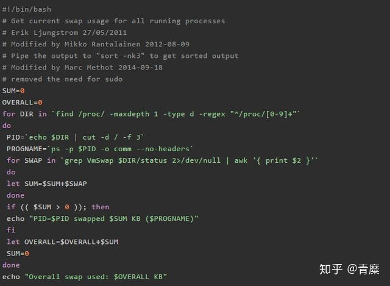

# 面试官：如何减少长时间的 GC 停顿？

[](https://www.zhihu.com/people/yang-gui-fei-46-72)

[青糜](https://www.zhihu.com/people/yang-gui-fei-46-72)

非常欢迎大家加入我们的专栏《java进阶集中营》

关注他

9 人赞同了该文章


> 垃圾回收是非常必要的，但是如果处理不好，它会成为性能杀手。采取以下步骤以确保 GC 停顿时间最少且最短。

长时间的 GC 停顿对应用程序是不利的，它会影响服务的 SLA，进而导致糟糕的用户体验，并对核心应用程序的服务造成严重损害。因此，在本文中，我列出了导致长时间 GC 停顿的关键原因以及解决这些问题的可能的解决方案。

## **1. 高速率创建对象**

如果你的应用程序的对象创建率很高，那么为了跟上它，垃圾回收率也将会很高。高垃圾回收率也会增加 GC 停顿时间。因此，优化应用程序以创建更少的对象是减少长 GC 停顿的有效策略。这可能是一个耗时的工作，但百分百值得去做。为了优化应用程序中的对象创建速率，可以考虑先使用 Java 分析器来进行分析，**例如 JProfiler，YourKit 或 JVisualVM，通过这些分析器可得出以下信息报告：**

- 创建了哪些对象？
- 创建这些对象的速率是多少？
- 它们在内存中占用多少空间？
- 谁在创建了它们？

始终尝试去优化占用最大内存量的对象。

**提示: 如何计算对象创建速率**

将你的 GC 日志上传到通用 GC 日志分析器工具 GCeasy。该工具将报告对象创建率。在“对象统计信息”中将列出“平均创建率”。此项将报告对象创建率。力争使该值保持较低。请参见下图（摘自 GCeasy 生成的报告的目录），显示“平均创建速度”为 **8.83 mb.sec**。


## **2. 年轻代空间不足**

当年轻代过小时，对象会过早地提升到老年代。从老年代收集垃圾比从年轻代收集垃圾要花费更多的时间。因此，增加年轻代的大小有可能减少长时间的 GC 停顿。可以通过设置两个 JVM 参数之一来增加年轻一代的大小：

> **-Xmn** ：指定年轻代的大小。**-XX:NewRatio** ：指定年轻代相对于老年代的大小比例。例如，设置 -XX:NewRatio=2 表示年轻代与老年代之间的比率为 1:2。年轻代的大小将是整个堆的 1/3。因此，如果堆大小为 2 GB，则年轻代大小将为 2G / 3 = 667 MB。

## **3. 选择 GC 算法**

GC 算法对 GC 停顿时间有很大的影响。如果你是 GC 专家或打算成为一个（或你的团队中的有人是 GC 专家），你可以调整 GC 参数配置以获得最佳 GC 停顿时间。如果你没有大量的 GC 的专业知识，那么我建议使用 G1 GC 算法，因为它有**自动调节**的能力。在 G1 中，可以使用系统属性 -xx：MaxGCPauseMillis来设置 GC 预期最大停顿时间。例如：

```java
-XX:MaxGCPauseMillis=200
```

按照上面的例子，最大 GC 停顿时间设置为 200 毫秒。这是一个软目标，JVM 将尽力实现它。

## **4. 进程使用了 Swap**

有时由于物理内存不足（RAM），操作系统可能会将应用程序暂时不用的数据从内存交换出去。交换动作是非常昂贵的，因为它需要访问磁盘，这比物理内存访问要慢得多。

依我之见，在生产环境中，任何一个重要的应用程序都不应该交换。当进程使用了 Swap 时，GC 将需要很长的时间才能完成。

下面的脚本来自 StackOverflow （感谢作者），当执行脚本时，将显示所有正在发生交换的进程。请确保你的应用程序进程没有使用 Swap。



如果发现进程使用了 Swap 分区，则可以执行下列操作之一：

- 分配更多的物理内存。
- 减少在服务器上运行的进程的数量，以便它可以释放内存（RAM）。
- 减少应用程序的堆大小（我不建议这么做，因为它会导致其他副作用。不过，它可能会解决你的问题）。


## **5. 调整 GC 线程数**

对于 GC 日志中报告的每个 GC 事件，会打印用户、系统和实际执行时间。例如：

```text
[Times: user=25.56 sys=0.35, real=20.48 secs]
```

如果在 GC 事件中，您始终注意到 real 时间并不显著小于 user 时间，那么它可能指示没有足够的 GC 线程。考虑增加 GC 线程数。假设 user 时间为 25s，并且将 GC 线程计数配置为 5，那么 real 应该接近 5s（因为 25s/5＝5s）。

警告：添加太多的 GC 线程将消耗大量 CPU，从而占用应用程序的资源。因此，在增加 GC 线程数之前，需要进行充分的测试。


## **6. 后台 I/O 活动**

如果有大量的文件系统 I/O 活动（即发生大量的读写操作），也可能导致长时间的 GC 停顿。此繁重的文件系统 I/O 活动可能不是由应用程序引起的。可能是由于运行在同一服务器上的另一进程造成的。但它仍然会导致应用程序遭受长时间的 GC 停顿。

当有严重的 I/O 活动时，你会注意到 real 的时间明显高于 user 的时间。例如：

```text
[Times:user=0.20 sys=0.01, real=18.45 secs] 
```

当这种情况发生时，以下是一些可能的解决方案：

- 如果高 I/O 活动是由应用程序引起的，那么优化它。
- 消除在服务器上导致高 I/O 活动的进程。
- 将应用程序移动到 I/O 活动较少的其他服务器。

**提示: 如何监视 I/O 活动**

在类 Unix系统 中，你可以使用的 SAR 命令（系统活动情况报告）监视 I/O 活动。例如：

```text
sar -d -p 1
```

上面的命令每 1 秒会报告一次读取/秒和写入/秒的统计数据。有关 SAR 命令的更多细节，可以自行参阅相关资料。


## **7. System.gc() 调用**

当调用 System.gc() or Runtime.getRuntime().gc() 方法时，它将导致 stop-the-world 的 Full GC。在 Full GC 期间，整个 JVM 被冻结（即在此期间不会执行任何用户活动）。System.gc() 调用一般来源于以下情况：

1、 开发人员可能会显式地调用 System.gc() 方法。2、 使用的第三方库、框架，有时甚至是应用程序服务器。其中任何一个都可能调用 System.gc() 方法。3、 还可以通过使用 JMX 从外部工具（如 VisualVM）触发。4、 如果你的应用程序正在使用 RMI，那么 RMI 会定期调用 System.gc() 。可以使用以下系统属性配置此调用间隔：

```text
-Dsun.rmi.dgc.server.gcInterval=n
-Dsun.rmi.dgc.client.gcInterval=n
```

评估是否显式调用 System.gc() 是绝对必要的。如果不需要，请把它删掉。另一方面，可以通过传递 JVM 参数来强制禁用 System.gc() 调用 **-XX:+DisableExplicitGC**。

**提示：如何知道是否显示调用了 System.gc()**

将 GC 日志上传到通用 GC 日志分析器工具GCeasy。此工具有一个名为 GCCauses的部分。如果由于System.gc()调用而触发 GC 活动，则此部分将报告该情况。请看下图（摘自 GCeasy 生成的报告目录），显示了 System.gc() 在这个应用程序的生命周期中被做了四次。


**警告**：所有上述战略只有经过彻底的测试和分析才能推广到生产。所有策略可能不一定适用于你的应用程序。如果不当使用可能会导致负面的结果。