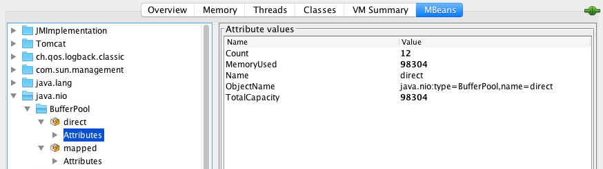

[Analyzing java memory usage in a Docker container](javascript:window.open('http://twitter.com/share?hashtags=java,memory,linux,docker&text=Analyzing java memory usage in a Docker container » ', '_blank', 'width=400,height=500');void(0);)

A few weeks ago I faced an interesting problem trying to analyze a memory consumption in my Java application (Spring Boot + Infinispan) running under Docker. The **Xmx** parameter was **set to 256m**, but the Docker monitoring tool displayed almost **two times more** used memory. Below we will try to understand the reasons of such a strange behavior and find out how much memory the app consumed in fact.


### Docker and memory

First of all, let’s take a look at the docker container arguments which I used to launch my application:

```
docker run -d --restart=always  
    \
    -p {{service_port}}:8080

    -p {{jmx_port}}:{{jmx_port}}
    \
    -e JAVA_OPTS='

        -Xmx{{java_memory_limit}}
        -XX:+UseConcMarkSweepGC
        -XX:NativeMemoryTracking=summary

        -Djava.rmi.server.hostname={{ansible_default_ipv4.address}}

        -Dcom.sun.management.jmxremote

        -Dcom.sun.management.jmxremote.port={{jmx_port}}

        -Dcom.sun.management.jmxremote.rmi.port={{jmx_port}}

        -Dcom.sun.management.jmxremote.local.only=false

        -Dcom.sun.management.jmxremote.authenticate=false
        -Dcom.sun.management.jmxremote.ssl=false
    '
    \
    -m={{container_memory_limit}}
    --memory-swap={{container_memory_limit}}
    \
    --name {{service_name}}
    \
    {{private_registry}}/{{image_name}}:{{image_version}}
```

where `java_memory_limit` = **256m**.

The problems begin when you start trying to explain the results of `docker stats my-app` command:

```
    CONTAINER    CPU %    MEM USAGE/LIMIT    MEM %    NET I/O
    my-app       1.67%    504 MB/536.9 MB    93.85%   555.4 kB/159.4 kB
```

MEM USAGE is **504m**! But why?

We know that a Docker container is designed to run only one process inside. That means we have to explain where the jvm process spent 504m - 256m = **248m**.

Here we should make a small digression and take a look at Linux Memory Model. I would recommend to read [this article](http://linuxaria.com/howto/linux-memory-management) before you proceed with the current one. In short, there are a lot of ways to measure how much memory the process consumes. Each of them depends on what we understand by “memory” :) Usually, you are interested in RSS.

**R**esident **S**et **S**ize is the amount of physical memory currently allocated and used by a process (without swapped out pages). It includes the code, data and shared libraries (which are counted in every process which uses them). Sounds a bit messy, but that is the best metric in Linux that you got to analyze memory consumption of a process.

So, we just run the following command:

```
    [mkrestyaninov@xxx ~]$ docker exec my-app ps -o rss,vsz,sz 1
    RSS    VSZ    SZ
    375824 4924048 1231012
```

Hmm… that is strange! PS says our application consumes only **375824K** / 1024 = **367M**. Seems we have more questions than answers :(

**Why does docker `stats` info differ from the `ps` data?**

Answer for the first question is very simple - Docker has [a bug](https://github.com/docker/docker/issues/10824) (or a feature - depends on your mood): it includes file caches into the total memory usage info. So, we can just avoid this metric and use `ps` info about RSS and think that our application uses **367M**, not 504M (since files cache can be easily flushed in case of memory starvation).

Well, ok - but **why is RSS higher than Xmx?** That is an extremely interesting question! Let’s try to find it out.


### JMX

The most simple way to analyze a java process is JMX (that’s why we have it enabled in our container).

Theoretically, in case of a java application

```
    RSS = Heap size + MetaSpace + OffHeap size
```

where OffHeap consists of thread stacks, direct buffers, mapped files (libraries and jars) and JVM code itself;

According to `jvisualvm`, committed Heap size is **136M** (while just only **67M** are "used"):


MetaSapce size is **68M** (67M are used):


In other words, we had to explain **367M - (136M + 67M) = 164M** of OffHeap memory.

My app has (in average) **30 live threads**:


Each of these threads consumes 1M:

```
    [ root@fac6d0dfbbb4:/data ]$ java -XX:+PrintFlagsFinal -version |grep ThreadStackSize    
    intx CompilerThreadStackSize             = 0
    intx ThreadStackSize                     = 1024
    intx VMThreadStackSize                   = 1024
```

So, here we can add **30M** more.

The only place where the app uses DirectBuffer is NIO. As far as I can see from JMX, it doesn’t consume a lot of resources - only **98K**:


The last step is mapped libs and jars. But according to `pmap`:

```
   [mkrestyaninov@xxx ~]$ docker exec my-app pmap -x 1 | grep ".so.*" | awk '{sum+=$3} END {print sum}'

   12664
```

plus

```
    [mkrestyaninov@xxx ~]$ docker exec my-app pmap -x 1 | grep ".jar" | awk '{sum+=$3} END {print sum}'

    8428
```

we only have **20M** here.

Here you should keep in mind that “shared” libraries (libc.so, libjvm.so, etc) aren’t so shared when you use Docker (or any other virtualization) - each container has its own copy of these libraries (see [here](https://github.com/docker/docker/issues/7950)).

Hence, we still have to explain **164M - (30M + 20M) = 114M** :(


### Native Memory Tracking

All the manipulations above hint us that JMX is not the instrument that we want here :)

Hopefully, [since JDK 1.8.40](https://docs.oracle.com/javase/8/docs/technotes/guides/vm/enhancements-8.html) we have [Native Memory Tracker](https://docs.oracle.com/javase/8/docs/technotes/guides/troubleshoot/tooldescr007.html)!

As you can see, I’ve already added `-XX:NativeMemoryTracking=summary` property to the JVM, so we can just invoke it from the command line:

```
[mkrestyaninov@xxx ~]$ docker exec my-app jcmd 1 VM.native_memory summary

    Native Memory Tracking:

    Total: reserved=1754380KB, committed=371564KB
    -                 Java Heap (reserved=262144KB, committed=140736KB)
                                (mmap: reserved=262144KB, committed=140736KB)

    -                     Class (reserved=1113555KB, committed=73811KB)
                                (classes #13295)
                                (malloc=1491KB #17749)
                                (mmap: reserved=1112064KB, committed=72320KB)

    -                    Thread (reserved=50587KB, committed=50587KB)
                                (thread #50)
                                (stack: reserved=50372KB, committed=50372KB)
                                (malloc=158KB #256)
                                (arena=57KB #98)

    -                      Code (reserved=255257KB, committed=34065KB)
                                (malloc=5657KB #8882)
                                (mmap: reserved=249600KB, committed=28408KB)

    -                        GC (reserved=13777KB, committed=13305KB)
                                (malloc=12917KB #338)
                                (mmap: reserved=860KB, committed=388KB)

    -                  Compiler (reserved=178KB, committed=178KB)
                                (malloc=47KB #233)
                                (arena=131KB #3)

    -                  Internal (reserved=2503KB, committed=2503KB)
                                (malloc=2471KB #16052)
                                (mmap: reserved=32KB, committed=32KB)

    -                    Symbol (reserved=17801KB, committed=17801KB)
                                (malloc=13957KB #137625)
                                (arena=3844KB #1)

    -    Native Memory Tracking (reserved=2846KB, committed=2846KB)
                                (malloc=11KB #126)
                                (tracking overhead=2836KB)

    -               Arena Chunk (reserved=187KB, committed=187KB)
                                    (malloc=187KB)

    -                   Unknown (reserved=35544KB, committed=35544KB)
                                (mmap: reserved=35544KB, committed=35544KB)
```

Voila! All the information about your JVM process’s memory is on your screen! [Here](http://hirt.se/blog/?p=401) you can find an information about what each point means, if that’s not obvious. Don’t worry about the “Unknown” section - seems that NMT is an immature tool and can’t deal with CMS GC (this section disappears when you use an another GC).

Keep in mind, that NMT displays “committed” memory, not "resident" (which you get through the `ps` command). In other words, a memory page can be committed without considering as a resident (until it directly accessed). That means that NMT results for non-heap areas (heap is always preinitialized) *might be* bigger than RSS values. See [SO](http://stackoverflow.com/questions/31173374/why-does-a-jvm-report-more-committed-memory-than-the-linux-process-resident-set) for details.


### Summary

As a result, despite the fact that we set the jvm heap limit to **256m**, our application consumes **367M**. The “other” **164M** are mostly used for storing class metadata, compiled code, threads and GC data.

First three points are often constants for an application, so the only thing which increases with the heap size is GC data. This dependency is linear, but the “k” coefficient (`y = kx + b`) is much less then 1. E.g., in case of our application, **for 380M** of committed heap, GC uses **78M** (in the current example we have **140M against 48M**).

What I can say as a conclusion? Well… **never put words “java” and “micro” in the same sentence** :) I'm kidding - just remember that dealing with memory in case of java, linux and docker is a bit more tricky thing than it seems at first.


#### P. S.

Below you can find information about the environment where I performed my experiments:

```
[mkrestyaninov@xxx ~]$ cat /etc/redhat-release
Red Hat Enterprise Linux Server release 7.2 (Maipo)

[mkrestyaninov@xxx ~]$ uname -a
Linux xxx 3.10.0-327.el7.x86_64 #1 SMP Thu Oct 29 17:29:29 EDT 2015 x86_64 x86_64 x86_64 GNU/Linux

[mkrestyaninov@xxx ~]$ docker -v
Docker version 1.8.2, build a01dc02/1.8.2

[mkrestyaninov@xxx ~]$ docker exec my-app java -version
java version "1.8.0_40"
Java(TM) SE Runtime Environment (build 1.8.0_40-b25)
Java HotSpot(TM) 64-Bit Server VM (build 25.40-b25, mixed mode)
```

Plus, as a bonus, here is [a link](https://spring.io/blog/2015/12/10/spring-boot-memory-performance) to an article about memory usage in a vanilla Spring Boot application.

[← MicroServices and Docker](http://trustmeiamadeveloper.com/2016/02/26/microservices-and-docker/)